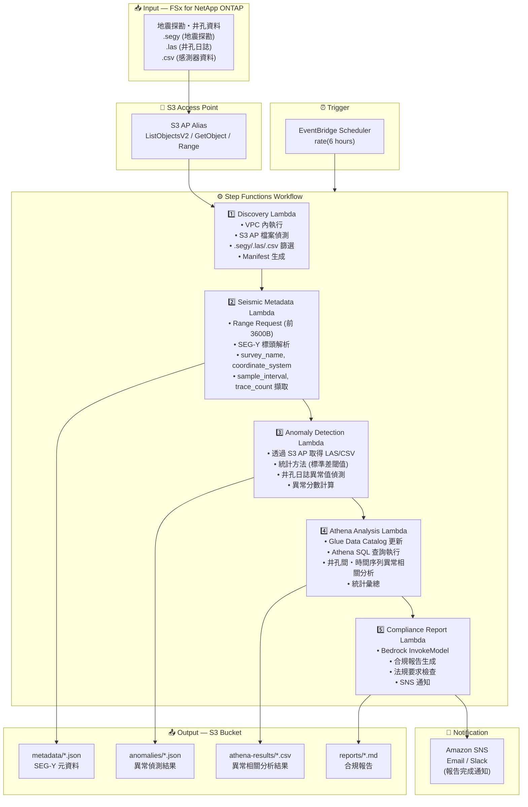

# UC8: 能源 / 石油與天然氣 — 地震探勘資料處理・井孔測井異常偵測

🌐 **Language / 언어 / 语言 / 語言 / Langue / Sprache / Idioma**: [日本語](architecture.md) | [English](architecture.en.md) | [한국어](architecture.ko.md) | [简体中文](architecture.zh-CN.md) | 繁體中文 | [Français](architecture.fr.md) | [Deutsch](architecture.de.md) | [Español](architecture.es.md)

> 注意：此翻譯由 Amazon Bedrock Claude 產生。歡迎對翻譯品質提出改進建議。

## End-to-End Architecture (Input → Output)

---

## Architecture Diagram

---

## Data Flow Detail

### Input
| Item | Description |
|------|-------------|
| **Source** | FSx for NetApp ONTAP volume |
| **File Types** | .segy (SEG-Y 地震探勘), .las (井孔日誌), .csv (感測器資料) |
| **Access Method** | S3 Access Point (ListObjectsV2 + GetObject + Range Request) |
| **Read Strategy** | SEG-Y: 僅前 3600 位元組 (Range Request), LAS/CSV: 完整取得 |

### Processing
| Step | Service | Function |
|------|---------|----------|
| Discovery | Lambda (VPC) | 透過 S3 AP 偵測 SEG-Y/LAS/CSV 檔案，生成 Manifest |
| Seismic Metadata | Lambda | 透過 Range Request 取得 SEG-Y 標頭，擷取元資料 (survey_name, coordinate_system, sample_interval, trace_count) |
| Anomaly Detection | Lambda | 井孔日誌統計異常偵測 (標準差閾值)，計算異常分數 |
| Athena Analysis | Lambda + Glue + Athena | 透過 SQL 進行井孔間・時間序列異常相關分析，統計彙總 |
| Compliance Report | Lambda + Bedrock | 生成合規報告，檢查法規要求 |

### Output
| Artifact | Format | Description |
|----------|--------|-------------|
| Metadata JSON | `metadata/YYYY/MM/DD/{survey}_metadata.json` | SEG-Y 元資料 (座標系統、取樣間隔、追蹤數) |
| Anomaly Results | `anomalies/YYYY/MM/DD/{well}_anomalies.json` | 井孔日誌異常偵測結果 (異常分數、超過閾值位置) |
| Athena Results | `athena-results/{id}.csv` | 井孔間・時間序列異常相關分析結果 |
| Compliance Report | `reports/YYYY/MM/DD/compliance_report.md` | Bedrock 生成的合規報告 |
| SNS Notification | Email | 報告完成通知・異常偵測警報 |

---

## Key Design Decisions

1. **透過 Range Request 取得 SEG-Y 標頭** — SEG-Y 檔案可達數 GB，但元資料集中在前 3600 位元組。透過 Range Request 優化頻寬與成本
2. **統計異常偵測** — 基於標準差閾值的方法，無需 ML 模型即可偵測井孔日誌異常。閾值可參數化調整
3. **透過 Athena 進行相關分析** — 使用 SQL 靈活分析多個井孔間・時間序列的異常模式相關性
4. **透過 Bedrock 生成報告** — 自動以自然語言生成符合法規要求的合規報告
5. **循序管線** — 透過 Step Functions 管理元資料 → 異常偵測 → 相關分析 → 報告的順序依賴性
6. **基於輪詢** — 由於 S3 AP 不支援事件通知，採用定期排程執行

---

## AWS Services Used

| Service | Role |
|---------|------|
| FSx for NetApp ONTAP | 地震探勘資料・井孔日誌儲存 |
| S3 Access Points | 對 ONTAP 磁碟區的無伺服器存取 (支援 Range Request) |
| EventBridge Scheduler | 定期觸發 |
| Step Functions | 工作流程編排 (循序) |
| Lambda | 運算 (Discovery, Seismic Metadata, Anomaly Detection, Athena Analysis, Compliance Report) |
| Glue Data Catalog | 異常偵測資料的結構描述管理 |
| Amazon Athena | 基於 SQL 的異常相關分析・統計彙總 |
| Amazon Bedrock | 合規報告生成 (Claude / Nova) |
| SNS | 報告完成通知・異常偵測警報 |
| Secrets Manager | ONTAP REST API 認證資訊管理 |
| CloudWatch + X-Ray | 可觀測性 |
