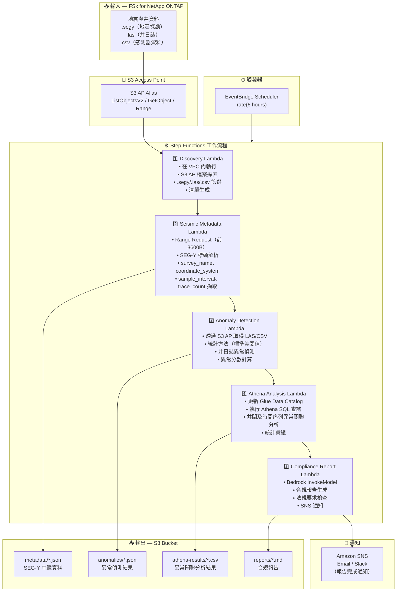

# UC8: 能源/石油天然氣 — 地震探勘資料處理與井日誌異常偵測

🌐 **Language / 言語**: [日本語](architecture.md) | [English](architecture.en.md) | [한국어](architecture.ko.md) | [简体中文](architecture.zh-CN.md) | 繁體中文 | [Français](architecture.fr.md) | [Deutsch](architecture.de.md) | [Español](architecture.es.md)

## 端到端架構（輸入 → 輸出）

---

## 高層級流程

```
┌─────────────────────────────────────────────────────────────────────────────┐
│                         FSx for NetApp ONTAP                                 │
│                                                                              │
│  /vol/seismic_data/                                                          │
│  ├── surveys/north_field/survey_2024.segy    (SEG-Y seismic data)            │
│  ├── surveys/south_field/survey_2024.segy    (SEG-Y seismic data)            │
│  ├── well_logs/well_A/gamma_ray.las          (Well log LAS)                  │
│  ├── well_logs/well_B/resistivity.las        (Well log LAS)                  │
│  └── well_logs/well_C/sensor_data.csv        (Sensor data CSV)               │
│                                                                              │
└──────────────────────────────────┬───────────────────────────────────────────┘
                                   │
                                   ▼
┌──────────────────────────────────────────────────────────────────────────────┐
│                      S3 Access Point (Data Path)                              │
│                                                                              │
│  Alias: fsxn-seismic-vol-ext-s3alias                                         │
│  • ListObjectsV2 (SEG-Y/LAS/CSV file discovery)                             │
│  • GetObject (file retrieval)                                                │
│  • Range Request (SEG-Y header first 3600 bytes)                             │
│  • No NFS/SMB mount required from Lambda                                     │
│                                                                              │
└──────────────────────────────────┬───────────────────────────────────────────┘
                                   │
                                   ▼
┌──────────────────────────────────────────────────────────────────────────────┐
│                    EventBridge Scheduler (Trigger)                            │
│                                                                              │
│  Schedule: rate(6 hours) — configurable                                      │
│  Target: Step Functions State Machine                                        │
│                                                                              │
└──────────────────────────────────┬───────────────────────────────────────────┘
                                   │
                                   ▼
┌──────────────────────────────────────────────────────────────────────────────┐
│                    AWS Step Functions (Orchestration)                         │
│                                                                              │
│  ┌─────────────┐    ┌──────────────────────┐    ┌────────────────────┐      │
│  │  Discovery   │───▶│  Seismic Metadata    │───▶│ Anomaly Detection  │      │
│  │  Lambda      │    │  Lambda              │    │ Lambda             │      │
│  │             │    │                      │    │                   │      │
│  │  • VPC内     │    │  • Range Request     │    │  • Statistical     │      │
│  │  • S3 AP List│    │  • SEG-Y header      │    │    anomaly detect  │      │
│  │  • SEG-Y/LAS │    │  • Metadata extract  │    │  • Std dev thresh  │      │
│  └─────────────┘    └──────────────────────┘    │  • Well log analysis│     │
│                                                  └────────────────────┘      │
│                                                         │                    │
│                                                         ▼                    │
│                      ┌──────────────────────┐    ┌────────────────────┐      │
│                      │  Compliance Report   │◀───│  Athena Analysis   │      │
│                      │  Lambda              │    │  Lambda            │      │
│                      │                      │    │                   │      │
│                      │  • Bedrock           │    │  • Glue Catalog    │      │
│                      │  • Report generation │    │  • Athena SQL      │      │
│                      │  • SNS notification  │    │  • Anomaly correl  │      │
│                      └──────────────────────┘    └────────────────────┘      │
│                                                                              │
└──────────────────────────────────────────────────────────────────────────────┘
                                   │
                                   ▼
┌──────────────────────────────────────────────────────────────────────────────┐
│                         Output (S3 Bucket)                                    │
│                                                                              │
│  s3://{stack}-output-{account}/                                              │
│  ├── metadata/YYYY/MM/DD/                                                    │
│  │   ├── survey_north_field_metadata.json   ← SEG-Y metadata                │
│  │   └── survey_south_field_metadata.json                                    │
│  ├── anomalies/YYYY/MM/DD/                                                   │
│  │   ├── well_A_anomalies.json             ← Anomaly detection results      │
│  │   └── well_B_anomalies.json                                               │
│  ├── athena-results/                                                         │
│  │   └── {query-execution-id}.csv          ← Anomaly correlation results    │
│  └── reports/YYYY/MM/DD/                                                     │
│      └── compliance_report.md              ← Compliance report               │
│                                                                              │
└──────────────────────────────────────────────────────────────────────────────┘
```

---

## Mermaid 圖表



---

## 資料流程詳細說明

### 輸入
| 項目 | 說明 |
|------|------|
| **來源** | FSx for NetApp ONTAP 磁碟區 |
| **檔案類型** | .segy（SEG-Y 地震資料）、.las（井日誌）、.csv（感測器資料） |
| **存取方式** | S3 Access Point（ListObjectsV2 + GetObject + Range Request） |
| **讀取策略** | SEG-Y：僅前 3600 位元組（Range Request），LAS/CSV：完整取得 |

### 處理
| 步驟 | 服務 | 功能 |
|------|------|------|
| 探索 | Lambda（VPC） | 透過 S3 AP 探索 SEG-Y/LAS/CSV 檔案，生成清單 |
| 地震中繼資料 | Lambda | SEG-Y 標頭 Range Request，中繼資料擷取（survey_name、coordinate_system、sample_interval、trace_count） |
| 異常偵測 | Lambda | 井日誌統計異常偵測（標準差閾值），異常分數計算 |
| Athena 分析 | Lambda + Glue + Athena | 基於 SQL 的井間及時間序列異常關聯分析，統計彙總 |
| 合規報告 | Lambda + Bedrock | 合規報告生成，法規要求檢查 |

### 輸出
| 產出物 | 格式 | 說明 |
|--------|------|------|
| 中繼資料 JSON | `metadata/YYYY/MM/DD/{survey}_metadata.json` | SEG-Y 中繼資料（座標系、取樣間隔、道數） |
| 異常結果 | `anomalies/YYYY/MM/DD/{well}_anomalies.json` | 井日誌異常偵測結果（異常分數、閾值超出） |
| Athena 結果 | `athena-results/{id}.csv` | 井間及時間序列異常關聯分析結果 |
| 合規報告 | `reports/YYYY/MM/DD/compliance_report.md` | Bedrock 生成的合規報告 |
| SNS 通知 | Email | 報告完成通知及異常偵測警報 |

---

## 關鍵設計決策

1. **SEG-Y 標頭 Range Request** — SEG-Y 檔案可達數 GB，但中繼資料集中在前 3600 位元組。Range Request 最佳化頻寬與成本
2. **統計異常偵測** — 基於標準差閾值的方法，無需 ML 模型即可偵測井日誌異常。閾值參數化可調
3. **Athena 關聯分析** — 跨多口井和時間序列的異常模式靈活 SQL 分析
4. **Bedrock 報告生成** — 自動生成符合法規要求的自然語言合規報告
5. **順序管線** — Step Functions 管理順序依賴：中繼資料 → 異常偵測 → 關聯分析 → 報告
6. **輪詢（非事件驅動）** — S3 AP 不支援事件通知，因此採用定期排程執行

---

## 使用的 AWS 服務

| 服務 | 角色 |
|------|------|
| FSx for NetApp ONTAP | 地震資料及井日誌儲存 |
| S3 Access Points | 對 ONTAP 磁碟區的無伺服器存取（Range Request 支援） |
| EventBridge Scheduler | 定期觸發 |
| Step Functions | 工作流程編排（順序） |
| Lambda | 運算（Discovery、Seismic Metadata、Anomaly Detection、Athena Analysis、Compliance Report） |
| Glue Data Catalog | 異常偵測資料模式管理 |
| Amazon Athena | 基於 SQL 的異常關聯分析及統計彙總 |
| Amazon Bedrock | 合規報告生成（Claude / Nova） |
| SNS | 報告完成通知及異常偵測警報 |
| Secrets Manager | ONTAP REST API 憑證管理 |
| CloudWatch + X-Ray | 可觀測性 |
