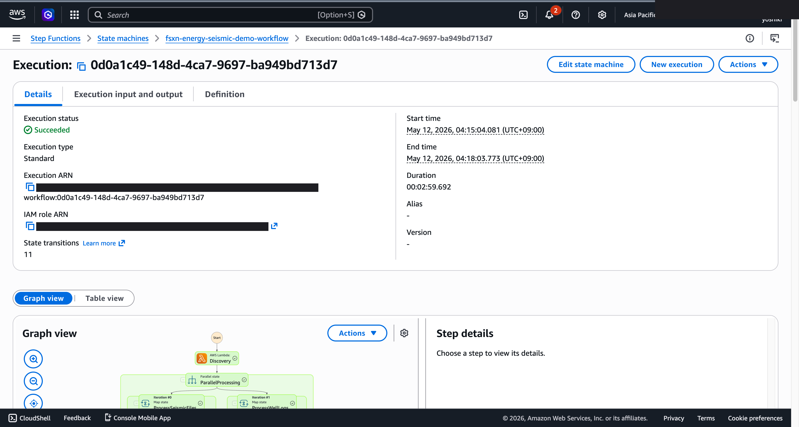
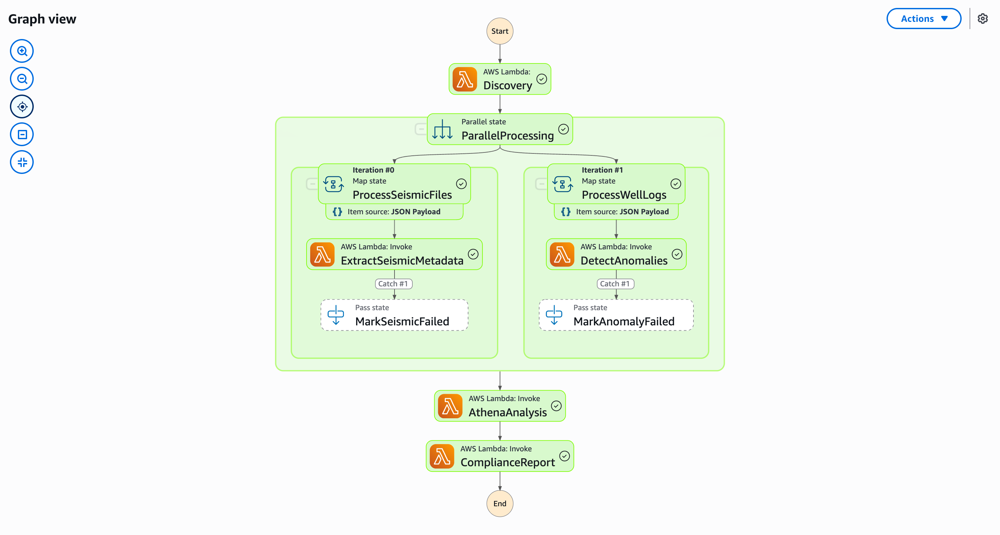

# Anomalieerkennung in Protokolldaten und Compliance-Bericht — Demo Guide

🌐 **Language / 언어 / 语言 / 語言 / Langue / Sprache / Idioma**: [日本語](demo-guide.md) | [English](demo-guide.en.md) | [한국어](demo-guide.ko.md) | [简体中文](demo-guide.zh-CN.md) | [繁體中文](demo-guide.zh-TW.md) | [Français](demo-guide.fr.md) | Deutsch | [Español](demo-guide.es.md)

> Hinweis: Diese Übersetzung wurde von Amazon Bedrock Claude erstellt. Beiträge zur Verbesserung der Übersetzungsqualität sind willkommen.

## Executive Summary

Diese Demo zeigt eine Pipeline zur Anomalieerkennung in Bohrloch-Logging-Daten und zur Erstellung von Compliance-Berichten. Qualitätsprobleme in Logging-Daten werden automatisch erkannt und regulatorische Berichte effizient erstellt.

**Kernbotschaft der Demo**: Automatische Erkennung von Anomalien in Logging-Daten und sofortige Erstellung von Compliance-Berichten, die regulatorischen Anforderungen entsprechen.

**Geschätzte Dauer**: 3–5 Minuten

---

## Target Audience & Persona

| Punkt | Details |
|------|------|
| **Position** | Geologieingenieur / Datenanalyst / Compliance-Beauftragter |
| **Tägliche Aufgaben** | Analyse von Logging-Daten, Bohrlochbewertung, Erstellung regulatorischer Berichte |
| **Herausforderung** | Manuelle Erkennung von Anomalien in großen Mengen von Logging-Daten ist zeitaufwändig |
| **Erwartetes Ergebnis** | Automatische Datenqualitätsprüfung und Effizienzsteigerung bei regulatorischen Berichten |

### Persona: Herr Matsumoto (Geologieingenieur)

- Verwaltet Logging-Daten von über 50 Bohrlöchern
- Regelmäßige Berichterstattung an Regulierungsbehörden erforderlich
- „Ich möchte Datenanomalieerkennung automatisieren und die Berichterstellung effizienter gestalten"

---

## Demo Scenario: Batch-Analyse von Logging-Daten

### Gesamtworkflow-Übersicht

```
Logging-Daten      Datenvalidierung    Anomalieerkennung    Compliance
(LAS/DLIS)    →    Qualitätsprüfung →  Statistische     →   Berichterstellung
                   Format              Analyse
                                       Ausreißererkennung
```

---

## Storyboard (5 Abschnitte / 3–5 Minuten)

### Section 1: Problem Statement (0:00–0:45)

**Narration (Zusammenfassung)**:
> Logging-Daten von 50 Bohrlöchern müssen regelmäßig qualitätsgeprüft und an Regulierungsbehörden gemeldet werden. Bei manueller Analyse besteht ein hohes Risiko von Übersehungen.

**Key Visual**: Liste der Logging-Datendateien (LAS/DLIS-Format)

### Section 2: Data Ingestion (0:45–1:30)

**Narration (Zusammenfassung)**:
> Logging-Datendateien werden hochgeladen und die Qualitätsprüfungs-Pipeline wird gestartet. Beginnt mit der Formatvalidierung.

**Key Visual**: Workflow-Start, Datenformatvalidierung

### Section 3: Anomaly Detection (1:30–2:30)

**Narration (Zusammenfassung)**:
> Statistische Anomalieerkennung wird für jede Logging-Kurve (GR, SP, Resistivity usw.) durchgeführt. Ausreißer werden für jeden Tiefenabschnitt erkannt.

**Key Visual**: Anomalieerkennungsverarbeitung, Hervorhebung von Anomalien in Logging-Kurven

### Section 4: Results Review (2:30–3:45)

**Narration (Zusammenfassung)**:
> Erkannte Anomalien werden nach Bohrloch und Kurve überprüft. Anomalietypen (Spikes, Fehlstellen, Bereichsabweichungen) werden klassifiziert.

**Key Visual**: Tabelle der Anomalieerkennungsergebnisse, Zusammenfassung nach Bohrloch

### Section 5: Compliance Report (3:45–5:00)

**Narration (Zusammenfassung)**:
> KI generiert automatisch einen Compliance-Bericht, der regulatorischen Anforderungen entspricht. Enthält Datenqualitätszusammenfassung, Anomaliebehandlungsaufzeichnungen und empfohlene Maßnahmen.

**Key Visual**: Compliance-Bericht (entspricht regulatorischem Format)

---

## Screen Capture Plan

| # | Bildschirm | Abschnitt |
|---|------|-----------|
| 1 | Liste der Logging-Datendateien | Section 1 |
| 2 | Pipeline-Start & Formatvalidierung | Section 2 |
| 3 | Ergebnisse der Anomalieerkennung | Section 3 |
| 4 | Anomaliezusammenfassung nach Bohrloch | Section 4 |
| 5 | Compliance-Bericht | Section 5 |

---

## Narration Outline

| Abschnitt | Zeit | Kernbotschaft |
|-----------|------|--------------|
| Problem | 0:00–0:45 | „Manuelle Qualitätsprüfung von Logging-Daten aus 50 Bohrlöchern stößt an Grenzen" |
| Ingestion | 0:45–1:30 | „Validierung startet automatisch beim Daten-Upload" |
| Detection | 1:30–2:30 | „Statistische Methoden erkennen Anomalien in jeder Kurve" |
| Results | 2:30–3:45 | „Anomalien werden nach Bohrloch und Kurve klassifiziert und überprüft" |
| Report | 3:45–5:00 | „KI generiert automatisch regulierungskonforme Berichte" |

---

## Sample Data Requirements

| # | Daten | Verwendungszweck |
|---|--------|------|
| 1 | Normale Logging-Daten (LAS-Format, 10 Bohrlöcher) | Baseline |
| 2 | Spike-Anomaliedaten (3 Fälle) | Anomalieerkennungs-Demo |
| 3 | Daten mit fehlenden Abschnitten (2 Fälle) | Qualitätsprüfungs-Demo |
| 4 | Bereichsabweichungsdaten (2 Fälle) | Klassifizierungs-Demo |

---

## Timeline

### Erreichbar innerhalb 1 Woche

| Aufgabe | Erforderliche Zeit |
|--------|---------|
| Vorbereitung von Sample-Logging-Daten | 3 Stunden |
| Pipeline-Ausführungsbestätigung | 2 Stunden |
| Bildschirmaufnahmen | 2 Stunden |
| Erstellung des Narrationsskripts | 2 Stunden |
| Videobearbeitung | 4 Stunden |

### Future Enhancements

- Echtzeit-Überwachung von Bohrdaten
- Automatisierung der Schichtkorrelation
- Integration mit 3D-Geologiemodellen

---

## Technical Notes

| Komponente | Rolle |
|--------------|------|
| Step Functions | Workflow-Orchestrierung |
| Lambda (LAS Parser) | Analyse des Logging-Datenformats |
| Lambda (Anomaly Detector) | Statistische Anomalieerkennung |
| Lambda (Report Generator) | Compliance-Berichterstellung durch Bedrock |
| Amazon Athena | Aggregationsanalyse von Logging-Daten |

### Fallback

| Szenario | Maßnahme |
|---------|------|
| LAS-Parsing-Fehler | Verwendung vorab analysierter Daten |
| Bedrock-Verzögerung | Anzeige vorab generierter Berichte |

---

*Dieses Dokument ist ein Produktionsleitfaden für Demo-Videos für technische Präsentationen.*

---

## Verifizierte UI/UX-Screenshots

Nach demselben Ansatz wie Phase 7 UC15/16/17 und UC6/11/14 Demos werden **UI/UX-Bildschirme, die Endbenutzer in ihrer täglichen Arbeit tatsächlich sehen**, als Ziel betrachtet. Technische Ansichten (Step Functions-Graph, CloudFormation-Stack-Ereignisse usw.) werden in `docs/verification-results-*.md` konsolidiert.

### Verifizierungsstatus für diesen Use Case

- ✅ **E2E-Ausführung**: In Phase 1-6 bestätigt (siehe Root-README)
- 📸 **UI/UX-Neuaufnahme**: ✅ Aufgenommen bei Redeployment-Verifizierung am 10.05.2026 (UC8 Step Functions-Graph, erfolgreiche Lambda-Ausführung bestätigt)
- 🔄 **Reproduktionsmethode**: Siehe „Aufnahmeleitfaden" am Ende dieses Dokuments

### Aufgenommen bei Redeployment-Verifizierung am 10.05.2026 (UI/UX-Fokus)

#### UC8 Step Functions Graph view (SUCCEEDED)


Step Functions Graph view visualisiert den Ausführungsstatus jedes Lambda / Parallel / Map-Status farblich und ist der wichtigste Bildschirm für Endbenutzer.

### Vorhandene Screenshots (relevante aus Phase 1-6)

#### UC8 Step Functions Graph (SUCCEEDED — Neuaufnahme nach IAM-Korrektur in Phase 8)



Nach IAM S3AP-Korrektur neu bereitgestellt. Alle Schritte SUCCEEDED (2:59).

#### UC8 Step Functions Graph (Zoom-Ansicht — Details zu jedem Schritt)



### UI/UX-Zielbildschirme bei Neuverifizierung (empfohlene Aufnahmeliste)

- S3-Ausgabe-Bucket (segy-metadata/, anomalies/, reports/)
- Athena-Abfrageergebnisse (SEG-Y-Metadatenstatistiken)
- Rekognition-Bohrloch-Log-Bild-Labels
- Anomalieerkennungsbericht

### Aufnahmeleitfaden

1. **Vorbereitung**:
   - Voraussetzungen mit `bash scripts/verify_phase7_prerequisites.sh` prüfen (gemeinsame VPC/S3 AP vorhanden)
   - Lambda-Paket mit `UC=energy-seismic bash scripts/package_generic_uc.sh`
   - Deployment mit `bash scripts/deploy_generic_ucs.sh UC8`

2. **Sample-Datenplatzierung**:
   - Sample-Dateien über S3 AP Alias mit `seismic/`-Präfix hochladen
   - Step Functions `fsxn-energy-seismic-demo-workflow` starten (Eingabe `{}`)

3. **Aufnahme** (CloudShell/Terminal schließen, Benutzername oben rechts im Browser schwärzen):
   - Übersicht über S3-Ausgabe-Bucket `fsxn-energy-seismic-demo-output-<account>`
   - Vorschau der AI/ML-Ausgabe-JSON (Format siehe `build/preview_*.html`)
   - SNS-E-Mail-Benachrichtigung (falls zutreffend)

4. **Maskierungsverarbeitung**:
   - Automatische Maskierung mit `python3 scripts/mask_uc_demos.py energy-seismic-demo`
   - Zusätzliche Maskierung nach `docs/screenshots/MASK_GUIDE.md` (bei Bedarf)

5. **Cleanup**:
   - Löschen mit `bash scripts/cleanup_generic_ucs.sh UC8`
   - VPC Lambda ENI-Freigabe dauert 15-30 Minuten (AWS-Spezifikation)
