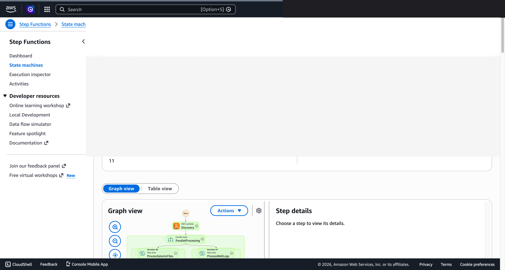

# 测井数据异常检测与合规报告 — Demo Guide

🌐 **Language / 언어 / 语言 / 語言 / Langue / Sprache / Idioma**: [日本語](demo-guide.md) | [English](demo-guide.en.md) | [한국어](demo-guide.ko.md) | 简体中文 | [繁體中文](demo-guide.zh-TW.md) | [Français](demo-guide.fr.md) | [Deutsch](demo-guide.de.md) | [Español](demo-guide.es.md)

> 注意：此翻译由 Amazon Bedrock Claude 生成。欢迎对翻译质量提出改进建议。

## Executive Summary

本演示展示了井眼测井数据异常检测和合规报告生成管道。自动检测测井数据的质量问题，高效创建监管报告。

**演示核心信息**：自动检测测井数据异常，即时生成符合监管要求的合规报告。

**预计时间**：3〜5 分钟

---

## Target Audience & Persona

| 项目 | 详细 |
|------|------|
| **职位** | 地质工程师 / 数据分析师 / 合规负责人 |
| **日常业务** | 测井数据解析、井眼评估、监管报告创建 |
| **课题** | 从大量测井数据中手动检测异常非常耗时 |
| **期待成果** | 数据质量自动验证和监管报告效率化 |

### Persona: 松本先生（地质工程师）

- 管理 50+ 口井的测井数据
- 需要向监管机构定期报告
- "希望自动检测数据异常，提高报告创建效率"

---

## Demo Scenario: 测井数据批量分析

### 工作流程全貌

```
测井数据        数据验证       异常检测          合规
(LAS/DLIS)   →   质量检查  →  统计分析    →    报告生成
                  格式         离群值检测
```

---

## Storyboard（5 个部分 / 3〜5 分钟）

### Section 1: Problem Statement（0:00–0:45）

**解说要点**:
> 需要定期对 50 口井的测井数据进行质量验证，并向监管机构报告。手动分析存在遗漏风险。

**Key Visual**: 测井数据文件列表（LAS/DLIS 格式）

### Section 2: Data Ingestion（0:45–1:30）

**解说要点**:
> 上传测井数据文件，启动质量验证管道。从格式验证开始。

**Key Visual**: 工作流程启动、数据格式验证

### Section 3: Anomaly Detection（1:30–2:30）

**解说要点**:
> 对各测井曲线（GR、SP、Resistivity 等）执行统计异常检测。检测各深度区间的离群值。

**Key Visual**: 异常检测处理中、测井曲线异常高亮显示

### Section 4: Results Review（2:30–3:45）

**解说要点**:
> 按井眼、曲线确认检测到的异常。对异常类型（尖峰、缺失、范围偏离）进行分类。

**Key Visual**: 异常检测结果表、按井眼汇总

### Section 5: Compliance Report（3:45–5:00）

**解说要点**:
> AI 自动生成符合监管要求的合规报告。包含数据质量汇总、异常应对记录、推荐措施。

**Key Visual**: 合规报告（符合监管格式）

---

## Screen Capture Plan

| # | 画面 | 部分 |
|---|------|-----------|
| 1 | 测井数据文件列表 | Section 1 |
| 2 | 管道启动・格式验证 | Section 2 |
| 3 | 异常检测处理结果 | Section 3 |
| 4 | 按井眼异常汇总 | Section 4 |
| 5 | 合规报告 | Section 5 |

---

## Narration Outline

| 部分 | 时间 | 关键信息 |
|-----------|------|--------------|
| Problem | 0:00–0:45 | "手动进行 50 口井的测井数据质量验证已达极限" |
| Ingestion | 0:45–1:30 | "数据上传后自动开始验证" |
| Detection | 1:30–2:30 | "使用统计方法检测各曲线异常" |
| Results | 2:30–3:45 | "按井眼、曲线对异常进行分类・确认" |
| Report | 3:45–5:00 | "AI 自动生成符合监管的报告" |

---

## Sample Data Requirements

| # | 数据 | 用途 |
|---|--------|------|
| 1 | 正常测井数据（LAS 格式、10 口井） | 基线 |
| 2 | 尖峰异常数据（3 件） | 异常检测演示 |
| 3 | 缺失区间数据（2 件） | 质量检查演示 |
| 4 | 范围偏离数据（2 件） | 分类演示 |

---

## Timeline

### 1 周内可达成

| 任务 | 所需时间 |
|--------|---------|
| 准备样本测井数据 | 3 小时 |
| 确认管道执行 | 2 小时 |
| 获取屏幕截图 | 2 小时 |
| 创建解说稿 | 2 小时 |
| 视频编辑 | 4 小时 |

### Future Enhancements

- 实时钻井数据监控
- 地层对比自动化
- 3D 地质模型联动

---

## Technical Notes

| 组件 | 作用 |
|--------------|------|
| Step Functions | 工作流程编排 |
| Lambda (LAS Parser) | 测井数据格式解析 |
| Lambda (Anomaly Detector) | 统计异常检测 |
| Lambda (Report Generator) | 通过 Bedrock 生成合规报告 |
| Amazon Athena | 测井数据汇总分析 |

### 回退方案

| 场景 | 应对 |
|---------|------|
| LAS 解析失败 | 使用预先解析的数据 |
| Bedrock 延迟 | 显示预先生成的报告 |

---

*本文档是技术演示用演示视频的制作指南。*

---

## 已验证的 UI/UX 截图

Phase 7 UC15/16/17 与 UC6/11/14 的演示采用相同方针，以**最终用户在日常业务中实际
看到的 UI/UX 画面**为对象。技术人员视图（Step Functions 图、CloudFormation
堆栈事件等）汇总在 `docs/verification-results-*.md` 中。

### 本用例的验证状态

- ✅ **E2E 执行**: Phase 1-6 已确认（参考根 README）
- 📸 **UI/UX 重新拍摄**: ✅ 2026-05-10 重新部署验证时已拍摄 （UC8 Step Functions 图、Lambda 执行成功已确认）
- 🔄 **重现方法**: 参考本文档末尾的"拍摄指南"

### 2026-05-10 重新部署验证时拍摄（以 UI/UX 为中心）

#### UC8 Step Functions Graph view（SUCCEEDED）



Step Functions Graph view 通过颜色可视化各 Lambda / Parallel / Map 状态的执行情况，
是最终用户最重要的画面。

### 现有截图（来自 Phase 1-6 的相关部分）

*(无相关内容。重新验证时请新拍摄)*

### 重新验证时的 UI/UX 目标画面（推荐拍摄列表）

- S3 输出存储桶（segy-metadata/、anomalies/、reports/）
- Athena 查询结果（SEG-Y 元数据统计）
- Rekognition 井眼日志图像标签
- 异常检测报告

### 拍摄指南

1. **事前准备**:
   - `bash scripts/verify_phase7_prerequisites.sh` 确认前提条件（共享 VPC/S3 AP 是否存在）
   - `UC=energy-seismic bash scripts/package_generic_uc.sh` 打包 Lambda
   - `bash scripts/deploy_generic_ucs.sh UC8` 部署

2. **放置样本数据**:
   - 通过 S3 AP Alias 将样本文件上传到 `seismic/` 前缀
   - 启动 Step Functions `fsxn-energy-seismic-demo-workflow`（输入 `{}`）

3. **拍摄**（关闭 CloudShell・终端，浏览器右上角的用户名涂黑）:
   - S3 输出存储桶 `fsxn-energy-seismic-demo-output-<account>` 的俯瞰图
   - AI/ML 输出 JSON 的预览（参考 `build/preview_*.html` 格式）
   - SNS 邮件通知（如适用）

4. **遮罩处理**:
   - `python3 scripts/mask_uc_demos.py energy-seismic-demo` 自动遮罩
   - 根据 `docs/screenshots/MASK_GUIDE.md` 进行额外遮罩（如需要）

5. **清理**:
   - `bash scripts/cleanup_generic_ucs.sh UC8` 删除
   - VPC Lambda ENI 释放需要 15-30 分钟（AWS 规格）
