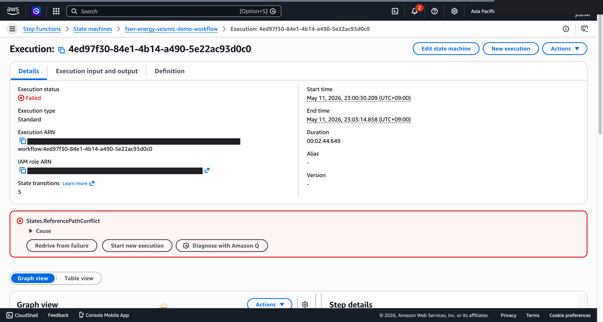

# 檢層數據異常檢知・合規報告 — Demo Guide

🌐 **Language / 언어 / 语言 / 語言 / Langue / Sprache / Idioma**: [日本語](demo-guide.md) | [English](demo-guide.en.md) | [한국어](demo-guide.ko.md) | [简体中文](demo-guide.zh-CN.md) | 繁體中文 | [Français](demo-guide.fr.md) | [Deutsch](demo-guide.de.md) | [Español](demo-guide.es.md)

> 注意：此翻譯由 Amazon Bedrock Claude 產生。歡迎對翻譯品質提出改進建議。

## Executive Summary

本示範展示了井測資料異常檢測與合規報告生成管線。自動檢測井測資料的品質問題，並有效率地建立法規報告。

**示範的核心訊息**：自動檢測井測資料的異常，並立即生成符合法規要求的合規報告。

**預估時間**：3〜5 分鐘

---

## Target Audience & Persona

| 項目 | 詳細 |
|------|------|
| **職位** | 地質工程師 / 資料分析師 / 合規負責人 |
| **日常業務** | 井測資料解析、井評估、法規報告書製作 |
| **課題** | 從大量井測資料中手動檢測異常非常耗時 |
| **期待成果** | 資料品質的自動驗證與法規報告的效率化 |

### Persona: 松本先生（地質工程師）

- 管理 50+ 口井的井測資料
- 需要定期向法規機關報告
- 「希望自動檢測資料異常，提升報告製作效率」

---

## Demo Scenario: 井測資料批次分析

### 工作流程全貌

```
井測資料          資料驗證       異常檢測          合規
(LAS/DLIS)   →   品質檢查  →  統計分析    →    報告生成
                  格式         離群值檢測
```

---

## Storyboard（5 個章節 / 3〜5 分鐘）

### Section 1: Problem Statement（0:00–0:45）

**旁白要旨**:
> 需要定期對 50 口井的井測資料進行品質驗證，並向法規機關報告。手動分析有高度遺漏風險。

**Key Visual**: 井測資料檔案清單（LAS/DLIS 格式）

### Section 2: Data Ingestion（0:45–1:30）

**旁白要旨**:
> 上傳井測資料檔案，啟動品質驗證管線。從格式驗證開始。

**Key Visual**: 工作流程啟動、資料格式驗證

### Section 3: Anomaly Detection（1:30–2:30）

**旁白要旨**:
> 對各井測曲線（GR、SP、Resistivity 等）執行統計異常檢測。檢測各深度區間的離群值。

**Key Visual**: 異常檢測處理中、井測曲線的異常標示

### Section 4: Results Review（2:30–3:45）

**旁白要旨**:
> 依井別、曲線別確認檢測到的異常。分類異常類型（尖峰、缺失、範圍偏離）。

**Key Visual**: 異常檢測結果表格、井別摘要

### Section 5: Compliance Report（3:45–5:00）

**旁白要旨**:
> AI 自動生成符合法規要求的合規報告。包含資料品質摘要、異常處理記錄、建議行動。

**Key Visual**: 合規報告（符合法規格式）

---

## Screen Capture Plan

| # | 畫面 | 章節 |
|---|------|-----------|
| 1 | 井測資料檔案清單 | Section 1 |
| 2 | 管線啟動・格式驗證 | Section 2 |
| 3 | 異常檢測處理結果 | Section 3 |
| 4 | 井別異常摘要 | Section 4 |
| 5 | 合規報告 | Section 5 |

---

## Narration Outline

| 章節 | 時間 | 關鍵訊息 |
|-----------|------|--------------|
| Problem | 0:00–0:45 | 「手動進行 50 口井的井測資料品質驗證已達極限」 |
| Ingestion | 0:45–1:30 | 「資料上傳後自動開始驗證」 |
| Detection | 1:30–2:30 | 「以統計方法檢測各曲線的異常」 |
| Results | 2:30–3:45 | 「依井別、曲線別分類・確認異常」 |
| Report | 3:45–5:00 | 「AI 自動生成符合法規的報告」 |

---

## Sample Data Requirements

| # | 資料 | 用途 |
|---|--------|------|
| 1 | 正常井測資料（LAS 格式、10 口井） | 基準線 |
| 2 | 尖峰異常資料（3 件） | 異常檢測示範 |
| 3 | 缺失區間資料（2 件） | 品質檢查示範 |
| 4 | 範圍偏離資料（2 件） | 分類示範 |

---

## Timeline

### 1 週內可達成

| 任務 | 所需時間 |
|--------|---------|
| 準備樣本井測資料 | 3 小時 |
| 確認管線執行 | 2 小時 |
| 取得畫面截圖 | 2 小時 |
| 製作旁白稿 | 2 小時 |
| 影片編輯 | 4 小時 |

### Future Enhancements

- 即時鑽井資料監控
- 地層對比自動化
- 3D 地質模型整合

---

## Technical Notes

| 元件 | 角色 |
|--------------|------|
| Step Functions | 工作流程編排 |
| Lambda (LAS Parser) | 井測資料格式解析 |
| Lambda (Anomaly Detector) | 統計異常檢測 |
| Lambda (Report Generator) | 透過 Bedrock 生成合規報告 |
| Amazon Athena | 井測資料的彙總分析 |

### 備援方案

| 情境 | 對應 |
|---------|------|
| LAS 解析失敗 | 使用預先解析的資料 |
| Bedrock 延遲 | 顯示預先生成的報告 |

---

*本文件為技術簡報用示範影片的製作指南。*

---

## 已驗證的 UI/UX 螢幕截圖

Phase 7 UC15/16/17 與 UC6/11/14 的示範採用相同方針，以**終端使用者在日常業務中實際
看到的 UI/UX 畫面**為對象。技術人員視圖（Step Functions 圖表、CloudFormation
堆疊事件等）集中於 `docs/verification-results-*.md`。

### 此使用案例的驗證狀態

- ✅ **E2E 執行**: Phase 1-6 已確認（參照根目錄 README）
- 📸 **UI/UX 重新拍攝**: ✅ 2026-05-10 重新部署驗證時已拍攝 （UC8 Step Functions 圖表、Lambda 執行成功已確認）
- 🔄 **重現方法**: 參照本文件末尾的「拍攝指南」

### 2026-05-10 重新部署驗證時拍攝（以 UI/UX 為中心）

#### UC8 Step Functions Graph view（SUCCEEDED）


Step Functions Graph view 以顏色視覺化各 Lambda / Parallel / Map 狀態的執行狀況，
是終端使用者最重要的畫面。

### 既有螢幕截圖（來自 Phase 1-6 的相關部分）



### 重新驗證時的 UI/UX 目標畫面（建議拍攝清單）

- S3 輸出儲存貯體（segy-metadata/、anomalies/、reports/）
- Athena 查詢結果（SEG-Y 中繼資料統計）
- Rekognition 井測影像標籤
- 異常檢測報告

### 拍攝指南

1. **事前準備**:
   - `bash scripts/verify_phase7_prerequisites.sh` 確認前提（共用 VPC/S3 AP 是否存在）
   - `UC=energy-seismic bash scripts/package_generic_uc.sh` 打包 Lambda
   - `bash scripts/deploy_generic_ucs.sh UC8` 進行部署

2. **配置樣本資料**:
   - 透過 S3 AP Alias 將樣本檔案上傳至 `seismic/` 前綴
   - 啟動 Step Functions `fsxn-energy-seismic-demo-workflow`（輸入 `{}`）

3. **拍攝**（關閉 CloudShell・終端機，將瀏覽器右上角的使用者名稱塗黑）:
   - S3 輸出儲存貯體 `fsxn-energy-seismic-demo-output-<account>` 的總覽
   - AI/ML 輸出 JSON 的預覽（參考 `build/preview_*.html` 的格式）
   - SNS 電子郵件通知（如適用）

4. **遮罩處理**:
   - `python3 scripts/mask_uc_demos.py energy-seismic-demo` 進行自動遮罩
   - 依照 `docs/screenshots/MASK_GUIDE.md` 進行額外遮罩（如有需要）

5. **清理**:
   - `bash scripts/cleanup_generic_ucs.sh UC8` 進行刪除
   - VPC Lambda ENI 釋放需 15-30 分鐘（AWS 規格）
