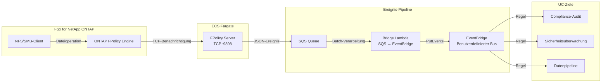
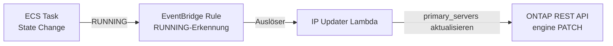

🌐 **Language / 言語**: [日本語](README.md) | [English](README.en.md) | [한국어](README.ko.md) | [简体中文](README.zh-CN.md) | [繁體中文](README.zh-TW.md) | [Français](README.fr.md) | Deutsch | [Español](README.es.md)

# Ereignisgesteuerte FPolicy — Echtzeit-Erkennung von Dateioperationen

📚 **Dokumentation**: [Architekturdiagramm](docs/architecture.de.md) | [Demo-Leitfaden](docs/demo-guide.de.md)

## Überblick

Ein serverloses Muster, das einen ONTAP FPolicy External Server auf ECS Fargate implementiert und Dateioperationsereignisse in Echtzeit an AWS-Dienste (SQS → EventBridge) weiterleitet.

Es erkennt sofort Dateierstellungs-, Schreib-, Lösch- und Umbenennungsoperationen über NFS/SMB und leitet sie über einen benutzerdefinierten EventBridge-Bus an beliebige Anwendungsfälle weiter (Compliance-Audit, Sicherheitsüberwachung, Auslösung von Datenpipelines usw.).

### Geeignete Anwendungsfälle

- Sie möchten Dateioperationen in Echtzeit erkennen und sofort Aktionen ausführen
- Sie möchten NFS/SMB-Dateiänderungen als AWS-Ereignisse behandeln
- Sie möchten von einer einzelnen Ereignisquelle an mehrere Anwendungsfälle routen
- Sie möchten Dateioperationen asynchron verarbeiten, ohne sie zu blockieren (asynchroner Modus)
- Sie möchten eine ereignisgesteuerte Architektur in Umgebungen realisieren, in denen S3-Ereignisbenachrichtigungen nicht verfügbar sind

### Nicht geeignete Anwendungsfälle

- Sie müssen Dateioperationen im Voraus blockieren/ablehnen (synchroner Modus erforderlich)
- Periodisches Batch-Scanning ist ausreichend (S3 AP Polling-Muster empfohlen)
- Ihre Umgebung verwendet ausschließlich das NFSv4.2-Protokoll (von FPolicy nicht unterstützt)
- Die Netzwerkerreichbarkeit zur ONTAP REST API kann nicht sichergestellt werden

### Hauptfunktionen

| Funktion | Beschreibung |
|----------|--------------|
| Multi-Protokoll-Unterstützung | Unterstützt NFSv3/NFSv4.0/NFSv4.1/SMB |
| Asynchroner Modus | Blockiert keine Dateioperationen (kein Latenzeinfluss) |
| XML-Parsing + Pfadnormalisierung | Konvertiert ONTAP FPolicy XML in strukturiertes JSON |
| Automatische SVM/Volume-Namensauflösung | Automatisch aus dem NEGO_REQ-Handshake ermittelt |
| EventBridge-Routing | Anwendungsfallspezifisches Routing über benutzerdefinierten Bus |
| Automatische IP-Aktualisierung der Fargate-Tasks | Reflektiert automatisch die ONTAP-Engine-IP bei ECS-Task-Neustart |
| NFSv3 Write-Complete-Wartezeit | Gibt das Ereignis erst nach Abschluss des Schreibvorgangs aus |

## Architektur



### Mechanismus zur automatischen IP-Aktualisierung



## Voraussetzungen

- AWS-Konto mit entsprechenden IAM-Berechtigungen
- FSx for NetApp ONTAP-Dateisystem (ONTAP 9.17.1 oder höher)
- VPC, private Subnetze (gleiche VPC wie FSxN SVM)
- ONTAP-Administratoranmeldedaten in Secrets Manager registriert
- ECR-Repository (für das FPolicy Server-Container-Image)
- VPC Endpoints (ECR, SQS, CloudWatch Logs, STS)

### VPC Endpoints-Anforderungen

Für den ordnungsgemäßen Betrieb von ECS Fargate (Private Subnet) sind folgende VPC Endpoints erforderlich:

| VPC Endpoint | Verwendung |
|-------------|------------|
| `com.amazonaws.<region>.ecr.dkr` | Container-Image-Pull |
| `com.amazonaws.<region>.ecr.api` | ECR-Authentifizierung |
| `com.amazonaws.<region>.s3` (Gateway) | ECR-Image-Layer-Abruf |
| `com.amazonaws.<region>.logs` | CloudWatch Logs |
| `com.amazonaws.<region>.sts` | IAM-Rollenauthentifizierung |
| `com.amazonaws.<region>.sqs` | SQS-Nachrichtenversand ★Erforderlich |

## Bereitstellungsschritte

### 1. Container-Image erstellen und pushen

```bash
# ECR-Repository erstellen
aws ecr create-repository \
  --repository-name fsxn-fpolicy-server \
  --region ap-northeast-1

# ECR-Anmeldung
aws ecr get-login-password --region ap-northeast-1 | \
  docker login --username AWS --password-stdin \
  <ACCOUNT_ID>.dkr.ecr.ap-northeast-1.amazonaws.com

# Build & Push (aus dem Verzeichnis event-driven-fpolicy/ ausführen)
docker buildx build --platform linux/arm64 \
  -f server/Dockerfile \
  -t <ACCOUNT_ID>.dkr.ecr.ap-northeast-1.amazonaws.com/fsxn-fpolicy-server:latest \
  --push .
```

### 2. CloudFormation-Bereitstellung

#### Fargate-Modus (Standard)

```bash
aws cloudformation deploy \
  --template-file event-driven-fpolicy/template.yaml \
  --stack-name fsxn-fpolicy-event-driven \
  --parameter-overrides \
    ComputeType=fargate \
    VpcId=<your-vpc-id> \
    SubnetIds=<subnet-1>,<subnet-2> \
    FsxnSvmSecurityGroupId=<fsxn-sg-id> \
    ContainerImage=<ACCOUNT_ID>.dkr.ecr.ap-northeast-1.amazonaws.com/fsxn-fpolicy-server:latest \
    FsxnMgmtIp=<svm-mgmt-ip> \
    FsxnSvmUuid=<svm-uuid> \
    FsxnCredentialsSecret=<secret-name> \
  --capabilities CAPABILITY_NAMED_IAM \
  --region ap-northeast-1
```

#### EC2-Modus (Feste IP, niedrige Kosten)

```bash
aws cloudformation deploy \
  --template-file event-driven-fpolicy/template.yaml \
  --stack-name fsxn-fpolicy-event-driven \
  --parameter-overrides \
    ComputeType=ec2 \
    VpcId=<your-vpc-id> \
    SubnetIds=<subnet-1> \
    FsxnSvmSecurityGroupId=<fsxn-sg-id> \
    ContainerImage=<ACCOUNT_ID>.dkr.ecr.ap-northeast-1.amazonaws.com/fsxn-fpolicy-server:latest \
    InstanceType=t4g.micro \
    FsxnMgmtIp=<svm-mgmt-ip> \
    FsxnSvmUuid=<svm-uuid> \
    FsxnCredentialsSecret=<secret-name> \
  --capabilities CAPABILITY_NAMED_IAM \
  --region ap-northeast-1
```

> **Auswahlkriterien Fargate vs EC2**:
> - **Fargate**: Skalierbarkeit im Fokus, verwalteter Betrieb, automatische IP-Aktualisierung enthalten
> - **EC2**: Kostenoptimierung (~3 $/Monat vs ~54 $/Monat), feste IP (keine ONTAP-Engine-Aktualisierung erforderlich), SSM-Unterstützung

### 3. ONTAP FPolicy-Konfiguration

```bash
# Per SSH mit dem FSxN SVM verbinden und Folgendes ausführen

# 1. External Engine erstellen
vserver fpolicy policy external-engine create \
  -vserver <SVM_NAME> \
  -engine-name fpolicy_aws_engine \
  -primary-servers <FARGATE_TASK_IP> \
  -port 9898 \
  -extern-engine-type asynchronous

# 2. Event erstellen
vserver fpolicy policy event create \
  -vserver <SVM_NAME> \
  -event-name fpolicy_aws_event \
  -protocol cifs,nfsv3,nfsv4 \
  -file-operations create,write,delete,rename

# 3. Policy erstellen
vserver fpolicy policy create \
  -vserver <SVM_NAME> \
  -policy-name fpolicy_aws \
  -events fpolicy_aws_event \
  -engine fpolicy_aws_engine \
  -is-mandatory false

# 4. Scope konfigurieren (optional)
vserver fpolicy policy scope create \
  -vserver <SVM_NAME> \
  -policy-name fpolicy_aws \
  -volumes-to-include "*"

# 5. Policy aktivieren
vserver fpolicy enable \
  -vserver <SVM_NAME> \
  -policy-name fpolicy_aws \
  -sequence-number 1
```

## Konfigurationsparameter

| Parameter | Beschreibung | Standard | Erforderlich |
|-----------|--------------|----------|--------------|
| `ComputeType` | Auswahl der Ausführungsumgebung (fargate/ec2) | `fargate` | |
| `VpcId` | VPC-ID (gleiche VPC wie FSxN) | — | ✅ |
| `SubnetIds` | Private Subnet für Fargate-Task oder EC2-Platzierung | — | ✅ |
| `FsxnSvmSecurityGroupId` | Security Group ID des FSxN SVM | — | ✅ |
| `ContainerImage` | FPolicy Server Container-Image-URI | — | ✅ |
| `FPolicyPort` | TCP-Listening-Port | `9898` | |
| `WriteCompleteDelaySec` | NFSv3 Write-Complete-Wartezeit in Sekunden | `5` | |
| `Mode` | Betriebsmodus (realtime/batch) | `realtime` | |
| `DesiredCount` | Anzahl der Fargate-Tasks (nur Fargate) | `1` | |
| `Cpu` | Fargate-Task-CPU (nur Fargate) | `256` | |
| `Memory` | Fargate-Task-Speicher in MB (nur Fargate) | `512` | |
| `InstanceType` | EC2-Instanztyp (nur EC2) | `t4g.micro` | |
| `KeyPairName` | SSH-Schlüsselpaarname (nur EC2, optional) | `""` | |
| `EventBusName` | Name des benutzerdefinierten EventBridge-Bus | `fsxn-fpolicy-events` | |
| `FsxnMgmtIp` | FSxN SVM Management-IP | — | ✅ |
| `FsxnSvmUuid` | FSxN SVM UUID | — | ✅ |
| `FsxnEngineName` | FPolicy External-Engine-Name | `fpolicy_aws_engine` | |
| `FsxnPolicyName` | FPolicy-Richtlinienname | `fpolicy_aws` | |
| `FsxnCredentialsSecret` | Secrets Manager Secret-Name | — | ✅ |

## Kostenstruktur

### Dauerhaft laufende Komponenten

| Dienst | Konfiguration | Monatliche Schätzung |
|--------|---------------|---------------------|
| ECS Fargate | 0,25 vCPU / 512 MB × 1 Task | ~9,50 $ |
| NLB | Interner NLB (für Health Checks) | ~16,20 $ |
| VPC Endpoints | SQS + ECR + Logs + STS (4 Interface) | ~28,80 $ |

### Nutzungsbasierte Komponenten

| Dienst | Abrechnungseinheit | Schätzung (1.000 Ereignisse/Tag) |
|--------|-------------------|----------------------------------|
| SQS | Anzahl der Anfragen | ~0,01 $/Monat |
| Lambda (Bridge) | Anfragen + Ausführungszeit | ~0,01 $/Monat |
| Lambda (IP Updater) | Anfragen (nur bei Task-Neustart) | ~0,001 $/Monat |
| EventBridge | Anzahl benutzerdefinierter Ereignisse | ~0,03 $/Monat |

> **Minimalkonfiguration**: Fargate + NLB + VPC Endpoints ab **~54,50 $/Monat**.

## Bereinigung

```bash
# 1. ONTAP FPolicy deaktivieren
# Per SSH mit dem FSxN SVM verbinden
vserver fpolicy disable -vserver <SVM_NAME> -policy-name fpolicy_aws

# 2. CloudFormation-Stack löschen
aws cloudformation delete-stack \
  --stack-name fsxn-fpolicy-event-driven \
  --region ap-northeast-1

aws cloudformation wait stack-delete-complete \
  --stack-name fsxn-fpolicy-event-driven \
  --region ap-northeast-1

# 3. ECR-Image löschen (optional)
aws ecr delete-repository \
  --repository-name fsxn-fpolicy-server \
  --force \
  --region ap-northeast-1
```

## Supported Regions

Dieses Muster verwendet die folgenden Dienste:

| Dienst | Regionale Einschränkungen |
|--------|--------------------------|
| FSx for NetApp ONTAP | [Liste unterstützter Regionen](https://docs.aws.amazon.com/general/latest/gr/fsxn.html) |
| ECS Fargate | In fast allen Regionen verfügbar |
| EventBridge | In allen Regionen verfügbar |
| SQS | In allen Regionen verfügbar |

## Verifizierte Umgebung

| Element | Wert |
|---------|------|
| AWS-Region | ap-northeast-1 (Tokyo) |
| FSx ONTAP-Version | ONTAP 9.17.1P6 |
| FSx-Konfiguration | SINGLE_AZ_1 |
| Python | 3.12 |
| Bereitstellungsmethode | CloudFormation (Standard) |

## Protokoll-Support-Matrix

| Protokoll | FPolicy-Unterstützung | Hinweise |
|-----------|:--------------------:|----------|
| NFSv3 | ✅ | Write-Complete-Wartezeit erforderlich (Standard 5 Sekunden) |
| NFSv4.0 | ✅ | Empfohlen |
| NFSv4.1 | ✅ | Empfohlen (`vers=4.1` beim Mounten angeben) |
| NFSv4.2 | ❌ | Nicht unterstützt durch ONTAP FPolicy Monitoring |
| SMB | ✅ | Wird als CIFS-Protokoll erkannt |

> **Wichtig**: `mount -o vers=4` kann zu NFSv4.2 ausgehandelt werden, geben Sie daher explizit `vers=4.1` an.

## Referenzen

- [NetApp FPolicy-Dokumentation](https://docs.netapp.com/us-en/ontap-technical-reports/ontap-security-hardening/create-fpolicy.html)
- [ONTAP REST API-Referenz](https://docs.netapp.com/us-en/ontap-automation/)
- [ECS Fargate-Dokumentation](https://docs.aws.amazon.com/AmazonECS/latest/developerguide/AWS_Fargate.html)
- [EventBridge Benutzerdefinierter Bus](https://docs.aws.amazon.com/eventbridge/latest/userguide/eb-create-event-bus.html)
