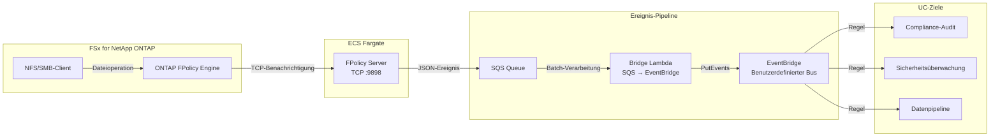

🌐 **Language / 言語**: [日本語](README.md) | [English](README.en.md) | [한국어](README.ko.md) | [简体中文](README.zh-CN.md) | [繁體中文](README.zh-TW.md) | [Français](README.fr.md) | Deutsch | [Español](README.es.md)

# Ereignisgesteuerte FPolicy — Echtzeit-Erkennung von Dateioperationen

📚 **Dokumentation**: [Architektur](docs/architecture.de.md) | [Demo-Leitfaden](docs/demo-guide.de.md)

## Überblick

Ein serverloses Muster, das einen ONTAP FPolicy External Server auf ECS Fargate implementiert und Dateioperationsereignisse in Echtzeit an AWS-Dienste (SQS → EventBridge) weiterleitet.

Erkennt sofort Dateierstellungs-, Schreib-, Lösch- und Umbenennungsoperationen über NFS/SMB und leitet sie über einen benutzerdefinierten EventBridge-Bus an beliebige Anwendungsfälle weiter (Compliance-Audit, Sicherheitsüberwachung, Datenpipeline-Auslösung usw.).

### Geeignete Anwendungsfälle

- Echtzeit-Erkennung von Dateioperationen mit sofortiger Aktion
- Behandlung von NFS/SMB-Dateiänderungen als AWS-Ereignisse
- Routing von Ereignissen aus einer einzigen Quelle an mehrere Anwendungsfälle
- Nicht-blockierende, asynchrone Verarbeitung von Dateioperationen
- Ereignisgesteuerte Architektur, wenn S3-Ereignisbenachrichtigungen nicht verfügbar sind

### Nicht geeignete Anwendungsfälle

- Vorheriges Blockieren/Ablehnen von Dateioperationen erforderlich (synchroner Modus)
- Periodisches Batch-Scanning ausreichend (S3 AP Polling-Muster empfohlen)
- Umgebung verwendet nur NFSv4.2-Protokoll (von FPolicy nicht unterstützt)
- Netzwerkverbindung zur ONTAP REST API nicht herstellbar

### Hauptfunktionen

| Funktion | Beschreibung |
|----------|-------------|
| Multi-Protokoll-Unterstützung | NFSv3/NFSv4.0/NFSv4.1/SMB |
| Asynchroner Modus | Nicht-blockierende Dateioperationen |
| XML-Parsing + Pfadnormalisierung | Konvertierung von ONTAP FPolicy XML in strukturiertes JSON |
| Automatische SVM/Volume-Namensauflösung | Automatische Extraktion aus NEGO_REQ-Handshake |
| EventBridge-Routing | UC-spezifisches Routing über benutzerdefinierten Bus |
| Automatische Fargate-Task-IP-Aktualisierung | Automatische ONTAP-Engine-IP-Aktualisierung bei Task-Neustart |

## Architektur

## Voraussetzungen

- AWS-Konto mit entsprechenden IAM-Berechtigungen
- FSx for NetApp ONTAP-Dateisystem (ONTAP 9.17.1 oder höher)
- VPC mit privaten Subnetzen (gleiche VPC wie FSxN SVM)
- ONTAP-Administratoranmeldedaten in Secrets Manager gespeichert
- ECR-Repository (für FPolicy Server Container-Image)
- VPC Endpoints (ECR, SQS, CloudWatch Logs, STS)

## Protokoll-Support-Matrix

| Protokoll | FPolicy-Unterstützung | Hinweise |
|-----------|:--------------------:|----------|
| NFSv3 | ✅ | Write-Complete-Wartezeit erforderlich (Standard 5s) |
| NFSv4.0 | ✅ | Empfohlen |
| NFSv4.1 | ✅ | Empfohlen (`vers=4.1` beim Mounten angeben) |
| NFSv4.2 | ❌ | Von ONTAP FPolicy Monitoring nicht unterstützt |
| SMB | ✅ | Als CIFS-Protokoll erkannt |

## Verifizierte Umgebung

| Element | Wert |
|---------|------|
| AWS-Region | ap-northeast-1 (Tokio) |
| FSx ONTAP-Version | ONTAP 9.17.1P6 |
| Python | 3.12 |
| Bereitstellung | CloudFormation (Standard) |
