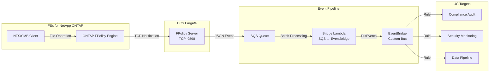
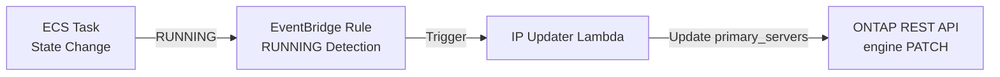

🌐 **Language / 言語**: [日本語](README.md) | English | [한국어](README.ko.md) | [简体中文](README.zh-CN.md) | [繁體中文](README.zh-TW.md) | [Français](README.fr.md) | [Deutsch](README.de.md) | [Español](README.es.md)

# Event-Driven FPolicy — Real-Time File Operation Detection Pattern

📚 **Documentation**: [Architecture Diagram](docs/architecture.en.md) | [Demo Guide](docs/demo-guide.en.md)

## Overview

A serverless pattern that implements an ONTAP FPolicy External Server on ECS Fargate, delivering file operation events in real time to AWS services (SQS → EventBridge).

It instantly detects file create, write, delete, and rename operations via NFS/SMB and routes them through an EventBridge custom bus to any use case (compliance auditing, security monitoring, data pipeline triggering, etc.).

### When This Pattern Is a Good Fit

- You want to detect file operations in real time and take immediate action
- You want to treat NFS/SMB file changes as AWS events
- You want to route from a single event source to multiple use cases
- You want to process file operations asynchronously without blocking them (asynchronous mode)
- You want to achieve event-driven architecture in environments where S3 event notifications are unavailable

### When This Pattern Is Not a Good Fit

- You need to block/deny file operations in advance (synchronous mode required)
- Periodic batch scanning is sufficient (S3 AP polling pattern recommended)
- Your environment uses only the NFSv4.2 protocol (not supported by FPolicy)
- Network reachability to the ONTAP REST API cannot be ensured

### Key Features

| Feature | Description |
|---------|-------------|
| Multi-protocol support | Supports NFSv3/NFSv4.0/NFSv4.1/SMB |
| Asynchronous mode | Does not block file operations (no latency impact) |
| XML parse + path normalization | Converts ONTAP FPolicy XML to structured JSON |
| SVM/Volume name auto-resolution | Automatically obtained from NEGO_REQ handshake |
| EventBridge routing | Use-case-specific routing via custom bus |
| Fargate task IP auto-update | Automatically reflects ONTAP engine IP on ECS task restart |
| NFSv3 write-complete wait | Issues event only after write completion |

## Architecture



### IP Auto-Update Mechanism



## Prerequisites

- AWS account with appropriate IAM permissions
- FSx for NetApp ONTAP file system (ONTAP 9.17.1 or later)
- VPC, private subnets (same VPC as FSxN SVM)
- ONTAP administrator credentials registered in Secrets Manager
- ECR repository (for FPolicy Server container image)
- VPC Endpoints (ECR, SQS, CloudWatch Logs, STS)

### VPC Endpoints Requirements

The following VPC Endpoints are required for ECS Fargate (Private Subnet) to operate correctly:

| VPC Endpoint | Purpose |
|-------------|---------|
| `com.amazonaws.<region>.ecr.dkr` | Container image pull |
| `com.amazonaws.<region>.ecr.api` | ECR authentication |
| `com.amazonaws.<region>.s3` (Gateway) | ECR image layer retrieval |
| `com.amazonaws.<region>.logs` | CloudWatch Logs |
| `com.amazonaws.<region>.sts` | IAM role authentication |
| `com.amazonaws.<region>.sqs` | SQS message sending ★Required |

## Deployment Steps

### 1. Build and Push Container Image

```bash
# Create ECR repository
aws ecr create-repository \
  --repository-name fsxn-fpolicy-server \
  --region ap-northeast-1

# ECR login
aws ecr get-login-password --region ap-northeast-1 | \
  docker login --username AWS --password-stdin \
  <ACCOUNT_ID>.dkr.ecr.ap-northeast-1.amazonaws.com

# Build & push (run from event-driven-fpolicy/ directory)
docker buildx build --platform linux/arm64 \
  -f server/Dockerfile \
  -t <ACCOUNT_ID>.dkr.ecr.ap-northeast-1.amazonaws.com/fsxn-fpolicy-server:latest \
  --push .
```

### 2. CloudFormation Deployment

#### Fargate Mode (Default)

```bash
aws cloudformation deploy \
  --template-file event-driven-fpolicy/template.yaml \
  --stack-name fsxn-fpolicy-event-driven \
  --parameter-overrides \
    ComputeType=fargate \
    VpcId=<your-vpc-id> \
    SubnetIds=<subnet-1>,<subnet-2> \
    FsxnSvmSecurityGroupId=<fsxn-sg-id> \
    ContainerImage=<ACCOUNT_ID>.dkr.ecr.ap-northeast-1.amazonaws.com/fsxn-fpolicy-server:latest \
    FsxnMgmtIp=<svm-mgmt-ip> \
    FsxnSvmUuid=<svm-uuid> \
    FsxnCredentialsSecret=<secret-name> \
  --capabilities CAPABILITY_NAMED_IAM \
  --region ap-northeast-1
```

#### EC2 Mode (Fixed IP, Low Cost)

```bash
aws cloudformation deploy \
  --template-file event-driven-fpolicy/template.yaml \
  --stack-name fsxn-fpolicy-event-driven \
  --parameter-overrides \
    ComputeType=ec2 \
    VpcId=<your-vpc-id> \
    SubnetIds=<subnet-1> \
    FsxnSvmSecurityGroupId=<fsxn-sg-id> \
    ContainerImage=<ACCOUNT_ID>.dkr.ecr.ap-northeast-1.amazonaws.com/fsxn-fpolicy-server:latest \
    InstanceType=t4g.micro \
    FsxnMgmtIp=<svm-mgmt-ip> \
    FsxnSvmUuid=<svm-uuid> \
    FsxnCredentialsSecret=<secret-name> \
  --capabilities CAPABILITY_NAMED_IAM \
  --region ap-northeast-1
```

> **Fargate vs EC2 Selection Criteria**:
> - **Fargate**: Scalability-focused, managed operations, automatic IP update included
> - **EC2**: Cost-optimized (~$3/month vs ~$54/month), fixed IP (no ONTAP engine update needed), SSM supported

### 3. ONTAP FPolicy Configuration

```bash
# Connect to FSxN SVM via SSH and execute the following

# 1. Create External Engine
fpolicy policy external-engine create \
  -vserver <SVM_NAME> \
  -engine-name fpolicy_aws_engine \
  -primary-servers <FARGATE_TASK_IP> \
  -port 9898 \
  -extern-engine-type asynchronous

# 2. Create Event
fpolicy policy event create \
  -vserver <SVM_NAME> \
  -event-name fpolicy_aws_event \
  -protocol cifs,nfsv3,nfsv4 \
  -file-operations create,write,delete,rename

# 3. Create Policy
fpolicy policy create \
  -vserver <SVM_NAME> \
  -policy-name fpolicy_aws \
  -events fpolicy_aws_event \
  -engine fpolicy_aws_engine \
  -is-mandatory false

# 4. Configure Scope (optional)
fpolicy policy scope create \
  -vserver <SVM_NAME> \
  -policy-name fpolicy_aws \
  -volumes-to-include "*"

# 5. Enable Policy
fpolicy enable \
  -vserver <SVM_NAME> \
  -policy-name fpolicy_aws \
  -sequence-number 1
```

## Configuration Parameters

| Parameter | Description | Default | Required |
|-----------|-------------|---------|----------|
| `ComputeType` | Execution environment selection (fargate/ec2) | `fargate` | |
| `VpcId` | VPC ID (same VPC as FSxN) | — | ✅ |
| `SubnetIds` | Private Subnet for Fargate task or EC2 placement | — | ✅ |
| `FsxnSvmSecurityGroupId` | FSxN SVM Security Group ID | — | ✅ |
| `ContainerImage` | FPolicy Server container image URI | — | ✅ |
| `FPolicyPort` | TCP listening port | `9898` | |
| `WriteCompleteDelaySec` | NFSv3 write-complete wait seconds | `5` | |
| `Mode` | Operation mode (realtime/batch) | `realtime` | |
| `DesiredCount` | Fargate task count (Fargate only) | `1` | |
| `Cpu` | Fargate task CPU (Fargate only) | `256` | |
| `Memory` | Fargate task memory MB (Fargate only) | `512` | |
| `InstanceType` | EC2 instance type (EC2 only) | `t4g.micro` | |
| `KeyPairName` | SSH key pair name (EC2 only, optional) | `""` | |
| `EventBusName` | EventBridge custom bus name | `fsxn-fpolicy-events` | |
| `FsxnMgmtIp` | FSxN SVM management IP | — | ✅ |
| `FsxnSvmUuid` | FSxN SVM UUID | — | ✅ |
| `FsxnEngineName` | FPolicy external-engine name | `fpolicy_aws_engine` | |
| `FsxnPolicyName` | FPolicy policy name | `fpolicy_aws` | |
| `FsxnCredentialsSecret` | Secrets Manager secret name | — | ✅ |

## Cost Structure

### Always-On Components

| Service | Configuration | Monthly Estimate |
|---------|---------------|-----------------|
| ECS Fargate | 0.25 vCPU / 512 MB × 1 task | ~$9.50 |
| NLB | Internal NLB (for health checks) | ~$16.20 |
| VPC Endpoints | SQS + ECR + Logs + STS (4 Interface) | ~$28.80 |

### Pay-Per-Use Components

| Service | Billing Unit | Estimate (1,000 events/day) |
|---------|-------------|---------------------------|
| SQS | Number of requests | ~$0.01/month |
| Lambda (Bridge) | Requests + execution time | ~$0.01/month |
| Lambda (IP Updater) | Requests (only on task restart) | ~$0.001/month |
| EventBridge | Number of custom events | ~$0.03/month |

> **Minimum configuration**: Fargate + NLB + VPC Endpoints starting at **~$54.50/month**.

## Cleanup

```bash
# 1. Disable ONTAP FPolicy
# Connect to FSxN SVM via SSH
fpolicy disable -vserver <SVM_NAME> -policy-name fpolicy_aws

# 2. Delete CloudFormation stack
aws cloudformation delete-stack \
  --stack-name fsxn-fpolicy-event-driven \
  --region ap-northeast-1

aws cloudformation wait stack-delete-complete \
  --stack-name fsxn-fpolicy-event-driven \
  --region ap-northeast-1

# 3. Delete ECR image (optional)
aws ecr delete-repository \
  --repository-name fsxn-fpolicy-server \
  --force \
  --region ap-northeast-1
```

## Supported Regions

This pattern uses the following services:

| Service | Region Constraints |
|---------|-------------------|
| FSx for NetApp ONTAP | [Supported regions list](https://docs.aws.amazon.com/general/latest/gr/fsxn.html) |
| ECS Fargate | Available in almost all regions |
| EventBridge | Available in all regions |
| SQS | Available in all regions |

## Verified Environment

| Item | Value |
|------|-------|
| AWS Region | ap-northeast-1 (Tokyo) |
| FSx ONTAP Version | ONTAP 9.17.1P6 |
| FSx Configuration | SINGLE_AZ_1 |
| Python | 3.12 |
| Deployment Method | CloudFormation (standard) |

## Protocol Support Matrix

| Protocol | FPolicy Support | Notes |
|----------|:--------------:|-------|
| NFSv3 | ✅ | Write-complete wait required (default 5 seconds) |
| NFSv4.0 | ✅ | Recommended |
| NFSv4.1 | ✅ | Recommended (specify `vers=4.1` at mount time). **ONTAP 9.15.1 and later** |
| NFSv4.2 | ❌ | Not supported by ONTAP FPolicy monitoring |
| SMB | ✅ | Detected as CIFS protocol |

> **Important**: `mount -o vers=4` may negotiate to NFSv4.2, so explicitly specify `vers=4.1`.

> **ONTAP version note**: NFSv4.1 FPolicy monitoring support was introduced in ONTAP 9.15.1. Earlier versions support SMB, NFSv3, and NFSv4.0 only. See [NetApp FPolicy event configuration documentation](https://docs.netapp.com/us-en/ontap/nas-audit/plan-fpolicy-event-config-concept.html) for the full protocol support matrix by ONTAP version.

## References

- [NetApp FPolicy Documentation](https://docs.netapp.com/us-en/ontap-technical-reports/ontap-security-hardening/create-fpolicy.html)
- [ONTAP REST API Reference](https://docs.netapp.com/us-en/ontap-automation/)
- [ECS Fargate Documentation](https://docs.aws.amazon.com/AmazonECS/latest/developerguide/AWS_Fargate.html)
- [EventBridge Custom Bus](https://docs.aws.amazon.com/eventbridge/latest/userguide/eb-create-event-bus.html)
