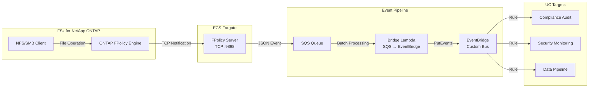

🌐 **Language / 言語**: [日本語](README.md) | English | [한국어](README.ko.md) | [简体中文](README.zh-CN.md) | [繁體中文](README.zh-TW.md) | [Français](README.fr.md) | [Deutsch](README.de.md) | [Español](README.es.md)

# Event-Driven FPolicy — Real-Time File Operation Detection Pattern

📚 **Documentation**: [Architecture](docs/architecture.en.md) | [Demo Guide](docs/demo-guide.en.md)

## Overview

A serverless pattern that implements an ONTAP FPolicy External Server on ECS Fargate, delivering file operation events in real time to AWS services (SQS → EventBridge).

Instantly detects file create, write, delete, and rename operations via NFS/SMB and routes them through an EventBridge custom bus to arbitrary use cases (compliance auditing, security monitoring, data pipeline triggers, etc.).

### When This Pattern Is Suitable

- You need real-time detection of file operations with immediate action
- You want to treat NFS/SMB file changes as AWS events
- You need to route events from a single source to multiple use cases
- You want non-blocking, asynchronous file operation processing
- You need event-driven architecture where S3 event notifications are unavailable

### When This Pattern Is Not Suitable

- You need to block/deny file operations in advance (synchronous mode required)
- Periodic batch scanning is sufficient (S3 AP polling pattern recommended)
- Your environment uses only NFSv4.2 protocol (not supported by FPolicy)
- Network connectivity to ONTAP REST API cannot be established

### Key Features

| Feature | Description |
|---------|-------------|
| Multi-protocol support | NFSv3/NFSv4.0/NFSv4.1/SMB |
| Asynchronous mode | Non-blocking file operations (no latency impact) |
| XML parse + path normalization | Converts ONTAP FPolicy XML to structured JSON |
| SVM/Volume name auto-resolution | Automatically extracted from NEGO_REQ handshake |
| EventBridge routing | Per-UC routing via custom bus |
| Fargate task IP auto-update | Automatically updates ONTAP engine IP on task restart |
| NFSv3 write-complete wait | Waits for write completion before emitting event |

## Architecture



## Prerequisites

- AWS account with appropriate IAM permissions
- FSx for NetApp ONTAP file system (ONTAP 9.17.1 or later)
- VPC with private subnets (same VPC as FSxN SVM)
- ONTAP admin credentials stored in Secrets Manager
- ECR repository (for FPolicy Server container image)
- VPC Endpoints (ECR, SQS, CloudWatch Logs, STS)

## Deployment

### 1. Build and Push Container Image

```bash
# Create ECR repository
aws ecr create-repository \
  --repository-name fsxn-fpolicy-server \
  --region ap-northeast-1

# ECR login
aws ecr get-login-password --region ap-northeast-1 | \
  docker login --username AWS --password-stdin \
  <ACCOUNT_ID>.dkr.ecr.ap-northeast-1.amazonaws.com

# Build & push (run from event-driven-fpolicy/ directory)
docker buildx build --platform linux/arm64 \
  -f server/Dockerfile \
  -t <ACCOUNT_ID>.dkr.ecr.ap-northeast-1.amazonaws.com/fsxn-fpolicy-server:latest \
  --push .
```

### 2. CloudFormation Deploy

```bash
aws cloudformation deploy \
  --template-file event-driven-fpolicy/template.yaml \
  --stack-name fsxn-fpolicy-event-driven \
  --parameter-overrides \
    VpcId=<your-vpc-id> \
    SubnetIds=<subnet-1>,<subnet-2> \
    FsxnSvmSecurityGroupId=<fsxn-sg-id> \
    ContainerImage=<ACCOUNT_ID>.dkr.ecr.ap-northeast-1.amazonaws.com/fsxn-fpolicy-server:latest \
    FsxnMgmtIp=<svm-mgmt-ip> \
    FsxnSvmUuid=<svm-uuid> \
    FsxnCredentialsSecret=<secret-name> \
  --capabilities CAPABILITY_NAMED_IAM \
  --region ap-northeast-1
```

### 3. Configure ONTAP FPolicy

```bash
# Connect to FSxN SVM via SSH, then execute:

vserver fpolicy policy external-engine create \
  -vserver <SVM_NAME> \
  -engine-name fpolicy_aws_engine \
  -primary-servers <FARGATE_TASK_IP> \
  -port 9898 \
  -extern-engine-type asynchronous

vserver fpolicy policy event create \
  -vserver <SVM_NAME> \
  -event-name fpolicy_aws_event \
  -protocol cifs,nfsv3,nfsv4 \
  -file-operations create,write,delete,rename

vserver fpolicy policy create \
  -vserver <SVM_NAME> \
  -policy-name fpolicy_aws \
  -events fpolicy_aws_event \
  -engine fpolicy_aws_engine \
  -is-mandatory false

vserver fpolicy enable \
  -vserver <SVM_NAME> \
  -policy-name fpolicy_aws \
  -sequence-number 1
```

## Configuration Parameters

| Parameter | Description | Default | Required |
|-----------|-------------|---------|----------|
| `VpcId` | VPC ID (same as FSxN) | — | ✅ |
| `SubnetIds` | Private subnets for Fargate tasks | — | ✅ |
| `FsxnSvmSecurityGroupId` | FSxN SVM Security Group ID | — | ✅ |
| `ContainerImage` | FPolicy Server container image URI | — | ✅ |
| `FPolicyPort` | TCP listening port | `9898` | |
| `WriteCompleteDelaySec` | NFSv3 write-complete wait (seconds) | `5` | |
| `Mode` | Operation mode (realtime/batch) | `realtime` | |
| `EventBusName` | EventBridge custom bus name | `fsxn-fpolicy-events` | |
| `FsxnMgmtIp` | FSxN SVM management IP | — | ✅ |
| `FsxnSvmUuid` | FSxN SVM UUID | — | ✅ |
| `FsxnCredentialsSecret` | Secrets Manager secret name | — | ✅ |

## Cost Structure

### Always-On Components

| Service | Configuration | Monthly Estimate |
|---------|--------------|-----------------|
| ECS Fargate | 0.25 vCPU / 512 MB × 1 task | ~$9.50 |
| NLB | Internal NLB (health check only) | ~$16.20 |
| VPC Endpoints | SQS + ECR + Logs + STS (4 Interface) | ~$28.80 |

### Pay-Per-Use Components

| Service | Billing Unit | Estimate (1,000 events/day) |
|---------|-------------|---------------------------|
| SQS | Request count | ~$0.01/month |
| Lambda (Bridge) | Requests + duration | ~$0.01/month |
| EventBridge | Custom events | ~$0.03/month |

> **Minimum configuration**: Fargate + NLB + VPC Endpoints starting at **~$54.50/month**.

## Cleanup

```bash
# 1. Disable ONTAP FPolicy
vserver fpolicy disable -vserver <SVM_NAME> -policy-name fpolicy_aws

# 2. Delete CloudFormation stack
aws cloudformation delete-stack \
  --stack-name fsxn-fpolicy-event-driven \
  --region ap-northeast-1
```

## Protocol Support Matrix

| Protocol | FPolicy Support | Notes |
|----------|:--------------:|-------|
| NFSv3 | ✅ | Write-complete wait required (default 5s) |
| NFSv4.0 | ✅ | Recommended |
| NFSv4.1 | ✅ | Recommended (specify `vers=4.1` at mount) |
| NFSv4.2 | ❌ | Not supported by ONTAP FPolicy monitoring |
| SMB | ✅ | Detected as CIFS protocol |

## Verified Environment

| Item | Value |
|------|-------|
| AWS Region | ap-northeast-1 (Tokyo) |
| FSx ONTAP Version | ONTAP 9.17.1P6 |
| FSx Configuration | SINGLE_AZ_1 |
| Python | 3.12 |
| Deployment | CloudFormation (standard) |
