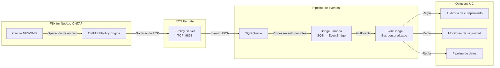

🌐 **Language / 言語**: [日本語](README.md) | [English](README.en.md) | [한국어](README.ko.md) | [简体中文](README.zh-CN.md) | [繁體中文](README.zh-TW.md) | [Français](README.fr.md) | [Deutsch](README.de.md) | Español

# FPolicy basado en eventos — Patrón de detección en tiempo real de operaciones de archivos

📚 **Documentación**: [Arquitectura](docs/architecture.es.md) | [Guía de demostración](docs/demo-guide.es.md)

## Descripción general

Un patrón serverless que implementa un servidor externo ONTAP FPolicy en ECS Fargate, entregando eventos de operaciones de archivos en tiempo real a servicios AWS (SQS → EventBridge).

Detecta instantáneamente operaciones de creación, escritura, eliminación y renombrado de archivos a través de NFS/SMB y las enruta mediante un bus personalizado de EventBridge a casos de uso arbitrarios (auditoría de cumplimiento, monitoreo de seguridad, activación de pipelines de datos, etc.).

### Casos de uso apropiados

- Detección en tiempo real de operaciones de archivos con acción inmediata
- Tratamiento de cambios de archivos NFS/SMB como eventos AWS
- Enrutamiento de eventos desde una única fuente a múltiples casos de uso
- Procesamiento asíncrono no bloqueante de operaciones de archivos
- Arquitectura basada en eventos cuando las notificaciones de eventos S3 no están disponibles

### Casos de uso no apropiados

- Se requiere bloqueo/rechazo previo de operaciones de archivos (modo síncrono necesario)
- El escaneo por lotes periódico es suficiente (patrón de polling S3 AP recomendado)
- Entorno que utiliza solo protocolo NFSv4.2 (no soportado por FPolicy)
- No se puede establecer conectividad de red a la API REST de ONTAP

### Funcionalidades principales

| Funcionalidad | Descripción |
|---------------|-------------|
| Soporte multi-protocolo | NFSv3/NFSv4.0/NFSv4.1/SMB |
| Modo asíncrono | Operaciones de archivos no bloqueantes |
| Análisis XML + normalización de rutas | Conversión de XML FPolicy ONTAP a JSON estructurado |
| Resolución automática de nombres SVM/Volume | Extracción automática del handshake NEGO_REQ |
| Enrutamiento EventBridge | Enrutamiento por UC mediante bus personalizado |
| Actualización automática de IP Fargate | Actualización automática de IP del engine ONTAP al reiniciar |

## Arquitectura

## Prerrequisitos

- Cuenta AWS con permisos IAM apropiados
- Sistema de archivos FSx for NetApp ONTAP (ONTAP 9.17.1 o posterior)
- VPC con subredes privadas (misma VPC que FSxN SVM)
- Credenciales de administrador ONTAP almacenadas en Secrets Manager
- Repositorio ECR (para imagen de contenedor FPolicy Server)
- VPC Endpoints (ECR, SQS, CloudWatch Logs, STS)

## Matriz de soporte de protocolos

| Protocolo | Soporte FPolicy | Notas |
|-----------|:--------------:|-------|
| NFSv3 | ✅ | Requiere espera write-complete (5s por defecto) |
| NFSv4.0 | ✅ | Recomendado |
| NFSv4.1 | ✅ | Recomendado (especificar `vers=4.1` al montar) |
| NFSv4.2 | ❌ | No soportado por ONTAP FPolicy monitoring |
| SMB | ✅ | Detectado como protocolo CIFS |

## Entorno verificado

| Elemento | Valor |
|----------|-------|
| Región AWS | ap-northeast-1 (Tokio) |
| Versión FSx ONTAP | ONTAP 9.17.1P6 |
| Python | 3.12 |
| Despliegue | CloudFormation (estándar) |
