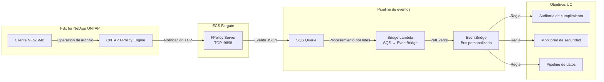
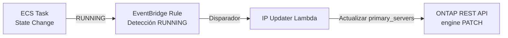

🌐 **Language / 言語**: [日本語](README.md) | [English](README.en.md) | [한국어](README.ko.md) | [简体中文](README.zh-CN.md) | [繁體中文](README.zh-TW.md) | [Français](README.fr.md) | [Deutsch](README.de.md) | Español

# FPolicy basado en eventos — Patrón de detección en tiempo real de operaciones de archivos

📚 **Documentación**: [Diagrama de arquitectura](docs/architecture.es.md) | [Guía de demostración](docs/demo-guide.es.md)

## Descripción general

Un patrón serverless que implementa un servidor externo ONTAP FPolicy en ECS Fargate, entregando eventos de operaciones de archivos en tiempo real a servicios AWS (SQS → EventBridge).

Detecta instantáneamente operaciones de creación, escritura, eliminación y renombrado de archivos a través de NFS/SMB y las enruta mediante un bus personalizado de EventBridge a cualquier caso de uso (auditoría de cumplimiento, monitoreo de seguridad, activación de pipelines de datos, etc.).

### Casos de uso adecuados

- Desea detectar operaciones de archivos en tiempo real y ejecutar acciones inmediatamente
- Desea tratar los cambios de archivos NFS/SMB como eventos de AWS
- Desea enrutar desde una única fuente de eventos a múltiples casos de uso
- Desea procesar operaciones de archivos de forma asíncrona sin bloquearlas (modo asíncrono)
- Desea lograr una arquitectura basada en eventos en entornos donde las notificaciones de eventos S3 no están disponibles

### Casos de uso no adecuados

- Necesita bloquear/denegar operaciones de archivos de antemano (se requiere modo síncrono)
- El escaneo batch periódico es suficiente (se recomienda el patrón de polling S3 AP)
- Su entorno utiliza únicamente el protocolo NFSv4.2 (no soportado por FPolicy)
- No se puede garantizar la accesibilidad de red a la API REST de ONTAP

### Funcionalidades principales

| Funcionalidad | Descripción |
|---------------|-------------|
| Soporte multi-protocolo | Soporta NFSv3/NFSv4.0/NFSv4.1/SMB |
| Modo asíncrono | No bloquea las operaciones de archivos (sin impacto en la latencia) |
| Análisis XML + normalización de rutas | Convierte XML de FPolicy ONTAP a JSON estructurado |
| Resolución automática de nombres SVM/Volume | Obtenido automáticamente del handshake NEGO_REQ |
| Enrutamiento EventBridge | Enrutamiento por caso de uso mediante bus personalizado |
| Actualización automática de IP de tareas Fargate | Refleja automáticamente la IP del motor ONTAP al reiniciar tareas ECS |
| Espera write-complete NFSv3 | Emite el evento solo después de completar la escritura |

## Arquitectura



### Mecanismo de actualización automática de IP



## Requisitos previos

- Cuenta AWS con permisos IAM apropiados
- Sistema de archivos FSx for NetApp ONTAP (ONTAP 9.17.1 o posterior)
- VPC, subredes privadas (misma VPC que el SVM de FSxN)
- Credenciales de administrador ONTAP registradas en Secrets Manager
- Repositorio ECR (para la imagen de contenedor del servidor FPolicy)
- VPC Endpoints (ECR, SQS, CloudWatch Logs, STS)

### Requisitos de VPC Endpoints

Los siguientes VPC Endpoints son necesarios para que ECS Fargate (Private Subnet) funcione correctamente:

| VPC Endpoint | Propósito |
|-------------|-----------|
| `com.amazonaws.<region>.ecr.dkr` | Pull de imágenes de contenedor |
| `com.amazonaws.<region>.ecr.api` | Autenticación ECR |
| `com.amazonaws.<region>.s3` (Gateway) | Obtención de capas de imágenes ECR |
| `com.amazonaws.<region>.logs` | CloudWatch Logs |
| `com.amazonaws.<region>.sts` | Autenticación de roles IAM |
| `com.amazonaws.<region>.sqs` | Envío de mensajes SQS ★Requerido |

## Pasos de despliegue

### 1. Construir y subir la imagen de contenedor

```bash
# Crear repositorio ECR
aws ecr create-repository \
  --repository-name fsxn-fpolicy-server \
  --region ap-northeast-1

# Inicio de sesión en ECR
aws ecr get-login-password --region ap-northeast-1 | \
  docker login --username AWS --password-stdin \
  <ACCOUNT_ID>.dkr.ecr.ap-northeast-1.amazonaws.com

# Build & push (ejecutar desde el directorio event-driven-fpolicy/)
docker buildx build --platform linux/arm64 \
  -f server/Dockerfile \
  -t <ACCOUNT_ID>.dkr.ecr.ap-northeast-1.amazonaws.com/fsxn-fpolicy-server:latest \
  --push .
```

### 2. Despliegue con CloudFormation

#### Modo Fargate (predeterminado)

```bash
aws cloudformation deploy \
  --template-file event-driven-fpolicy/template.yaml \
  --stack-name fsxn-fpolicy-event-driven \
  --parameter-overrides \
    ComputeType=fargate \
    VpcId=<your-vpc-id> \
    SubnetIds=<subnet-1>,<subnet-2> \
    FsxnSvmSecurityGroupId=<fsxn-sg-id> \
    ContainerImage=<ACCOUNT_ID>.dkr.ecr.ap-northeast-1.amazonaws.com/fsxn-fpolicy-server:latest \
    FsxnMgmtIp=<svm-mgmt-ip> \
    FsxnSvmUuid=<svm-uuid> \
    FsxnCredentialsSecret=<secret-name> \
  --capabilities CAPABILITY_NAMED_IAM \
  --region ap-northeast-1
```

#### Modo EC2 (IP fija, bajo costo)

```bash
aws cloudformation deploy \
  --template-file event-driven-fpolicy/template.yaml \
  --stack-name fsxn-fpolicy-event-driven \
  --parameter-overrides \
    ComputeType=ec2 \
    VpcId=<your-vpc-id> \
    SubnetIds=<subnet-1> \
    FsxnSvmSecurityGroupId=<fsxn-sg-id> \
    ContainerImage=<ACCOUNT_ID>.dkr.ecr.ap-northeast-1.amazonaws.com/fsxn-fpolicy-server:latest \
    InstanceType=t4g.micro \
    FsxnMgmtIp=<svm-mgmt-ip> \
    FsxnSvmUuid=<svm-uuid> \
    FsxnCredentialsSecret=<secret-name> \
  --capabilities CAPABILITY_NAMED_IAM \
  --region ap-northeast-1
```

> **Criterios de selección Fargate vs EC2**:
> - **Fargate**: Enfoque en escalabilidad, operaciones gestionadas, actualización automática de IP incluida
> - **EC2**: Optimización de costos (~$3/mes vs ~$54/mes), IP fija (no requiere actualización del motor ONTAP), soporte SSM

### 3. Configuración de ONTAP FPolicy

```bash
# Conectarse al SVM de FSxN vía SSH y ejecutar lo siguiente

# 1. Crear External Engine
fpolicy policy external-engine create \
  -vserver <SVM_NAME> \
  -engine-name fpolicy_aws_engine \
  -primary-servers <FARGATE_TASK_IP> \
  -port 9898 \
  -extern-engine-type asynchronous

# 2. Crear Event
fpolicy policy event create \
  -vserver <SVM_NAME> \
  -event-name fpolicy_aws_event \
  -protocol cifs,nfsv3,nfsv4 \
  -file-operations create,write,delete,rename

# 3. Crear Policy
fpolicy policy create \
  -vserver <SVM_NAME> \
  -policy-name fpolicy_aws \
  -events fpolicy_aws_event \
  -engine fpolicy_aws_engine \
  -is-mandatory false

# 4. Configurar Scope (opcional)
fpolicy policy scope create \
  -vserver <SVM_NAME> \
  -policy-name fpolicy_aws \
  -volumes-to-include "*"

# 5. Habilitar Policy
fpolicy enable \
  -vserver <SVM_NAME> \
  -policy-name fpolicy_aws \
  -sequence-number 1
```

## Lista de parámetros de configuración

| Parámetro | Descripción | Valor predeterminado | Requerido |
|-----------|-------------|---------------------|-----------|
| `ComputeType` | Selección del entorno de ejecución (fargate/ec2) | `fargate` | |
| `VpcId` | ID de VPC (misma VPC que FSxN) | — | ✅ |
| `SubnetIds` | Private Subnet para tarea Fargate o ubicación EC2 | — | ✅ |
| `FsxnSvmSecurityGroupId` | ID del Security Group del SVM de FSxN | — | ✅ |
| `ContainerImage` | URI de la imagen de contenedor del servidor FPolicy | — | ✅ |
| `FPolicyPort` | Puerto de escucha TCP | `9898` | |
| `WriteCompleteDelaySec` | Segundos de espera write-complete NFSv3 | `5` | |
| `Mode` | Modo de operación (realtime/batch) | `realtime` | |
| `DesiredCount` | Número de tareas Fargate (solo Fargate) | `1` | |
| `Cpu` | CPU de tarea Fargate (solo Fargate) | `256` | |
| `Memory` | Memoria de tarea Fargate en MB (solo Fargate) | `512` | |
| `InstanceType` | Tipo de instancia EC2 (solo EC2) | `t4g.micro` | |
| `KeyPairName` | Nombre del par de claves SSH (solo EC2, opcional) | `""` | |
| `EventBusName` | Nombre del bus personalizado de EventBridge | `fsxn-fpolicy-events` | |
| `FsxnMgmtIp` | IP de gestión del SVM de FSxN | — | ✅ |
| `FsxnSvmUuid` | UUID del SVM de FSxN | — | ✅ |
| `FsxnEngineName` | Nombre del external-engine de FPolicy | `fpolicy_aws_engine` | |
| `FsxnPolicyName` | Nombre de la política FPolicy | `fpolicy_aws` | |
| `FsxnCredentialsSecret` | Nombre del secreto en Secrets Manager | — | ✅ |

## Estructura de costos

### Componentes permanentes

| Servicio | Configuración | Estimación mensual |
|----------|---------------|-------------------|
| ECS Fargate | 0.25 vCPU / 512 MB × 1 tarea | ~$9.50 |
| NLB | NLB interno (para health checks) | ~$16.20 |
| VPC Endpoints | SQS + ECR + Logs + STS (4 Interface) | ~$28.80 |

### Componentes de pago por uso

| Servicio | Unidad de facturación | Estimación (1,000 eventos/día) |
|----------|----------------------|-------------------------------|
| SQS | Número de solicitudes | ~$0.01/mes |
| Lambda (Bridge) | Solicitudes + tiempo de ejecución | ~$0.01/mes |
| Lambda (IP Updater) | Solicitudes (solo al reiniciar tareas) | ~$0.001/mes |
| EventBridge | Número de eventos personalizados | ~$0.03/mes |

> **Configuración mínima**: Fargate + NLB + VPC Endpoints desde **~$54.50/mes**.

## Limpieza

```bash
# 1. Deshabilitar ONTAP FPolicy
# Conectarse al SVM de FSxN vía SSH
fpolicy disable -vserver <SVM_NAME> -policy-name fpolicy_aws

# 2. Eliminar stack de CloudFormation
aws cloudformation delete-stack \
  --stack-name fsxn-fpolicy-event-driven \
  --region ap-northeast-1

aws cloudformation wait stack-delete-complete \
  --stack-name fsxn-fpolicy-event-driven \
  --region ap-northeast-1

# 3. Eliminar imagen ECR (opcional)
aws ecr delete-repository \
  --repository-name fsxn-fpolicy-server \
  --force \
  --region ap-northeast-1
```

## Supported Regions

Este patrón utiliza los siguientes servicios:

| Servicio | Restricciones regionales |
|----------|-------------------------|
| FSx for NetApp ONTAP | [Lista de regiones soportadas](https://docs.aws.amazon.com/general/latest/gr/fsxn.html) |
| ECS Fargate | Disponible en casi todas las regiones |
| EventBridge | Disponible en todas las regiones |
| SQS | Disponible en todas las regiones |

## Entorno verificado

| Elemento | Valor |
|----------|-------|
| Región AWS | ap-northeast-1 (Tokio) |
| Versión FSx ONTAP | ONTAP 9.17.1P6 |
| Configuración FSx | SINGLE_AZ_1 |
| Python | 3.12 |
| Método de despliegue | CloudFormation (estándar) |

## Matriz de soporte de protocolos

| Protocolo | Soporte FPolicy | Notas |
|-----------|:--------------:|-------|
| NFSv3 | ✅ | Se requiere espera write-complete (5 segundos por defecto) |
| NFSv4.0 | ✅ | Recomendado |
| NFSv4.1 | ✅ | Recomendado (especificar `vers=4.1` al montar). **ONTAP 9.15.1 y posterior** |
| NFSv4.2 | ❌ | No soportado por el monitoreo FPolicy de ONTAP |
| SMB | ✅ | Detectado como protocolo CIFS |

> **Importante**: `mount -o vers=4` puede negociar a NFSv4.2, especifique explícitamente `vers=4.1`.

> **Nota de versión ONTAP**: El soporte de monitoreo FPolicy para NFSv4.1 fue introducido en ONTAP 9.15.1. Las versiones anteriores solo soportan SMB, NFSv3 y NFSv4.0. Consulte la [documentación de configuración de eventos FPolicy de NetApp](https://docs.netapp.com/us-en/ontap/nas-audit/plan-fpolicy-event-config-concept.html) para la matriz completa.

## Referencias

- [Documentación de NetApp FPolicy](https://docs.netapp.com/us-en/ontap-technical-reports/ontap-security-hardening/create-fpolicy.html)
- [Referencia de API REST de ONTAP](https://docs.netapp.com/us-en/ontap-automation/)
- [Documentación de ECS Fargate](https://docs.aws.amazon.com/AmazonECS/latest/developerguide/AWS_Fargate.html)
- [Bus personalizado de EventBridge](https://docs.aws.amazon.com/eventbridge/latest/userguide/eb-create-event-bus.html)
