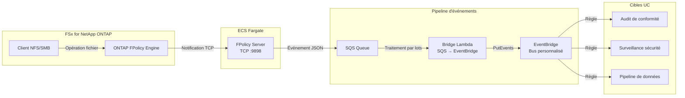

🌐 **Language / 言語**: [日本語](README.md) | [English](README.en.md) | [한국어](README.ko.md) | [简体中文](README.zh-CN.md) | [繁體中文](README.zh-TW.md) | Français | [Deutsch](README.de.md) | [Español](README.es.md)

# FPolicy événementiel — Détection en temps réel des opérations sur fichiers

📚 **Documentation** : [Architecture](docs/architecture.fr.md) | [Guide de démonstration](docs/demo-guide.fr.md)

## Présentation

Un modèle serverless qui implémente un serveur externe ONTAP FPolicy sur ECS Fargate, transmettant les événements d'opérations sur fichiers en temps réel aux services AWS (SQS → EventBridge).

Détecte instantanément les opérations de création, écriture, suppression et renommage de fichiers via NFS/SMB et les achemine via un bus personnalisé EventBridge vers des cas d'utilisation arbitraires (audit de conformité, surveillance de sécurité, déclenchement de pipelines de données, etc.).

### Cas d'utilisation appropriés

- Détection en temps réel des opérations sur fichiers avec action immédiate
- Traitement des modifications de fichiers NFS/SMB comme événements AWS
- Routage d'événements d'une source unique vers plusieurs cas d'utilisation
- Traitement asynchrone non bloquant des opérations sur fichiers
- Architecture événementielle lorsque les notifications d'événements S3 ne sont pas disponibles

### Cas d'utilisation non appropriés

- Blocage/refus préalable des opérations sur fichiers (mode synchrone requis)
- Analyse par lots périodique suffisante (modèle de polling S3 AP recommandé)
- Environnement utilisant uniquement le protocole NFSv4.2 (non pris en charge par FPolicy)
- Connectivité réseau vers l'API REST ONTAP impossible

### Fonctionnalités principales

| Fonctionnalité | Description |
|----------------|-------------|
| Support multi-protocole | NFSv3/NFSv4.0/NFSv4.1/SMB |
| Mode asynchrone | Opérations sur fichiers non bloquantes |
| Analyse XML + normalisation des chemins | Conversion XML FPolicy ONTAP en JSON structuré |
| Résolution automatique SVM/Volume | Extraction automatique depuis le handshake NEGO_REQ |
| Routage EventBridge | Routage par UC via bus personnalisé |
| Mise à jour automatique IP Fargate | Mise à jour automatique de l'IP engine ONTAP au redémarrage |

## Architecture

## Prérequis

- Compte AWS avec permissions IAM appropriées
- Système de fichiers FSx for NetApp ONTAP (ONTAP 9.17.1 ou ultérieur)
- VPC avec sous-réseaux privés (même VPC que FSxN SVM)
- Identifiants administrateur ONTAP stockés dans Secrets Manager
- Dépôt ECR (pour l'image conteneur FPolicy Server)
- VPC Endpoints (ECR, SQS, CloudWatch Logs, STS)

## Matrice de support des protocoles

| Protocole | Support FPolicy | Notes |
|-----------|:--------------:|-------|
| NFSv3 | ✅ | Attente write-complete requise (5s par défaut) |
| NFSv4.0 | ✅ | Recommandé |
| NFSv4.1 | ✅ | Recommandé (spécifier `vers=4.1` au montage) |
| NFSv4.2 | ❌ | Non pris en charge par ONTAP FPolicy monitoring |
| SMB | ✅ | Détecté comme protocole CIFS |

## Environnement vérifié

| Élément | Valeur |
|---------|--------|
| Région AWS | ap-northeast-1 (Tokyo) |
| Version FSx ONTAP | ONTAP 9.17.1P6 |
| Python | 3.12 |
| Déploiement | CloudFormation (standard) |
