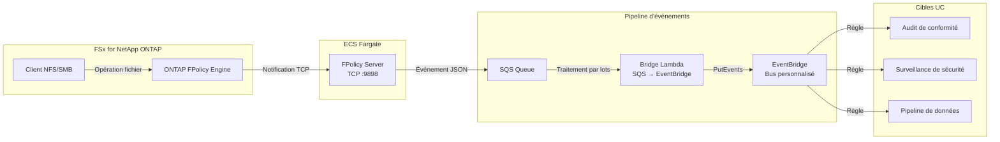
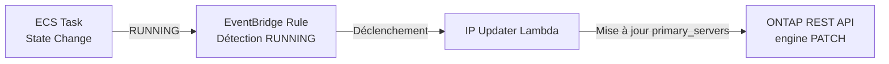

🌐 **Language / 言語**: [日本語](README.md) | [English](README.en.md) | [한국어](README.ko.md) | [简体中文](README.zh-CN.md) | [繁體中文](README.zh-TW.md) | Français | [Deutsch](README.de.md) | [Español](README.es.md)

# FPolicy événementiel — Modèle de détection en temps réel des opérations fichiers

📚 **Documentation** : [Diagramme d'architecture](docs/architecture.fr.md) | [Guide de démonstration](docs/demo-guide.fr.md)

## Présentation

Un modèle serverless qui implémente un serveur externe ONTAP FPolicy sur ECS Fargate, transmettant les événements d'opérations fichiers en temps réel aux services AWS (SQS → EventBridge).

Il détecte instantanément les opérations de création, écriture, suppression et renommage de fichiers via NFS/SMB et les route via un bus personnalisé EventBridge vers n'importe quel cas d'utilisation (audit de conformité, surveillance de sécurité, déclenchement de pipelines de données, etc.).

### Cas d'utilisation adaptés

- Vous souhaitez détecter les opérations fichiers en temps réel et exécuter des actions immédiatement
- Vous souhaitez traiter les modifications de fichiers NFS/SMB comme des événements AWS
- Vous souhaitez router depuis une source d'événements unique vers plusieurs cas d'utilisation
- Vous souhaitez traiter les opérations fichiers de manière asynchrone sans les bloquer (mode asynchrone)
- Vous souhaitez réaliser une architecture événementielle dans des environnements où les notifications d'événements S3 ne sont pas disponibles

### Cas d'utilisation non adaptés

- Vous devez bloquer/refuser les opérations fichiers à l'avance (mode synchrone requis)
- Un scan batch périodique est suffisant (modèle de polling S3 AP recommandé)
- Votre environnement utilise uniquement le protocole NFSv4.2 (non supporté par FPolicy)
- L'accessibilité réseau vers l'API REST ONTAP ne peut être garantie

### Fonctionnalités principales

| Fonctionnalité | Description |
|----------------|-------------|
| Support multi-protocole | Supporte NFSv3/NFSv4.0/NFSv4.1/SMB |
| Mode asynchrone | Ne bloque pas les opérations fichiers (aucun impact sur la latence) |
| Analyse XML + normalisation des chemins | Convertit le XML FPolicy ONTAP en JSON structuré |
| Résolution automatique des noms SVM/Volume | Obtenu automatiquement depuis le handshake NEGO_REQ |
| Routage EventBridge | Routage par cas d'utilisation via bus personnalisé |
| Mise à jour automatique de l'IP des tâches Fargate | Reflète automatiquement l'IP du moteur ONTAP au redémarrage des tâches ECS |
| Attente write-complete NFSv3 | Émet l'événement uniquement après la fin de l'écriture |

## Architecture



### Mécanisme de mise à jour automatique de l'IP



## Prérequis

- Compte AWS avec les permissions IAM appropriées
- Système de fichiers FSx for NetApp ONTAP (ONTAP 9.17.1 ou ultérieur)
- VPC, sous-réseaux privés (même VPC que le SVM FSxN)
- Identifiants administrateur ONTAP enregistrés dans Secrets Manager
- Dépôt ECR (pour l'image conteneur du serveur FPolicy)
- VPC Endpoints (ECR, SQS, CloudWatch Logs, STS)

### Exigences VPC Endpoints

Les VPC Endpoints suivants sont nécessaires pour le bon fonctionnement d'ECS Fargate (Private Subnet) :

| VPC Endpoint | Utilisation |
|-------------|-------------|
| `com.amazonaws.<region>.ecr.dkr` | Pull d'images conteneur |
| `com.amazonaws.<region>.ecr.api` | Authentification ECR |
| `com.amazonaws.<region>.s3` (Gateway) | Récupération des couches d'images ECR |
| `com.amazonaws.<region>.logs` | CloudWatch Logs |
| `com.amazonaws.<region>.sts` | Authentification des rôles IAM |
| `com.amazonaws.<region>.sqs` | Envoi de messages SQS ★Requis |

## Étapes de déploiement

### 1. Construction et push de l'image conteneur

```bash
# Créer le dépôt ECR
aws ecr create-repository \
  --repository-name fsxn-fpolicy-server \
  --region ap-northeast-1

# Connexion ECR
aws ecr get-login-password --region ap-northeast-1 | \
  docker login --username AWS --password-stdin \
  <ACCOUNT_ID>.dkr.ecr.ap-northeast-1.amazonaws.com

# Build & push (exécuter depuis le répertoire event-driven-fpolicy/)
docker buildx build --platform linux/arm64 \
  -f server/Dockerfile \
  -t <ACCOUNT_ID>.dkr.ecr.ap-northeast-1.amazonaws.com/fsxn-fpolicy-server:latest \
  --push .
```

### 2. Déploiement CloudFormation

#### Mode Fargate (par défaut)

```bash
aws cloudformation deploy \
  --template-file event-driven-fpolicy/template.yaml \
  --stack-name fsxn-fpolicy-event-driven \
  --parameter-overrides \
    ComputeType=fargate \
    VpcId=<your-vpc-id> \
    SubnetIds=<subnet-1>,<subnet-2> \
    FsxnSvmSecurityGroupId=<fsxn-sg-id> \
    ContainerImage=<ACCOUNT_ID>.dkr.ecr.ap-northeast-1.amazonaws.com/fsxn-fpolicy-server:latest \
    FsxnMgmtIp=<svm-mgmt-ip> \
    FsxnSvmUuid=<svm-uuid> \
    FsxnCredentialsSecret=<secret-name> \
  --capabilities CAPABILITY_NAMED_IAM \
  --region ap-northeast-1
```

#### Mode EC2 (IP fixe, faible coût)

```bash
aws cloudformation deploy \
  --template-file event-driven-fpolicy/template.yaml \
  --stack-name fsxn-fpolicy-event-driven \
  --parameter-overrides \
    ComputeType=ec2 \
    VpcId=<your-vpc-id> \
    SubnetIds=<subnet-1> \
    FsxnSvmSecurityGroupId=<fsxn-sg-id> \
    ContainerImage=<ACCOUNT_ID>.dkr.ecr.ap-northeast-1.amazonaws.com/fsxn-fpolicy-server:latest \
    InstanceType=t4g.micro \
    FsxnMgmtIp=<svm-mgmt-ip> \
    FsxnSvmUuid=<svm-uuid> \
    FsxnCredentialsSecret=<secret-name> \
  --capabilities CAPABILITY_NAMED_IAM \
  --region ap-northeast-1
```

> **Critères de sélection Fargate vs EC2** :
> - **Fargate** : Priorité à la scalabilité, opérations managées, mise à jour automatique de l'IP incluse
> - **EC2** : Optimisation des coûts (~3 $/mois vs ~54 $/mois), IP fixe (pas de mise à jour du moteur ONTAP nécessaire), support SSM

### 3. Configuration ONTAP FPolicy

```bash
# Se connecter au SVM FSxN via SSH puis exécuter les commandes suivantes

# 1. Créer l'External Engine
vserver fpolicy policy external-engine create \
  -vserver <SVM_NAME> \
  -engine-name fpolicy_aws_engine \
  -primary-servers <FARGATE_TASK_IP> \
  -port 9898 \
  -extern-engine-type asynchronous

# 2. Créer l'Event
vserver fpolicy policy event create \
  -vserver <SVM_NAME> \
  -event-name fpolicy_aws_event \
  -protocol cifs,nfsv3,nfsv4 \
  -file-operations create,write,delete,rename

# 3. Créer la Policy
vserver fpolicy policy create \
  -vserver <SVM_NAME> \
  -policy-name fpolicy_aws \
  -events fpolicy_aws_event \
  -engine fpolicy_aws_engine \
  -is-mandatory false

# 4. Configurer le Scope (optionnel)
vserver fpolicy policy scope create \
  -vserver <SVM_NAME> \
  -policy-name fpolicy_aws \
  -volumes-to-include "*"

# 5. Activer la Policy
vserver fpolicy enable \
  -vserver <SVM_NAME> \
  -policy-name fpolicy_aws \
  -sequence-number 1
```

## Liste des paramètres de configuration

| Paramètre | Description | Valeur par défaut | Requis |
|-----------|-------------|-------------------|--------|
| `ComputeType` | Sélection de l'environnement d'exécution (fargate/ec2) | `fargate` | |
| `VpcId` | ID du VPC (même VPC que FSxN) | — | ✅ |
| `SubnetIds` | Private Subnet pour la tâche Fargate ou le placement EC2 | — | ✅ |
| `FsxnSvmSecurityGroupId` | ID du Security Group du SVM FSxN | — | ✅ |
| `ContainerImage` | URI de l'image conteneur du serveur FPolicy | — | ✅ |
| `FPolicyPort` | Port d'écoute TCP | `9898` | |
| `WriteCompleteDelaySec` | Secondes d'attente write-complete NFSv3 | `5` | |
| `Mode` | Mode de fonctionnement (realtime/batch) | `realtime` | |
| `DesiredCount` | Nombre de tâches Fargate (Fargate uniquement) | `1` | |
| `Cpu` | CPU de la tâche Fargate (Fargate uniquement) | `256` | |
| `Memory` | Mémoire de la tâche Fargate en MB (Fargate uniquement) | `512` | |
| `InstanceType` | Type d'instance EC2 (EC2 uniquement) | `t4g.micro` | |
| `KeyPairName` | Nom de la paire de clés SSH (EC2 uniquement, optionnel) | `""` | |
| `EventBusName` | Nom du bus personnalisé EventBridge | `fsxn-fpolicy-events` | |
| `FsxnMgmtIp` | IP de gestion du SVM FSxN | — | ✅ |
| `FsxnSvmUuid` | UUID du SVM FSxN | — | ✅ |
| `FsxnEngineName` | Nom de l'external-engine FPolicy | `fpolicy_aws_engine` | |
| `FsxnPolicyName` | Nom de la politique FPolicy | `fpolicy_aws` | |
| `FsxnCredentialsSecret` | Nom du secret Secrets Manager | — | ✅ |

## Structure des coûts

### Composants permanents

| Service | Configuration | Estimation mensuelle |
|---------|---------------|---------------------|
| ECS Fargate | 0.25 vCPU / 512 MB × 1 tâche | ~9,50 $ |
| NLB | NLB interne (pour les health checks) | ~16,20 $ |
| VPC Endpoints | SQS + ECR + Logs + STS (4 Interface) | ~28,80 $ |

### Composants à la consommation

| Service | Unité de facturation | Estimation (1 000 événements/jour) |
|---------|---------------------|-----------------------------------|
| SQS | Nombre de requêtes | ~0,01 $/mois |
| Lambda (Bridge) | Requêtes + temps d'exécution | ~0,01 $/mois |
| Lambda (IP Updater) | Requêtes (uniquement au redémarrage des tâches) | ~0,001 $/mois |
| EventBridge | Nombre d'événements personnalisés | ~0,03 $/mois |

> **Configuration minimale** : Fargate + NLB + VPC Endpoints à partir de **~54,50 $/mois**.

## Nettoyage

```bash
# 1. Désactiver ONTAP FPolicy
# Se connecter au SVM FSxN via SSH
vserver fpolicy disable -vserver <SVM_NAME> -policy-name fpolicy_aws

# 2. Supprimer la stack CloudFormation
aws cloudformation delete-stack \
  --stack-name fsxn-fpolicy-event-driven \
  --region ap-northeast-1

aws cloudformation wait stack-delete-complete \
  --stack-name fsxn-fpolicy-event-driven \
  --region ap-northeast-1

# 3. Supprimer l'image ECR (optionnel)
aws ecr delete-repository \
  --repository-name fsxn-fpolicy-server \
  --force \
  --region ap-northeast-1
```

## Supported Regions

Ce modèle utilise les services suivants :

| Service | Contraintes régionales |
|---------|----------------------|
| FSx for NetApp ONTAP | [Liste des régions supportées](https://docs.aws.amazon.com/general/latest/gr/fsxn.html) |
| ECS Fargate | Disponible dans presque toutes les régions |
| EventBridge | Disponible dans toutes les régions |
| SQS | Disponible dans toutes les régions |

## Environnement vérifié

| Élément | Valeur |
|---------|--------|
| Région AWS | ap-northeast-1 (Tokyo) |
| Version FSx ONTAP | ONTAP 9.17.1P6 |
| Configuration FSx | SINGLE_AZ_1 |
| Python | 3.12 |
| Méthode de déploiement | CloudFormation (standard) |

## Matrice de support des protocoles

| Protocole | Support FPolicy | Notes |
|-----------|:--------------:|-------|
| NFSv3 | ✅ | Attente write-complete nécessaire (5 secondes par défaut) |
| NFSv4.0 | ✅ | Recommandé |
| NFSv4.1 | ✅ | Recommandé (spécifier `vers=4.1` au montage). **ONTAP 9.15.1 et ultérieur** |
| NFSv4.2 | ❌ | Non supporté par le monitoring FPolicy ONTAP |
| SMB | ✅ | Détecté comme protocole CIFS |

> **Important** : `mount -o vers=4` peut négocier vers NFSv4.2, spécifiez explicitement `vers=4.1`.

> **Note de version ONTAP** : Le support du monitoring FPolicy NFSv4.1 a été introduit dans ONTAP 9.15.1. Les versions antérieures ne supportent que SMB, NFSv3 et NFSv4.0. Voir la [documentation de configuration des événements FPolicy NetApp](https://docs.netapp.com/us-en/ontap/nas-audit/plan-fpolicy-event-config-concept.html) pour la matrice complète.

## Références

- [Documentation NetApp FPolicy](https://docs.netapp.com/us-en/ontap-technical-reports/ontap-security-hardening/create-fpolicy.html)
- [Référence API REST ONTAP](https://docs.netapp.com/us-en/ontap-automation/)
- [Documentation ECS Fargate](https://docs.aws.amazon.com/AmazonECS/latest/developerguide/AWS_Fargate.html)
- [Bus personnalisé EventBridge](https://docs.aws.amazon.com/eventbridge/latest/userguide/eb-create-event-bus.html)
