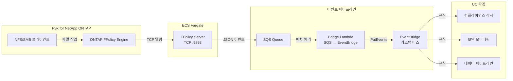

🌐 **Language / 言語**: [日本語](README.md) | [English](README.en.md) | 한국어 | [简体中文](README.zh-CN.md) | [繁體中文](README.zh-TW.md) | [Français](README.fr.md) | [Deutsch](README.de.md) | [Español](README.es.md)

# 이벤트 기반 FPolicy — 파일 작업 실시간 감지 패턴

📚 **문서**: [아키텍처](docs/architecture.ko.md) | [데모 가이드](docs/demo-guide.ko.md)

## 개요

ONTAP FPolicy External Server를 ECS Fargate에 구현하여 파일 작업 이벤트를 실시간으로 AWS 서비스(SQS → EventBridge)에 연계하는 서버리스 패턴입니다.

NFS/SMB를 통한 파일 생성·쓰기·삭제·이름 변경 작업을 즉시 감지하고, EventBridge 커스텀 버스를 통해 임의의 유스케이스(컴플라이언스 감사, 보안 모니터링, 데이터 파이프라인 트리거 등)로 라우팅합니다.

### 이 패턴이 적합한 경우

- 파일 작업을 실시간으로 감지하고 즉시 액션을 실행해야 하는 경우
- NFS/SMB 프로토콜을 통한 파일 변경을 AWS 이벤트로 처리하고 싶은 경우
- 단일 이벤트 소스에서 여러 유스케이스로 라우팅이 필요한 경우
- 파일 작업을 차단하지 않고 비동기로 처리하고 싶은 경우
- S3 이벤트 알림을 사용할 수 없는 환경에서 이벤트 기반 아키텍처가 필요한 경우

### 이 패턴이 적합하지 않은 경우

- 파일 작업을 사전에 차단/거부해야 하는 경우(동기 모드 필요)
- 정기적인 배치 스캔으로 충분한 경우(S3 AP 폴링 패턴 권장)
- NFSv4.2 프로토콜만 사용하는 환경(FPolicy 미지원)
- ONTAP REST API에 대한 네트워크 연결이 불가능한 환경

### 주요 기능

| 기능 | 설명 |
|------|------|
| 멀티 프로토콜 지원 | NFSv3/NFSv4.0/NFSv4.1/SMB 대응 |
| 비동기 모드 | 파일 작업을 차단하지 않음(레이턴시 영향 없음) |
| XML 파싱 + 경로 정규화 | ONTAP FPolicy XML을 구조화된 JSON으로 변환 |
| SVM/Volume 이름 자동 해석 | NEGO_REQ 핸드셰이크에서 자동 추출 |
| EventBridge 라우팅 | 커스텀 버스를 통한 UC별 라우팅 |
| Fargate 태스크 IP 자동 업데이트 | ECS 태스크 재시작 시 ONTAP engine IP 자동 반영 |

## 아키텍처



## 전제 조건

- AWS 계정 및 적절한 IAM 권한
- FSx for NetApp ONTAP 파일 시스템(ONTAP 9.17.1 이상)
- VPC, 프라이빗 서브넷(FSxN SVM과 동일 VPC)
- ONTAP 관리자 인증 정보가 Secrets Manager에 등록됨
- ECR 리포지토리(FPolicy Server 컨테이너 이미지용)
- VPC Endpoints(ECR, SQS, CloudWatch Logs, STS)

## 배포

```bash
aws cloudformation deploy \
  --template-file event-driven-fpolicy/template.yaml \
  --stack-name fsxn-fpolicy-event-driven \
  --parameter-overrides \
    VpcId=<your-vpc-id> \
    SubnetIds=<subnet-1>,<subnet-2> \
    FsxnSvmSecurityGroupId=<fsxn-sg-id> \
    ContainerImage=<ACCOUNT_ID>.dkr.ecr.ap-northeast-1.amazonaws.com/fsxn-fpolicy-server:latest \
    FsxnMgmtIp=<svm-mgmt-ip> \
    FsxnSvmUuid=<svm-uuid> \
    FsxnCredentialsSecret=<secret-name> \
  --capabilities CAPABILITY_NAMED_IAM \
  --region ap-northeast-1
```

## 프로토콜 지원 매트릭스

| 프로토콜 | FPolicy 지원 | 비고 |
|----------|:-----------:|------|
| NFSv3 | ✅ | write-complete 대기 필요(기본 5초) |
| NFSv4.0 | ✅ | 권장 |
| NFSv4.1 | ✅ | 권장(마운트 시 `vers=4.1` 명시) |
| NFSv4.2 | ❌ | ONTAP FPolicy monitoring 미지원 |
| SMB | ✅ | CIFS 프로토콜로 감지 |

## 검증된 환경

| 항목 | 값 |
|------|-----|
| AWS 리전 | ap-northeast-1 (도쿄) |
| FSx ONTAP 버전 | ONTAP 9.17.1P6 |
| Python | 3.12 |
| 배포 방식 | CloudFormation (표준) |
