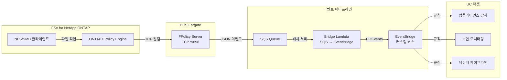
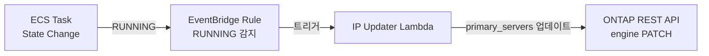

🌐 **Language / 言語**: [日本語](README.md) | [English](README.en.md) | 한국어 | [简体中文](README.zh-CN.md) | [繁體中文](README.zh-TW.md) | [Français](README.fr.md) | [Deutsch](README.de.md) | [Español](README.es.md)

# 이벤트 기반 FPolicy — 파일 작업 실시간 감지 패턴

📚 **문서**: [아키텍처 다이어그램](docs/architecture.ko.md) | [데모 가이드](docs/demo-guide.ko.md)

## 개요

ONTAP FPolicy External Server를 ECS Fargate에 구현하여 파일 작업 이벤트를 실시간으로 AWS 서비스(SQS → EventBridge)에 연계하는 서버리스 패턴입니다.

NFS/SMB를 통한 파일 생성·쓰기·삭제·이름 변경 작업을 즉시 감지하고, EventBridge 커스텀 버스를 통해 다양한 유스케이스(컴플라이언스 감사, 보안 모니터링, 데이터 파이프라인 시작 등)로 라우팅합니다.

### 이 패턴이 적합한 경우

- 파일 작업을 실시간으로 감지하고 즉시 액션을 실행하고 싶은 경우
- NFS/SMB 프로토콜을 통한 파일 변경을 AWS 이벤트로 처리하고 싶은 경우
- 단일 이벤트 소스에서 여러 유스케이스로 라우팅하고 싶은 경우
- 파일 작업을 차단하지 않고 비동기로 처리하고 싶은 경우(비동기 모드)
- S3 이벤트 알림을 사용할 수 없는 환경에서 이벤트 기반 아키텍처를 구현하고 싶은 경우

### 이 패턴이 적합하지 않은 경우

- 파일 작업을 사전에 차단/거부해야 하는 경우(동기 모드 필요)
- 정기적인 배치 스캔으로 충분한 경우(S3 AP 폴링 패턴 권장)
- NFSv4.2 프로토콜만 사용하는 환경(FPolicy 미지원)
- ONTAP REST API에 대한 네트워크 도달성을 확보할 수 없는 환경

### 주요 기능

| 기능 | 설명 |
|------|------|
| 멀티 프로토콜 지원 | NFSv3/NFSv4.0/NFSv4.1/SMB 지원 |
| 비동기 모드 | 파일 작업을 차단하지 않음(레이턴시 영향 없음) |
| XML 파싱 + 경로 정규화 | ONTAP FPolicy XML을 구조화된 JSON으로 변환 |
| SVM/Volume 이름 자동 해석 | NEGO_REQ 핸드셰이크에서 자동 취득 |
| EventBridge 라우팅 | 커스텀 버스를 통한 UC별 라우팅 |
| Fargate 태스크 IP 자동 업데이트 | ECS 태스크 재시작 시 ONTAP engine IP 자동 반영 |
| NFSv3 write-complete 대기 | 쓰기 완료를 기다린 후 이벤트 발행 |

## 아키텍처



### IP 자동 업데이트 메커니즘



## 사전 요구 사항

- AWS 계정 및 적절한 IAM 권한
- FSx for NetApp ONTAP 파일 시스템(ONTAP 9.17.1 이상)
- VPC, 프라이빗 서브넷(FSxN SVM과 동일 VPC)
- ONTAP 관리자 자격 증명이 Secrets Manager에 등록 완료
- ECR 리포지토리(FPolicy Server 컨테이너 이미지용)
- VPC Endpoints(ECR, SQS, CloudWatch Logs, STS)

### VPC Endpoints 요구 사항

ECS Fargate(Private Subnet)가 정상 작동하려면 다음 VPC Endpoints가 필요합니다:

| VPC Endpoint | 용도 |
|-------------|------|
| `com.amazonaws.<region>.ecr.dkr` | 컨테이너 이미지 풀 |
| `com.amazonaws.<region>.ecr.api` | ECR 인증 |
| `com.amazonaws.<region>.s3` (Gateway) | ECR 이미지 레이어 취득 |
| `com.amazonaws.<region>.logs` | CloudWatch Logs |
| `com.amazonaws.<region>.sts` | IAM 역할 인증 |
| `com.amazonaws.<region>.sqs` | SQS 메시지 전송 ★필수 |

## 배포 절차

### 1. 컨테이너 이미지 빌드·푸시

```bash
# ECR 리포지토리 생성
aws ecr create-repository \
  --repository-name fsxn-fpolicy-server \
  --region ap-northeast-1

# ECR 로그인
aws ecr get-login-password --region ap-northeast-1 | \
  docker login --username AWS --password-stdin \
  <ACCOUNT_ID>.dkr.ecr.ap-northeast-1.amazonaws.com

# 빌드 & 푸시(event-driven-fpolicy/ 디렉토리에서 실행)
docker buildx build --platform linux/arm64 \
  -f server/Dockerfile \
  -t <ACCOUNT_ID>.dkr.ecr.ap-northeast-1.amazonaws.com/fsxn-fpolicy-server:latest \
  --push .
```

### 2. CloudFormation 배포

#### Fargate 모드(기본값)

```bash
aws cloudformation deploy \
  --template-file event-driven-fpolicy/template.yaml \
  --stack-name fsxn-fpolicy-event-driven \
  --parameter-overrides \
    ComputeType=fargate \
    VpcId=<your-vpc-id> \
    SubnetIds=<subnet-1>,<subnet-2> \
    FsxnSvmSecurityGroupId=<fsxn-sg-id> \
    ContainerImage=<ACCOUNT_ID>.dkr.ecr.ap-northeast-1.amazonaws.com/fsxn-fpolicy-server:latest \
    FsxnMgmtIp=<svm-mgmt-ip> \
    FsxnSvmUuid=<svm-uuid> \
    FsxnCredentialsSecret=<secret-name> \
  --capabilities CAPABILITY_NAMED_IAM \
  --region ap-northeast-1
```

#### EC2 모드(고정 IP, 저비용)

```bash
aws cloudformation deploy \
  --template-file event-driven-fpolicy/template.yaml \
  --stack-name fsxn-fpolicy-event-driven \
  --parameter-overrides \
    ComputeType=ec2 \
    VpcId=<your-vpc-id> \
    SubnetIds=<subnet-1> \
    FsxnSvmSecurityGroupId=<fsxn-sg-id> \
    ContainerImage=<ACCOUNT_ID>.dkr.ecr.ap-northeast-1.amazonaws.com/fsxn-fpolicy-server:latest \
    InstanceType=t4g.micro \
    FsxnMgmtIp=<svm-mgmt-ip> \
    FsxnSvmUuid=<svm-uuid> \
    FsxnCredentialsSecret=<secret-name> \
  --capabilities CAPABILITY_NAMED_IAM \
  --region ap-northeast-1
```

> **Fargate vs EC2 선택 기준**:
> - **Fargate**: 확장성 중시, 관리형 운영, IP 자동 업데이트 포함
> - **EC2**: 비용 최적화(~$3/월 vs ~$54/월), 고정 IP(ONTAP engine 업데이트 불필요), SSM 지원

### 3. ONTAP FPolicy 설정

```bash
# SSH로 FSxN SVM에 접속 후 다음을 실행

# 1. External Engine 생성
vserver fpolicy policy external-engine create \
  -vserver <SVM_NAME> \
  -engine-name fpolicy_aws_engine \
  -primary-servers <FARGATE_TASK_IP> \
  -port 9898 \
  -extern-engine-type asynchronous

# 2. Event 생성
vserver fpolicy policy event create \
  -vserver <SVM_NAME> \
  -event-name fpolicy_aws_event \
  -protocol cifs,nfsv3,nfsv4 \
  -file-operations create,write,delete,rename

# 3. Policy 생성
vserver fpolicy policy create \
  -vserver <SVM_NAME> \
  -policy-name fpolicy_aws \
  -events fpolicy_aws_event \
  -engine fpolicy_aws_engine \
  -is-mandatory false

# 4. Scope 설정(옵션)
vserver fpolicy policy scope create \
  -vserver <SVM_NAME> \
  -policy-name fpolicy_aws \
  -volumes-to-include "*"

# 5. Policy 활성화
vserver fpolicy enable \
  -vserver <SVM_NAME> \
  -policy-name fpolicy_aws \
  -sequence-number 1
```

## 설정 파라미터 목록

| 파라미터 | 설명 | 기본값 | 필수 |
|-----------|------|----------|------|
| `ComputeType` | 실행 환경 선택 (fargate/ec2) | `fargate` | |
| `VpcId` | FSxN과 동일 VPC의 ID | — | ✅ |
| `SubnetIds` | Fargate 태스크 또는 EC2 배치 대상 Private Subnet | — | ✅ |
| `FsxnSvmSecurityGroupId` | FSxN SVM의 Security Group ID | — | ✅ |
| `ContainerImage` | FPolicy Server 컨테이너 이미지 URI | — | ✅ |
| `FPolicyPort` | TCP 리스닝 포트 | `9898` | |
| `WriteCompleteDelaySec` | NFSv3 write-complete 대기 초 | `5` | |
| `Mode` | 동작 모드 (realtime/batch) | `realtime` | |
| `DesiredCount` | Fargate 태스크 수(Fargate 시에만) | `1` | |
| `Cpu` | Fargate 태스크 CPU(Fargate 시에만) | `256` | |
| `Memory` | Fargate 태스크 메모리 MB(Fargate 시에만) | `512` | |
| `InstanceType` | EC2 인스턴스 타입(EC2 시에만) | `t4g.micro` | |
| `KeyPairName` | SSH 키 페어 이름(EC2 시에만, 생략 가능) | `""` | |
| `EventBusName` | EventBridge 커스텀 버스 이름 | `fsxn-fpolicy-events` | |
| `FsxnMgmtIp` | FSxN SVM 관리 IP | — | ✅ |
| `FsxnSvmUuid` | FSxN SVM UUID | — | ✅ |
| `FsxnEngineName` | FPolicy external-engine 이름 | `fpolicy_aws_engine` | |
| `FsxnPolicyName` | FPolicy 정책 이름 | `fpolicy_aws` | |
| `FsxnCredentialsSecret` | Secrets Manager 시크릿 이름 | — | ✅ |

## 비용 구조

### 상시 가동 컴포넌트

| 서비스 | 구성 | 월간 예상 비용 |
|---------|------|---------|
| ECS Fargate | 0.25 vCPU / 512 MB × 1 태스크 | ~$9.50 |
| NLB | 내부 NLB(헬스 체크용) | ~$16.20 |
| VPC Endpoints | SQS + ECR + Logs + STS (4 Interface) | ~$28.80 |

### 종량 과금 컴포넌트

| 서비스 | 과금 단위 | 예상(1,000 이벤트/일) |
|---------|---------|------------------------|
| SQS | 요청 수 | ~$0.01/월 |
| Lambda (Bridge) | 요청 + 실행 시간 | ~$0.01/월 |
| Lambda (IP Updater) | 요청(태스크 재시작 시에만) | ~$0.001/월 |
| EventBridge | 커스텀 이벤트 수 | ~$0.03/월 |

> **최소 구성**: Fargate + NLB + VPC Endpoints로 **~$54.50/월**부터 이용 가능.

## 정리(클린업)

```bash
# 1. ONTAP FPolicy 비활성화
# SSH로 FSxN SVM에 접속
vserver fpolicy disable -vserver <SVM_NAME> -policy-name fpolicy_aws

# 2. CloudFormation 스택 삭제
aws cloudformation delete-stack \
  --stack-name fsxn-fpolicy-event-driven \
  --region ap-northeast-1

aws cloudformation wait stack-delete-complete \
  --stack-name fsxn-fpolicy-event-driven \
  --region ap-northeast-1

# 3. ECR 이미지 삭제(옵션)
aws ecr delete-repository \
  --repository-name fsxn-fpolicy-server \
  --force \
  --region ap-northeast-1
```

## Supported Regions

이 패턴은 다음 서비스를 사용합니다:

| 서비스 | 리전 제약 |
|---------|-------------|
| FSx for NetApp ONTAP | [지원 리전 목록](https://docs.aws.amazon.com/general/latest/gr/fsxn.html) |
| ECS Fargate | 거의 모든 리전에서 이용 가능 |
| EventBridge | 모든 리전에서 이용 가능 |
| SQS | 모든 리전에서 이용 가능 |

## 검증 완료 환경

| 항목 | 값 |
|------|-----|
| AWS 리전 | ap-northeast-1 (도쿄) |
| FSx ONTAP 버전 | ONTAP 9.17.1P6 |
| FSx 구성 | SINGLE_AZ_1 |
| Python | 3.12 |
| 배포 방식 | CloudFormation (표준) |

## 프로토콜 지원 매트릭스

| 프로토콜 | FPolicy 지원 | 비고 |
|-----------|:-----------:|------|
| NFSv3 | ✅ | write-complete 대기 필요(기본 5초) |
| NFSv4.0 | ✅ | 권장 |
| NFSv4.1 | ✅ | 권장(마운트 시 `vers=4.1` 명시) |
| NFSv4.2 | ❌ | ONTAP FPolicy monitoring 미지원 |
| SMB | ✅ | CIFS 프로토콜로 감지 |

> **중요**: `mount -o vers=4`는 NFSv4.2로 협상될 수 있으므로 `vers=4.1`을 명시적으로 지정하세요.

## 참고 링크

- [NetApp FPolicy 문서](https://docs.netapp.com/us-en/ontap-technical-reports/ontap-security-hardening/create-fpolicy.html)
- [ONTAP REST API 레퍼런스](https://docs.netapp.com/us-en/ontap-automation/)
- [ECS Fargate 문서](https://docs.aws.amazon.com/AmazonECS/latest/developerguide/AWS_Fargate.html)
- [EventBridge 커스텀 버스](https://docs.aws.amazon.com/eventbridge/latest/userguide/eb-create-event-bus.html)
