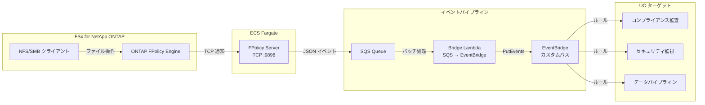
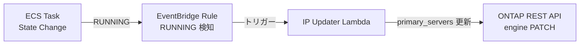

🌐 **Language / 言語**: 日本語 | [English](README.en.md) | [한국어](README.ko.md) | [简体中文](README.zh-CN.md) | [繁體中文](README.zh-TW.md) | [Français](README.fr.md) | [Deutsch](README.de.md) | [Español](README.es.md)

# イベント駆動 FPolicy — ファイル操作リアルタイム検知パターン

📚 **ドキュメント**: [アーキテクチャ図](docs/architecture.md) | [デモガイド](docs/demo-guide.md)

## 概要

ONTAP FPolicy External Server を ECS Fargate 上に実装し、ファイル操作イベントをリアルタイムで AWS サービス（SQS → EventBridge）に連携するサーバーレスパターンです。

NFS/SMB 経由のファイル作成・書き込み・削除・リネーム操作を即座に検知し、EventBridge カスタムバスを通じて任意のユースケース（コンプライアンス監査、セキュリティ監視、データパイプライン起動など）にルーティングします。

### このパターンが適しているケース

- ファイル操作をリアルタイムで検知し、即座にアクションを実行したい
- NFS/SMB プロトコル経由のファイル変更を AWS イベントとして扱いたい
- 複数のユースケースに対して単一のイベントソースからルーティングしたい
- ファイル操作をブロックせずに非同期で処理したい（非同期モード）
- S3 イベント通知が利用できない環境でイベント駆動アーキテクチャを実現したい

### このパターンが適さないケース

- ファイル操作を事前にブロック/拒否する必要がある（同期モードが必要）
- 定期的なバッチスキャンで十分な場合（S3 AP ポーリングパターンを推奨）
- NFSv4.2 プロトコルのみを使用する環境（FPolicy 非サポート）
- ONTAP REST API へのネットワーク到達性が確保できない環境

### 主な機能

| 機能 | 説明 |
|------|------|
| マルチプロトコル対応 | NFSv3/NFSv4.0/NFSv4.1/SMB に対応 |
| 非同期モード | ファイル操作をブロックしない（レイテンシ影響なし） |
| XML パース + パス正規化 | ONTAP FPolicy XML を構造化 JSON に変換 |
| SVM/Volume 名自動解決 | NEGO_REQ ハンドシェイクから自動取得 |
| EventBridge ルーティング | カスタムバスによる UC 別ルーティング |
| Fargate タスク IP 自動更新 | ECS タスク再起動時に ONTAP engine IP を自動反映 |
| NFSv3 write-complete 待機 | 書き込み完了を待ってからイベント発行 |

## アーキテクチャ



### IP 自動更新メカニズム



## 前提条件

- AWS アカウントと適切な IAM 権限
- FSx for NetApp ONTAP ファイルシステム（ONTAP 9.17.1 以上）
- VPC、プライベートサブネット（FSxN SVM と同一 VPC）
- ONTAP 管理者認証情報が Secrets Manager に登録済み
- ECR リポジトリ（FPolicy Server コンテナイメージ用）
- VPC Endpoints（ECR, SQS, CloudWatch Logs, STS）

### VPC Endpoints 要件

ECS Fargate（Private Subnet）が正常動作するには以下の VPC Endpoints が必要です:

| VPC Endpoint | 用途 |
|-------------|------|
| `com.amazonaws.<region>.ecr.dkr` | コンテナイメージプル |
| `com.amazonaws.<region>.ecr.api` | ECR 認証 |
| `com.amazonaws.<region>.s3` (Gateway) | ECR イメージレイヤー取得 |
| `com.amazonaws.<region>.logs` | CloudWatch Logs |
| `com.amazonaws.<region>.sts` | IAM ロール認証 |
| `com.amazonaws.<region>.sqs` | SQS メッセージ送信 ★必須 |

## デプロイ手順

### 1. コンテナイメージのビルド・プッシュ

```bash
# ECR リポジトリ作成
aws ecr create-repository \
  --repository-name fsxn-fpolicy-server \
  --region ap-northeast-1

# ECR ログイン
aws ecr get-login-password --region ap-northeast-1 | \
  docker login --username AWS --password-stdin \
  <ACCOUNT_ID>.dkr.ecr.ap-northeast-1.amazonaws.com

# ビルド & プッシュ（event-driven-fpolicy/ ディレクトリから実行）
docker buildx build --platform linux/arm64 \
  -f server/Dockerfile \
  -t <ACCOUNT_ID>.dkr.ecr.ap-northeast-1.amazonaws.com/fsxn-fpolicy-server:latest \
  --push .
```

### 2. CloudFormation デプロイ

#### Fargate モード（デフォルト）

```bash
aws cloudformation deploy \
  --template-file event-driven-fpolicy/template.yaml \
  --stack-name fsxn-fpolicy-event-driven \
  --parameter-overrides \
    ComputeType=fargate \
    VpcId=<your-vpc-id> \
    SubnetIds=<subnet-1>,<subnet-2> \
    FsxnSvmSecurityGroupId=<fsxn-sg-id> \
    ContainerImage=<ACCOUNT_ID>.dkr.ecr.ap-northeast-1.amazonaws.com/fsxn-fpolicy-server:latest \
    FsxnMgmtIp=<svm-mgmt-ip> \
    FsxnSvmUuid=<svm-uuid> \
    FsxnCredentialsSecret=<secret-name> \
  --capabilities CAPABILITY_NAMED_IAM \
  --region ap-northeast-1
```

#### EC2 モード（固定 IP、低コスト）

```bash
aws cloudformation deploy \
  --template-file event-driven-fpolicy/template.yaml \
  --stack-name fsxn-fpolicy-event-driven \
  --parameter-overrides \
    ComputeType=ec2 \
    VpcId=<your-vpc-id> \
    SubnetIds=<subnet-1> \
    FsxnSvmSecurityGroupId=<fsxn-sg-id> \
    ContainerImage=<ACCOUNT_ID>.dkr.ecr.ap-northeast-1.amazonaws.com/fsxn-fpolicy-server:latest \
    InstanceType=t4g.micro \
    FsxnMgmtIp=<svm-mgmt-ip> \
    FsxnSvmUuid=<svm-uuid> \
    FsxnCredentialsSecret=<secret-name> \
  --capabilities CAPABILITY_NAMED_IAM \
  --region ap-northeast-1
```

> **Fargate vs EC2 の選択基準**:
> - **Fargate**: スケーラビリティ重視、マネージド運用、IP 自動更新あり
> - **EC2**: コスト最適化（~$3/月 vs ~$54/月）、固定 IP（ONTAP engine 更新不要）、SSM 対応

### 3. ONTAP FPolicy 設定

```bash
# SSH で FSxN SVM に接続後、以下を実行

# 1. External Engine 作成
vserver fpolicy policy external-engine create \
  -vserver <SVM_NAME> \
  -engine-name fpolicy_aws_engine \
  -primary-servers <FARGATE_TASK_IP> \
  -port 9898 \
  -extern-engine-type asynchronous

# 2. Event 作成
vserver fpolicy policy event create \
  -vserver <SVM_NAME> \
  -event-name fpolicy_aws_event \
  -protocol cifs,nfsv3,nfsv4 \
  -file-operations create,write,delete,rename

# 3. Policy 作成
vserver fpolicy policy create \
  -vserver <SVM_NAME> \
  -policy-name fpolicy_aws \
  -events fpolicy_aws_event \
  -engine fpolicy_aws_engine \
  -is-mandatory false

# 4. Scope 設定（オプション）
vserver fpolicy policy scope create \
  -vserver <SVM_NAME> \
  -policy-name fpolicy_aws \
  -volumes-to-include "*"

# 5. Policy 有効化
vserver fpolicy enable \
  -vserver <SVM_NAME> \
  -policy-name fpolicy_aws \
  -sequence-number 1
```

## 設定パラメータ一覧

| パラメータ | 説明 | デフォルト | 必須 |
|-----------|------|----------|------|
| `ComputeType` | 実行環境の選択 (fargate/ec2) | `fargate` | |
| `VpcId` | FSxN と同一 VPC の ID | — | ✅ |
| `SubnetIds` | Fargate タスクまたは EC2 配置先 Private Subnet | — | ✅ |
| `FsxnSvmSecurityGroupId` | FSxN SVM の Security Group ID | — | ✅ |
| `ContainerImage` | FPolicy Server コンテナイメージ URI | — | ✅ |
| `FPolicyPort` | TCP リスニングポート | `9898` | |
| `WriteCompleteDelaySec` | NFSv3 write-complete 待機秒数 | `5` | |
| `Mode` | 動作モード (realtime/batch) | `realtime` | |
| `DesiredCount` | Fargate タスク数（Fargate 時のみ） | `1` | |
| `Cpu` | Fargate タスク CPU（Fargate 時のみ） | `256` | |
| `Memory` | Fargate タスクメモリ MB（Fargate 時のみ） | `512` | |
| `InstanceType` | EC2 インスタンスタイプ（EC2 時のみ） | `t4g.micro` | |
| `KeyPairName` | SSH キーペア名（EC2 時のみ、省略可） | `""` | |
| `EventBusName` | EventBridge カスタムバス名 | `fsxn-fpolicy-events` | |
| `FsxnMgmtIp` | FSxN SVM 管理 IP | — | ✅ |
| `FsxnSvmUuid` | FSxN SVM UUID | — | ✅ |
| `FsxnEngineName` | FPolicy external-engine 名 | `fpolicy_aws_engine` | |
| `FsxnPolicyName` | FPolicy ポリシー名 | `fpolicy_aws` | |
| `FsxnCredentialsSecret` | Secrets Manager シークレット名 | — | ✅ |

## コスト構造

### 常時稼働コンポーネント

| サービス | 構成 | 月額概算 |
|---------|------|---------|
| ECS Fargate | 0.25 vCPU / 512 MB × 1 タスク | ~$9.50 |
| NLB | 内部 NLB（ヘルスチェック用） | ~$16.20 |
| VPC Endpoints | SQS + ECR + Logs + STS (4 Interface) | ~$28.80 |

### 従量課金コンポーネント

| サービス | 課金単位 | 概算（1,000 イベント/日） |
|---------|---------|------------------------|
| SQS | リクエスト数 | ~$0.01/月 |
| Lambda (Bridge) | リクエスト + 実行時間 | ~$0.01/月 |
| Lambda (IP Updater) | リクエスト（タスク再起動時のみ） | ~$0.001/月 |
| EventBridge | カスタムイベント数 | ~$0.03/月 |

> **最小構成**: Fargate + NLB + VPC Endpoints で **~$54.50/月** から利用可能。

## クリーンアップ

```bash
# 1. ONTAP FPolicy を無効化
# SSH で FSxN SVM に接続
vserver fpolicy disable -vserver <SVM_NAME> -policy-name fpolicy_aws

# 2. CloudFormation スタック削除
aws cloudformation delete-stack \
  --stack-name fsxn-fpolicy-event-driven \
  --region ap-northeast-1

aws cloudformation wait stack-delete-complete \
  --stack-name fsxn-fpolicy-event-driven \
  --region ap-northeast-1

# 3. ECR イメージ削除（オプション）
aws ecr delete-repository \
  --repository-name fsxn-fpolicy-server \
  --force \
  --region ap-northeast-1
```

## Supported Regions

本パターンは以下のサービスを使用します:

| サービス | リージョン制約 |
|---------|-------------|
| FSx for NetApp ONTAP | [対応リージョン一覧](https://docs.aws.amazon.com/general/latest/gr/fsxn.html) |
| ECS Fargate | ほぼ全リージョンで利用可能 |
| EventBridge | 全リージョンで利用可能 |
| SQS | 全リージョンで利用可能 |

## 検証済み環境

| 項目 | 値 |
|------|-----|
| AWS リージョン | ap-northeast-1 (東京) |
| FSx ONTAP バージョン | ONTAP 9.17.1P6 |
| FSx 構成 | SINGLE_AZ_1 |
| Python | 3.12 |
| デプロイ方式 | CloudFormation (標準) |

## プロトコルサポートマトリックス

| プロトコル | FPolicy 対応 | 備考 |
|-----------|:-----------:|------|
| NFSv3 | ✅ | write-complete 待機が必要（デフォルト 5 秒） |
| NFSv4.0 | ✅ | 推奨 |
| NFSv4.1 | ✅ | 推奨（マウント時 `vers=4.1` を明示） |
| NFSv4.2 | ❌ | ONTAP FPolicy monitoring 非サポート |
| SMB | ✅ | CIFS プロトコルとして検知 |

> **重要**: `mount -o vers=4` は NFSv4.2 にネゴシエートされる可能性があるため、`vers=4.1` を明示的に指定してください。

## 参考リンク

- [NetApp FPolicy ドキュメント](https://docs.netapp.com/us-en/ontap-technical-reports/ontap-security-hardening/create-fpolicy.html)
- [ONTAP REST API リファレンス](https://docs.netapp.com/us-en/ontap-automation/)
- [ECS Fargate ドキュメント](https://docs.aws.amazon.com/AmazonECS/latest/developerguide/AWS_Fargate.html)
- [EventBridge カスタムバス](https://docs.aws.amazon.com/eventbridge/latest/userguide/eb-create-event-bus.html)
