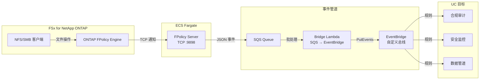
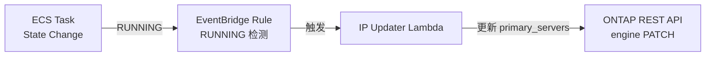

🌐 **Language / 言語**: [日本語](README.md) | [English](README.en.md) | [한국어](README.ko.md) | 简体中文 | [繁體中文](README.zh-TW.md) | [Français](README.fr.md) | [Deutsch](README.de.md) | [Español](README.es.md)

# 事件驱动 FPolicy — 文件操作实时检测模式

📚 **文档**: [架构图](docs/architecture.zh-CN.md) | [演示指南](docs/demo-guide.zh-CN.md)

## 概述

在 ECS Fargate 上实现 ONTAP FPolicy External Server，将文件操作事件实时传递到 AWS 服务（SQS → EventBridge）的无服务器模式。

即时检测通过 NFS/SMB 进行的文件创建、写入、删除、重命名操作，并通过 EventBridge 自定义总线路由到各种用例（合规审计、安全监控、数据管道启动等）。

### 适用场景

- 希望实时检测文件操作并立即执行操作
- 希望将 NFS/SMB 协议的文件变更作为 AWS 事件处理
- 希望从单一事件源路由到多个用例
- 希望在不阻塞文件操作的情况下异步处理（异步模式）
- 希望在无法使用 S3 事件通知的环境中实现事件驱动架构

### 不适用场景

- 需要事先阻止/拒绝文件操作（需要同步模式）
- 定期批量扫描即可满足需求（推荐 S3 AP 轮询模式）
- 仅使用 NFSv4.2 协议的环境（FPolicy 不支持）
- 无法确保到 ONTAP REST API 的网络可达性的环境

### 主要功能

| 功能 | 说明 |
|------|------|
| 多协议支持 | 支持 NFSv3/NFSv4.0/NFSv4.1/SMB |
| 异步模式 | 不阻塞文件操作（无延迟影响） |
| XML 解析 + 路径规范化 | 将 ONTAP FPolicy XML 转换为结构化 JSON |
| SVM/Volume 名称自动解析 | 从 NEGO_REQ 握手中自动获取 |
| EventBridge 路由 | 通过自定义总线按用例路由 |
| Fargate 任务 IP 自动更新 | ECS 任务重启时自动反映 ONTAP engine IP |
| NFSv3 write-complete 等待 | 等待写入完成后再发布事件 |

## 架构



### IP 自动更新机制



## 前提条件

- AWS 账户及适当的 IAM 权限
- FSx for NetApp ONTAP 文件系统（ONTAP 9.17.1 以上）
- VPC、私有子网（与 FSxN SVM 相同的 VPC）
- ONTAP 管理员凭证已注册到 Secrets Manager
- ECR 仓库（用于 FPolicy Server 容器镜像）
- VPC Endpoints（ECR、SQS、CloudWatch Logs、STS）

### VPC Endpoints 要求

ECS Fargate（Private Subnet）正常运行需要以下 VPC Endpoints：

| VPC Endpoint | 用途 |
|-------------|------|
| `com.amazonaws.<region>.ecr.dkr` | 容器镜像拉取 |
| `com.amazonaws.<region>.ecr.api` | ECR 认证 |
| `com.amazonaws.<region>.s3` (Gateway) | ECR 镜像层获取 |
| `com.amazonaws.<region>.logs` | CloudWatch Logs |
| `com.amazonaws.<region>.sts` | IAM 角色认证 |
| `com.amazonaws.<region>.sqs` | SQS 消息发送 ★必需 |

## 部署步骤

### 1. 构建并推送容器镜像

```bash
# 创建 ECR 仓库
aws ecr create-repository \
  --repository-name fsxn-fpolicy-server \
  --region ap-northeast-1

# ECR 登录
aws ecr get-login-password --region ap-northeast-1 | \
  docker login --username AWS --password-stdin \
  <ACCOUNT_ID>.dkr.ecr.ap-northeast-1.amazonaws.com

# 构建 & 推送（从 event-driven-fpolicy/ 目录执行）
docker buildx build --platform linux/arm64 \
  -f server/Dockerfile \
  -t <ACCOUNT_ID>.dkr.ecr.ap-northeast-1.amazonaws.com/fsxn-fpolicy-server:latest \
  --push .
```

### 2. CloudFormation 部署

#### Fargate 模式（默认）

```bash
aws cloudformation deploy \
  --template-file event-driven-fpolicy/template.yaml \
  --stack-name fsxn-fpolicy-event-driven \
  --parameter-overrides \
    ComputeType=fargate \
    VpcId=<your-vpc-id> \
    SubnetIds=<subnet-1>,<subnet-2> \
    FsxnSvmSecurityGroupId=<fsxn-sg-id> \
    ContainerImage=<ACCOUNT_ID>.dkr.ecr.ap-northeast-1.amazonaws.com/fsxn-fpolicy-server:latest \
    FsxnMgmtIp=<svm-mgmt-ip> \
    FsxnSvmUuid=<svm-uuid> \
    FsxnCredentialsSecret=<secret-name> \
  --capabilities CAPABILITY_NAMED_IAM \
  --region ap-northeast-1
```

#### EC2 模式（固定 IP、低成本）

```bash
aws cloudformation deploy \
  --template-file event-driven-fpolicy/template.yaml \
  --stack-name fsxn-fpolicy-event-driven \
  --parameter-overrides \
    ComputeType=ec2 \
    VpcId=<your-vpc-id> \
    SubnetIds=<subnet-1> \
    FsxnSvmSecurityGroupId=<fsxn-sg-id> \
    ContainerImage=<ACCOUNT_ID>.dkr.ecr.ap-northeast-1.amazonaws.com/fsxn-fpolicy-server:latest \
    InstanceType=t4g.micro \
    FsxnMgmtIp=<svm-mgmt-ip> \
    FsxnSvmUuid=<svm-uuid> \
    FsxnCredentialsSecret=<secret-name> \
  --capabilities CAPABILITY_NAMED_IAM \
  --region ap-northeast-1
```

> **Fargate vs EC2 选择标准**：
> - **Fargate**：注重可扩展性、托管运维、包含 IP 自动更新
> - **EC2**：成本优化（~$3/月 vs ~$54/月）、固定 IP（无需更新 ONTAP engine）、支持 SSM

### 3. ONTAP FPolicy 配置

```bash
# 通过 SSH 连接到 FSxN SVM 后执行以下命令

# 1. 创建 External Engine
fpolicy policy external-engine create \
  -vserver <SVM_NAME> \
  -engine-name fpolicy_aws_engine \
  -primary-servers <FARGATE_TASK_IP> \
  -port 9898 \
  -extern-engine-type asynchronous

# 2. 创建 Event
fpolicy policy event create \
  -vserver <SVM_NAME> \
  -event-name fpolicy_aws_event \
  -protocol cifs,nfsv3,nfsv4 \
  -file-operations create,write,delete,rename

# 3. 创建 Policy
fpolicy policy create \
  -vserver <SVM_NAME> \
  -policy-name fpolicy_aws \
  -events fpolicy_aws_event \
  -engine fpolicy_aws_engine \
  -is-mandatory false

# 4. 配置 Scope（可选）
fpolicy policy scope create \
  -vserver <SVM_NAME> \
  -policy-name fpolicy_aws \
  -volumes-to-include "*"

# 5. 启用 Policy
fpolicy enable \
  -vserver <SVM_NAME> \
  -policy-name fpolicy_aws \
  -sequence-number 1
```

## 配置参数列表

| 参数 | 说明 | 默认值 | 必需 |
|-----------|------|----------|------|
| `ComputeType` | 执行环境选择 (fargate/ec2) | `fargate` | |
| `VpcId` | 与 FSxN 相同 VPC 的 ID | — | ✅ |
| `SubnetIds` | Fargate 任务或 EC2 放置的 Private Subnet | — | ✅ |
| `FsxnSvmSecurityGroupId` | FSxN SVM 的 Security Group ID | — | ✅ |
| `ContainerImage` | FPolicy Server 容器镜像 URI | — | ✅ |
| `FPolicyPort` | TCP 监听端口 | `9898` | |
| `WriteCompleteDelaySec` | NFSv3 write-complete 等待秒数 | `5` | |
| `Mode` | 运行模式 (realtime/batch) | `realtime` | |
| `DesiredCount` | Fargate 任务数（仅 Fargate 时） | `1` | |
| `Cpu` | Fargate 任务 CPU（仅 Fargate 时） | `256` | |
| `Memory` | Fargate 任务内存 MB（仅 Fargate 时） | `512` | |
| `InstanceType` | EC2 实例类型（仅 EC2 时） | `t4g.micro` | |
| `KeyPairName` | SSH 密钥对名称（仅 EC2 时，可省略） | `""` | |
| `EventBusName` | EventBridge 自定义总线名称 | `fsxn-fpolicy-events` | |
| `FsxnMgmtIp` | FSxN SVM 管理 IP | — | ✅ |
| `FsxnSvmUuid` | FSxN SVM UUID | — | ✅ |
| `FsxnEngineName` | FPolicy external-engine 名称 | `fpolicy_aws_engine` | |
| `FsxnPolicyName` | FPolicy 策略名称 | `fpolicy_aws` | |
| `FsxnCredentialsSecret` | Secrets Manager 密钥名称 | — | ✅ |

## 成本结构

### 常驻组件

| 服务 | 配置 | 月度估算 |
|---------|------|---------|
| ECS Fargate | 0.25 vCPU / 512 MB × 1 任务 | ~$9.50 |
| NLB | 内部 NLB（用于健康检查） | ~$16.20 |
| VPC Endpoints | SQS + ECR + Logs + STS (4 Interface) | ~$28.80 |

### 按量计费组件

| 服务 | 计费单位 | 估算（1,000 事件/天） |
|---------|---------|------------------------|
| SQS | 请求数 | ~$0.01/月 |
| Lambda (Bridge) | 请求 + 执行时间 | ~$0.01/月 |
| Lambda (IP Updater) | 请求（仅任务重启时） | ~$0.001/月 |
| EventBridge | 自定义事件数 | ~$0.03/月 |

> **最小配置**：Fargate + NLB + VPC Endpoints，**~$54.50/月**起。

## 清理

```bash
# 1. 禁用 ONTAP FPolicy
# 通过 SSH 连接到 FSxN SVM
fpolicy disable -vserver <SVM_NAME> -policy-name fpolicy_aws

# 2. 删除 CloudFormation 堆栈
aws cloudformation delete-stack \
  --stack-name fsxn-fpolicy-event-driven \
  --region ap-northeast-1

aws cloudformation wait stack-delete-complete \
  --stack-name fsxn-fpolicy-event-driven \
  --region ap-northeast-1

# 3. 删除 ECR 镜像（可选）
aws ecr delete-repository \
  --repository-name fsxn-fpolicy-server \
  --force \
  --region ap-northeast-1
```

## Supported Regions

本模式使用以下服务：

| 服务 | 区域限制 |
|---------|-------------|
| FSx for NetApp ONTAP | [支持区域列表](https://docs.aws.amazon.com/general/latest/gr/fsxn.html) |
| ECS Fargate | 几乎所有区域可用 |
| EventBridge | 所有区域可用 |
| SQS | 所有区域可用 |

## 已验证环境

| 项目 | 值 |
|------|-----|
| AWS 区域 | ap-northeast-1（东京） |
| FSx ONTAP 版本 | ONTAP 9.17.1P6 |
| FSx 配置 | SINGLE_AZ_1 |
| Python | 3.12 |
| 部署方式 | CloudFormation（标准） |

## 协议支持矩阵

| 协议 | FPolicy 支持 | 备注 |
|-----------|:-----------:|------|
| NFSv3 | ✅ | 需要 write-complete 等待（默认 5 秒） |
| NFSv4.0 | ✅ | 推荐 |
| NFSv4.1 | ✅ | 推荐（挂载时明确指定 `vers=4.1`）。**ONTAP 9.15.1 及以上版本支持** |
| NFSv4.2 | ❌ | ONTAP FPolicy monitoring 不支持 |
| SMB | ✅ | 作为 CIFS 协议检测 |

> **重要**：`mount -o vers=4` 可能会协商为 NFSv4.2，请明确指定 `vers=4.1`。

> **ONTAP 版本说明**：NFSv4.1 FPolicy monitoring 支持在 ONTAP 9.15.1 中引入。更早版本仅支持 SMB、NFSv3 和 NFSv4.0。详情请参阅 [NetApp FPolicy 事件配置文档](https://docs.netapp.com/us-en/ontap/nas-audit/plan-fpolicy-event-config-concept.html)。

## 参考链接

- [NetApp FPolicy 文档](https://docs.netapp.com/us-en/ontap-technical-reports/ontap-security-hardening/create-fpolicy.html)
- [ONTAP REST API 参考](https://docs.netapp.com/us-en/ontap-automation/)
- [ECS Fargate 文档](https://docs.aws.amazon.com/AmazonECS/latest/developerguide/AWS_Fargate.html)
- [EventBridge 自定义总线](https://docs.aws.amazon.com/eventbridge/latest/userguide/eb-create-event-bus.html)
