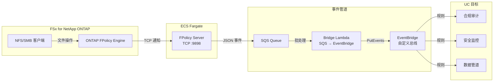

🌐 **Language / 言語**: [日本語](README.md) | [English](README.en.md) | [한국어](README.ko.md) | 简体中文 | [繁體中文](README.zh-TW.md) | [Français](README.fr.md) | [Deutsch](README.de.md) | [Español](README.es.md)

# 事件驱动 FPolicy — 文件操作实时检测模式

📚 **文档**: [架构图](docs/architecture.zh-CN.md) | [演示指南](docs/demo-guide.zh-CN.md)

## 概述

在 ECS Fargate 上实现 ONTAP FPolicy External Server，将文件操作事件实时传递到 AWS 服务（SQS → EventBridge）的无服务器模式。

即时检测通过 NFS/SMB 进行的文件创建、写入、删除、重命名操作，并通过 EventBridge 自定义总线路由到任意用例（合规审计、安全监控、数据管道触发等）。

### 适用场景

- 需要实时检测文件操作并立即执行操作
- 希望将 NFS/SMB 协议的文件变更作为 AWS 事件处理
- 需要从单一事件源路由到多个用例
- 希望以非阻塞方式异步处理文件操作
- 在无法使用 S3 事件通知的环境中需要事件驱动架构

### 不适用场景

- 需要事先阻止/拒绝文件操作（需要同步模式）
- 定期批量扫描即可满足需求（推荐 S3 AP 轮询模式）
- 仅使用 NFSv4.2 协议的环境（FPolicy 不支持）
- 无法建立到 ONTAP REST API 的网络连接

### 主要功能

| 功能 | 说明 |
|------|------|
| 多协议支持 | NFSv3/NFSv4.0/NFSv4.1/SMB |
| 异步模式 | 不阻塞文件操作（无延迟影响） |
| XML 解析 + 路径规范化 | 将 ONTAP FPolicy XML 转换为结构化 JSON |
| SVM/Volume 名称自动解析 | 从 NEGO_REQ 握手中自动提取 |
| EventBridge 路由 | 通过自定义总线按用例路由 |
| Fargate 任务 IP 自动更新 | ECS 任务重启时自动更新 ONTAP engine IP |

## 架构



## 前提条件

- AWS 账户及适当的 IAM 权限
- FSx for NetApp ONTAP 文件系统（ONTAP 9.17.1 以上）
- VPC、私有子网（与 FSxN SVM 相同的 VPC）
- ONTAP 管理员凭证已注册到 Secrets Manager
- ECR 仓库（用于 FPolicy Server 容器镜像）
- VPC Endpoints（ECR、SQS、CloudWatch Logs、STS）

## 部署

```bash
aws cloudformation deploy \
  --template-file event-driven-fpolicy/template.yaml \
  --stack-name fsxn-fpolicy-event-driven \
  --parameter-overrides \
    VpcId=<your-vpc-id> \
    SubnetIds=<subnet-1>,<subnet-2> \
    FsxnSvmSecurityGroupId=<fsxn-sg-id> \
    ContainerImage=<ACCOUNT_ID>.dkr.ecr.ap-northeast-1.amazonaws.com/fsxn-fpolicy-server:latest \
    FsxnMgmtIp=<svm-mgmt-ip> \
    FsxnSvmUuid=<svm-uuid> \
    FsxnCredentialsSecret=<secret-name> \
  --capabilities CAPABILITY_NAMED_IAM \
  --region ap-northeast-1
```

## 协议支持矩阵

| 协议 | FPolicy 支持 | 备注 |
|------|:-----------:|------|
| NFSv3 | ✅ | 需要 write-complete 等待（默认 5 秒） |
| NFSv4.0 | ✅ | 推荐 |
| NFSv4.1 | ✅ | 推荐（挂载时指定 `vers=4.1`） |
| NFSv4.2 | ❌ | ONTAP FPolicy monitoring 不支持 |
| SMB | ✅ | 作为 CIFS 协议检测 |

## 验证环境

| 项目 | 值 |
|------|-----|
| AWS 区域 | ap-northeast-1（东京） |
| FSx ONTAP 版本 | ONTAP 9.17.1P6 |
| Python | 3.12 |
| 部署方式 | CloudFormation（标准） |
