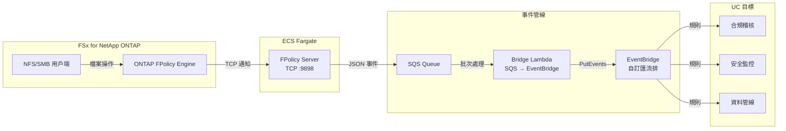
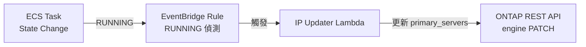

🌐 **Language / 言語**: [日本語](README.md) | [English](README.en.md) | [한국어](README.ko.md) | [简体中文](README.zh-CN.md) | 繁體中文 | [Français](README.fr.md) | [Deutsch](README.de.md) | [Español](README.es.md)

# 事件驅動 FPolicy — 檔案操作即時偵測模式

📚 **文件**: [架構圖](docs/architecture.zh-TW.md) | [示範指南](docs/demo-guide.zh-TW.md)

## 概述

在 ECS Fargate 上實作 ONTAP FPolicy External Server，將檔案操作事件即時傳遞到 AWS 服務（SQS → EventBridge）的無伺服器模式。

即時偵測透過 NFS/SMB 進行的檔案建立、寫入、刪除、重新命名操作，並透過 EventBridge 自訂匯流排路由到各種使用案例（合規稽核、安全監控、資料管線啟動等）。

### 適用情境

- 希望即時偵測檔案操作並立即執行動作
- 希望將 NFS/SMB 協定的檔案變更作為 AWS 事件處理
- 希望從單一事件來源路由到多個使用案例
- 希望在不阻擋檔案操作的情況下非同步處理（非同步模式）
- 希望在無法使用 S3 事件通知的環境中實現事件驅動架構

### 不適用情境

- 需要事先阻擋/拒絕檔案操作（需要同步模式）
- 定期批次掃描即可滿足需求（建議使用 S3 AP 輪詢模式）
- 僅使用 NFSv4.2 協定的環境（FPolicy 不支援）
- 無法確保到 ONTAP REST API 的網路可達性的環境

### 主要功能

| 功能 | 說明 |
|------|------|
| 多協定支援 | 支援 NFSv3/NFSv4.0/NFSv4.1/SMB |
| 非同步模式 | 不阻擋檔案操作（無延遲影響） |
| XML 解析 + 路徑正規化 | 將 ONTAP FPolicy XML 轉換為結構化 JSON |
| SVM/Volume 名稱自動解析 | 從 NEGO_REQ 交握中自動取得 |
| EventBridge 路由 | 透過自訂匯流排按使用案例路由 |
| Fargate 任務 IP 自動更新 | ECS 任務重啟時自動反映 ONTAP engine IP |
| NFSv3 write-complete 等待 | 等待寫入完成後再發布事件 |

## 架構



### IP 自動更新機制



## 前提條件

- AWS 帳戶及適當的 IAM 權限
- FSx for NetApp ONTAP 檔案系統（ONTAP 9.17.1 以上）
- VPC、私有子網路（與 FSxN SVM 相同的 VPC）
- ONTAP 管理員憑證已註冊到 Secrets Manager
- ECR 儲存庫（用於 FPolicy Server 容器映像）
- VPC Endpoints（ECR、SQS、CloudWatch Logs、STS）

### VPC Endpoints 需求

ECS Fargate（Private Subnet）正常運作需要以下 VPC Endpoints：

| VPC Endpoint | 用途 |
|-------------|------|
| `com.amazonaws.<region>.ecr.dkr` | 容器映像拉取 |
| `com.amazonaws.<region>.ecr.api` | ECR 驗證 |
| `com.amazonaws.<region>.s3` (Gateway) | ECR 映像層取得 |
| `com.amazonaws.<region>.logs` | CloudWatch Logs |
| `com.amazonaws.<region>.sts` | IAM 角色驗證 |
| `com.amazonaws.<region>.sqs` | SQS 訊息傳送 ★必要 |

## 部署步驟

### 1. 建置並推送容器映像

```bash
# 建立 ECR 儲存庫
aws ecr create-repository \
  --repository-name fsxn-fpolicy-server \
  --region ap-northeast-1

# ECR 登入
aws ecr get-login-password --region ap-northeast-1 | \
  docker login --username AWS --password-stdin \
  <ACCOUNT_ID>.dkr.ecr.ap-northeast-1.amazonaws.com

# 建置 & 推送（從 event-driven-fpolicy/ 目錄執行）
docker buildx build --platform linux/arm64 \
  -f server/Dockerfile \
  -t <ACCOUNT_ID>.dkr.ecr.ap-northeast-1.amazonaws.com/fsxn-fpolicy-server:latest \
  --push .
```

### 2. CloudFormation 部署

#### Fargate 模式（預設）

```bash
aws cloudformation deploy \
  --template-file event-driven-fpolicy/template.yaml \
  --stack-name fsxn-fpolicy-event-driven \
  --parameter-overrides \
    ComputeType=fargate \
    VpcId=<your-vpc-id> \
    SubnetIds=<subnet-1>,<subnet-2> \
    FsxnSvmSecurityGroupId=<fsxn-sg-id> \
    ContainerImage=<ACCOUNT_ID>.dkr.ecr.ap-northeast-1.amazonaws.com/fsxn-fpolicy-server:latest \
    FsxnMgmtIp=<svm-mgmt-ip> \
    FsxnSvmUuid=<svm-uuid> \
    FsxnCredentialsSecret=<secret-name> \
  --capabilities CAPABILITY_NAMED_IAM \
  --region ap-northeast-1
```

#### EC2 模式（固定 IP、低成本）

```bash
aws cloudformation deploy \
  --template-file event-driven-fpolicy/template.yaml \
  --stack-name fsxn-fpolicy-event-driven \
  --parameter-overrides \
    ComputeType=ec2 \
    VpcId=<your-vpc-id> \
    SubnetIds=<subnet-1> \
    FsxnSvmSecurityGroupId=<fsxn-sg-id> \
    ContainerImage=<ACCOUNT_ID>.dkr.ecr.ap-northeast-1.amazonaws.com/fsxn-fpolicy-server:latest \
    InstanceType=t4g.micro \
    FsxnMgmtIp=<svm-mgmt-ip> \
    FsxnSvmUuid=<svm-uuid> \
    FsxnCredentialsSecret=<secret-name> \
  --capabilities CAPABILITY_NAMED_IAM \
  --region ap-northeast-1
```

> **Fargate vs EC2 選擇標準**：
> - **Fargate**：注重可擴展性、託管營運、包含 IP 自動更新
> - **EC2**：成本最佳化（~$3/月 vs ~$54/月）、固定 IP（無需更新 ONTAP engine）、支援 SSM

### 3. ONTAP FPolicy 設定

```bash
# 透過 SSH 連線到 FSxN SVM 後執行以下命令

# 1. 建立 External Engine
vserver fpolicy policy external-engine create \
  -vserver <SVM_NAME> \
  -engine-name fpolicy_aws_engine \
  -primary-servers <FARGATE_TASK_IP> \
  -port 9898 \
  -extern-engine-type asynchronous

# 2. 建立 Event
vserver fpolicy policy event create \
  -vserver <SVM_NAME> \
  -event-name fpolicy_aws_event \
  -protocol cifs,nfsv3,nfsv4 \
  -file-operations create,write,delete,rename

# 3. 建立 Policy
vserver fpolicy policy create \
  -vserver <SVM_NAME> \
  -policy-name fpolicy_aws \
  -events fpolicy_aws_event \
  -engine fpolicy_aws_engine \
  -is-mandatory false

# 4. 設定 Scope（選用）
vserver fpolicy policy scope create \
  -vserver <SVM_NAME> \
  -policy-name fpolicy_aws \
  -volumes-to-include "*"

# 5. 啟用 Policy
vserver fpolicy enable \
  -vserver <SVM_NAME> \
  -policy-name fpolicy_aws \
  -sequence-number 1
```

## 設定參數列表

| 參數 | 說明 | 預設值 | 必要 |
|-----------|------|----------|------|
| `ComputeType` | 執行環境選擇 (fargate/ec2) | `fargate` | |
| `VpcId` | 與 FSxN 相同 VPC 的 ID | — | ✅ |
| `SubnetIds` | Fargate 任務或 EC2 放置的 Private Subnet | — | ✅ |
| `FsxnSvmSecurityGroupId` | FSxN SVM 的 Security Group ID | — | ✅ |
| `ContainerImage` | FPolicy Server 容器映像 URI | — | ✅ |
| `FPolicyPort` | TCP 監聽連接埠 | `9898` | |
| `WriteCompleteDelaySec` | NFSv3 write-complete 等待秒數 | `5` | |
| `Mode` | 運作模式 (realtime/batch) | `realtime` | |
| `DesiredCount` | Fargate 任務數（僅 Fargate 時） | `1` | |
| `Cpu` | Fargate 任務 CPU（僅 Fargate 時） | `256` | |
| `Memory` | Fargate 任務記憶體 MB（僅 Fargate 時） | `512` | |
| `InstanceType` | EC2 執行個體類型（僅 EC2 時） | `t4g.micro` | |
| `KeyPairName` | SSH 金鑰對名稱（僅 EC2 時，可省略） | `""` | |
| `EventBusName` | EventBridge 自訂匯流排名稱 | `fsxn-fpolicy-events` | |
| `FsxnMgmtIp` | FSxN SVM 管理 IP | — | ✅ |
| `FsxnSvmUuid` | FSxN SVM UUID | — | ✅ |
| `FsxnEngineName` | FPolicy external-engine 名稱 | `fpolicy_aws_engine` | |
| `FsxnPolicyName` | FPolicy 原則名稱 | `fpolicy_aws` | |
| `FsxnCredentialsSecret` | Secrets Manager 密鑰名稱 | — | ✅ |

## 成本結構

### 常駐元件

| 服務 | 組態 | 每月估算 |
|---------|------|---------|
| ECS Fargate | 0.25 vCPU / 512 MB × 1 任務 | ~$9.50 |
| NLB | 內部 NLB（用於健康檢查） | ~$16.20 |
| VPC Endpoints | SQS + ECR + Logs + STS (4 Interface) | ~$28.80 |

### 按量計費元件

| 服務 | 計費單位 | 估算（1,000 事件/天） |
|---------|---------|------------------------|
| SQS | 請求數 | ~$0.01/月 |
| Lambda (Bridge) | 請求 + 執行時間 | ~$0.01/月 |
| Lambda (IP Updater) | 請求（僅任務重啟時） | ~$0.001/月 |
| EventBridge | 自訂事件數 | ~$0.03/月 |

> **最小組態**：Fargate + NLB + VPC Endpoints，**~$54.50/月**起。

## 清理

```bash
# 1. 停用 ONTAP FPolicy
# 透過 SSH 連線到 FSxN SVM
vserver fpolicy disable -vserver <SVM_NAME> -policy-name fpolicy_aws

# 2. 刪除 CloudFormation 堆疊
aws cloudformation delete-stack \
  --stack-name fsxn-fpolicy-event-driven \
  --region ap-northeast-1

aws cloudformation wait stack-delete-complete \
  --stack-name fsxn-fpolicy-event-driven \
  --region ap-northeast-1

# 3. 刪除 ECR 映像（選用）
aws ecr delete-repository \
  --repository-name fsxn-fpolicy-server \
  --force \
  --region ap-northeast-1
```

## Supported Regions

本模式使用以下服務：

| 服務 | 區域限制 |
|---------|-------------|
| FSx for NetApp ONTAP | [支援區域列表](https://docs.aws.amazon.com/general/latest/gr/fsxn.html) |
| ECS Fargate | 幾乎所有區域可用 |
| EventBridge | 所有區域可用 |
| SQS | 所有區域可用 |

## 已驗證環境

| 項目 | 值 |
|------|-----|
| AWS 區域 | ap-northeast-1（東京） |
| FSx ONTAP 版本 | ONTAP 9.17.1P6 |
| FSx 組態 | SINGLE_AZ_1 |
| Python | 3.12 |
| 部署方式 | CloudFormation（標準） |

## 協定支援矩陣

| 協定 | FPolicy 支援 | 備註 |
|-----------|:-----------:|------|
| NFSv3 | ✅ | 需要 write-complete 等待（預設 5 秒） |
| NFSv4.0 | ✅ | 建議 |
| NFSv4.1 | ✅ | 建議（掛載時明確指定 `vers=4.1`）。**ONTAP 9.15.1 及以上版本支援** |
| NFSv4.2 | ❌ | ONTAP FPolicy monitoring 不支援 |
| SMB | ✅ | 作為 CIFS 協定偵測 |

> **重要**：`mount -o vers=4` 可能會協商為 NFSv4.2，請明確指定 `vers=4.1`。

> **ONTAP 版本說明**：NFSv4.1 FPolicy monitoring 支援在 ONTAP 9.15.1 中引入。更早版本僅支援 SMB、NFSv3 和 NFSv4.0。詳情請參閱 [NetApp FPolicy 事件設定文件](https://docs.netapp.com/us-en/ontap/nas-audit/plan-fpolicy-event-config-concept.html)。

## 參考連結

- [NetApp FPolicy 文件](https://docs.netapp.com/us-en/ontap-technical-reports/ontap-security-hardening/create-fpolicy.html)
- [ONTAP REST API 參考](https://docs.netapp.com/us-en/ontap-automation/)
- [ECS Fargate 文件](https://docs.aws.amazon.com/AmazonECS/latest/developerguide/AWS_Fargate.html)
- [EventBridge 自訂匯流排](https://docs.aws.amazon.com/eventbridge/latest/userguide/eb-create-event-bus.html)
