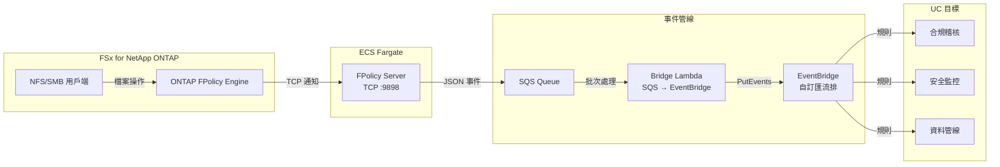

🌐 **Language / 言語**: [日本語](README.md) | [English](README.en.md) | [한국어](README.ko.md) | [简体中文](README.zh-CN.md) | 繁體中文 | [Français](README.fr.md) | [Deutsch](README.de.md) | [Español](README.es.md)

# 事件驅動 FPolicy — 檔案操作即時偵測模式

📚 **文件**: [架構圖](docs/architecture.zh-TW.md) | [示範指南](docs/demo-guide.zh-TW.md)

## 概述

在 ECS Fargate 上實作 ONTAP FPolicy External Server，將檔案操作事件即時傳遞到 AWS 服務（SQS → EventBridge）的無伺服器模式。

即時偵測透過 NFS/SMB 進行的檔案建立、寫入、刪除、重新命名操作，並透過 EventBridge 自訂匯流排路由到任意使用案例（合規稽核、安全監控、資料管線觸發等）。

### 適用情境

- 需要即時偵測檔案操作並立即執行動作
- 希望將 NFS/SMB 協定的檔案變更作為 AWS 事件處理
- 需要從單一事件來源路由到多個使用案例
- 希望以非阻塞方式非同步處理檔案操作
- 在無法使用 S3 事件通知的環境中需要事件驅動架構

### 不適用情境

- 需要事先阻止/拒絕檔案操作（需要同步模式）
- 定期批次掃描即可滿足需求（建議 S3 AP 輪詢模式）
- 僅使用 NFSv4.2 協定的環境（FPolicy 不支援）
- 無法建立到 ONTAP REST API 的網路連線

### 主要功能

| 功能 | 說明 |
|------|------|
| 多協定支援 | NFSv3/NFSv4.0/NFSv4.1/SMB |
| 非同步模式 | 不阻塞檔案操作（無延遲影響） |
| XML 解析 + 路徑正規化 | 將 ONTAP FPolicy XML 轉換為結構化 JSON |
| SVM/Volume 名稱自動解析 | 從 NEGO_REQ 交握中自動擷取 |
| EventBridge 路由 | 透過自訂匯流排按 UC 路由 |
| Fargate 任務 IP 自動更新 | ECS 任務重啟時自動更新 ONTAP engine IP |

## 架構

## 前提條件

- AWS 帳戶及適當的 IAM 權限
- FSx for NetApp ONTAP 檔案系統（ONTAP 9.17.1 以上）
- VPC、私有子網路（與 FSxN SVM 相同的 VPC）
- ONTAP 管理員憑證已註冊到 Secrets Manager
- ECR 儲存庫（用於 FPolicy Server 容器映像）
- VPC Endpoints（ECR、SQS、CloudWatch Logs、STS）

## 協定支援矩陣

| 協定 | FPolicy 支援 | 備註 |
|------|:-----------:|------|
| NFSv3 | ✅ | 需要 write-complete 等待（預設 5 秒） |
| NFSv4.0 | ✅ | 建議 |
| NFSv4.1 | ✅ | 建議（掛載時指定 `vers=4.1`） |
| NFSv4.2 | ❌ | ONTAP FPolicy monitoring 不支援 |
| SMB | ✅ | 作為 CIFS 協定偵測 |

## 驗證環境

| 項目 | 值 |
|------|-----|
| AWS 區域 | ap-northeast-1（東京） |
| FSx ONTAP 版本 | ONTAP 9.17.1P6 |
| Python | 3.12 |
| 部署方式 | CloudFormation（標準） |
