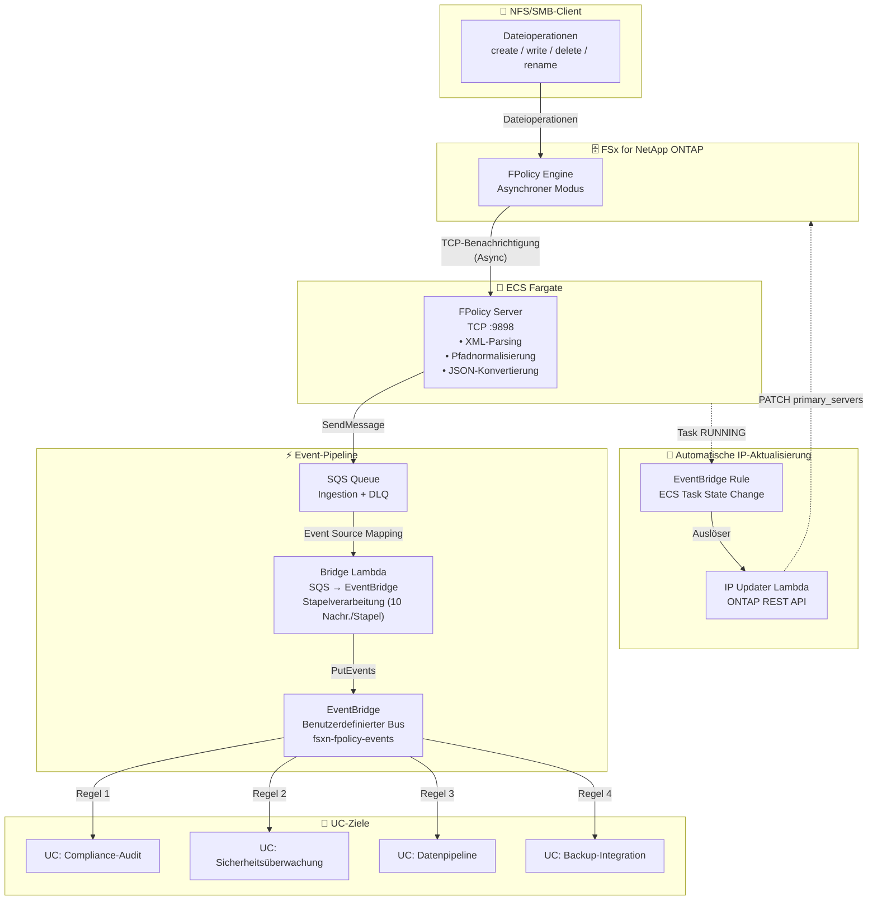

🌐 **Language / 言語**: [日本語](architecture.md) | [English](architecture.en.md) | [한국어](architecture.ko.md) | [简体中文](architecture.zh-CN.md) | [繁體中文](architecture.zh-TW.md) | [Français](architecture.fr.md) | Deutsch | [Español](architecture.es.md)

# Ereignisgesteuerte FPolicy — Architektur

## End-to-End-Architektur



## Komponentendetails

### 1. FPolicy Server (ECS Fargate)

| Element | Details |
|---------|---------|
| Laufzeitumgebung | ECS Fargate (ARM64, 0.25 vCPU / 512 MB) |
| Protokoll | TCP :9898 (ONTAP FPolicy Binary Framing) |
| Betriebsmodus | Asynchron — Keine Antwort für NOTI_REQ erforderlich |
| Hauptverarbeitung | XML-Parsing → Pfadnormalisierung → JSON-Konvertierung → SQS-Versand |
| Gesundheitsprüfung | NLB TCP Health Check (30-Sekunden-Intervall) |

**Wichtig**: ONTAP FPolicy funktioniert nicht über NLB TCP Passthrough (Binary-Framing-Inkompatibilität). Geben Sie die direkte Private IP der Fargate-Aufgabe für die ONTAP external-engine an.

### 2. SQS Ingestion Queue

| Element | Details |
|---------|---------|
| Nachrichtenaufbewahrung | 4 Tage (345.600 Sekunden) |
| Sichtbarkeits-Timeout | 300 Sekunden |
| DLQ | Nach maximal 3 Wiederholungen in DLQ verschoben |
| Verschlüsselung | SQS Managed SSE |

### 3. Bridge Lambda (SQS → EventBridge)

| Element | Details |
|---------|---------|
| Auslöser | SQS Event Source Mapping (Stapelgröße 10) |
| Verarbeitung | JSON-Parsing → EventBridge PutEvents |
| Fehlerbehandlung | ReportBatchItemFailures (Unterstützung für Teilausfälle) |
| Metriken | EventBridgeRoutingLatency (CloudWatch) |

### 4. Benutzerdefinierter EventBridge-Bus

| Element | Details |
|---------|---------|
| Busname | `fsxn-fpolicy-events` |
| Quelle | `fsxn.fpolicy` |
| DetailType | `FPolicy File Operation` |
| Routing | Zielspezifikation pro UC über EventBridge Rules |

### 5. IP Updater Lambda

| Element | Details |
|---------|---------|
| Auslöser | EventBridge Rule (ECS Task State Change → RUNNING) |
| Verarbeitung | 1. Policy deaktivieren → 2. Engine-IP aktualisieren → 3. Policy reaktivieren |
| Authentifizierung | ONTAP-Anmeldedaten aus Secrets Manager abrufen |
| VPC-Platzierung | Gleiches VPC wie FSxN SVM (für REST-API-Zugriff) |

## Datenfluss

### Ereignisnachrichtenformat

```json
{
  "event_id": "550e8400-e29b-41d4-a716-446655440000",
  "operation_type": "create",
  "file_path": "documents/report.pdf",
  "volume_name": "vol1",
  "svm_name": "FSxN_OnPre",
  "timestamp": "2026-01-15T10:30:00+00:00",
  "file_size": 0,
  "client_ip": "10.0.1.100"
}
```

### EventBridge-Ereignisformat

```json
{
  "source": "fsxn.fpolicy",
  "detail-type": "FPolicy File Operation",
  "detail": {
    "event_id": "550e8400-e29b-41d4-a716-446655440000",
    "operation_type": "create",
    "file_path": "documents/report.pdf",
    "volume_name": "vol1",
    "svm_name": "FSxN_OnPre",
    "timestamp": "2026-01-15T10:30:00+00:00",
    "file_size": 0,
    "client_ip": "10.0.1.100"
  }
}
```

## Sicherheitsüberlegungen

### Netzwerk

- FPolicy Server befindet sich in einem Private Subnet (kein öffentlicher Zugriff)
- Kommunikation zwischen ONTAP und FPolicy Server ist VPC-interner Verkehr (keine Verschlüsselung erforderlich)
- Zugriff auf AWS-Dienste erfolgt über VPC Endpoints (kein Internet-Transit)
- Security Group erlaubt TCP 9898 nur vom VPC CIDR (10.0.0.0/8)

### Authentifizierung und Autorisierung

- ONTAP-Admin-Anmeldedaten werden in Secrets Manager verwaltet
- ECS-Aufgabenrolle hat minimale Berechtigungen (nur SQS SendMessage + CloudWatch PutMetricData)
- IP Updater Lambda befindet sich im VPC + hat Secrets Manager-Zugriffsberechtigungen

### Datenschutz

- SQS-Nachrichten sind mit SSE verschlüsselt
- CloudWatch Logs werden nach 30 Tagen Aufbewahrung automatisch gelöscht
- DLQ-Nachrichten werden nach 14 Tagen automatisch gelöscht

## Mechanismus zur automatischen IP-Aktualisierung

Fargate-Aufgaben erhalten bei jedem Neustart eine neue Private IP. Da die ONTAP FPolicy external-engine eine feste IP referenziert, ist eine automatische IP-Aktualisierung erforderlich.

### Aktualisierungsablauf

1. ECS-Aufgabe wechselt in den RUNNING-Zustand
2. EventBridge Rule erkennt das ECS Task State Change-Ereignis
3. IP Updater Lambda wird ausgelöst
4. Lambda extrahiert die neue Aufgaben-IP aus dem ECS-Ereignis
5. Vorübergehende Deaktivierung der FPolicy Policy über ONTAP REST API
6. Aktualisierung der primary_servers der Engine über ONTAP REST API
7. Reaktivierung der FPolicy Policy über ONTAP REST API

### Unterschiede zur EC2-Version

In der EC2-Version (`template-ec2.yaml`) ist die Private IP fest, daher ist keine automatische IP-Aktualisierung erforderlich. Verwenden Sie die EC2-Version, wenn Kostenoptimierung oder eine feste IP benötigt wird.
