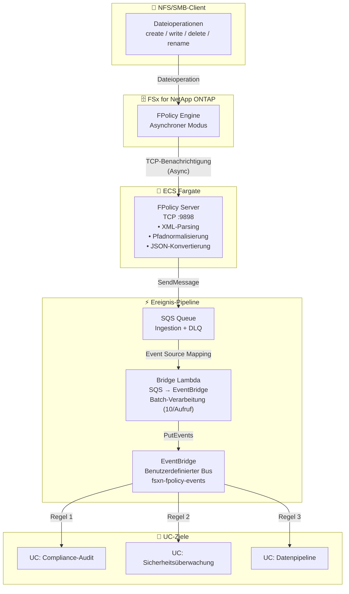

🌐 **Language / 言語**: [日本語](architecture.md) | [English](architecture.en.md) | [한국어](architecture.ko.md) | [简体中文](architecture.zh-CN.md) | [繁體中文](architecture.zh-TW.md) | [Français](architecture.fr.md) | Deutsch | [Español](architecture.es.md)

# Ereignisgesteuerte FPolicy — Architektur

## End-to-End-Architektur

## Komponentendetails

### 1. FPolicy Server (ECS Fargate)

| Element | Details |
|---------|---------|
| Laufzeitumgebung | ECS Fargate (ARM64, 0.25 vCPU / 512 MB) |
| Protokoll | TCP :9898 (ONTAP FPolicy Binär-Framing) |
| Modus | Asynchron — keine Antwort für NOTI_REQ erforderlich |
| Verarbeitung | XML-Parsing → Pfadnormalisierung → JSON-Konvertierung → SQS-Versand |

### 2. IP Updater Lambda

| Element | Details |
|---------|---------|
| Auslöser | EventBridge Rule (ECS Task State Change → RUNNING) |
| Verarbeitung | 1. Policy deaktivieren → 2. Engine-IP aktualisieren → 3. Policy reaktivieren |
| Authentifizierung | ONTAP-Anmeldedaten aus Secrets Manager abrufen |

## Sicherheitsüberlegungen

- FPolicy Server im privaten Subnetz bereitgestellt (kein öffentlicher Zugang)
- AWS-Dienstzugriff über VPC Endpoints (kein Internet-Transit)
- Security Group erlaubt TCP 9898 nur aus VPC CIDR (10.0.0.0/8)
- ONTAP-Administratoranmeldedaten über Secrets Manager verwaltet
