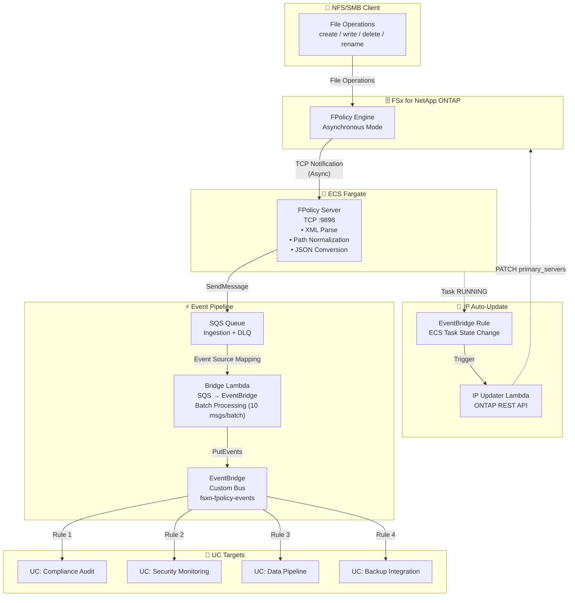

🌐 **Language / 言語**: [日本語](architecture.md) | English | [한국어](architecture.ko.md) | [简体中文](architecture.zh-CN.md) | [繁體中文](architecture.zh-TW.md) | [Français](architecture.fr.md) | [Deutsch](architecture.de.md) | [Español](architecture.es.md)

# Event-Driven FPolicy — Architecture

## End-to-End Architecture



## Component Details

### 1. FPolicy Server (ECS Fargate)

| Item | Details |
|------|---------|
| Runtime Environment | ECS Fargate (ARM64, 0.25 vCPU / 512 MB) |
| Protocol | TCP :9898 (ONTAP FPolicy Binary Framing) |
| Operation Mode | Asynchronous — No response required for NOTI_REQ |
| Main Processing | XML Parse → Path Normalization → JSON Conversion → SQS Send |
| Health Check | NLB TCP Health Check (30-second interval) |

**Important**: ONTAP FPolicy does not work through NLB TCP passthrough (binary framing incompatibility). Specify the Fargate task's direct Private IP for the ONTAP external-engine.

### 2. SQS Ingestion Queue

| Item | Details |
|------|---------|
| Message Retention | 4 days (345,600 seconds) |
| Visibility Timeout | 300 seconds |
| DLQ | Moved to DLQ after max 3 retries |
| Encryption | SQS Managed SSE |

### 3. Bridge Lambda (SQS → EventBridge)

| Item | Details |
|------|---------|
| Trigger | SQS Event Source Mapping (Batch Size 10) |
| Processing | JSON Parse → EventBridge PutEvents |
| Error Handling | ReportBatchItemFailures (Partial failure support) |
| Metrics | EventBridgeRoutingLatency (CloudWatch) |

### 4. EventBridge Custom Bus

| Item | Details |
|------|---------|
| Bus Name | `fsxn-fpolicy-events` |
| Source | `fsxn.fpolicy` |
| DetailType | `FPolicy File Operation` |
| Routing | Target specification per UC via EventBridge Rules |

### 5. IP Updater Lambda

| Item | Details |
|------|---------|
| Trigger | EventBridge Rule (ECS Task State Change → RUNNING) |
| Processing | 1. Disable Policy → 2. Update Engine IP → 3. Re-enable Policy |
| Authentication | Retrieve ONTAP credentials from Secrets Manager |
| VPC Placement | Same VPC as FSxN SVM (for REST API access) |

## Data Flow

### Event Message Format

```json
{
  "event_id": "550e8400-e29b-41d4-a716-446655440000",
  "operation_type": "create",
  "file_path": "documents/report.pdf",
  "volume_name": "vol1",
  "svm_name": "FSxN_OnPre",
  "timestamp": "2026-01-15T10:30:00+00:00",
  "file_size": 0,
  "client_ip": "10.0.1.100"
}
```

### EventBridge Event Format

```json
{
  "source": "fsxn.fpolicy",
  "detail-type": "FPolicy File Operation",
  "detail": {
    "event_id": "550e8400-e29b-41d4-a716-446655440000",
    "operation_type": "create",
    "file_path": "documents/report.pdf",
    "volume_name": "vol1",
    "svm_name": "FSxN_OnPre",
    "timestamp": "2026-01-15T10:30:00+00:00",
    "file_size": 0,
    "client_ip": "10.0.1.100"
  }
}
```

## Security Considerations

### Network

- FPolicy Server is placed in a Private Subnet (no public access)
- Communication between ONTAP and FPolicy Server is internal VPC traffic (no encryption needed)
- Access to AWS services is via VPC Endpoints (no internet transit)
- Security Group allows TCP 9898 only from VPC CIDR (10.0.0.0/8)

### Authentication & Authorization

- ONTAP admin credentials are managed in Secrets Manager
- ECS task role has least privilege (SQS SendMessage + CloudWatch PutMetricData only)
- IP Updater Lambda is placed in VPC + has Secrets Manager access permissions

### Data Protection

- SQS messages are encrypted with SSE
- CloudWatch Logs are automatically deleted after 30-day retention
- DLQ messages are automatically deleted after 14 days

## IP Auto-Update Mechanism

Fargate tasks are assigned a new Private IP each time they restart. Since the ONTAP FPolicy external-engine references a fixed IP, automatic IP updates are required.

### Update Flow

1. ECS task transitions to RUNNING state
2. EventBridge Rule detects the ECS Task State Change event
3. IP Updater Lambda is triggered
4. Lambda extracts the new task IP from the ECS event
5. Temporarily disables the FPolicy Policy via ONTAP REST API
6. Updates the Engine's primary_servers via ONTAP REST API
7. Re-enables the FPolicy Policy via ONTAP REST API

### Differences from EC2 Version

In the EC2 version (`template-ec2.yaml`), the Private IP is fixed, so IP auto-update is not needed. Use the EC2 version when cost optimization or a fixed IP is required.
