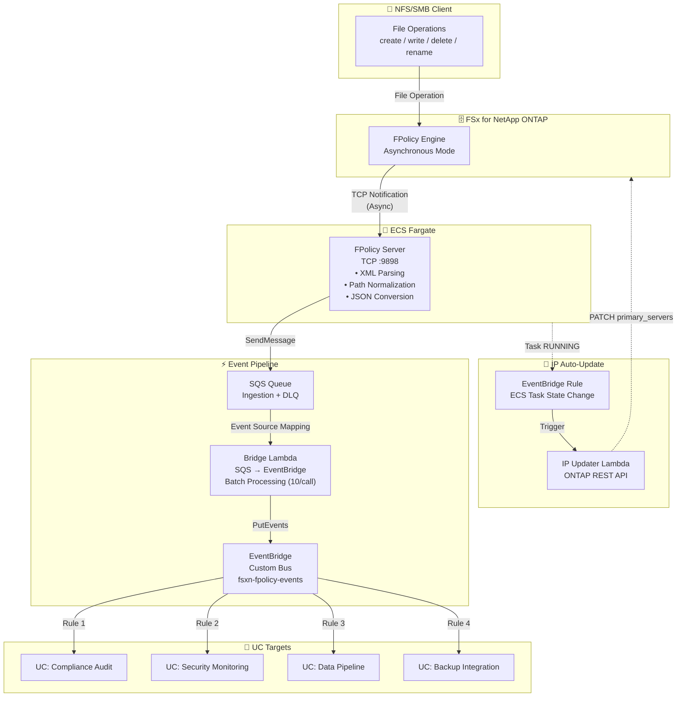

🌐 **Language / 言語**: [日本語](architecture.md) | English | [한국어](architecture.ko.md) | [简体中文](architecture.zh-CN.md) | [繁體中文](architecture.zh-TW.md) | [Français](architecture.fr.md) | [Deutsch](architecture.de.md) | [Español](architecture.es.md)

# Event-Driven FPolicy — Architecture

## End-to-End Architecture



## Component Details

### 1. FPolicy Server (ECS Fargate)

| Item | Details |
|------|---------|
| Runtime | ECS Fargate (ARM64, 0.25 vCPU / 512 MB) |
| Protocol | TCP :9898 (ONTAP FPolicy binary framing) |
| Mode | Asynchronous — no response needed for NOTI_REQ |
| Processing | XML parse → Path normalization → JSON conversion → SQS send |
| Health Check | NLB TCP health check (30s interval) |

**Important**: ONTAP FPolicy does not work through NLB TCP passthrough (binary framing incompatibility). Specify the Fargate task's direct Private IP in the ONTAP external-engine.

### 2. SQS Ingestion Queue

| Item | Details |
|------|---------|
| Message Retention | 4 days (345,600 seconds) |
| Visibility Timeout | 300 seconds |
| DLQ | Moves to DLQ after 3 retries |
| Encryption | SQS managed SSE |

### 3. Bridge Lambda (SQS → EventBridge)

| Item | Details |
|------|---------|
| Trigger | SQS Event Source Mapping (batch size 10) |
| Processing | JSON parse → EventBridge PutEvents |
| Error Handling | ReportBatchItemFailures (partial failure support) |
| Metrics | EventBridgeRoutingLatency (CloudWatch) |

### 4. EventBridge Custom Bus

| Item | Details |
|------|---------|
| Bus Name | `fsxn-fpolicy-events` |
| Source | `fsxn.fpolicy` |
| DetailType | `FPolicy File Operation` |
| Routing | EventBridge Rules specify targets per UC |

### 5. IP Updater Lambda

| Item | Details |
|------|---------|
| Trigger | EventBridge Rule (ECS Task State Change → RUNNING) |
| Processing | 1. Disable policy → 2. Update engine IP → 3. Re-enable policy |
| Auth | Retrieves ONTAP credentials from Secrets Manager |
| VPC Placement | Same VPC as FSxN SVM (for REST API access) |

## Data Flow

### Event Message Format

```json
{
  "event_id": "550e8400-e29b-41d4-a716-446655440000",
  "operation_type": "create",
  "file_path": "documents/report.pdf",
  "volume_name": "vol1",
  "svm_name": "FSxN_OnPre",
  "timestamp": "2026-01-15T10:30:00+00:00",
  "file_size": 0,
  "client_ip": "10.0.1.100"
}
```

## Security Considerations

### Network

- FPolicy Server placed in Private Subnet (no public access)
- ONTAP → FPolicy Server communication is VPC-internal
- AWS service access via VPC Endpoints (no internet transit)
- Security Group allows TCP 9898 only from VPC CIDR (10.0.0.0/8)

### Authentication & Authorization

- ONTAP admin credentials managed in Secrets Manager
- ECS task role has least privilege (SQS SendMessage + CloudWatch PutMetricData only)
- IP Updater Lambda placed in VPC + Secrets Manager access

### Data Protection

- SQS messages encrypted with SSE
- CloudWatch Logs auto-deleted after 30 days retention
- DLQ messages auto-deleted after 14 days

## IP Auto-Update Mechanism

Fargate tasks receive a new Private IP on every restart. Since ONTAP FPolicy external-engine references a fixed IP, automatic IP updates are required.

### Update Flow

1. ECS task transitions to RUNNING state
2. EventBridge Rule detects ECS Task State Change event
3. IP Updater Lambda is triggered
4. Lambda extracts new task IP from ECS event
5. ONTAP REST API: temporarily disable FPolicy Policy
6. ONTAP REST API: update Engine primary_servers
7. ONTAP REST API: re-enable FPolicy Policy

### Difference from EC2 Version

The EC2 version (`template-ec2.yaml`) has a fixed Private IP, so IP auto-update is unnecessary. Use the EC2 version when cost optimization or fixed IP is required.
