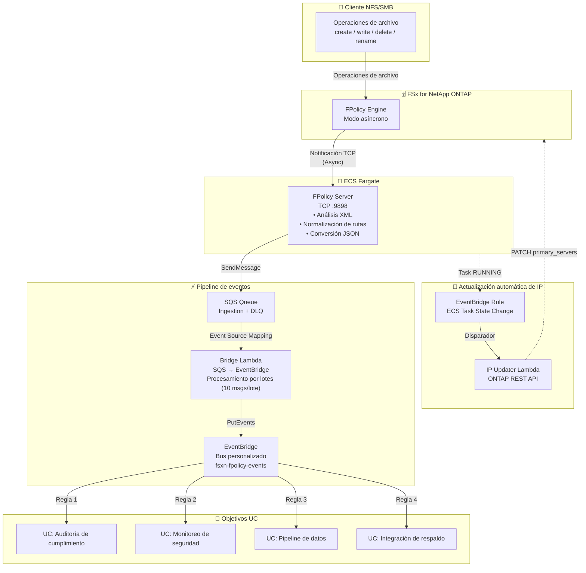

🌐 **Language / 言語**: [日本語](architecture.md) | [English](architecture.en.md) | [한국어](architecture.ko.md) | [简体中文](architecture.zh-CN.md) | [繁體中文](architecture.zh-TW.md) | [Français](architecture.fr.md) | [Deutsch](architecture.de.md) | Español

# FPolicy Basada en Eventos — Arquitectura

## Arquitectura End-to-End



## Detalles de componentes

### 1. FPolicy Server (ECS Fargate)

| Elemento | Detalles |
|----------|----------|
| Entorno de ejecución | ECS Fargate (ARM64, 0.25 vCPU / 512 MB) |
| Protocolo | TCP :9898 (ONTAP FPolicy Binary Framing) |
| Modo de operación | Asíncrono — No se requiere respuesta para NOTI_REQ |
| Procesamiento principal | Análisis XML → Normalización de rutas → Conversión JSON → Envío SQS |
| Verificación de salud | NLB TCP Health Check (intervalo de 30 segundos) |

**Importante**: ONTAP FPolicy no funciona a través del passthrough NLB TCP (incompatibilidad de enmarcado binario). Especifique la IP privada directa de la tarea Fargate para el ONTAP external-engine.

### 2. SQS Ingestion Queue

| Elemento | Detalles |
|----------|----------|
| Retención de mensajes | 4 días (345,600 segundos) |
| Tiempo de visibilidad | 300 segundos |
| DLQ | Movido a DLQ después de máximo 3 reintentos |
| Cifrado | SSE administrado por SQS |

### 3. Bridge Lambda (SQS → EventBridge)

| Elemento | Detalles |
|----------|----------|
| Disparador | SQS Event Source Mapping (tamaño de lote 10) |
| Procesamiento | Análisis JSON → EventBridge PutEvents |
| Manejo de errores | ReportBatchItemFailures (soporte de fallos parciales) |
| Métricas | EventBridgeRoutingLatency (CloudWatch) |

### 4. Bus personalizado EventBridge

| Elemento | Detalles |
|----------|----------|
| Nombre del bus | `fsxn-fpolicy-events` |
| Fuente | `fsxn.fpolicy` |
| DetailType | `FPolicy File Operation` |
| Enrutamiento | Especificación de destino por UC mediante EventBridge Rules |

### 5. IP Updater Lambda

| Elemento | Detalles |
|----------|----------|
| Disparador | EventBridge Rule (ECS Task State Change → RUNNING) |
| Procesamiento | 1. Deshabilitar Policy → 2. Actualizar IP del Engine → 3. Rehabilitar Policy |
| Autenticación | Obtener credenciales ONTAP desde Secrets Manager |
| Ubicación VPC | Mismo VPC que FSxN SVM (para acceso a REST API) |

## Flujo de datos

### Formato de mensaje de evento

```json
{
  "event_id": "550e8400-e29b-41d4-a716-446655440000",
  "operation_type": "create",
  "file_path": "documents/report.pdf",
  "volume_name": "vol1",
  "svm_name": "FSxN_OnPre",
  "timestamp": "2026-01-15T10:30:00+00:00",
  "file_size": 0,
  "client_ip": "10.0.1.100"
}
```

### Formato de evento EventBridge

```json
{
  "source": "fsxn.fpolicy",
  "detail-type": "FPolicy File Operation",
  "detail": {
    "event_id": "550e8400-e29b-41d4-a716-446655440000",
    "operation_type": "create",
    "file_path": "documents/report.pdf",
    "volume_name": "vol1",
    "svm_name": "FSxN_OnPre",
    "timestamp": "2026-01-15T10:30:00+00:00",
    "file_size": 0,
    "client_ip": "10.0.1.100"
  }
}
```

## Consideraciones de seguridad

### Red

- FPolicy Server está ubicado en un Private Subnet (sin acceso público)
- La comunicación entre ONTAP y FPolicy Server es tráfico interno del VPC (no requiere cifrado)
- El acceso a servicios AWS es a través de VPC Endpoints (sin tránsito por internet)
- Security Group permite TCP 9898 solo desde el CIDR del VPC (10.0.0.0/8)

### Autenticación y autorización

- Las credenciales de administrador ONTAP se gestionan en Secrets Manager
- El rol de tarea ECS tiene privilegios mínimos (solo SQS SendMessage + CloudWatch PutMetricData)
- IP Updater Lambda está ubicado en el VPC + tiene permisos de acceso a Secrets Manager

### Protección de datos

- Los mensajes SQS están cifrados con SSE
- Los CloudWatch Logs se eliminan automáticamente después de 30 días de retención
- Los mensajes DLQ se eliminan automáticamente después de 14 días

## Mecanismo de actualización automática de IP

Las tareas Fargate reciben una nueva IP privada cada vez que se reinician. Dado que el ONTAP FPolicy external-engine referencia una IP fija, se requiere la actualización automática de IP.

### Flujo de actualización

1. La tarea ECS transiciona al estado RUNNING
2. EventBridge Rule detecta el evento ECS Task State Change
3. IP Updater Lambda se activa
4. Lambda extrae la nueva IP de la tarea del evento ECS
5. Deshabilitación temporal de la FPolicy Policy mediante ONTAP REST API
6. Actualización de primary_servers del Engine mediante ONTAP REST API
7. Rehabilitación de la FPolicy Policy mediante ONTAP REST API

### Diferencias con la versión EC2

En la versión EC2 (`template-ec2.yaml`), la IP privada es fija, por lo que no se necesita la actualización automática de IP. Use la versión EC2 cuando se requiera optimización de costos o una IP fija.
