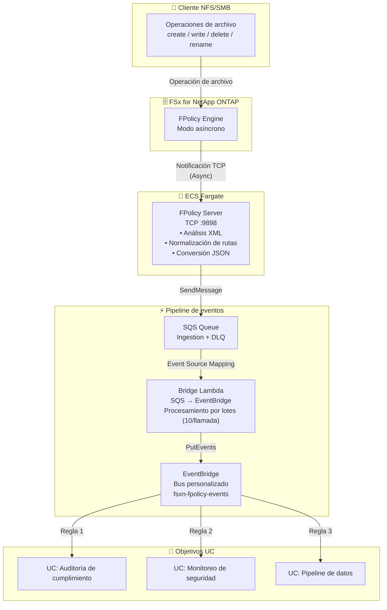

🌐 **Language / 言語**: [日本語](architecture.md) | [English](architecture.en.md) | [한국어](architecture.ko.md) | [简体中文](architecture.zh-CN.md) | [繁體中文](architecture.zh-TW.md) | [Français](architecture.fr.md) | [Deutsch](architecture.de.md) | Español

# FPolicy basado en eventos — Arquitectura

## Arquitectura de extremo a extremo

## Detalles de componentes

### 1. FPolicy Server (ECS Fargate)

| Elemento | Detalles |
|----------|----------|
| Entorno de ejecución | ECS Fargate (ARM64, 0.25 vCPU / 512 MB) |
| Protocolo | TCP :9898 (enmarcado binario ONTAP FPolicy) |
| Modo | Asíncrono — no se requiere respuesta para NOTI_REQ |
| Procesamiento | Análisis XML → Normalización de rutas → Conversión JSON → Envío SQS |

### 2. IP Updater Lambda

| Elemento | Detalles |
|----------|----------|
| Disparador | EventBridge Rule (ECS Task State Change → RUNNING) |
| Procesamiento | 1. Deshabilitar Policy → 2. Actualizar IP Engine → 3. Rehabilitar Policy |
| Autenticación | Obtener credenciales ONTAP de Secrets Manager |

## Consideraciones de seguridad

- FPolicy Server desplegado en subred privada (sin acceso público)
- Acceso a servicios AWS a través de VPC Endpoints (sin tránsito por internet)
- Security Group permite TCP 9898 solo desde CIDR VPC (10.0.0.0/8)
- Credenciales de administrador ONTAP gestionadas mediante Secrets Manager
