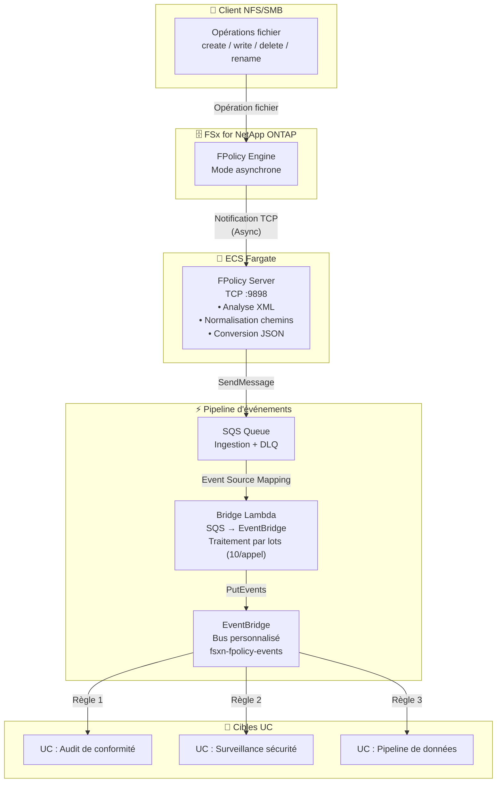

🌐 **Language / 言語**: [日本語](architecture.md) | [English](architecture.en.md) | [한국어](architecture.ko.md) | [简体中文](architecture.zh-CN.md) | [繁體中文](architecture.zh-TW.md) | Français | [Deutsch](architecture.de.md) | [Español](architecture.es.md)

# FPolicy événementiel — Architecture

## Architecture de bout en bout

## Détails des composants

### 1. FPolicy Server (ECS Fargate)

| Élément | Détails |
|---------|---------|
| Environnement | ECS Fargate (ARM64, 0.25 vCPU / 512 Mo) |
| Protocole | TCP :9898 (cadrage binaire ONTAP FPolicy) |
| Mode | Asynchrone — pas de réponse nécessaire pour NOTI_REQ |
| Traitement | Analyse XML → Normalisation → Conversion JSON → Envoi SQS |

### 2. IP Updater Lambda

| Élément | Détails |
|---------|---------|
| Déclencheur | EventBridge Rule (ECS Task State Change → RUNNING) |
| Traitement | 1. Désactiver Policy → 2. Mettre à jour IP Engine → 3. Réactiver Policy |
| Authentification | Récupération des identifiants ONTAP depuis Secrets Manager |

## Considérations de sécurité

- FPolicy Server déployé dans un sous-réseau privé (pas d'accès public)
- Accès aux services AWS via VPC Endpoints (pas de transit internet)
- Security Group autorise TCP 9898 uniquement depuis le CIDR VPC (10.0.0.0/8)
- Identifiants administrateur ONTAP gérés via Secrets Manager
