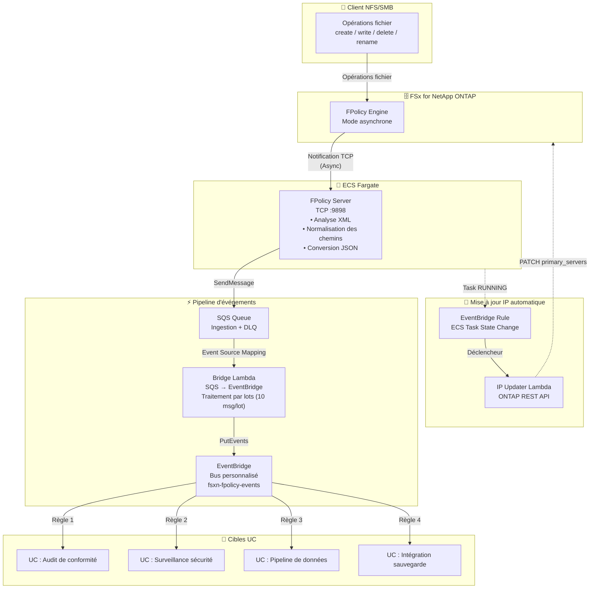

🌐 **Language / 言語**: [日本語](architecture.md) | [English](architecture.en.md) | [한국어](architecture.ko.md) | [简体中文](architecture.zh-CN.md) | [繁體中文](architecture.zh-TW.md) | Français | [Deutsch](architecture.de.md) | [Español](architecture.es.md)

# FPolicy Événementiel — Architecture

## Architecture End-to-End



## Détails des composants

### 1. FPolicy Server (ECS Fargate)

| Élément | Détails |
|---------|---------|
| Environnement d'exécution | ECS Fargate (ARM64, 0.25 vCPU / 512 MB) |
| Protocole | TCP :9898 (ONTAP FPolicy Binary Framing) |
| Mode de fonctionnement | Asynchrone — Pas de réponse requise pour NOTI_REQ |
| Traitement principal | Analyse XML → Normalisation des chemins → Conversion JSON → Envoi SQS |
| Vérification de santé | NLB TCP Health Check (intervalle de 30 secondes) |

**Important** : ONTAP FPolicy ne fonctionne pas via le passthrough NLB TCP (incompatibilité du cadrage binaire). Spécifiez l'IP privée directe de la tâche Fargate pour l'ONTAP external-engine.

### 2. SQS Ingestion Queue

| Élément | Détails |
|---------|---------|
| Rétention des messages | 4 jours (345 600 secondes) |
| Délai de visibilité | 300 secondes |
| DLQ | Déplacé vers DLQ après 3 tentatives maximum |
| Chiffrement | SSE géré par SQS |

### 3. Bridge Lambda (SQS → EventBridge)

| Élément | Détails |
|---------|---------|
| Déclencheur | SQS Event Source Mapping (taille de lot 10) |
| Traitement | Analyse JSON → EventBridge PutEvents |
| Gestion des erreurs | ReportBatchItemFailures (support des échecs partiels) |
| Métriques | EventBridgeRoutingLatency (CloudWatch) |

### 4. Bus personnalisé EventBridge

| Élément | Détails |
|---------|---------|
| Nom du bus | `fsxn-fpolicy-events` |
| Source | `fsxn.fpolicy` |
| DetailType | `FPolicy File Operation` |
| Routage | Spécification de cible par UC via EventBridge Rules |

### 5. IP Updater Lambda

| Élément | Détails |
|---------|---------|
| Déclencheur | EventBridge Rule (ECS Task State Change → RUNNING) |
| Traitement | 1. Désactiver Policy → 2. Mettre à jour IP Engine → 3. Réactiver Policy |
| Authentification | Récupération des identifiants ONTAP depuis Secrets Manager |
| Placement VPC | Même VPC que FSxN SVM (pour l'accès REST API) |

## Flux de données

### Format du message d'événement

```json
{
  "event_id": "550e8400-e29b-41d4-a716-446655440000",
  "operation_type": "create",
  "file_path": "documents/report.pdf",
  "volume_name": "vol1",
  "svm_name": "FSxN_OnPre",
  "timestamp": "2026-01-15T10:30:00+00:00",
  "file_size": 0,
  "client_ip": "10.0.1.100"
}
```

### Format d'événement EventBridge

```json
{
  "source": "fsxn.fpolicy",
  "detail-type": "FPolicy File Operation",
  "detail": {
    "event_id": "550e8400-e29b-41d4-a716-446655440000",
    "operation_type": "create",
    "file_path": "documents/report.pdf",
    "volume_name": "vol1",
    "svm_name": "FSxN_OnPre",
    "timestamp": "2026-01-15T10:30:00+00:00",
    "file_size": 0,
    "client_ip": "10.0.1.100"
  }
}
```

## Considérations de sécurité

### Réseau

- Le FPolicy Server est placé dans un Private Subnet (pas d'accès public)
- La communication entre ONTAP et FPolicy Server est interne au VPC (pas de chiffrement nécessaire)
- L'accès aux services AWS se fait via VPC Endpoints (pas de transit internet)
- Le Security Group autorise TCP 9898 uniquement depuis le CIDR VPC (10.0.0.0/8)

### Authentification et autorisation

- Les identifiants administrateur ONTAP sont gérés dans Secrets Manager
- Le rôle de tâche ECS a le minimum de privilèges (SQS SendMessage + CloudWatch PutMetricData uniquement)
- L'IP Updater Lambda est placé dans le VPC + dispose des permissions d'accès à Secrets Manager

### Protection des données

- Les messages SQS sont chiffrés avec SSE
- Les CloudWatch Logs sont automatiquement supprimés après une rétention de 30 jours
- Les messages DLQ sont automatiquement supprimés après 14 jours

## Mécanisme de mise à jour automatique de l'IP

Les tâches Fargate se voient attribuer une nouvelle IP privée à chaque redémarrage. Comme l'ONTAP FPolicy external-engine référence une IP fixe, la mise à jour automatique de l'IP est nécessaire.

### Flux de mise à jour

1. La tâche ECS passe à l'état RUNNING
2. L'EventBridge Rule détecte l'événement ECS Task State Change
3. L'IP Updater Lambda est déclenché
4. Lambda extrait la nouvelle IP de la tâche depuis l'événement ECS
5. Désactivation temporaire de la FPolicy Policy via l'API REST ONTAP
6. Mise à jour des primary_servers de l'Engine via l'API REST ONTAP
7. Réactivation de la FPolicy Policy via l'API REST ONTAP

### Différences avec la version EC2

Dans la version EC2 (`template-ec2.yaml`), l'IP privée est fixe, donc la mise à jour automatique de l'IP n'est pas nécessaire. Utilisez la version EC2 lorsque l'optimisation des coûts ou une IP fixe est requise.
