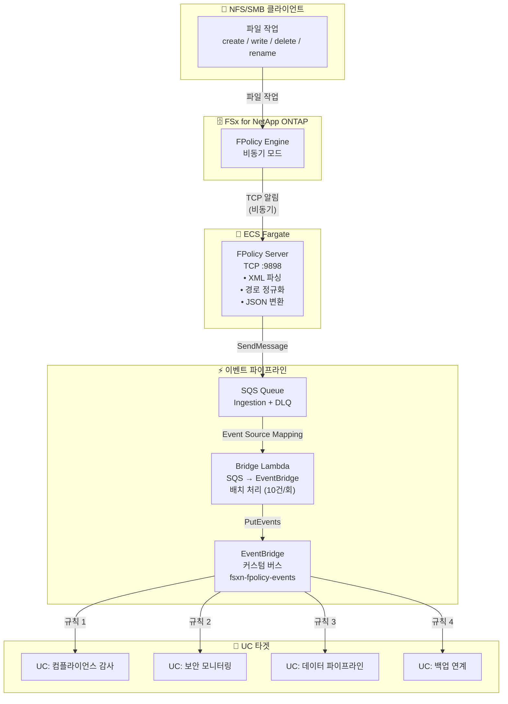

🌐 **Language / 言語**: [日本語](architecture.md) | [English](architecture.en.md) | 한국어 | [简体中文](architecture.zh-CN.md) | [繁體中文](architecture.zh-TW.md) | [Français](architecture.fr.md) | [Deutsch](architecture.de.md) | [Español](architecture.es.md)

# 이벤트 기반 FPolicy — 아키텍처

## End-to-End 아키텍처

## 컴포넌트 상세

### 1. FPolicy Server (ECS Fargate)

| 항목 | 상세 |
|------|------|
| 실행 환경 | ECS Fargate (ARM64, 0.25 vCPU / 512 MB) |
| 프로토콜 | TCP :9898 (ONTAP FPolicy 바이너리 프레이밍) |
| 동작 모드 | 비동기 — NOTI_REQ에 응답 불필요 |
| 주요 처리 | XML 파싱 → 경로 정규화 → JSON 변환 → SQS 전송 |

### 2. SQS Ingestion Queue

| 항목 | 상세 |
|------|------|
| 메시지 보존 | 4일 (345,600초) |
| 가시성 타임아웃 | 300초 |
| DLQ | 최대 3회 재시도 후 DLQ로 이동 |

### 3. Bridge Lambda (SQS → EventBridge)

| 항목 | 상세 |
|------|------|
| 트리거 | SQS Event Source Mapping (배치 크기 10) |
| 처리 | JSON 파싱 → EventBridge PutEvents |
| 에러 처리 | ReportBatchItemFailures (부분 실패 대응) |

### 4. IP Updater Lambda

| 항목 | 상세 |
|------|------|
| 트리거 | EventBridge Rule (ECS Task State Change → RUNNING) |
| 처리 | 1. Policy 비활성화 → 2. Engine IP 업데이트 → 3. Policy 재활성화 |
| 인증 | Secrets Manager에서 ONTAP 인증 정보 취득 |

## 보안 고려사항

- FPolicy Server는 Private Subnet에 배치 (퍼블릭 액세스 불가)
- AWS 서비스 액세스는 VPC Endpoints 경유 (인터넷 비경유)
- Security Group에서 TCP 9898을 VPC CIDR (10.0.0.0/8)에서만 허용
- ONTAP 관리자 인증 정보는 Secrets Manager로 관리
