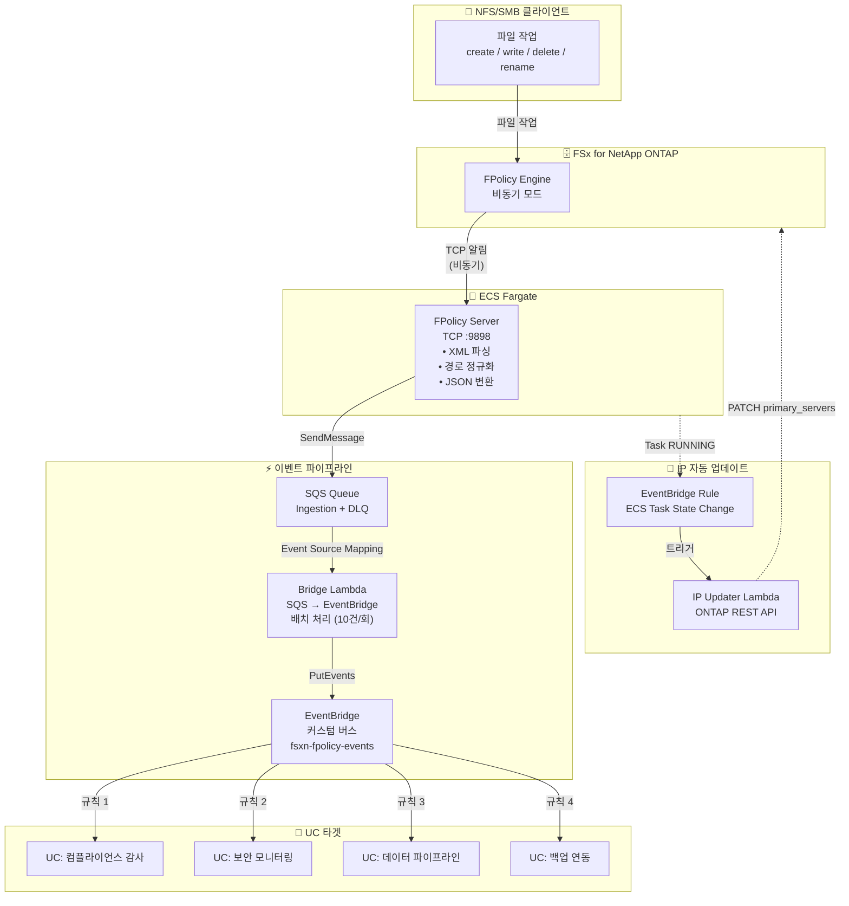

🌐 **Language / 言語**: [日本語](architecture.md) | [English](architecture.en.md) | 한국어 | [简体中文](architecture.zh-CN.md) | [繁體中文](architecture.zh-TW.md) | [Français](architecture.fr.md) | [Deutsch](architecture.de.md) | [Español](architecture.es.md)

# 이벤트 기반 FPolicy — 아키텍처

## End-to-End 아키텍처



## 컴포넌트 상세

### 1. FPolicy Server (ECS Fargate)

| 항목 | 상세 |
|------|------|
| 실행 환경 | ECS Fargate (ARM64, 0.25 vCPU / 512 MB) |
| 프로토콜 | TCP :9898 (ONTAP FPolicy 바이너리 프레이밍) |
| 동작 모드 | 비동기(asynchronous) — NOTI_REQ에 응답 불필요 |
| 주요 처리 | XML 파싱 → 경로 정규화 → JSON 변환 → SQS 전송 |
| 헬스 체크 | NLB TCP 헬스 체크 (30초 간격) |

**중요**: ONTAP FPolicy는 NLB TCP 패스스루를 통해 동작하지 않습니다(바이너리 프레이밍 비호환). ONTAP external-engine에는 Fargate 태스크의 직접 Private IP를 지정하세요.

### 2. SQS Ingestion Queue

| 항목 | 상세 |
|------|------|
| 메시지 보존 | 4일 (345,600초) |
| 가시성 타임아웃 | 300초 |
| DLQ | 최대 3회 재시도 후 DLQ로 이동 |
| 암호화 | SQS 관리형 SSE |

### 3. Bridge Lambda (SQS → EventBridge)

| 항목 | 상세 |
|------|------|
| 트리거 | SQS Event Source Mapping (배치 사이즈 10) |
| 처리 | JSON 파싱 → EventBridge PutEvents |
| 에러 처리 | ReportBatchItemFailures (부분 실패 대응) |
| 메트릭 | EventBridgeRoutingLatency (CloudWatch) |

### 4. EventBridge 커스텀 버스

| 항목 | 상세 |
|------|------|
| 버스 이름 | `fsxn-fpolicy-events` |
| 소스 | `fsxn.fpolicy` |
| DetailType | `FPolicy File Operation` |
| 라우팅 | EventBridge Rules로 UC별 타겟 지정 |

### 5. IP Updater Lambda

| 항목 | 상세 |
|------|------|
| 트리거 | EventBridge Rule (ECS Task State Change → RUNNING) |
| 처리 | 1. Policy 비활성화 → 2. Engine IP 업데이트 → 3. Policy 재활성화 |
| 인증 | Secrets Manager에서 ONTAP 인증 정보 취득 |
| VPC 배치 | FSxN SVM과 동일 VPC 내 (REST API 액세스용) |

## 데이터 플로우

### 이벤트 메시지 형식

```json
{
  "event_id": "550e8400-e29b-41d4-a716-446655440000",
  "operation_type": "create",
  "file_path": "documents/report.pdf",
  "volume_name": "vol1",
  "svm_name": "FSxN_OnPre",
  "timestamp": "2026-01-15T10:30:00+00:00",
  "file_size": 0,
  "client_ip": "10.0.1.100"
}
```

### EventBridge 이벤트 형식

```json
{
  "source": "fsxn.fpolicy",
  "detail-type": "FPolicy File Operation",
  "detail": {
    "event_id": "550e8400-e29b-41d4-a716-446655440000",
    "operation_type": "create",
    "file_path": "documents/report.pdf",
    "volume_name": "vol1",
    "svm_name": "FSxN_OnPre",
    "timestamp": "2026-01-15T10:30:00+00:00",
    "file_size": 0,
    "client_ip": "10.0.1.100"
  }
}
```

## 보안 고려사항

### 네트워크

- FPolicy Server는 Private Subnet에 배치 (퍼블릭 액세스 불가)
- ONTAP → FPolicy Server 간은 VPC 내부 통신 (암호화 불필요)
- AWS 서비스 액세스는 VPC Endpoints 경유 (인터넷 비경유)
- Security Group에서 TCP 9898을 VPC CIDR (10.0.0.0/8)에서만 허용

### 인증·인가

- ONTAP 관리자 인증 정보는 Secrets Manager로 관리
- ECS 태스크 역할은 최소 권한 (SQS SendMessage + CloudWatch PutMetricData만)
- IP Updater Lambda는 VPC 내 배치 + Secrets Manager 액세스 권한

### 데이터 보호

- SQS 메시지는 SSE로 암호화
- CloudWatch Logs는 보존 기간 30일로 자동 삭제
- DLQ 메시지는 14일로 자동 삭제

## IP 자동 업데이트 메커니즘

Fargate 태스크는 재시작할 때마다 새로운 Private IP가 할당됩니다. ONTAP FPolicy external-engine은 고정 IP를 참조하므로 IP 자동 업데이트가 필요합니다.

### 업데이트 플로우

1. ECS 태스크가 RUNNING 상태로 전환
2. EventBridge Rule이 ECS Task State Change 이벤트를 감지
3. IP Updater Lambda가 트리거됨
4. Lambda가 ECS 이벤트에서 새 태스크 IP를 추출
5. ONTAP REST API로 FPolicy Policy를 일시 비활성화
6. ONTAP REST API로 Engine의 primary_servers를 업데이트
7. ONTAP REST API로 FPolicy Policy를 재활성화

### EC2 버전과의 차이

EC2 버전(`template-ec2.yaml`)에서는 Private IP가 고정되므로 IP 자동 업데이트가 불필요합니다. 비용 최적화나 고정 IP가 필요한 경우 EC2 버전을 사용하세요.
