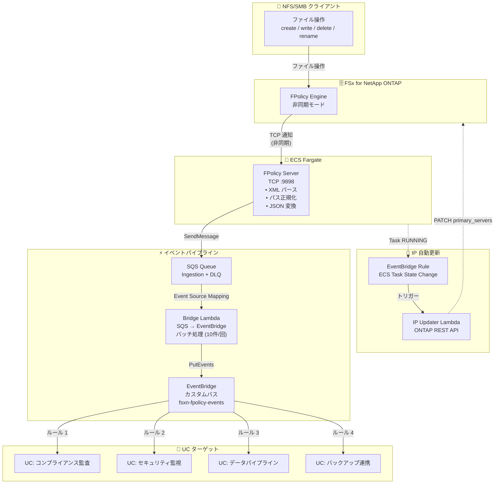

🌐 **Language / 言語**: 日本語 | [English](architecture.en.md) | [한국어](architecture.ko.md) | [简体中文](architecture.zh-CN.md) | [繁體中文](architecture.zh-TW.md) | [Français](architecture.fr.md) | [Deutsch](architecture.de.md) | [Español](architecture.es.md)

# イベント駆動 FPolicy — アーキテクチャ

## End-to-End アーキテクチャ



## コンポーネント詳細

### 1. FPolicy Server (ECS Fargate)

| 項目 | 詳細 |
|------|------|
| 実行環境 | ECS Fargate (ARM64, 0.25 vCPU / 512 MB) |
| プロトコル | TCP :9898 (ONTAP FPolicy バイナリフレーミング) |
| 動作モード | 非同期（asynchronous）— NOTI_REQ にレスポンス不要 |
| 主な処理 | XML パース → パス正規化 → JSON 変換 → SQS 送信 |
| ヘルスチェック | NLB TCP ヘルスチェック (30秒間隔) |

**重要**: ONTAP FPolicy は NLB TCP パススルー経由では動作しません（バイナリフレーミング非互換）。ONTAP external-engine には Fargate タスクの直接 Private IP を指定してください。

### 2. SQS Ingestion Queue

| 項目 | 詳細 |
|------|------|
| メッセージ保持 | 4 日 (345,600 秒) |
| 可視性タイムアウト | 300 秒 |
| DLQ | 最大 3 回リトライ後に DLQ へ移動 |
| 暗号化 | SQS マネージド SSE |

### 3. Bridge Lambda (SQS → EventBridge)

| 項目 | 詳細 |
|------|------|
| トリガー | SQS Event Source Mapping (バッチサイズ 10) |
| 処理 | JSON パース → EventBridge PutEvents |
| エラー処理 | ReportBatchItemFailures（部分失敗対応） |
| メトリクス | EventBridgeRoutingLatency (CloudWatch) |

### 4. EventBridge カスタムバス

| 項目 | 詳細 |
|------|------|
| バス名 | `fsxn-fpolicy-events` |
| ソース | `fsxn.fpolicy` |
| DetailType | `FPolicy File Operation` |
| ルーティング | EventBridge Rules で UC 別にターゲット指定 |

### 5. IP Updater Lambda

| 項目 | 詳細 |
|------|------|
| トリガー | EventBridge Rule (ECS Task State Change → RUNNING) |
| 処理 | 1. Policy 無効化 → 2. Engine IP 更新 → 3. Policy 再有効化 |
| 認証 | Secrets Manager から ONTAP 認証情報取得 |
| VPC 配置 | FSxN SVM と同一 VPC 内（REST API アクセス用） |

## データフロー

### イベントメッセージ形式

```json
{
  "event_id": "550e8400-e29b-41d4-a716-446655440000",
  "operation_type": "create",
  "file_path": "documents/report.pdf",
  "volume_name": "vol1",
  "svm_name": "FSxN_OnPre",
  "timestamp": "2026-01-15T10:30:00+00:00",
  "file_size": 0,
  "client_ip": "10.0.1.100"
}
```

### EventBridge イベント形式

```json
{
  "source": "fsxn.fpolicy",
  "detail-type": "FPolicy File Operation",
  "detail": {
    "event_id": "550e8400-e29b-41d4-a716-446655440000",
    "operation_type": "create",
    "file_path": "documents/report.pdf",
    "volume_name": "vol1",
    "svm_name": "FSxN_OnPre",
    "timestamp": "2026-01-15T10:30:00+00:00",
    "file_size": 0,
    "client_ip": "10.0.1.100"
  }
}
```

## セキュリティ考慮事項

### ネットワーク

- FPolicy Server は Private Subnet に配置（パブリックアクセス不可）
- ONTAP → FPolicy Server 間は VPC 内部通信（暗号化不要）
- AWS サービスへのアクセスは VPC Endpoints 経由（インターネット非経由）
- Security Group で TCP 9898 を VPC CIDR (10.0.0.0/8) からのみ許可

### 認証・認可

- ONTAP 管理者認証情報は Secrets Manager で管理
- ECS タスクロールは最小権限（SQS SendMessage + CloudWatch PutMetricData のみ）
- IP Updater Lambda は VPC 内配置 + Secrets Manager アクセス権限

### データ保護

- SQS メッセージは SSE で暗号化
- CloudWatch Logs は保持期間 30 日で自動削除
- DLQ メッセージは 14 日で自動削除

## IP 自動更新メカニズム

Fargate タスクは再起動のたびに新しい Private IP が割り当てられます。ONTAP FPolicy external-engine は固定 IP を参照するため、IP 自動更新が必要です。

### 更新フロー

1. ECS タスクが RUNNING 状態に遷移
2. EventBridge Rule が ECS Task State Change イベントを検知
3. IP Updater Lambda がトリガーされる
4. Lambda が新しいタスク IP を ECS イベントから抽出
5. ONTAP REST API で FPolicy Policy を一時無効化
6. ONTAP REST API で Engine の primary_servers を更新
7. ONTAP REST API で FPolicy Policy を再有効化

### EC2 版との違い

EC2 版（`template-ec2.yaml`）では Private IP が固定されるため、IP 自動更新は不要です。コスト最適化や固定 IP が必要な場合は EC2 版を使用してください。
