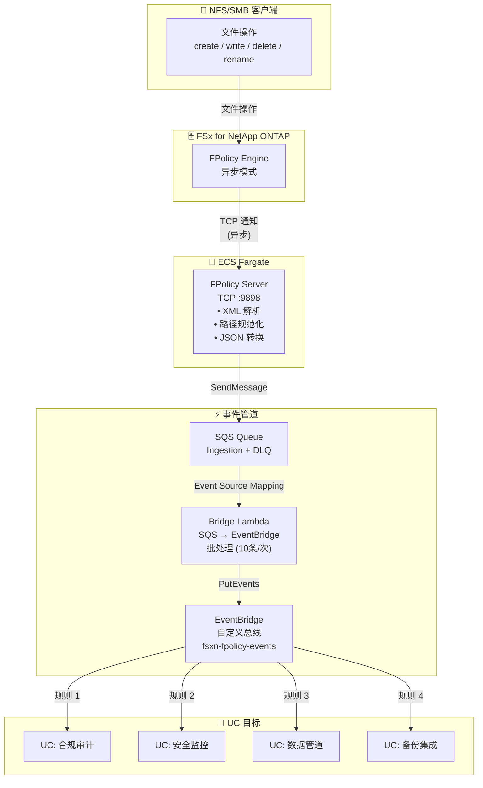

🌐 **Language / 言語**: [日本語](architecture.md) | [English](architecture.en.md) | [한국어](architecture.ko.md) | 简体中文 | [繁體中文](architecture.zh-TW.md) | [Français](architecture.fr.md) | [Deutsch](architecture.de.md) | [Español](architecture.es.md)

# 事件驱动 FPolicy — 架构

## 端到端架构

## 组件详情

### 1. FPolicy Server (ECS Fargate)

| 项目 | 详情 |
|------|------|
| 运行环境 | ECS Fargate (ARM64, 0.25 vCPU / 512 MB) |
| 协议 | TCP :9898 (ONTAP FPolicy 二进制帧) |
| 工作模式 | 异步 — NOTI_REQ 无需响应 |
| 主要处理 | XML 解析 → 路径规范化 → JSON 转换 → SQS 发送 |

### 2. SQS Ingestion Queue

| 项目 | 详情 |
|------|------|
| 消息保留 | 4天 (345,600秒) |
| 可见性超时 | 300秒 |
| DLQ | 最多重试3次后移至DLQ |

### 3. Bridge Lambda (SQS → EventBridge)

| 项目 | 详情 |
|------|------|
| 触发器 | SQS Event Source Mapping (批大小 10) |
| 处理 | JSON 解析 → EventBridge PutEvents |
| 错误处理 | ReportBatchItemFailures (部分失败支持) |

### 4. IP Updater Lambda

| 项目 | 详情 |
|------|------|
| 触发器 | EventBridge Rule (ECS Task State Change → RUNNING) |
| 处理 | 1. 禁用 Policy → 2. 更新 Engine IP → 3. 重新启用 Policy |
| 认证 | 从 Secrets Manager 获取 ONTAP 凭证 |

## 安全考虑

- FPolicy Server 部署在 Private Subnet（无公网访问）
- AWS 服务访问通过 VPC Endpoints（不经过互联网）
- Security Group 仅允许来自 VPC CIDR (10.0.0.0/8) 的 TCP 9898
- ONTAP 管理员凭证通过 Secrets Manager 管理
