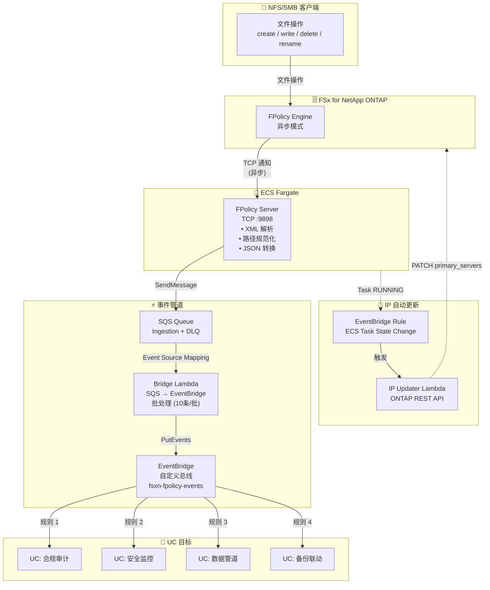

🌐 **Language / 言語**: [日本語](architecture.md) | [English](architecture.en.md) | [한국어](architecture.ko.md) | 简体中文 | [繁體中文](architecture.zh-TW.md) | [Français](architecture.fr.md) | [Deutsch](architecture.de.md) | [Español](architecture.es.md)

# 事件驱动 FPolicy — 架构

## End-to-End 架构



## 组件详情

### 1. FPolicy Server (ECS Fargate)

| 项目 | 详情 |
|------|------|
| 运行环境 | ECS Fargate (ARM64, 0.25 vCPU / 512 MB) |
| 协议 | TCP :9898 (ONTAP FPolicy 二进制帧) |
| 运行模式 | 异步（asynchronous）— NOTI_REQ 无需响应 |
| 主要处理 | XML 解析 → 路径规范化 → JSON 转换 → SQS 发送 |
| 健康检查 | NLB TCP 健康检查 (30秒间隔) |

**重要**: ONTAP FPolicy 无法通过 NLB TCP 直通工作（二进制帧不兼容）。请为 ONTAP external-engine 指定 Fargate 任务的直接 Private IP。

### 2. SQS Ingestion Queue

| 项目 | 详情 |
|------|------|
| 消息保留 | 4 天 (345,600 秒) |
| 可见性超时 | 300 秒 |
| DLQ | 最多重试 3 次后移至 DLQ |
| 加密 | SQS 托管 SSE |

### 3. Bridge Lambda (SQS → EventBridge)

| 项目 | 详情 |
|------|------|
| 触发器 | SQS Event Source Mapping (批大小 10) |
| 处理 | JSON 解析 → EventBridge PutEvents |
| 错误处理 | ReportBatchItemFailures（部分失败处理） |
| 指标 | EventBridgeRoutingLatency (CloudWatch) |

### 4. EventBridge 自定义总线

| 项目 | 详情 |
|------|------|
| 总线名称 | `fsxn-fpolicy-events` |
| 来源 | `fsxn.fpolicy` |
| DetailType | `FPolicy File Operation` |
| 路由 | 通过 EventBridge Rules 按 UC 指定目标 |

### 5. IP Updater Lambda

| 项目 | 详情 |
|------|------|
| 触发器 | EventBridge Rule (ECS Task State Change → RUNNING) |
| 处理 | 1. 禁用 Policy → 2. 更新 Engine IP → 3. 重新启用 Policy |
| 认证 | 从 Secrets Manager 获取 ONTAP 认证信息 |
| VPC 部署 | 与 FSxN SVM 相同 VPC 内（用于 REST API 访问） |

## 数据流

### 事件消息格式

```json
{
  "event_id": "550e8400-e29b-41d4-a716-446655440000",
  "operation_type": "create",
  "file_path": "documents/report.pdf",
  "volume_name": "vol1",
  "svm_name": "FSxN_OnPre",
  "timestamp": "2026-01-15T10:30:00+00:00",
  "file_size": 0,
  "client_ip": "10.0.1.100"
}
```

### EventBridge 事件格式

```json
{
  "source": "fsxn.fpolicy",
  "detail-type": "FPolicy File Operation",
  "detail": {
    "event_id": "550e8400-e29b-41d4-a716-446655440000",
    "operation_type": "create",
    "file_path": "documents/report.pdf",
    "volume_name": "vol1",
    "svm_name": "FSxN_OnPre",
    "timestamp": "2026-01-15T10:30:00+00:00",
    "file_size": 0,
    "client_ip": "10.0.1.100"
  }
}
```

## 安全考虑事项

### 网络

- FPolicy Server 部署在 Private Subnet（无公共访问）
- ONTAP → FPolicy Server 之间为 VPC 内部通信（无需加密）
- 对 AWS 服务的访问通过 VPC Endpoints（不经过互联网）
- Security Group 仅允许来自 VPC CIDR (10.0.0.0/8) 的 TCP 9898

### 认证与授权

- ONTAP 管理员认证信息由 Secrets Manager 管理
- ECS 任务角色为最小权限（仅 SQS SendMessage + CloudWatch PutMetricData）
- IP Updater Lambda 部署在 VPC 内 + 具有 Secrets Manager 访问权限

### 数据保护

- SQS 消息使用 SSE 加密
- CloudWatch Logs 保留期 30 天后自动删除
- DLQ 消息 14 天后自动删除

## IP 自动更新机制

Fargate 任务每次重启都会分配新的 Private IP。由于 ONTAP FPolicy external-engine 引用固定 IP，因此需要 IP 自动更新。

### 更新流程

1. ECS 任务转换为 RUNNING 状态
2. EventBridge Rule 检测到 ECS Task State Change 事件
3. IP Updater Lambda 被触发
4. Lambda 从 ECS 事件中提取新的任务 IP
5. 通过 ONTAP REST API 临时禁用 FPolicy Policy
6. 通过 ONTAP REST API 更新 Engine 的 primary_servers
7. 通过 ONTAP REST API 重新启用 FPolicy Policy

### 与 EC2 版本的区别

EC2 版本（`template-ec2.yaml`）中 Private IP 是固定的，因此不需要 IP 自动更新。当需要成本优化或固定 IP 时，请使用 EC2 版本。
