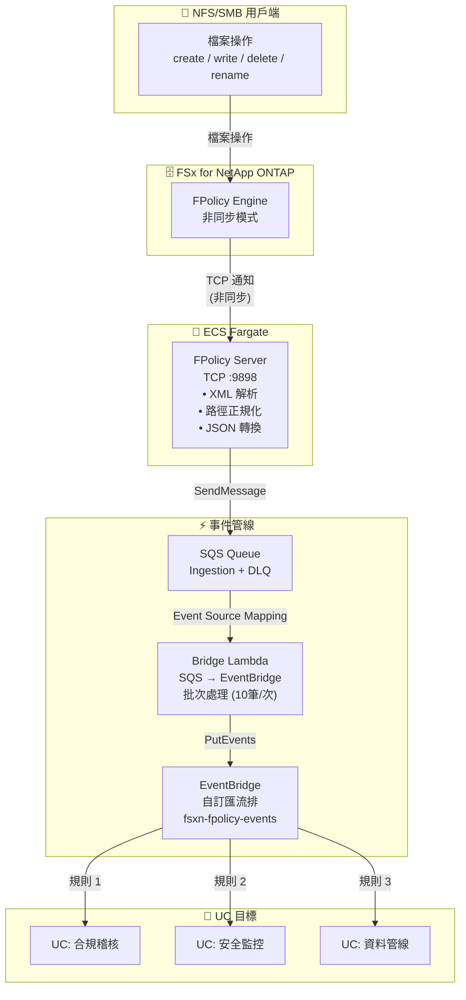

🌐 **Language / 言語**: [日本語](architecture.md) | [English](architecture.en.md) | [한국어](architecture.ko.md) | [简体中文](architecture.zh-CN.md) | 繁體中文 | [Français](architecture.fr.md) | [Deutsch](architecture.de.md) | [Español](architecture.es.md)

# 事件驅動 FPolicy — 架構

## 端到端架構

## 元件詳情

### 1. FPolicy Server (ECS Fargate)

| 項目 | 詳情 |
|------|------|
| 執行環境 | ECS Fargate (ARM64, 0.25 vCPU / 512 MB) |
| 協定 | TCP :9898 (ONTAP FPolicy 二進位框架) |
| 工作模式 | 非同步 — NOTI_REQ 無需回應 |
| 主要處理 | XML 解析 → 路徑正規化 → JSON 轉換 → SQS 傳送 |

### 2. IP Updater Lambda

| 項目 | 詳情 |
|------|------|
| 觸發器 | EventBridge Rule (ECS Task State Change → RUNNING) |
| 處理 | 1. 停用 Policy → 2. 更新 Engine IP → 3. 重新啟用 Policy |
| 認證 | 從 Secrets Manager 取得 ONTAP 憑證 |

## 安全考量

- FPolicy Server 部署在 Private Subnet（無公網存取）
- AWS 服務存取透過 VPC Endpoints（不經過網際網路）
- Security Group 僅允許來自 VPC CIDR (10.0.0.0/8) 的 TCP 9898
- ONTAP 管理員憑證透過 Secrets Manager 管理
