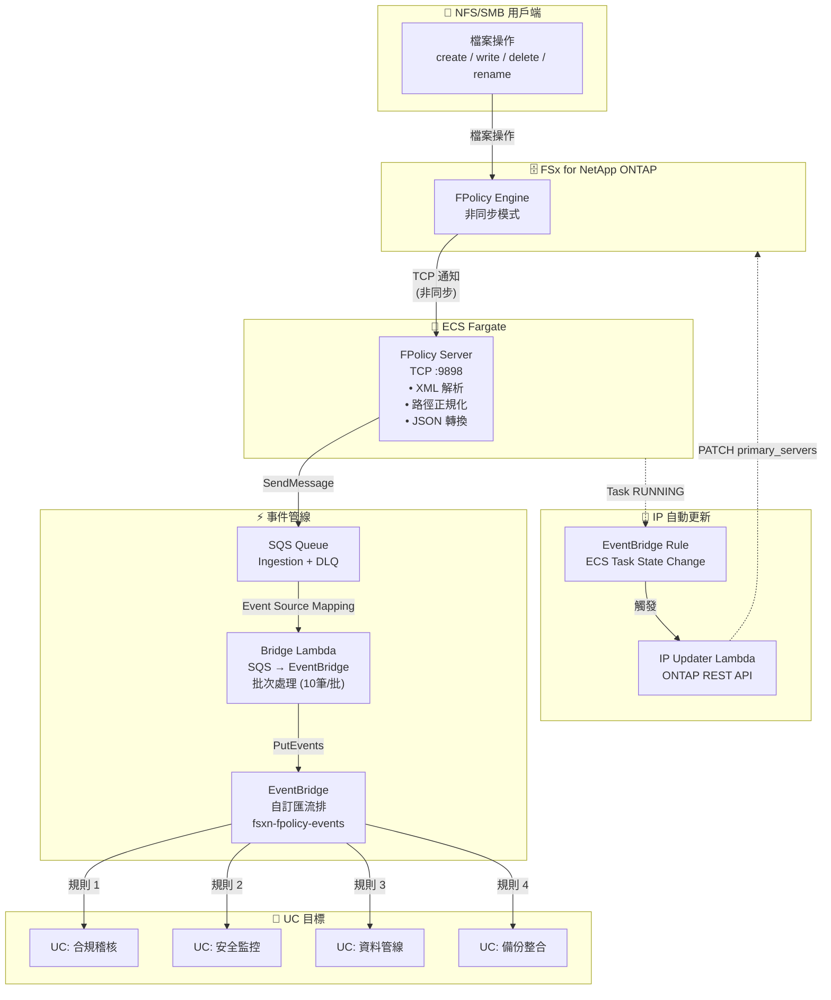

🌐 **Language / 言語**: [日本語](architecture.md) | [English](architecture.en.md) | [한국어](architecture.ko.md) | [简体中文](architecture.zh-CN.md) | 繁體中文 | [Français](architecture.fr.md) | [Deutsch](architecture.de.md) | [Español](architecture.es.md)

# 事件驅動 FPolicy — 架構

## End-to-End 架構



## 元件詳情

### 1. FPolicy Server (ECS Fargate)

| 項目 | 詳情 |
|------|------|
| 執行環境 | ECS Fargate (ARM64, 0.25 vCPU / 512 MB) |
| 協定 | TCP :9898 (ONTAP FPolicy 二進位框架) |
| 運作模式 | 非同步（asynchronous）— NOTI_REQ 無需回應 |
| 主要處理 | XML 解析 → 路徑正規化 → JSON 轉換 → SQS 傳送 |
| 健康檢查 | NLB TCP 健康檢查 (30秒間隔) |

**重要**: ONTAP FPolicy 無法透過 NLB TCP 直通運作（二進位框架不相容）。請為 ONTAP external-engine 指定 Fargate 任務的直接 Private IP。

### 2. SQS Ingestion Queue

| 項目 | 詳情 |
|------|------|
| 訊息保留 | 4 天 (345,600 秒) |
| 可見性逾時 | 300 秒 |
| DLQ | 最多重試 3 次後移至 DLQ |
| 加密 | SQS 受管 SSE |

### 3. Bridge Lambda (SQS → EventBridge)

| 項目 | 詳情 |
|------|------|
| 觸發器 | SQS Event Source Mapping (批次大小 10) |
| 處理 | JSON 解析 → EventBridge PutEvents |
| 錯誤處理 | ReportBatchItemFailures（部分失敗處理） |
| 指標 | EventBridgeRoutingLatency (CloudWatch) |

### 4. EventBridge 自訂匯流排

| 項目 | 詳情 |
|------|------|
| 匯流排名稱 | `fsxn-fpolicy-events` |
| 來源 | `fsxn.fpolicy` |
| DetailType | `FPolicy File Operation` |
| 路由 | 透過 EventBridge Rules 按 UC 指定目標 |

### 5. IP Updater Lambda

| 項目 | 詳情 |
|------|------|
| 觸發器 | EventBridge Rule (ECS Task State Change → RUNNING) |
| 處理 | 1. 停用 Policy → 2. 更新 Engine IP → 3. 重新啟用 Policy |
| 驗證 | 從 Secrets Manager 取得 ONTAP 驗證資訊 |
| VPC 部署 | 與 FSxN SVM 相同 VPC 內（用於 REST API 存取） |

## 資料流

### 事件訊息格式

```json
{
  "event_id": "550e8400-e29b-41d4-a716-446655440000",
  "operation_type": "create",
  "file_path": "documents/report.pdf",
  "volume_name": "vol1",
  "svm_name": "FSxN_OnPre",
  "timestamp": "2026-01-15T10:30:00+00:00",
  "file_size": 0,
  "client_ip": "10.0.1.100"
}
```

### EventBridge 事件格式

```json
{
  "source": "fsxn.fpolicy",
  "detail-type": "FPolicy File Operation",
  "detail": {
    "event_id": "550e8400-e29b-41d4-a716-446655440000",
    "operation_type": "create",
    "file_path": "documents/report.pdf",
    "volume_name": "vol1",
    "svm_name": "FSxN_OnPre",
    "timestamp": "2026-01-15T10:30:00+00:00",
    "file_size": 0,
    "client_ip": "10.0.1.100"
  }
}
```

## 安全考量事項

### 網路

- FPolicy Server 部署在 Private Subnet（無公開存取）
- ONTAP → FPolicy Server 之間為 VPC 內部通訊（無需加密）
- 對 AWS 服務的存取透過 VPC Endpoints（不經過網際網路）
- Security Group 僅允許來自 VPC CIDR (10.0.0.0/8) 的 TCP 9898

### 驗證與授權

- ONTAP 管理員驗證資訊由 Secrets Manager 管理
- ECS 任務角色為最小權限（僅 SQS SendMessage + CloudWatch PutMetricData）
- IP Updater Lambda 部署在 VPC 內 + 具有 Secrets Manager 存取權限

### 資料保護

- SQS 訊息使用 SSE 加密
- CloudWatch Logs 保留期 30 天後自動刪除
- DLQ 訊息 14 天後自動刪除

## IP 自動更新機制

Fargate 任務每次重新啟動都會分配新的 Private IP。由於 ONTAP FPolicy external-engine 參照固定 IP，因此需要 IP 自動更新。

### 更新流程

1. ECS 任務轉換為 RUNNING 狀態
2. EventBridge Rule 偵測到 ECS Task State Change 事件
3. IP Updater Lambda 被觸發
4. Lambda 從 ECS 事件中擷取新的任務 IP
5. 透過 ONTAP REST API 暫時停用 FPolicy Policy
6. 透過 ONTAP REST API 更新 Engine 的 primary_servers
7. 透過 ONTAP REST API 重新啟用 FPolicy Policy

### 與 EC2 版本的差異

EC2 版本（`template-ec2.yaml`）中 Private IP 是固定的，因此不需要 IP 自動更新。當需要成本最佳化或固定 IP 時，請使用 EC2 版本。
