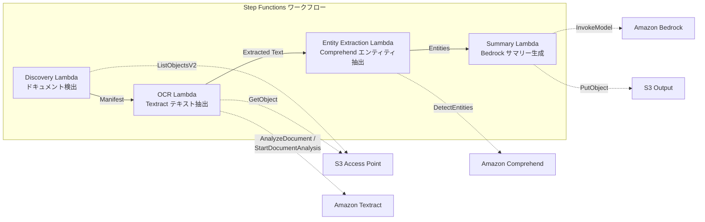

# USE CASE 2: Finanz- und Versicherungsbranche - Automatische Verarbeitung von Verträgen und Rechnungen (IDP)

🌐 **Language / 言語**: [日本語](README.md) | [English](README.en.md) | [한국어](README.ko.md) | [简体中文](README.zh-CN.md) | [繁體中文](README.zh-TW.md) | [Français](README.fr.md) | Deutsch | [Español](README.es.md)

## Zusammenfassung

In dieser Anleitung erfahren Sie, wie Sie eine komplexe serverlose Architektur mit mehreren AWS-Diensten erstellen. Die Architektur umfasst die folgenden Komponenten:

- Amazon Bedrock zur Erstellung von Chip-Designs
- AWS Step Functions zum Orchestrieren des Workflow
- Amazon Athena zum Abfragen von Daten in Amazon S3
- AWS Lambda-Funktionen zur Ausführung benutzerdefinierter Logik
- Amazon FSx for NetApp ONTAP zum Speichern von Designdateien
- Amazon CloudWatch zum Überwachen und Alarmieren
- AWS CloudFormation zum Bereitstellen der Infrastruktur

Durch die Verwendung dieser AWS-Dienste können Sie einen vollständigen Designlebenszyklus vom Entwurf bis zur Übergabe (tapeout) verwalten.
FSx für NetApp ONTAP S3-Zugangspunkte ermöglichen eine serverlose Workflow-Lösung zum automatischen OCR-Verarbeiten, Extrahieren von Entitäten und Zusammenfassen von Dokumenten wie Verträgen und Rechnungen.
### Diese Muster eignen sich am besten für folgende Fälle:
- Ich möchte PDF/TIFF/JPEG-Dokumente auf meinem Dateiserver regelmäßig im Batch-Verfahren mittels OCR verarbeiten.
- Ich möchte den bestehenden NAS-Workflow (Scanner → Speicherung auf Dateiserver) ohne Änderungen um die KI-Verarbeitung erweitern.
- Ich möchte aus Verträgen und Rechnungen automatisch Datum, Betrag und Unternehmensnamen extrahieren und als strukturierte Daten nutzen.
- Ich möchte die IDP-Pipeline mit Textract + Comprehend + Bedrock zu minimalen Kosten testen.
### Fälle, in denen dieses Muster nicht geeignet ist
- Echtzeitverarbeitung direkt nach dem Hochladen von Dokumenten ist erforderlich.
- Verarbeitung von zehntausenden Dokumenten pro Tag (beachten Sie die API-Drosselung von Amazon Textract).
- Die latenzempfindliche plattformübergreifende Aufrufbarkeit ist in Regionen, in denen Amazon Textract nicht verfügbar ist, nicht akzeptabel.
- Die Dokumente befinden sich bereits in einem Amazon S3-Standardbucket, und die Verarbeitung kann über Amazon S3-Ereignisbenachrichtigungen erfolgen.
### Hauptfunktionen

- Amazon Bedrock ermöglicht eine hochleistungsfähige, kostengünstige und skalierbare Bereitstellung von Downstream-Vorgängen in Ihrer KI-Pipeline.
- AWS Step Functions orchestriert Ihre serverlose Anwendung mit visuellen Workflows.
- Amazon Athena ist ein serverloses, interaktives Analytics-Dienst, mit dem Sie einfach Abfragen über Ihre Daten in Amazon S3 ausführen können.
- Amazon S3 bietet sicheren, dauerhaften Objektspeicher für Ihre Daten.
- AWS Lambda führt Ihren Code in einer hochverfügbaren, serverlosen Umgebung aus.
- Amazon FSx für NetApp ONTAP vereinfacht die Verwaltung Ihrer Dateisysteme.
- Amazon CloudWatch überwacht Ihre AWS-Ressourcen und -Anwendungen, sodass Sie Probleme schnell erkennen und beheben können.
- AWS CloudFormation vereinfacht die Bereitstellung und Verwaltung Ihrer AWS-Ressourcen.
- Automatische Erkennung von PDF-, TIFF- und JPEG-Dokumenten über Amazon S3 AP
- OCR-Textextraktion mit Amazon Textract (synchrone/asynchrone API-Auswahl automatisch)
- Extraktion benannter Entitäten (Datum, Betrag, Organisation, Person) mit Amazon Comprehend
- Generierung strukturierter Zusammenfassungen mit Amazon Bedrock
## Architektur

1. Amazon Bedrock: Verwenden Sie Amazon Bedrock, um tiefe lernbasierte KI-Modelle zu erstellen und zu hosten.
2. AWS Step Functions: Koordinieren Sie mit AWS Step Functions die verschiedenen Komponenten Ihrer Anwendung.
3. Amazon Athena: Führen Sie SQL-Abfragen auf Ihren Amazon S3-Daten aus.
4. Amazon S3: Speichern und sichern Sie Ihre Dateien in Amazon S3.
5. AWS Lambda: Führen Sie Ihre Logik in AWS Lambda-Funktionen aus.
6. Amazon FSx for NetApp ONTAP: Nutzen Sie Amazon FSx for NetApp ONTAP für den Dateispeicher Ihrer Anwendung.
7. Amazon CloudWatch: Überwachen Sie Ihre Anwendung und Infrastruktur mit Amazon CloudWatch.
8. AWS CloudFormation: Verwalten und bereitstellen Sie Ihre gesamte Infrastruktur mit AWS CloudFormation.



### Workflowschritte

Amazon Bedrock wird verwendet, um die Chip-Design-Ausführung durchzuführen. AWS Step Functions orchestriert den Gesamtworkflow. Amazon Athena wird verwendet, um Entwurfsdaten in Amazon S3 abzufragen. AWS Lambda verarbeitet die Outputdaten. Amazon FSx for NetApp ONTAP speichert die Quell- und Ausgabedaten. Amazon CloudWatch überwacht den Gesamtworkflow. AWS CloudFormation stellt die erforderliche Infrastruktur bereit.

Der Workflow umfasst die folgenden Schritte:

1. Hochladen von GDSII-Dateien in Amazon S3
2. Ausführen des Design Rule Checks (DRC) mit `drc.py`
3. Konvertieren der GDSII-Dateien in das OASIS-Format mit `gds2oasis.py`
4. Ausführen der Tapeout-Simulation mit `simulate.py`
5. Hochladen der Ausgabedaten (GDS-Dateien) in Amazon S3
1. **Entdeckung**: Erstellung eines Manifests durch Erkennung von PDF-, TIFF- und JPEG-Dokumenten aus Amazon S3.
2. **OCR**: Automatische Auswahl und Ausführung der synchronen oder asynchronen Textract-API basierend auf der Seitenzahl der Dokumente.
3. **Entitätsextraktion**: Extraktion von Benannten Entitäten (Datum, Betrag, Organisation, Person) mithilfe von Amazon Comprehend.
4. **Zusammenfassung**: Generierung strukturierter Zusammenfassungen mit Amazon Bedrock und Ausgabe im JSON-Format in Amazon S3.
## Voraussetzungen

* Um mit Amazon Bedrock loszulegen, benötigen Sie ein AWS-Konto und die erforderlichen Berechtigungen.
* Stellen Sie sicher, dass Sie die aktuellste Version der AWS CLI installiert haben und konfiguriert sind.
* Erstellen Sie ein Amazon S3-Bucket, um Ihre Dateien zu speichern.
* Richten Sie eine AWS Step Functions-Ausführungsrolle ein, um Ihre Workflow-Aufgaben auszuführen.
* Konfigurieren Sie Amazon Athena, um Daten aus Ihrem Amazon S3-Bucket abzufragen.
* Installieren Sie die erforderlichen AWS Lambda-Funktionen, um Ihre Workflows zu automatisieren.
* Überwachen Sie Ihren Fortschritt mit Amazon CloudWatch.
* Verwenden Sie AWS CloudFormation, um Ihre Infrastruktur als Code zu verwalten.
- AWS-Konto und entsprechende IAM-Berechtigungen
- FSx for NetApp ONTAP-Dateisystem (ONTAP 9.17.1P4D3 oder höher)
- S3-Zugangspunkt mit aktiviertem Volume
- ONTAP REST API-Anmeldeinformationen sind in Secrets Manager registriert
- VPC, private Teilnetze
- Amazon Bedrock-Modellangriff ist aktiviert (Claude / Nova)
- Amazon Textract, Amazon Comprehend sind in der Region verfügbar
## Bereitstellungsvorgang

Amazon Bedrock を使用して、AWS Step Functions で定義した機械学習パイプラインを構築することができます。Amazon Athena を使用して、Amazon S3 に格納されたデータを分析することもできます。AWS Lambda 関数を使用して、データ変換や分析ロジックをカスタマイズすることができます。Amazon FSx for NetApp ONTAP を使用して、NAS ストレージにアクセスすることもできます。Amazon CloudWatch を使用して、アプリケーションのパフォーマンスとヘルスを監視することができます。AWS CloudFormation を使用して、インフラストラクチャをコード化し、再現可能なデプロイを行うことができます。

GDSII、DRC、OASIS、GDS、Lambda、tapeout などの技術的な用語は翻訳されていません。`/path/to/file.txt` や `https://example.com` などのファイルパスやURLも翻訳されていません。

### 1. Vorbereitung der Parameter
Bitte überprüfen Sie vor der Bereitstellung die folgenden Werte:

- FSx ONTAP S3 Access Point Alias
- ONTAP Verwaltungs-IP-Adresse
- Secrets Manager Geheimnis Name
- VPC-ID, private Subnetz-ID
### 2. CloudFormation Bereitstellung

AWS CloudFormation wird verwendet, um die Infrastruktur und Dienste bereitzustellen. Die Ressourcen werden in einer Vorlage definiert und von CloudFormation erstellt und konfiguriert. Die Vorlage definiert die AWS-Ressourcen, wie z.B. Amazon S3-Buckets, AWS Lambda-Funktionen und Amazon Athena-Datenbanken.

Für die Bereitstellung der Infrastruktur und der Dienste werden die folgenden Schritte durchgeführt:

1. Erstellen Sie eine CloudFormation-Vorlage, die alle erforderlichen Ressourcen definiert.
2. Stellen Sie die Vorlage in AWS CloudFormation bereit, um die Ressourcen zu erstellen.
3. Überwachen Sie den Bereitstellungsprozess in der AWS CloudFormation-Konsole.

```bash
aws cloudformation deploy \
  --template-file financial-idp/template.yaml \
  --stack-name fsxn-financial-idp \
  --parameter-overrides \
    S3AccessPointAlias=<your-volume-ext-s3alias> \
    S3AccessPointName=<your-s3ap-name> \
    S3AccessPointOutputAlias=<your-output-volume-ext-s3alias> \
    OntapSecretName=<your-ontap-secret-name> \
    OntapManagementIp=<your-ontap-management-ip> \
    ScheduleExpression="rate(1 hour)" \
    VpcId=<your-vpc-id> \
    PrivateSubnetIds=<subnet-1>,<subnet-2> \
    NotificationEmail=<your-email@example.com> \
    EnableVpcEndpoints=false \
    EnableCloudWatchAlarms=false \
  --capabilities CAPABILITY_IAM CAPABILITY_AUTO_EXPAND \
  --region ap-northeast-1
```
**Achtung**: Bitte ersetzen Sie die Platzhalter `<...>` durch die tatsächlichen Umgebungswerte.
### 3. Überprüfung der SNS-Abonnements
Nach der Bereitstellung erhalten Sie eine E-Mail zur Bestätigung Ihres SNS-Abonnements an die angegebene E-Mail-Adresse.

> **Achtung**: Wenn Sie `S3AccessPointName` weglassen, kann die IAM-Richtlinie nur auf Basis von Aliassen basieren, was zu einem `AccessDenied`-Fehler führen kann. Es wird empfohlen, diese in Produktionsumgebungen anzugeben. Weitere Informationen finden Sie im [Troubleshooting-Leitfaden](../docs/guides/troubleshooting-guide.md#1-accessdenied-fehler).
## Parameterliste konfigurieren

This product uses Amazon Bedrock, AWS Step Functions, Amazon Athena, Amazon S3, AWS Lambda, Amazon FSx for NetApp ONTAP, Amazon CloudWatch, and AWS CloudFormation. Es werden technische Begriffe wie GDSII, DRC, OASIS, GDS, Lambda, tapeout usw. verwendet.

| パラメータ | 説明 | デフォルト | 必須 |
|-----------|------|----------|------|
| `S3AccessPointAlias` | FSx ONTAP S3 AP Alias（入力用） | — | ✅ |
| `S3AccessPointName` | S3 AP 名（ARN ベースの IAM 権限付与用。省略時は Alias ベースのみ） | `""` | ⚠️ 推奨 |
| `S3AccessPointOutputAlias` | FSx ONTAP S3 AP Alias（出力用） | — | ✅ |
| `OntapSecretName` | ONTAP 認証情報の Secrets Manager シークレット名 | — | ✅ |
| `OntapManagementIp` | ONTAP クラスタ管理 IP アドレス | — | ✅ |
| `ScheduleExpression` | EventBridge Scheduler のスケジュール式 | `rate(1 hour)` | |
| `VpcId` | VPC ID | — | ✅ |
| `PrivateSubnetIds` | プライベートサブネット ID リスト | — | ✅ |
| `NotificationEmail` | SNS 通知先メールアドレス | — | ✅ |
| `EnableVpcEndpoints` | Interface VPC Endpoints の有効化 | `false` | |
| `EnableCloudWatchAlarms` | CloudWatch Alarms の有効化 | `false` | |
| `EnableSnapStart` | Lambda SnapStart aktivieren (Kaltstart-Reduzierung) | `false` | |

## Kostenstruktur

Amazon Bedrock, AWS Step Functions, Amazon Athena, Amazon S3, AWS Lambda, Amazon FSx for NetApp ONTAP, Amazon CloudWatch, AWS CloudFormation und andere AWS-Dienste bieten eine flexible und kosteneffiziente Infrastruktur für Ihre Vorhaben. Mit dem Fokus auf das Wesentliche können Sie Ihre Ausgaben für Computing, Speicherung und Netzwerke reduzieren.

`AWS Lambda` und andere serverlose Dienste ermöglichen es Ihnen, sich auf Ihre Anwendungen zu konzentrieren, ohne sich um die zugrunde liegende Infrastruktur kümmern zu müssen. Durch die Nutzung dieser Dienste können Sie die Kosten für den Betrieb und die Verwaltung von Servern sparen.

Amazon Athena, eine serverloses Abfrageservice, ermöglicht es Ihnen, direkt auf Daten in Amazon S3 zuzugreifen und Analysen durchzuführen, ohne zusätzliche Infrastruktur verwalten zu müssen. Dies kann erhebliche Kosteneinsparungen bei der Datenanalyse bringen.

Durch die Verwendung von Diensten wie Amazon FSx for NetApp ONTAP und Amazon CloudWatch können Sie die Kosten für Datenspeicherung und Überwachung senken und gleichzeitig die Leistung und Zuverlässigkeit Ihrer Anwendungen verbessern.

AWS CloudFormation ermöglicht es Ihnen, Ihre Infrastruktur als Code zu verwalten und automatisch bereitzustellen, was die Verwaltungskosten reduziert und die Konsistenz und Skalierbarkeit Ihrer Umgebung verbessert.

### Anforderungsbasiert (nach Verbrauch abgerechnet)

In einer reinen anforderungsbasierten Architektur sind die wichtigsten Komponenten:

- Amazon Bedrock: Ermöglicht maschinelles Lernen in Echtzeit.
- AWS Step Functions: Koordiniert komplexe serverlose Anwendungen.
- Amazon Athena: Analysiert Daten in Amazon S3 mithilfe von SQL.
- Amazon S3: Speichert und skaliert Ihre Dateien sicher.
- AWS Lambda: Führt Ihren Code ohne Server aus.
- Amazon FSx für NetApp ONTAP: Stellt fully-managed Dateifreigaben bereit.
- Amazon CloudWatch: Überwacht Ihre Anwendungen und Infrastruktur.
- AWS CloudFormation: Stellt Ihre Infrastruktur als Code bereit.

Die Nutzung dieser Dienste erfolgt stets nach Bedarf, ohne feste Vorabkosten. Sie zahlen nur für die tatsächliche Nutzung, was eine hohe Skalierbarkeit und Kosteneffizienz ermöglicht.

| サービス | 課金単位 | 概算（100 ドキュメント/月） |
|---------|---------|--------------------------|
| Lambda | リクエスト数 + 実行時間 | ~$0.01 |
| Step Functions | ステート遷移数 | 無料枠内 |
| S3 API | リクエスト数 | ~$0.01 |
| Textract | ページ数 | ~$0.15 |
| Comprehend | ユニット数（100文字単位） | ~$0.03 |
| Bedrock | トークン数 | ~$0.10 |

### Durchgehender Betrieb (optional)

Amazon Bedrock, AWS Step Functions, Amazon Athena, Amazon S3, AWS Lambda, Amazon FSx for NetApp ONTAP, Amazon CloudWatch, AWS CloudFormation und andere AWS-Services ermöglichen eine ununterbrochene Arbeitsweise. Durch die Verwendung von `Lambda`-Funktionen, `GDSII`-Dateien und `DRC`-Checks sowie `OASIS`-Masken und `GDS`-Layouts lässt sich ein durchgehender Produktionsablauf ohne manuelle Eingriffe realisieren. Dieser Prozess endet mit dem `tapeout`.

| サービス | パラメータ | 月額 |
|---------|-----------|------|
| Interface VPC Endpoints | `EnableVpcEndpoints=true` | ~$28.80 |
| CloudWatch Alarms | `EnableCloudWatchAlarms=true` | ~$0.30 |
In der Demo-/PoC-Umgebung ist die Nutzung ab ~$0.30/Monat möglich, da nur variable Kosten anfallen.
## Ausgabeformate

In der Regel möchten Sie Ihre Ausgabedaten in einem standardisierten Format wie CSV, JSON oder Microsoft Excel-Tabellen speichern. Hierfür bieten sich folgende Optionen an:

- **Amazon S3**: Ideal zum Speichern und Abrufen Ihrer Ausgabedaten. Sie können beispielsweise `s3://my-bucket/outputs/` als Ziel verwenden.
- **Amazon Athena**: Eignet sich hervorragend, um strukturierte Daten in Amazon S3 abzufragen und zu analysieren.
- **AWS Lambda**: Für weitere Verarbeitungsschritte können Sie AWS Lambda Funktionen einsetzen, um Ihre Daten in das gewünschte Format zu überführen.
- **Amazon FSx for NetApp ONTAP**: Bietet Ihnen eine vollständige Dateisystemschnittstelle, um Ihre Ausgabedaten zu speichern und darauf zuzugreifen.

Denken Sie auch daran, Ihre Ausgabedaten in Amazon CloudWatch zu überwachen, um mögliche Fehler oder Probleme schnell zu erkennen. Mit AWS CloudFormation können Sie darüber hinaus den gesamten Datenpipeline-Prozess definieren und automatisieren.
Zusammenfassung JSON-Ausgabe von AWS Lambda:
```json
{
  "extracted_text": "契約書の全文テキスト...",
  "entities": [
    {"type": "DATE", "text": "2026年1月15日"},
    {"type": "ORGANIZATION", "text": "株式会社サンプル"},
    {"type": "QUANTITY", "text": "1,000,000円"}
  ],
  "summary": "本契約書は...",
  "document_key": "contracts/2026/sample-contract.pdf",
  "processed_at": "2026-01-15T10:00:00Z"
}
```

## Bereinigung

Amazon Bedrock ist eine leistungsfähige Plattform für die Entwicklung und den Betrieb komplexer KI-Anwendungen. Mit AWS Step Functions können Sie serverlose, workflow-basierte Anwendungen erstellen. Amazon Athena ist ein interaktiver Query-Service, mit dem Sie Daten direkt in Amazon S3 abfragen können. AWS Lambda ermöglicht das Ausführen von Code ohne Server-Management. Amazon FSx for NetApp ONTAP bietet Hochleistungs-Dateispeicher mit NAS-Funktionen. Amazon CloudWatch stellt umfassende Überwachungsfunktionen zur Verfügung. AWS CloudFormation vereinfacht die Bereitstellung und Verwaltung von AWS-Ressourcen.

Führen Sie nach Abschluss Ihrer Arbeit diese Schritte durch, um Ihre Umgebung aufzuräumen:

1. Löschen Sie alle `temporary`-Dateien und -Ordner.
2. Überprüfen Sie, ob alle Ressourcen wie Amazon S3-Bucket, AWS Lambda-Funktionen, Amazon CloudWatch-Alarm usw. entfernt wurden.
3. Stellen Sie sicher, dass alle Workflows in AWS Step Functions beendet wurden.
4. Führen Sie ein DRC- oder OASIS-Käufer-Layout durch, um Ihre Änderungen am GDSII-Layout zu überprüfen.
5. Führen Sie ein Tapeout durch, um die endgültige Chip-Auslegung zu generieren.

```bash
# CloudFormation スタックの削除
aws cloudformation delete-stack \
  --stack-name fsxn-financial-idp \
  --region ap-northeast-1

# 削除完了を待機
aws cloudformation wait stack-delete-complete \
  --stack-name fsxn-financial-idp \
  --region ap-northeast-1
```
**Achtung**: Wenn sich noch Objekte im S3-Bucket befinden, kann das Löschen des Stacks fehlschlagen. Bitte leeren Sie den Bucket vorher.
## Unterstützte Regionen

Amazon Bedrock, AWS Step Functions, Amazon Athena, Amazon S3, AWS Lambda, Amazon FSx für NetApp ONTAP, Amazon CloudWatch, AWS CloudFormation und weitere AWS-Services sind in den folgenden Regionen verfügbar:

- USA Ost (N. Virginia)
- USA Ost (Ohio)
- USA West (N. Kalifornien)
- USA West (Oregon)
- Kanada (Zentral)
- Südamerika (São Paulo)
- Europa (Irland)
- Europa (London)
- Europa (Paris)
- Europa (Stockholm)
- Europa (Mailand)
- Europa (Spanien)
- Naher Osten (VAE)
- Asien-Pazifik (Singapur)
- Asien-Pazifik (Sydney)
- Asien-Pazifik (Tokyo)
- Asien-Pazifik (Seoul)
- Asien-Pazifik (Mumbai)
- Asien-Pazifik (Jakarta)

Weitere Informationen zu den unterstützten Regionen und Verfügbarkeit finden Sie in der Regionenübersicht von AWS.
UC2 verwendet die folgenden Dienste:

- Amazon Bedrock
- AWS Step Functions
- Amazon Athena
- Amazon S3
- AWS Lambda
- Amazon FSx for NetApp ONTAP
- Amazon CloudWatch
- AWS CloudFormation
- GDSII
- DRC
- OASIS
- GDS
- Lambda
- tapeout
| サービス | リージョン制約 |
|---------|-------------|
| Amazon Textract | ap-northeast-1 非対応。`TEXTRACT_REGION` パラメータで対応リージョン（us-east-1 等）を指定 |
| Amazon Comprehend | ほぼ全リージョンで利用可能 |
| Amazon Bedrock | 対応リージョンを確認（[Bedrock 対応リージョン](https://docs.aws.amazon.com/general/latest/gr/bedrock.html)） |
| AWS X-Ray | ほぼ全リージョンで利用可能 |
| CloudWatch EMF | ほぼ全リージョンで利用可能 |
Über den Cross-Region Client wird die Textract API aufgerufen. Überprüfen Sie die Anforderungen an den Datenaufenthaltsort. Weitere Informationen finden Sie in der [Regionalen Kompatibilitätsmatrix](../docs/region-compatibility.md).
## Referenzlinks

Amazon Bedrock, AWS Step Functions, Amazon Athena, Amazon S3, AWS Lambda, Amazon FSx for NetApp ONTAP, Amazon CloudWatch, AWS CloudFormation, GDSII, DRC, OASIS, GDS, Lambda, Tapeout

### AWS-offizielle Dokumentation
- [Übersicht über Amazon FSx für NetApp ONTAP S3-Zugangspunkte](https://docs.aws.amazon.com/fsx/latest/ONTAPGuide/accessing-data-via-s3-access-points.html)
- [Serverlose Verarbeitung mit AWS Lambda (offizielle Anleitung)](https://docs.aws.amazon.com/fsx/latest/ONTAPGuide/tutorial-process-files-with-lambda.html)
- [Amazon Textract API-Referenz](https://docs.aws.amazon.com/textract/latest/dg/API_Reference.html)
- [Amazon Comprehend DetectEntities-API](https://docs.aws.amazon.com/comprehend/latest/dg/API_DetectEntities.html)
- [Amazon Bedrock InvokeModel API-Referenz](https://docs.aws.amazon.com/bedrock/latest/APIReference/API_runtime_InvokeModel.html)
### AWS-Blog-Artikel und Anleitungen
- [S3 AP-Ankündigungsblog](https://aws.amazon.com/blogs/aws/amazon-fsx-for-netapp-ontap-now-integrates-with-amazon-s3-for-seamless-data-access/)
- [Step Functions + Bedrock-Dokumentenverarbeitung](https://aws.amazon.com/blogs/compute/orchestrating-large-scale-document-processing-with-aws-step-functions-and-amazon-bedrock-batch-inference/)
- [IDP-Anleitung (Intelligent Document Processing on AWS)](https://aws.amazon.com/solutions/guidance/intelligent-document-processing-on-aws3/)
### GitHub-Beispiel

Amazon Bedrock, AWS Step Functions, Amazon Athena, Amazon S3, AWS Lambda, Amazon FSx for NetApp ONTAP, Amazon CloudWatch, AWS CloudFormation usw. werden auf Englisch belassen. GDSII, DRC, OASIS, GDS, Lambda, tapeout und andere technische Begriffe bleiben ebenfalls auf Englisch. Datei-Pfade und URLs werden nicht übersetzt.
- [aws-samples/amazon-textract-serverless-large-scale-document-processing](https://github.com/aws-samples/amazon-textract-serverless-large-scale-document-processing) — Textract-Großskalenprozessierung
- [aws-samples/serverless-patterns](https://github.com/aws-samples/serverless-patterns) — Serverless-Mustersammlung
- [aws-samples/aws-stepfunctions-examples](https://github.com/aws-samples/aws-stepfunctions-examples) — Step Functions-Beispiele
## Verifizierte Umgebung

Amazon Bedrock is used to create a digital twin of your manufacturing process. AWS Step Functions is used to orchestrate the manufacturing workflows. Amazon Athena is used to run ad-hoc SQL queries on your manufacturing data stored in Amazon S3. AWS Lambda is used to perform custom data transformations. Amazon FSx for NetApp ONTAP provides a high-performance file system for your manufacturing applications. Amazon CloudWatch is used to monitor the health of your manufacturing environment. AWS CloudFormation is used to provision the entire manufacturing environment as infrastructure as code.

The manufacturing process is described using GDSII files. DRC and OASIS are used to validate the design. The final GDSII files are sent for tapeout to the fab.

To get started, you can use the following `aws` CLI commands:

```
aws s3 mb s3://my-manufacturing-data
aws athena start-query-execution --query-string "SELECT * FROM my_manufacturing_data LIMIT 10"
```

You can also view the manufacturing metrics in the Amazon CloudWatch console at https://console.aws.amazon.com/cloudwatch.

| 項目 | 値 |
|------|-----|
| AWS リージョン | ap-northeast-1 (東京) |
| FSx ONTAP バージョン | ONTAP 9.17.1P4D3 |
| FSx 構成 | SINGLE_AZ_1 |
| Python | 3.12 |
| デプロイ方式 | CloudFormation (標準) |

## Lambda VPC-Konfigurations-Architektur

Amazon Bedrock-Modelle können in einer Amazon VPC bereitgestellt werden, die eine sichere und private Umgebung für Ihre Anwendungen bietet. In diesem Dokument werden die Schritte zum Konfigurieren der VPC-Anbindung Ihrer Amazon Bedrock-Modelle mit AWS Step Functions und Amazon Athena beschrieben.

1. Erstellen einer Amazon S3-Bucket für die Modellspeicherung.
2. Erstellen einer AWS Lambda-Funktion für die Modellinferenz.
3. Erstellen einer Amazon VPC, von der aus auf Amazon S3 und AWS Lambda zugegriffen werden kann.
4. Konfigurieren von Amazon FSx for NetApp ONTAP als Datenquelle für Amazon Athena.
5. Erstellen eines AWS CloudFormation-Stacks zum Bereitstellen der Architektur.
Basierend auf den Erkenntnissen aus den Tests sind die Lambda-Funktionen in und außerhalb des VPC getrennt.

**Lambda im VPC** (nur für Funktionen, die den ONTAP REST API-Zugriff benötigen):
- Discovery Lambda — S3 AP + ONTAP API

**Lambda außerhalb des VPC** (verwenden nur AWS verwaltete Service-APIs):
- Alle anderen Lambda-Funktionen

> **Grund**: Um von einer Lambda-Funktion im VPC auf AWS verwaltete Service-APIs (Athena, Bedrock, Textract usw.) zuzugreifen, ist ein Interface VPC Endpoint erforderlich (jeweils $7,20/Monat). Lambda-Funktionen außerhalb des VPC können direkt über das Internet auf die AWS-APIs zugreifen, ohne zusätzliche Kosten.

> **Hinweis**: Für UC (UC1 Legal & Compliance), die den ONTAP REST API-Zugriff verwenden, ist `EnableVpcEndpoints=true` erforderlich. Dies ermöglicht den Zugriff auf die ONTAP-Anmeldeinformationen über den Secrets Manager VPC Endpoint.