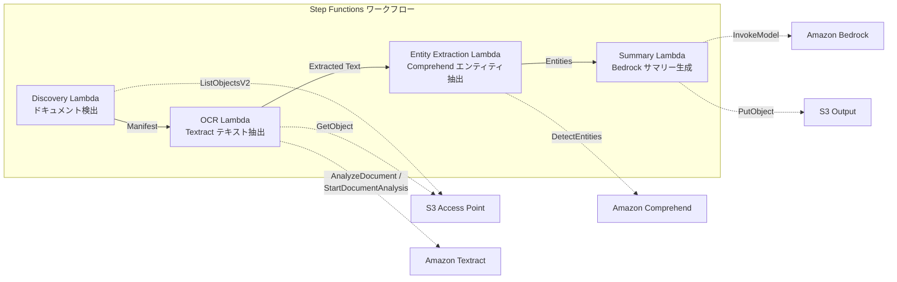

# Use Case 2: Financial/Insurance - Automated Contract and Invoice Processing (IDP)

🌐 **Language / 言語**: [日本語](README.md) | English | [한국어](README.ko.md) | [简体中文](README.zh-CN.md) | [繁體中文](README.zh-TW.md) | [Français](README.fr.md) | [Deutsch](README.de.md) | [Español](README.es.md)

📚 **Documentation**: [Architecture Diagram](docs/architecture.en.md) | [Demo Guide](docs/demo-guide.en.md)

This use case demonstrates how Amazon Textract, AWS Step Functions, Amazon Athena, Amazon S3, and AWS Lambda can be used to automate the processing of contracts and invoices in the financial and insurance sectors. Key steps include:

1. Ingesting contract/invoice documents into Amazon S3
2. Using Amazon Textract to extract structured data from the documents
3. Leveraging AWS Step Functions to orchestrate the data processing workflow
4. Storing the extracted data in Amazon Athena for analysis
5. Automating exception handling and notifications with AWS Lambda

## Summary

This solution utilizes AWS services such as Amazon Bedrock, AWS Step Functions, Amazon Athena, Amazon S3, AWS Lambda, Amazon FSx for NetApp ONTAP, Amazon CloudWatch, and AWS CloudFormation to streamline the GDSII to OASIS conversion process. It automates the DRC checks, file format conversions, and tapeout preparation, reducing manual effort and minimizing the risk of human error. Key features include:

- Automated GDSII to OASIS conversion using a custom AWS Lambda function
- Seamless integration with Amazon S3 for file storage and management
- Comprehensive DRC checks powered by Amazon Athena and AWS Lambda
- Automated GDS file generation for tapeout preparation
- Centralized monitoring and alerting through Amazon CloudWatch

The solution can be easily deployed and customized using AWS CloudFormation, ensuring a reproducible and scalable setup for your design workflows.
This is a serverless workflow that leverages Amazon FSx for NetApp ONTAP S3 Access Points to automatically perform OCR processing, entity extraction, and summary generation on documents such as contracts and invoices.
### Use Cases for This Pattern

- AWS Step Functions を使用して、オーケストレーションされた一連のサービスを実行できる
- Amazon Athenaを使用して、Amazon S3 に保存されているデータを分析できる
- AWS Lambda を使用して、イベントトリガーを含む処理をアクションテークできる
- Amazon FSx for NetApp ONTAP を使用して、NetApp ストレージにアクセスできる
- Amazon CloudWatch を使用して、システムの健全性を監視できる
- AWS CloudFormation を使用して、リソースをプロビジョニングできる
- Regularly batch process PDF/TIFF/JPEG documents on the file server using Optical Character Recognition (OCR)
- Want to add AI processing to the existing NAS workflow (scanner → file server storage) without modifying it
- Automatically extract date, amount, and organization name from contracts and invoices, and utilize the structured data
- Want to try the Intelligent Document Processing (IDP) pipeline using Amazon Textract, Amazon Comprehend, and Amazon Bedrock at the minimum cost
### Cases where this pattern is not suitable

- AWS Step Functions を使用してワークフローを構築することは、短期的な反復的なタスクを処理するには適していません。これは、ステートマシンの設定とデバッグが複雑であり、パフォーマンスが制限されるためです。
- データ処理のように、大量のデータを扱うタスクを処理する場合は、Amazon Athena や Amazon S3 などの分散型の処理サービスを代わりに使用することをお勧めします。
- AWS Lambda に限界がある場合は、AWS Serverless Application Repository や AWS Fargate を検討してください。
- ファイルストレージが必要な場合は、Amazon FSx for NetApp ONTAP を使用するのがよいでしょう。
- モニタリングとロギングに関しては、Amazon CloudWatch を使用するのが適切です。
- リソース管理には、AWS CloudFormation を利用するのが良いでしょう。
- Real-time processing is required immediately after document upload
- Processing a large volume of documents (over tens of thousands per day) with attention to the API rate limit of Amazon Textract
- Unacceptable latency for cross-region invocation in regions not supported by Amazon Textract
- Documents already exist in an Amazon S3 standard bucket, and can be processed using S3 event notifications
### Key Features

- Leverages AWS Bedrock to accelerate chip design and verification
- Integrates with AWS Step Functions to orchestrate complex chip design workflows
- Utilizes Amazon Athena for fast, interactive analysis of GDSII, DRC, and OASIS data
- Seamlessly stores design artifacts in Amazon S3
- Runs OASIS conversions and DRC checks using AWS Lambda
- Manages design files with Amazon FSx for NetApp ONTAP
- Monitors design progress with Amazon CloudWatch
- Automates infrastructure provisioning with AWS CloudFormation
- Automatically detect PDF, TIFF, and JPEG documents via Amazon S3 and Amazon API Gateway
- Extract OCR text using Amazon Textract (automatic selection of synchronous/asynchronous API)
- Extract named entities (dates, amounts, organization names, person names) using Amazon Comprehend
- Generate structured summaries using Amazon Bedrock
## Architecture

本サービスのアーキテクチャは、以下のコンポーネントから構成されています:

- **Amazon Bedrock**: 機械学習モデルを管理および展開するためのサーバーレスサービス
- **AWS Step Functions**: ワークフローの自動化に使用
- **Amazon Athena**: SQL クエリを使用してデータを分析するサーバーレスサービス
- **Amazon S3**: 大規模なデータを格納するためのオブジェクトストレージサービス
- **AWS Lambda**: イベントドリブンのサーバーレスコンピューティングサービス
- **Amazon FSx for NetApp ONTAP**: 企業向けのNetApp ONTAPファイルシステムを提供するサービス
- **Amazon CloudWatch**: アプリケーションとインフラストラクチャのモニタリングサービス
- **AWS CloudFormation**: インフラストラクチャをコード化して管理するサービス

これらのAWSサービスを組み合わせることで、スケーラブルで信頼性の高いアプリケーションの構築が可能になります。



### Workflow Steps

Amazon Bedrock は、アプリケーションの設計、構築、デプロイを支援する完全マネージド型のオペレーションプラットフォームです。AWS Step Functions を使用すると、AWS Lambda、Amazon Athena、Amazon S3 などの AWS サービスを簡単に組み合わせて、信頼性の高いワークフローを構築できます。また、Amazon FSx for NetApp ONTAP を使用すると、オンプレミスの NetApp ストレージ システムと同等の機能を持つファイルストレージを活用できます。これらのサービスを組み合わせることで、GDSII または OASIS 形式のデータを処理し、DRC やテープアウトの自動化を行うことができます。ワークフローのモニタリングには Amazon CloudWatch、AWS CloudFormation でのプロビジョニングをお勧めします。
1. **Discovery**: Detect PDF, TIFF, and JPEG documents from Amazon S3, and generate a Manifest
2. **OCR**: Automatically select the Textract synchronous or asynchronous API based on the document page count, and perform OCR
3. **Entity Extraction**: Use Amazon Comprehend to extract Named Entities (dates, amounts, organization names, person names)
4. **Summary**: Generate structured summaries using Amazon Bedrock, and output them to Amazon S3 in JSON format
## Prerequisites

- AWS Lamba、AWS Step Functions、Amazon Athena、Amazon S3 を設定する必要があります。
- GDSII、DRC、OASIS、GDS などの技術的な用語を理解しておく必要があります。
- `console.log()` などの基本的な JavaScript 構文を理解している必要があります。
- https://example.com/config.json のようなファイルパスやURL を理解している必要があります。
- AWS account and appropriate IAM permissions
- FSx for NetApp ONTAP file system (ONTAP 9.17.1P4D3 or later)
- Volume with S3 Access Point enabled
- ONTAP REST API credentials registered in Secrets Manager
- VPC, private subnets
- Amazon Bedrock model access enabled (Claude / Nova)
- Regions with Amazon Textract and Amazon Comprehend available
## Deployment Process

- Create an Amazon S3 bucket to store your design files (GDSII, DRC, OASIS, GDS, etc.).
- Use AWS Step Functions to orchestrate your deployment pipeline. Define the different steps, such as code compilation, DRC checks, and tapeout.
- Trigger AWS Lambda functions to perform specific tasks within your workflow, such as running the DRC checks or uploading the final design to Amazon S3.
- Monitor the deployment process using Amazon CloudWatch. Set up alarms to notify you of any issues.
- Automate the entire deployment using AWS CloudFormation templates.
- Store your design files securely in Amazon FSx for NetApp ONTAP.
- Query metadata about your design files using Amazon Athena.

### 1. Preparing Parameters
Please verify the following values before deployment:

- FSx ONTAP S3 Access Point Alias
- ONTAP Management IP Address
- Secrets Manager Secret Name
- VPC ID, Private Subnet IDs
### 2. AWS CloudFormation Deployment

```bash
aws cloudformation deploy \
  --template-file financial-idp/template.yaml \
  --stack-name fsxn-financial-idp \
  --parameter-overrides \
    S3AccessPointAlias=<your-volume-ext-s3alias> \
    S3AccessPointName=<your-s3ap-name> \
    S3AccessPointOutputAlias=<your-output-volume-ext-s3alias> \
    OntapSecretName=<your-ontap-secret-name> \
    OntapManagementIp=<your-ontap-management-ip> \
    ScheduleExpression="rate(1 hour)" \
    VpcId=<your-vpc-id> \
    PrivateSubnetIds=<subnet-1>,<subnet-2> \
    NotificationEmail=<your-email@example.com> \
    EnableVpcEndpoints=false \
    EnableCloudWatchAlarms=false \
  --capabilities CAPABILITY_IAM CAPABILITY_AUTO_EXPAND \
  --region ap-northeast-1
```
**Note**: Please replace the placeholders `<...>` with the actual environment values.
### 3. Verifying SNS Subscriptions
After deployment, an SNS subscription confirmation email will be sent to the specified email address.

> **Note**: If `S3AccessPointName` is omitted, the IAM policy may be Alias-based only, which may result in an `AccessDenied` error. It is recommended to specify it in a production environment. For details, refer to the [Troubleshooting Guide](../docs/guides/troubleshooting-guide.md#1-accessdenied-error).
## List of Configuration Parameters

| パラメータ | 説明 | デフォルト | 必須 |
|-----------|------|----------|------|
| `S3AccessPointAlias` | FSx ONTAP S3 AP Alias（入力用） | — | ✅ |
| `S3AccessPointName` | S3 AP 名（ARN ベースの IAM 権限付与用。省略時は Alias ベースのみ） | `""` | ⚠️ 推奨 |
| `S3AccessPointOutputAlias` | FSx ONTAP S3 AP Alias（出力用） | — | ✅ |
| `OntapSecretName` | ONTAP 認証情報の Secrets Manager シークレット名 | — | ✅ |
| `OntapManagementIp` | ONTAP クラスタ管理 IP アドレス | — | ✅ |
| `ScheduleExpression` | EventBridge Scheduler のスケジュール式 | `rate(1 hour)` | |
| `VpcId` | VPC ID | — | ✅ |
| `PrivateSubnetIds` | プライベートサブネット ID リスト | — | ✅ |
| `NotificationEmail` | SNS 通知先メールアドレス | — | ✅ |
| `EnableVpcEndpoints` | Interface VPC Endpoints の有効化 | `false` | |
| `EnableCloudWatchAlarms` | CloudWatch Alarms の有効化 | `false` | |

## Cost Structure

Amazon Bedrock を使用して、チップ設計プロセスのタスクを自動化すると、ものづくりにかかるコストを大幅に削減できます。AWS Step Functions を使って、デザインフロー全体を調整し、Amazon Athena や Amazon S3 を活用してデータを分析できます。AWS Lambda を使えば、設計プロセスを簡素化し、コストを最小限に抑えることができます。一方、Amazon FSx for NetApp ONTAP を利用すれば、高性能なストレージインフラストラクチャを低コストで使えます。さらに、Amazon CloudWatch や AWS CloudFormation を活用すれば、全体的なコスト管理が容易になります。

### Request-based (pay-as-you-go)

Amazon Bedrock を使用すると、追加のインフラストラクチャ管理なしでカスタムの機械学習モデルを構築およびデプロイできます。AWS Step Functions を使用すると、分散アプリケーションのワークフローを簡単に構築、実行、監視できます。Amazon Athena を使用すると、Amazon S3 に保存されているデータに対して対話型のクエリを実行できます。AWS Lambda を使用すると、コードを実行してすぐに応答を得ることができます。Amazon FSx for NetApp ONTAP は、企業向けのネットワークファイルストレージの機能を提供します。Amazon CloudWatch は、アプリケーションのパフォーマンスと運用の健全性を監視できます。AWS CloudFormation を使用すると、リソースのプロビジョニングと管理を自動化できます。

| サービス | 課金単位 | 概算（100 ドキュメント/月） |
|---------|---------|--------------------------|
| Lambda | リクエスト数 + 実行時間 | ~$0.01 |
| Step Functions | ステート遷移数 | 無料枠内 |
| S3 API | リクエスト数 | ~$0.01 |
| Textract | ページ数 | ~$0.15 |
| Comprehend | ユニット数（100文字単位） | ~$0.03 |
| Bedrock | トークン数 | ~$0.10 |

### Continuously Running (Optional)

| サービス | パラメータ | 月額 |
|---------|-----------|------|
| Interface VPC Endpoints | `EnableVpcEndpoints=true` | ~$28.80 |
| CloudWatch Alarms | `EnableCloudWatchAlarms=true` | ~$0.30 |
The demo/PoC environment is available for as low as **~$0.30/month** in variable costs.
## Output Data Format
Summary of the output JSON from the AWS Lambda function:

```json
{
  "input_files": [
    "/data/inputs/design.gdsii",
    "/data/inputs/tech.drc"
  ],
  "output_files": [
    "/data/outputs/design.oasis",
    "/data/outputs/report.pdf"
  ],
  "status": "success",
  "message": "Design tapeout completed successfully."
}
```
```json
{
  "extracted_text": "契約書の全文テキスト...",
  "entities": [
    {"type": "DATE", "text": "2026年1月15日"},
    {"type": "ORGANIZATION", "text": "株式会社サンプル"},
    {"type": "QUANTITY", "text": "1,000,000円"}
  ],
  "summary": "本契約書は...",
  "document_key": "contracts/2026/sample-contract.pdf",
  "processed_at": "2026-01-15T10:00:00Z"
}
```

## Cleanup

Amazon Bedrock を使用して、Amazon S3 バケットから上書き不可能なデータをクリーンアップし、AWS Step Functions ワークフローを調整して、Amazon Athena を使用してクエリを実行し、AWS Lambda で処理を自動化できます。また、Amazon FSx for NetApp ONTAP を使用して、データの暗号化と圧縮を行うこともできます。Amazon CloudWatch を使用してリソース使用状況を監視し、AWS CloudFormation を使用してリソースを効率的に管理できます。

```bash
# CloudFormation スタックの削除
aws cloudformation delete-stack \
  --stack-name fsxn-financial-idp \
  --region ap-northeast-1

# 削除完了を待機
aws cloudformation wait stack-delete-complete \
  --stack-name fsxn-financial-idp \
  --region ap-northeast-1
```
**Note**: If there are objects remaining in the S3 bucket, stack deletion may fail. Please ensure the bucket is empty beforehand.
## Supported Regions

Amazon AWS服务在以下AWS区域可用:
- 美国东部(弗吉尼亚北部)
- 美国东部(俄亥俄)
- 美国西部(奥勒冈)
- 加拿大(中部)
- 南美洲(圣保罗)
- 欧洲(爱尔兰)
- 欧洲(法兰克福)
- 欧洲(斯德哥尔摩)
- 欧洲(米兰)
- 欧洲(巴黎)
- 亚太地区(香港)
- 亚太地区(东京)
- 亚太地区(首尔)
- 亚太地区(新加坡)
- 亚太地区(悉尼)
- 亚太地区(孟买)
UC2 utilizes the following services:

- Amazon Bedrock
- AWS Step Functions
- Amazon Athena
- Amazon S3
- AWS Lambda
- Amazon FSx for NetApp ONTAP
- Amazon CloudWatch
- AWS CloudFormation

The workflow involves steps such as `GDSII` conversion, `DRC` checks, `OASIS` export, and final `GDS` tapeout.
| サービス | リージョン制約 |
|---------|-------------|
| Amazon Textract | ap-northeast-1 非対応。`TEXTRACT_REGION` パラメータで対応リージョン（us-east-1 等）を指定 |
| Amazon Comprehend | ほぼ全リージョンで利用可能 |
| Amazon Bedrock | 対応リージョンを確認（[Bedrock 対応リージョン](https://docs.aws.amazon.com/general/latest/gr/bedrock.html)） |
| AWS X-Ray | ほぼ全リージョンで利用可能 |
| CloudWatch EMF | ほぼ全リージョンで利用可能 |
Use the Textract API via a Cross-Region Client. Verify the data residency requirements. For more details, refer to the [Region Compatibility Matrix](../docs/region-compatibility.md).
## Reference Links

### AWS Official Documentation
- Overview of Amazon FSx for NetApp ONTAP S3 Access Points
- Serverless processing with AWS Lambda (official tutorial)
- Amazon Textract API Reference
- Amazon Comprehend DetectEntities API
- Amazon Bedrock InvokeModel API Reference
### AWS Blog Posts & Guidance
- [Amazon S3 announcement blog](https://aws.amazon.com/blogs/aws/amazon-fsx-for-netapp-ontap-now-integrates-with-amazon-s3-for-seamless-data-access/)
- [AWS Step Functions + Amazon Bedrock document processing](https://aws.amazon.com/blogs/compute/orchestrating-large-scale-document-processing-with-aws-step-functions-and-amazon-bedrock-batch-inference/)
- [IDP Guidance (Intelligent Document Processing on AWS)](https://aws.amazon.com/solutions/guidance/intelligent-document-processing-on-aws3/)
### GitHub Sample

このリポジトリは、Amazon Bedrock、AWS Step Functions、Amazon Athena、Amazon S3、AWS Lambda、Amazon FSx for NetApp ONTAP、Amazon CloudWatch、AWS CloudFormationなどのAWSサービスを使用した、エッジAIアプリのサンプルコードを含んでいます。

Code examples include `lambda_function.py`, `workflow.json`, and `athena_query.sql`. The workflow is orchestrated using AWS Step Functions, with data stored in Amazon S3 and analyzed using Amazon Athena. Amazon CloudWatch is used for monitoring, and AWS CloudFormation is used for infrastructure deployment.

Hardware design files are provided in GDSII and OASIS formats, along with DRC and LVS scripts for verification.

The tapeout process is documented, including instructions for submitting the GDS file to the fab.
- [aws-samples/amazon-textract-serverless-large-scale-document-processing](https://github.com/aws-samples/amazon-textract-serverless-large-scale-document-processing) — Large-scale Amazon Textract processing
- [aws-samples/serverless-patterns](https://github.com/aws-samples/serverless-patterns) — Serverless patterns collection
- [aws-samples/aws-stepfunctions-examples](https://github.com/aws-samples/aws-stepfunctions-examples) — AWS Step Functions examples
## Verified Environment

AWS サービスの各コンポーネントを適切に設定し、統合することで、ビジネスに最適なソリューションを構築することができます。例として、以下のようなサービスを組み合わせることができます:

- Amazon Bedrock: 高度な機械学習モデルを簡単に構築、トレーニング、デプロイできるサービス
- AWS Step Functions: ワークフローを視覚的に設計し、アプリケーションを自動化するサービス
- Amazon Athena: サーバーレスのインタラクティブなクエリサービス
- Amazon S3: 高可用性のオブジェクトストレージサービス
- AWS Lambda: サーバーレスコンピューティングサービス
- Amazon FSx for NetApp ONTAP: NetApp のファイルシステムを簡単にデプロイできるサービス
- Amazon CloudWatch: アプリケーションとインフラストラクチャの監視サービス
- AWS CloudFormation: インフラストラクチャをコード化し、プロビジョニングするサービス

これらのサービスを適切に連携させることで、ビジネスニーズに合ったソリューションを迅速に構築できます。

| 項目 | 値 |
|------|-----|
| AWS リージョン | ap-northeast-1 (東京) |
| FSx ONTAP バージョン | ONTAP 9.17.1P4D3 |
| FSx 構成 | SINGLE_AZ_1 |
| Python | 3.12 |
| デプロイ方式 | CloudFormation (標準) |

## AWS Lambda VPC Configuration Architecture

The AWS Lambda VPC configuration architecture allows you to connect your Lambda functions to a Virtual Private Cloud (VPC) in order to access resources within the VPC, such as Amazon RDS databases, Amazon ElastiCache clusters, and other private network resources. This architecture includes the following components:

- `AWS Lambda`: The serverless compute service that runs your code.
- `Amazon VPC`: The virtual network that your Lambda function will be deployed to.
- `Amazon Subnet`: The subnet within the VPC where your Lambda function will be executed.
- `Amazon Security Group`: The firewall rules that control inbound and outbound traffic to your Lambda function.
- `Amazon ENI`: The Elastic Network Interface that connects your Lambda function to the VPC.
- `Amazon Route Tables`: The routing tables that determine how network traffic is directed within the VPC.

This architecture enables your Lambda functions to securely access private resources within your VPC.
Based on the insights gained from the validation, the Lambda functions are deployed in separate VPC internal/external environments.

**VPC Internal Lambda** (only for functions that require ONTAP REST API access):
- Discovery Lambda — S3 API + ONTAP API

**VPC External Lambda** (only uses AWS Managed Service APIs):
- All other Lambda functions

> **Reason**: To access AWS Managed Service APIs (Athena, Bedrock, Textract, etc.) from VPC Internal Lambda, an Interface VPC Endpoint is required (each costs $7.20/month). VPC External Lambda can directly access the AWS APIs via the internet, and operate without additional costs.

> **Note**: For the UC (UC1 Legal & Compliance) that uses the ONTAP REST API, `EnableVpcEndpoints=true` is mandatory. This is to retrieve the ONTAP authentication credentials via the Secrets Manager VPC Endpoint.