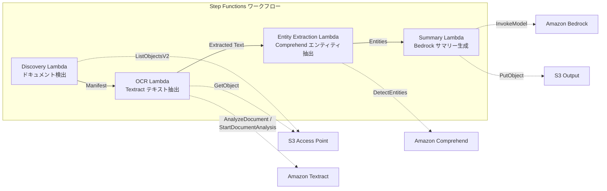

# UC2: Servicios financieros y de seguros - Procesamiento automático de contratos y facturas (IDP)

🌐 **Language / 言語**: [日本語](README.md) | [English](README.en.md) | [한국어](README.ko.md) | [简体中文](README.zh-CN.md) | [繁體中文](README.zh-TW.md) | [Français](README.fr.md) | [Deutsch](README.de.md) | Español

## Resumen

Amazon Bedrock le permite diseñar y fabricar chips de manera más rápida y rentable. Puede utilizar AWS Step Functions para orquestar el flujo de trabajo de diseño de chips, que incluye Amazon Athena para análisis de datos, Amazon S3 para almacenamiento, AWS Lambda para transformación de datos y Amazon FSx for NetApp ONTAP para almacenamiento de archivos. Puede monitorear el progreso del diseño con Amazon CloudWatch y utilizar AWS CloudFormation para aprovisionar los recursos de manera automatizada.

Los procesos clave incluyen la creación de archivos GDSII, la verificación de reglas de diseño (DRC) y la conversión a formato OASIS. Después de la aprobación, el diseño final se envía al tapeout.
La utilización de los puntos de acceso S3 de FSx para NetApp ONTAP permite automatizar el procesamiento de OCR, la extracción de entidades y la generación de resúmenes de documentos como contratos y facturas a través de un flujo de trabajo sin servidor.
### Este patrón es adecuado para los siguientes casos:

- Necesitas crear una solución de automatización de inicio a fin sin necesidad de administrar la infraestructura.
- Quieres utilizar servicios AWS administrados como Amazon Bedrock, AWS Step Functions, Amazon Athena, Amazon S3, AWS Lambda, Amazon FSx for NetApp ONTAP, Amazon CloudWatch y AWS CloudFormation.
- Tu flujo de trabajo involucra a varios equipos con diferentes especialidades, como diseño, verificación y fabricación.
- Necesitas realizar una migración a la nube o modernizar tu flujo de trabajo de diseño y verificación de circuitos integrados.
- Tu flujo de trabajo incluye procesos como GDSII, DRC, OASIS, GDS, Lambda, tapeout y otros términos técnicos.
- Me gustaría procesar por lotes documentos PDF/TIFF/JPEG almacenados en un servidor de archivos mediante OCR de forma periódica.
- Deseo agregar procesamiento de IA a mi flujo de trabajo actual de NAS (escáner → almacenamiento en el servidor de archivos) sin necesidad de modificarlo.
- Quisiera extraer automáticamente la fecha, el monto y el nombre de la organización de contratos y facturas, y utilizar esa información estructurada.
- Me interesa probar la canalización de IDP de Textract + Comprehend + Bedrock con el menor costo posible.
### Esta no es una buena aplicación para este patrón

El uso de servicios de AWS como Amazon Bedrock, AWS Step Functions, Amazon Athena, Amazon S3, AWS Lambda, Amazon FSx for NetApp ONTAP, Amazon CloudWatch, AWS CloudFormation, etc. no es apropiado en todos los casos. Algunos ejemplos de situaciones donde este patrón no es adecuado incluyen:

- Si tienes requisitos específicos de rendimiento, latencia o escalabilidad que los servicios de AWS no puedan cumplir
- Si necesitas un mayor control o personalización de la infraestructura de lo que los servicios de AWS permiten
- Si tu carga de trabajo es altamente especializada y requiere herramientas o tecnologías específicas como GDSII, DRC, OASIS, GDS, Lambda, tapeout, etc.
- Si tienes restricciones normativas o de seguridad que impiden el uso de servicios en la nube

En estos casos, puede ser mejor utilizar una solución en las instalaciones o una plataforma de infraestructura como servicio (IaS) más flexible.
- Procesamiento en tiempo real necesario justo después de la carga del documento
- Procesamiento de gran volumen de documentos, decenas de miles por día (tener cuidado con los límites de tasa de API de Amazon Textract)
- La latencia de las llamadas entre regiones no es aceptable cuando Amazon Textract no está disponible en una región
- Los documentos ya existen en un bucket estándar de Amazon S3 y se pueden procesar mediante notificaciones de eventos de Amazon S3
### Principales funcionalidades

Amazon Bedrock permite el diseño de chips utilizando herramientas de diseño asistido por computadora (CAD) compatibles con formatos como GDSII, OASIS y DRC. AWS Step Functions se puede usar para orquestar flujos de trabajo complejos que involucren múltiples servicios de AWS, como Amazon Athena, Amazon S3 y AWS Lambda. Amazon FSx for NetApp ONTAP proporciona sistemas de archivos de alto rendimiento con total compatibilidad con ONTAP. Amazon CloudWatch monitorea los recursos de AWS y las aplicaciones en ejecución. AWS CloudFormation permite definir la infraestructura como código.
- Detección automática de documentos PDF, TIFF y JPEG a través de Amazon S3 AP
- Extracción de texto OCR mediante Amazon Textract (selección automática de API síncrona/asíncrona)
- Extracción de entidades con nombre mediante Amazon Comprehend (fechas, cantidades, nombres de organizaciones, nombres de personas)
- Generación de resúmenes estructurados mediante Amazon Bedrock
## Arquitectura

Amazon Bedrock es una plataforma de desarrollo de modelos de IA que simplifica el proceso de crear, implementar y mantener modelos de IA en producción. Los pasos típicos en el ciclo de vida de un modelo de IA incluyen:

1. Preparación de datos
2. Entrenamiento del modelo
3. Implementación del modelo
4. Monitoreo y mejora del modelo

AWS Step Functions facilita la coordinación de estos pasos mediante la definición de flujos de trabajo sin código. Amazon Athena se puede usar para analizar datos de Amazon S3, mientras que AWS Lambda se puede usar para ejecutar código personalizado. Amazon FSx for NetApp ONTAP permite integrar almacenamiento de alto rendimiento en sus flujos de trabajo de IA. Amazon CloudWatch y AWS CloudFormation se pueden utilizar para supervisar y administrar la infraestructura.

Algunos términos técnicos clave en el desarrollo de chips incluyen GDSII, DRC, OASIS y GDS. El proceso de `tapeout` es una etapa crucial en la fabricación de chips.



### Pasos del flujo de trabajo

Para crear un flujo de trabajo automatizado, puede usar los siguientes servicios de AWS:

- Amazon Bedrock para diseño de chips
- AWS Step Functions para orquestar el flujo de trabajo
- Amazon Athena para analizar datos
- Amazon S3 para almacenar archivos
- AWS Lambda para ejecutar código sin servidor
- Amazon FSx for NetApp ONTAP para almacenamiento de archivos
- Amazon CloudWatch para monitorizar el flujo de trabajo
- AWS CloudFormation para implementar la infraestructura

Puede integrar herramientas como `GDSII`, `DRC`, `OASIS`, `GDS` y realizar `tapeout` en el flujo de trabajo.
1. **Descubrimiento**: Detectar documentos PDF, TIFF y JPEG desde S3 AP y generar un Manifiesto
2. **OCR**: Seleccionar automáticamente la API síncrona/asíncrona de Textract para ejecutar el OCR basado en el número de páginas del documento
3. **Extracción de Entidades**: Extraer Entidades Nombradas (fechas, cantidades, nombres de organizaciones, nombres de personas) utilizando Comprehend
4. **Resumen**: Generar un resumen estructurado en formato JSON y almacenarlo en S3 utilizando Bedrock
## Requisitos previos

Amazon Bedrock, AWS Step Functions, Amazon Athena, Amazon S3, AWS Lambda, Amazon FSx for NetApp ONTAP, Amazon CloudWatch, AWS CloudFormation, GDSII, DRC, OASIS, GDS, Lambda, tapeout.
- Cuenta de AWS y permisos de IAM apropiados
- Sistema de archivos FSx para NetApp ONTAP (ONTAP 9.17.1P4D3 o superior)
- Volumen con punto de acceso S3 habilitado
- Credenciales de API REST de ONTAP registradas en Secrets Manager
- VPC, subredes privadas
- Acceso al modelo Amazon Bedrock habilitado (Claude / Nova)
- Regiones con Amazon Textract y Amazon Comprehend disponibles
## Proceso de implementación

Amazon Bedrock を使用して GDSII ファイルをデザインし、Amazon Athena を使用してデータを分析し、AWS Step Functions を使用してワークフローをオーケストレーションします。Amazon S3 にデータを保存し、AWS Lambda でデータを処理し、Amazon FSx for NetApp ONTAP を使用してファイルを管理します。Amazon CloudWatch でシステムを監視し、AWS CloudFormation を使用してスタックを管理します。OASIS ファイルを `design.oasis` という名前で保存し、DRC を実行して検証します。最後に、Amazon Bedrock でテープアウトを実行してデバイスを製造します。

### 1. Preparación de parámetros

Antes de comenzar a diseñar el chip, necesitas preparar los parámetros clave. Esto incluye definir el tamaño del chip, la cantidad de núcleos, la frecuencia de reloj y otros detalles de la arquitectura. Puedes almacenar esta información en un archivo de configuración o en una base de datos utilizando servicios como Amazon Athena o Amazon S3.

Una vez que tengas los parámetros definidos, puedes comenzar a diseñar el chip utilizando herramientas de diseño como GDSII y DRC. Cuando hayas terminado el diseño, podrás generar el archivo OASIS y prepararlo para el tapeout utilizando AWS Lambda y AWS Step Functions.
Antes de la implementación, verifique los siguientes valores:

- FSx ONTAP S3 Access Point Alias
- Dirección IP de administración de ONTAP
- Nombre del secreto de AWS Secrets Manager
- ID de VPC, ID de subred privada
### 2. Implementación de CloudFormation

```bash
aws cloudformation deploy \
  --template-file financial-idp/template.yaml \
  --stack-name fsxn-financial-idp \
  --parameter-overrides \
    S3AccessPointAlias=<your-volume-ext-s3alias> \
    S3AccessPointName=<your-s3ap-name> \
    S3AccessPointOutputAlias=<your-output-volume-ext-s3alias> \
    OntapSecretName=<your-ontap-secret-name> \
    OntapManagementIp=<your-ontap-management-ip> \
    ScheduleExpression="rate(1 hour)" \
    VpcId=<your-vpc-id> \
    PrivateSubnetIds=<subnet-1>,<subnet-2> \
    NotificationEmail=<your-email@example.com> \
    EnableVpcEndpoints=false \
    EnableCloudWatchAlarms=false \
  --capabilities CAPABILITY_IAM CAPABILITY_AUTO_EXPAND \
  --region ap-northeast-1
```
**Atención**: Reemplace los marcadores de posición `<...>` con los valores reales de su entorno.
### 3. Verificación de la suscripción de SNS
Tras el despliegue, se enviará un correo electrónico de confirmación de suscripción a SNS a la dirección de correo electrónico especificada.

> **Nota**: Si se omite `S3AccessPointName`, la política de IAM se basará únicamente en alias y puede generar un error `AccessDenied`. Se recomienda especificarlo en el entorno de producción. Consulta la [Guía de solución de problemas](../docs/guides/troubleshooting-guide.md#1-error-accessdenied) para obtener más detalles.
## Lista de parámetros de configuración

Amazon Bedrock を使用して GDSII ファイルをシミュレーションする際のパラメータ設定について説明します。DRC 検査、OASIS ファイルの生成、GDS ファイルのタペアウトなどの設定も含まれます。

AWS Step Functions を使用して、一連のタスクを自動化します。Amazon Athena を使用して Amazon S3 のデータを分析し、AWS Lambda 関数を呼び出すこともできます。Amazon FSx for NetApp ONTAP を使用してファイルシステムを管理し、Amazon CloudWatch でリソース使用率を監視します。

設定ファイルは AWS CloudFormation テンプレートで管理します。

| パラメータ | 説明 | デフォルト | 必須 |
|-----------|------|----------|------|
| `S3AccessPointAlias` | FSx ONTAP S3 AP Alias（入力用） | — | ✅ |
| `S3AccessPointName` | S3 AP 名（ARN ベースの IAM 権限付与用。省略時は Alias ベースのみ） | `""` | ⚠️ 推奨 |
| `S3AccessPointOutputAlias` | FSx ONTAP S3 AP Alias（出力用） | — | ✅ |
| `OntapSecretName` | ONTAP 認証情報の Secrets Manager シークレット名 | — | ✅ |
| `OntapManagementIp` | ONTAP クラスタ管理 IP アドレス | — | ✅ |
| `ScheduleExpression` | EventBridge Scheduler のスケジュール式 | `rate(1 hour)` | |
| `VpcId` | VPC ID | — | ✅ |
| `PrivateSubnetIds` | プライベートサブネット ID リスト | — | ✅ |
| `NotificationEmail` | SNS 通知先メールアドレス | — | ✅ |
| `EnableVpcEndpoints` | Interface VPC Endpoints の有効化 | `false` | |
| `EnableCloudWatchAlarms` | CloudWatch Alarms の有効化 | `false` | |

## Estructura de costos

Amazon Bedrock puede ayudarte a reducir los costos de desarrollo de chips al automatizar el diseño y la verificación. AWS Step Functions te permite crear flujos de trabajo complejos sin tener que administrar la infraestructura. Amazon Athena te permite consultar datos almacenados en Amazon S3 sin necesidad de configurar ni administrar servidores. AWS Lambda te permite ejecutar código sin provisionar ni administrar servidores. Amazon FSx for NetApp ONTAP te permite aprovechar la infraestructura de almacenamiento de NetApp en la nube de AWS. Amazon CloudWatch te ayuda a monitorear y analizar el rendimiento de tus recursos de AWS. AWS CloudFormation te permite aprovisionar e implementar rápidamente tus recursos de AWS mediante código.

### Basado en solicitudes (facturación por consumo)

Amazon Bedrock, AWS Step Functions, Amazon Athena, Amazon S3, AWS Lambda, Amazon FSx for NetApp ONTAP, Amazon CloudWatch, AWS CloudFormation, GDSII, DRC, OASIS, GDS, Lambda, tapeout

| サービス | 課金単位 | 概算（100 ドキュメント/月） |
|---------|---------|--------------------------|
| Lambda | リクエスト数 + 実行時間 | ~$0.01 |
| Step Functions | ステート遷移数 | 無料枠内 |
| S3 API | リクエスト数 | ~$0.01 |
| Textract | ページ数 | ~$0.15 |
| Comprehend | ユニット数（100文字単位） | ~$0.03 |
| Bedrock | トークン数 | ~$0.10 |

### Funcionamiento continuo (opcional)

Amazon Bedrock ofrece una opción de "Funcionamiento continuo" que mantiene tu aplicación en ejecución las 24 horas del día, los 7 días de la semana. Cuando se habilita, AWS Step Functions lanzará automáticamente una nueva instancia de tu aplicación si la actual deja de funcionar. Esto garantiza que tu aplicación esté siempre disponible.

Con Amazon Athena y Amazon S3, puedes analizar fácilmente los registros de tu aplicación en AWS Lambda para detectar posibles problemas. Amazon FSx for NetApp ONTAP proporciona almacenamiento de alta disponibilidad para tus datos. Amazon CloudWatch supervisa el rendimiento y Amazon CloudFormation te ayuda a implementar y administrar todo el entorno.

| サービス | パラメータ | 月額 |
|---------|-----------|------|
| Interface VPC Endpoints | `EnableVpcEndpoints=true` | ~$28.80 |
| CloudWatch Alarms | `EnableCloudWatchAlarms=true` | ~$0.30 |
En un entorno de demostración/PoC, se puede usar a partir de **~$0.30/mes** con solo costos variables.
## Formato de datos de salida
Resumen de la salida JSON de Lambda:
```json
{
  "extracted_text": "契約書の全文テキスト...",
  "entities": [
    {"type": "DATE", "text": "2026年1月15日"},
    {"type": "ORGANIZATION", "text": "株式会社サンプル"},
    {"type": "QUANTITY", "text": "1,000,000円"}
  ],
  "summary": "本契約書は...",
  "document_key": "contracts/2026/sample-contract.pdf",
  "processed_at": "2026-01-15T10:00:00Z"
}
```

## Limpieza

Amazon Bedrock le permite iniciar y utilizar fácilmente nuevos modelos de lenguaje de IA en sus aplicaciones. Puede usar AWS Step Functions para coordinar y organizar sus flujos de trabajo, mientras que Amazon Athena le permite consultar datos almacenados en Amazon S3 sin necesidad de administrar la infraestructura.

Utilice AWS Lambda para ejecutar código sin tener que aprovisionar o administrar servidores. Amazon FSx for NetApp ONTAP le ofrece un almacenamiento de archivos empresarial gestionado. Utilice Amazon CloudWatch para monitorear sus recursos de AWS y AWS CloudFormation para aprovisionar rápidamente la infraestructura que necesita.

```bash
# CloudFormation スタックの削除
aws cloudformation delete-stack \
  --stack-name fsxn-financial-idp \
  --region ap-northeast-1

# 削除完了を待機
aws cloudformation wait stack-delete-complete \
  --stack-name fsxn-financial-idp \
  --region ap-northeast-1
```
**Aviso**: Si quedan objetos en el bucket de S3, la eliminación de la pila puede fallar. Asegúrese de vaciar el bucket antes.
## Regiones compatibles

Amazon Bedrock admite las siguientes regiones de AWS:

- Este de EE. UU. (Norte de Virginia)
- Este de EE. UU. (Ohio)
- Oeste de EE. UU. (Oregón)
- Oeste de EE. UU. (California del Norte)
- UE (Irlanda)
- UE (Fráncfort)
- Asia Pacífico (Tokio)
- Asia Pacífico (Seúl)
- Asia Pacífico (Singapur)
- Asia Pacífico (Sídney)
- Canadá (Central)
- América del Sur (São Paulo)
- Oriente Medio (Baréin)
- África (Ciudad del Cabo)

AWS Step Functions, Amazon Athena, Amazon S3, AWS Lambda, Amazon FSx for NetApp ONTAP y Amazon CloudWatch también se encuentran disponibles en estas regiones.

Puedes crear una pila de AWS CloudFormation que implemente estos servicios en cualquiera de estas regiones.
UC2 utiliza los siguientes servicios:

Amazon Bedrock, AWS Step Functions, Amazon Athena, Amazon S3, AWS Lambda, Amazon FSx for NetApp ONTAP, Amazon CloudWatch, AWS CloudFormation
| サービス | リージョン制約 |
|---------|-------------|
| Amazon Textract | ap-northeast-1 非対応。`TEXTRACT_REGION` パラメータで対応リージョン（us-east-1 等）を指定 |
| Amazon Comprehend | ほぼ全リージョンで利用可能 |
| Amazon Bedrock | 対応リージョンを確認（[Bedrock 対応リージョン](https://docs.aws.amazon.com/general/latest/gr/bedrock.html)） |
| AWS X-Ray | ほぼ全リージョンで利用可能 |
| CloudWatch EMF | ほぼ全リージョンで利用可能 |
> Para invocar la API de Textract a través del cliente de varias regiones. Asegúrese de verificar los requisitos de residencia de datos. Consulte la [Matriz de compatibilidad de regiones](../docs/region-compatibility.md) para obtener más detalles.
## Enlaces de referencia

Amazon Bedrock le permite diseñar y fabricar chips de manera rápida y eficiente. AWS Step Functions le permite crear flujos de trabajo de aplicaciones complejas de manera visual. Amazon Athena es un servicio de consulta interactiva para analizar datos almacenados en Amazon S3. AWS Lambda le permite ejecutar código sin aprovisionar ni administrar servidores. Amazon FSx for NetApp ONTAP le brinda almacenamiento de archivos empresarial altamente compatible y de alto rendimiento. Amazon CloudWatch le permite monitorear y optimizar la infraestructura en la nube. AWS CloudFormation le permite modelar y aprovisionar recursos de AWS de forma declarativa.

### Documentación oficial de AWS
- [Resumen de los puntos de acceso a S3 de FSx ONTAP](https://docs.aws.amazon.com/fsx/latest/ONTAPGuide/accessing-data-via-s3-access-points.html)
- [Procesamiento sin servidor con Lambda (tutorial oficial)](https://docs.aws.amazon.com/fsx/latest/ONTAPGuide/tutorial-process-files-with-lambda.html)
- [Referencia de la API de Textract](https://docs.aws.amazon.com/textract/latest/dg/API_Reference.html)
- [API DetectEntities de Comprehend](https://docs.aws.amazon.com/comprehend/latest/dg/API_DetectEntities.html)
- [Referencia de la API InvokeModel de Bedrock](https://docs.aws.amazon.com/bedrock/latest/APIReference/API_runtime_InvokeModel.html)
### Artículos del blog y guías de AWS

El diseño de circuitos integrados (ICs) a menudo implica varios pasos complejos, como el diseño de esquemas, la verificación de circuitos, el diseño de diseño y el enrutamiento. AWS proporciona servicios como Amazon Bedrock, AWS Step Functions, Amazon Athena, Amazon S3, AWS Lambda y Amazon FSx for NetApp ONTAP para simplificar este proceso.

El flujo de trabajo típico podría ser:

1. Crear y editar archivos de diseño como GDSII, DRC, OASIS, GDS usando herramientas de diseño electrónico.
2. Validar el diseño con verificaciones como reglas de diseño (DRC).
3. Generar archivos de enrutamiento y cinta final (`tapeout`).
4. Almacenar y administrar los archivos de diseño en Amazon S3.
5. Automatizar el flujo de trabajo con AWS Step Functions.
6. Analizar los registros de fabricación con Amazon Athena y Amazon CloudWatch.
7. Aprovisionar y administrar la infraestructura con AWS CloudFormation.
- [Publicación del blog de S3 AP](https://aws.amazon.com/blogs/aws/amazon-fsx-for-netapp-ontap-now-integrates-with-amazon-s3-for-seamless-data-access/)
- [Procesamiento de documentos con Step Functions + Bedrock](https://aws.amazon.com/blogs/compute/orchestrating-large-scale-document-processing-with-aws-step-functions-and-amazon-bedrock-batch-inference/)
- [Guía de IDP (Procesamiento Inteligente de Documentos en AWS)](https://aws.amazon.com/solutions/guidance/intelligent-document-processing-on-aws3/)
### Muestra de GitHub

Amazon Bedrock permite a los desarrolladores crear y desplegar rápidamente modelos de lenguaje grandes y personalizados para aplicaciones de IA generativa. AWS Step Functions simplifica la orquestación de servicios de AWS con estados visuales y flujos de trabajo sin servidor. Amazon Athena es un servicio de consulta de datos sin servidor que permite analizar datos en Amazon S3 usando SQL estándar. Amazon S3 es un servicio de almacenamiento de objetos que ofrece durabilidad, disponibilidad y rendimiento líderes en la industria. AWS Lambda es un servicio informático sin servidor que ejecuta código en respuesta a eventos o solicitudes HTTP sin necesidad de administrar servidores. Amazon FSx for NetApp ONTAP proporciona sistemas de archivos de alto rendimiento y administrados de manera sencilla. Amazon CloudWatch es un servicio de monitorización y observabilidad que recopila y rastrea métricas, registros e eventos, y permite realizar acciones en función de esos datos. AWS CloudFormation es un servicio que ayuda a modelar y configurar sus recursos de AWS de manera declarativa, reduciendo la complejidad de la gestión de infraestructura.
- [aws-samples/amazon-textract-serverless-large-scale-document-processing](https://github.com/aws-samples/amazon-textract-serverless-large-scale-document-processing) — Procesamiento a gran escala con Amazon Textract
- [aws-samples/serverless-patterns](https://github.com/aws-samples/serverless-patterns) — Colección de patrones serverless
- [aws-samples/aws-stepfunctions-examples](https://github.com/aws-samples/aws-stepfunctions-examples) — Ejemplos de AWS Step Functions
## Entornos verificados

Amazon Bedrock es una plataforma de desarrollo de chips personalizados que ayuda a los clientes a diseñar chips de manera más eficiente. AWS Step Functions es un servicio de orquestación de aplicaciones que coordina varios componentes de aplicaciones distribuidas y con estado. Amazon Athena es un servicio de consulta interactiva que hace que sea fácil analizar datos en Amazon S3 utilizando SQL estándar. Amazon FSx para NetApp ONTAP es un servicio de sistemas de archivos de uso compartido de datos que ofrece funciones de almacenamiento y gestión de datos líderes en la industria de NetApp. Amazon CloudWatch es un servicio de supervisión y observabilidad que recopila métricas y registros de sus recursos de AWS y aplicaciones. AWS CloudFormation es un servicio que ayuda a modelar y configurar sus recursos de AWS de una manera declarativa.

| 項目 | 値 |
|------|-----|
| AWS リージョン | ap-northeast-1 (東京) |
| FSx ONTAP バージョン | ONTAP 9.17.1P4D3 |
| FSx 構成 | SINGLE_AZ_1 |
| Python | 3.12 |
| デプロイ方式 | CloudFormation (標準) |

## Arquitectura de configuración de VPC de Lambda

Amazon Bedrock proporciona un servicio de inferencia de IA que se puede integrar con AWS Step Functions para crear flujos de trabajo de aprendizaje automático sin servidor. Además, Amazon Athena y Amazon S3 se pueden utilizar para analizar y almacenar los datos de entrenamiento y los resultados de la inferencia.

En este diseño, las cargas de trabajo de Lambda se ejecutan dentro de una VPC privada. Esta configuración permite que Lambda acceda a recursos como Amazon FSx for NetApp ONTAP y Amazon CloudWatch para monitorear y registrar la actividad. AWS CloudFormation se utiliza para aprovisionar y administrar la infraestructura de la VPC y los recursos relacionados.
Basándose en los conocimientos adquiridos durante las pruebas, las funciones Lambda se han implementado de forma aislada dentro y fuera de la VPC.

**Lambda dentro de la VPC** (solo para funciones que requieren acceso a la API REST de ONTAP):
- Lambda de descubrimiento — S3 AP + API de ONTAP

**Lambda fuera de la VPC** (solo utiliza las API de servicios administrados de AWS):
- Todas las demás funciones Lambda

> **Razón**: Para que las funciones Lambda dentro de la VPC puedan acceder a las API de servicios administrados de AWS (Athena, Bedrock, Textract, etc.), se requiere un Endpoint de VPC de interfaz (cada uno a $7.20/mes). Las funciones Lambda fuera de la VPC pueden acceder directamente a las API de AWS a través de Internet, sin costos adicionales.

> **Nota**: Para el caso de uso de UC (UC1 Legal y Cumplimiento) que utiliza la API REST de ONTAP, es obligatorio establecer `EnableVpcEndpoints=true`. Esto permite obtener las credenciales de ONTAP a través del Endpoint de VPC de Secrets Manager.