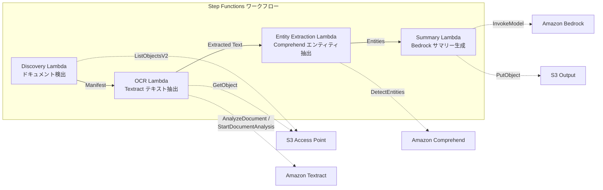

# UC2: Secteur financier et assurance — Traitement automatisé des contrats et des factures (IDP)

🌐 **Language / 言語**: [日本語](README.md) | [English](README.en.md) | [한국어](README.ko.md) | [简体中文](README.zh-CN.md) | [繁體中文](README.zh-TW.md) | Français | [Deutsch](README.de.md) | [Español](README.es.md)

Avec Amazon Bedrock, les entreprises peuvent déployer des modèles d'IA de pointe pour automatiser le traitement des documents. Cela permet d'extraire des données clés à partir de documents comme les contrats et les factures, et de les intégrer directement dans des systèmes de gestion.

Par exemple, les entreprises peuvent utiliser AWS Step Functions pour orchestrer un flux de traitement des documents qui inclut l'extraction de données avec Amazon Athena, le stockage dans Amazon S3 et l'intégration avec des systèmes métier via AWS Lambda.

Amazon FSx for NetApp ONTAP peut fournir un stockage de fichiers hautement performant et évolutif, idéal pour héberger les documents traités. Amazon CloudWatch surveille les performances et Amazon CloudFormation automatise le déploiement de l'infrastructure.

Voici la traduction en français :

## Résumé

Amazon Bedrock, AWS Step Functions, Amazon Athena, Amazon S3, AWS Lambda, Amazon FSx pour NetApp ONTAP, Amazon CloudWatch, AWS CloudFormation, GDSII, DRC, OASIS, GDS, Lambda, tapeout, `/path/to/file`, https://example.com
Exploiter les points d'accès S3 de FSx pour NetApp ONTAP afin d'automatiser le traitement OCR, l'extraction d'entités et la génération de résumés pour des documents tels que les contrats et les factures, via un workflow serverless.
### Cette approche est adaptée dans les cas suivants :

- Vous devez développer des applications complexes qui nécessitent une orchestration sophistiquée des tâches et des ressources.
- Vous avez besoin de services gérés tels qu'Amazon Athena, Amazon S3 et AWS Lambda pour exécuter des charges de travail sans serveur.
- Vous voulez profiter de services tels qu'Amazon FSx for NetApp ONTAP pour accéder à des systèmes de fichiers gérés.
- Vous avez besoin d'intégrer et de surveiller plusieurs services AWS à l'aide d'Amazon CloudWatch et AWS CloudFormation.
- Votre projet implique des processus métier complexes qui nécessitent une orchestration avancée des tâches, comme dans le cas d'un flux de conception de circuits intégrés (GDSII, DRC, OASIS, GDS, tapeout, etc.).
- Je souhaite traiter périodiquement par lots les documents PDF/TIFF/JPEG stockés sur le serveur de fichiers via OCR.
- Je souhaite ajouter un traitement IA à mon flux de travail NAS existant (numériseur → stockage sur serveur de fichiers) sans le modifier.
- Je souhaite extraire automatiquement la date, le montant et le nom de l'organisation à partir de contrats et de factures, et les utiliser sous forme de données structurées.
- Je souhaite tester la pipeline IDP avec Textract + Comprehend + Bedrock au coût le plus bas possible.
Voici les situations où ce modèle n'est pas recommandé :

- Le workflow nécessite un niveau de contrôle très fin ou des étapes personnalisées qui ne peuvent pas être facilement gérées avec Amazon Bedrock, AWS Step Functions ou Amazon Athena.
- Le volume de données entrant/sortant est trop important pour Amazon S3 ou AWS Lambda.
- Le workflow inclut un grand nombre d'étapes séquentielles qui ne peuvent pas être facilement parallélisées avec AWS Step Functions.
- Le workflow nécessite une intégration étroite avec des systèmes externes qui ne peuvent pas être facilement gérés avec les services AWS.
- Le workflow nécessite des fonctionnalités avancées de gestion des fichiers qui ne sont pas proposées par Amazon FSx for NetApp ONTAP.
- Le workflow nécessite un niveau élevé de surveillance et d'alertes qui ne peut pas être facilement géré avec Amazon CloudWatch.
- Le workflow nécessite une configuration complexe qui ne peut pas être facilement gérée avec AWS CloudFormation.
- Un traitement en temps réel est nécessaire immédiatement après le téléchargement des documents
- Traitement d'un très grand nombre de documents, jusqu'à des dizaines de milliers par jour (attention aux limites de débit de l'API Amazon Textract)
- La latence des appels intersites est inacceptable dans les régions non prises en charge par Amazon Textract
- Les documents sont déjà présents dans un compartiment Amazon S3 standard, et leur traitement peut être déclenché par les notifications d'événements Amazon S3
Voici la traduction en français :

### Principales fonctionnalités

- Conception de circuits intégrés à l'aide d'Amazon Bedrock
- Automatisation des workflows de conception avec AWS Step Functions
- Analyse de données de conception avec Amazon Athena
- Stockage sécurisé des fichiers de conception sur Amazon S3
- Exécution de tâches de conception avec AWS Lambda
- Stockage de fichiers volumineux avec Amazon FSx for NetApp ONTAP
- Surveillance de la progression et des performances avec Amazon CloudWatch
- Déploiement et gestion de l'infrastructure avec AWS CloudFormation
- Prise en charge des formats de fichier de conception standard tels que GDSII, DRC, OASIS et GDS
- Prise en charge du flux de conception jusqu'à la production (tapeout)
- Détection automatique des documents PDF, TIFF et JPEG via Amazon S3 AP
- Extraction de texte OCR avec Amazon Textract (sélection automatique des API synchrone/asynchrone)
- Extraction d'entités nommées (dates, montants, organisations, personnes) avec Amazon Comprehend
- Génération de résumés structurés avec Amazon Bedrock
## Architecture

La conception de votre architecture AWS est essentielle pour garantir la fiabilité, la disponibilité et les performances de votre application. Voici quelques éléments à prendre en compte :

- Utilisez Amazon Bedrock pour créer une plateforme de développement sans serveur robuste.
- Tirez parti d'AWS Step Functions pour orchestrer vos workflows.
- Exploitez Amazon Athena pour effectuer des analyses ad hoc sur vos données stockées dans Amazon S3.
- Déployez votre code avec AWS Lambda pour une exécution serverless.
- Utilisez Amazon FSx for NetApp ONTAP pour accéder à des systèmes de fichiers haute performance.
- Surveillez vos ressources avec Amazon CloudWatch.
- Automatisez le déploiement de votre infrastructure avec AWS CloudFormation.



Voici la traduction en français :

### Étapes du workflow
1. **Découverte** : Détecter les documents PDF, TIFF et JPEG depuis S3 AP et générer un manifeste
2. **OCR** : Sélectionner automatiquement l'API Textract synchrone ou asynchrone en fonction du nombre de pages du document, puis exécuter l'OCR
3. **Extraction d'entités** : Extraire les entités nommées (dates, montants, noms d'organisations, noms de personnes) avec Comprehend
4. **Résumé** : Générer un résumé structuré avec Bedrock et le stocker au format JSON dans S3
Voici la traduction en français :

## Prérequis
- Compte AWS et autorisations IAM appropriées
- Système de fichiers FSx pour NetApp ONTAP (ONTAP 9.17.1P4D3 ou supérieur)
- Volume avec point d'accès S3 activé
- Informations d'authentification de l'API REST ONTAP enregistrées dans Secrets Manager
- VPC, sous-réseaux privés
- Accès au modèle Amazon Bedrock activé (Claude / Nova)
- Régions où Amazon Textract et Amazon Comprehend sont disponibles
## Procédure de déploiement

Le processus de déploiement se déroule comme suit :

1. Créer un nouveau projet dans Amazon Bedrock.
2. Définir les tâches de workflow dans AWS Step Functions.
3. Interroger les données dans Amazon Athena.
4. Stocker les fichiers dans Amazon S3.
5. Exécuter le code dans AWS Lambda.
6. Utiliser Amazon FSx for NetApp ONTAP pour le stockage de fichiers.
7. Surveiller les métriques dans Amazon CloudWatch.
8. Déployer l'infrastructure avec AWS CloudFormation.

Les étapes techniques incluent la conversion de fichiers GDSII, l'exécution de DRC et la génération de fichiers OASIS pour le tapeout.

### 1. Préparation des paramètres

Cette étape implique la configuration des paramètres nécessaires pour le processus de conception. Cela peut inclure la définition des règles de conception (`DRC`), des formats de fichier (`GDSII`, `OASIS`), des spécifications techniques, etc. Le but est de s'assurer que tous les éléments requis sont en place avant de commencer la conception proprement dite.

Voici quelques exemples de paramètres à préparer :

- Définir les règles de conception (`DRC`) pour s'assurer que le layout respecte les exigences de fabrication
- Configurer les formats de fichiers de conception (`GDSII`, `OASIS`) 
- Spécifier les caractéristiques techniques du circuit, telles que la taille, la technologie, etc.
- Préparer les données de test et de validation du circuit

Une fois ces paramètres configurés, vous pourrez passer à l'étape suivante du processus de conception.
Veuillez vérifier les valeurs suivantes avant le déploiement :

- Alias du point d'accès S3 FSx ONTAP
- Adresse IP de gestion ONTAP
- Nom du secret Secrets Manager
- ID du VPC, ID du sous-réseau privé
### 2. Déploiement de CloudFormation

Déployez votre application en utilisant AWS CloudFormation. Créez un modèle CloudFormation qui définit les ressources AWS nécessaires, comme Amazon S3, AWS Lambda et Amazon Athena. Utilisez des paramètres pour rendre le modèle réutilisable. Déployez le modèle en utilisant la console AWS CloudFormation, l'AWS CLI ou les AWS SDK.

```bash
aws cloudformation deploy \
  --template-file financial-idp/template.yaml \
  --stack-name fsxn-financial-idp \
  --parameter-overrides \
    S3AccessPointAlias=<your-volume-ext-s3alias> \
    S3AccessPointName=<your-s3ap-name> \
    S3AccessPointOutputAlias=<your-output-volume-ext-s3alias> \
    OntapSecretName=<your-ontap-secret-name> \
    OntapManagementIp=<your-ontap-management-ip> \
    ScheduleExpression="rate(1 hour)" \
    VpcId=<your-vpc-id> \
    PrivateSubnetIds=<subnet-1>,<subnet-2> \
    NotificationEmail=<your-email@example.com> \
    EnableVpcEndpoints=false \
    EnableCloudWatchAlarms=false \
  --capabilities CAPABILITY_IAM CAPABILITY_AUTO_EXPAND \
  --region ap-northeast-1
```
**Attention** : Veuillez remplacer les espaces réservés `<...>` par les valeurs de votre environnement.
### 3. Vérification des abonnements SNS

Amazon SNS (Simple Notification Service) est un service AWS qui permet d'envoyer des notifications. Vous pouvez vérifier les abonnements SNS existants à l'aide de la console AWS ou de l'AWS CLI.

Pour vérifier les abonnements SNS :

1. Accédez à la console AWS et sélectionnez le service Amazon SNS.
2. Dans le panneau de navigation de gauche, cliquez sur "Abonnements".
3. Vous verrez la liste de tous les abonnements SNS.

Vous pouvez également utiliser la commande AWS CLI suivante pour afficher la liste des abonnements SNS :

`aws sns list-subscriptions`
Après le déploiement, un e-mail de confirmation d'abonnement SNS sera envoyé à l'adresse e-mail spécifiée.

> **Remarque** : Si vous omettez `S3AccessPointName`, la politique IAM sera basée uniquement sur les alias et peut entraîner une erreur `AccessDenied`. Il est recommandé de le spécifier dans un environnement de production. Consultez le [guide de dépannage](../docs/guides/troubleshooting-guide.md#1-erreur-accessdenied) pour plus d'informations.
Voici la traduction en français :

## Liste des paramètres de configuration

| パラメータ | 説明 | デフォルト | 必須 |
|-----------|------|----------|------|
| `S3AccessPointAlias` | FSx ONTAP S3 AP Alias（入力用） | — | ✅ |
| `S3AccessPointName` | S3 AP 名（ARN ベースの IAM 権限付与用。省略時は Alias ベースのみ） | `""` | ⚠️ 推奨 |
| `S3AccessPointOutputAlias` | FSx ONTAP S3 AP Alias（出力用） | — | ✅ |
| `OntapSecretName` | ONTAP 認証情報の Secrets Manager シークレット名 | — | ✅ |
| `OntapManagementIp` | ONTAP クラスタ管理 IP アドレス | — | ✅ |
| `ScheduleExpression` | EventBridge Scheduler のスケジュール式 | `rate(1 hour)` | |
| `VpcId` | VPC ID | — | ✅ |
| `PrivateSubnetIds` | プライベートサブネット ID リスト | — | ✅ |
| `NotificationEmail` | SNS 通知先メールアドレス | — | ✅ |
| `EnableVpcEndpoints` | Interface VPC Endpoints の有効化 | `false` | |
| `EnableCloudWatchAlarms` | CloudWatch Alarms の有効化 | `false` | |

## Structure des coûts

Amazon Bedrock vous permet de créer des applications d'intelligence artificielle à faible coût. Avec AWS Step Functions, vous pouvez orchestrer vos workflows d'IA de manière rentable. Amazon Athena vous permet d'interroger les données stockées dans Amazon S3 à la demande, sans avoir à gérer d'infrastructure. AWS Lambda vous permet de faire fonctionner votre code sans avoir à vous soucier des serveurs. Avec Amazon FSx for NetApp ONTAP, vous pouvez créer facilement un système de fichiers hautement performant et évolutif. Amazon CloudWatch vous aide à surveiller vos ressources et à optimiser vos coûts. Grâce à AWS CloudFormation, vous pouvez automatiser le déploiement de vos ressources, ce qui vous fait faire des économies.

Facturation à l'utilisation

### Exécution sans serveur 

Exécution sans serveur

### Amazon Bedrock

Amazon Bedrock

### AWS Step Functions

AWS Step Functions

### Amazon Athena

Amazon Athena

### Amazon S3

Amazon S3

### AWS Lambda

AWS Lambda

### Amazon FSx pour NetApp ONTAP

Amazon FSx pour NetApp ONTAP

### Amazon CloudWatch

Amazon CloudWatch

### AWS CloudFormation

AWS CloudFormation

### GDSII, DRC, OASIS, GDS, Lambda, tapeout

GDSII, DRC, OASIS, GDS, Lambda, tapeout

### `/chemin/fichier.txt`

/chemin/fichier.txt

| サービス | 課金単位 | 概算（100 ドキュメント/月） |
|---------|---------|--------------------------|
| Lambda | リクエスト数 + 実行時間 | ~$0.01 |
| Step Functions | ステート遷移数 | 無料枠内 |
| S3 API | リクエスト数 | ~$0.01 |
| Textract | ページ数 | ~$0.15 |
| Comprehend | ユニット数（100文字単位） | ~$0.03 |
| Bedrock | トークン数 | ~$0.10 |

Fonctionnement continu (facultatif)

| サービス | パラメータ | 月額 |
|---------|-----------|------|
| Interface VPC Endpoints | `EnableVpcEndpoints=true` | ~$28.80 |
| CloudWatch Alarms | `EnableCloudWatchAlarms=true` | ~$0.30 |
Dans un environnement de démonstration/PoC, vous pouvez l'utiliser à partir de **~0,30 $/mois** en ne payant que les coûts variables.
## Format des données de sortie
Résumé de la sortie JSON de AWS Lambda :
```json
{
  "extracted_text": "契約書の全文テキスト...",
  "entities": [
    {"type": "DATE", "text": "2026年1月15日"},
    {"type": "ORGANIZATION", "text": "株式会社サンプル"},
    {"type": "QUANTITY", "text": "1,000,000円"}
  ],
  "summary": "本契約書は...",
  "document_key": "contracts/2026/sample-contract.pdf",
  "processed_at": "2026-01-15T10:00:00Z"
}
```

## Nettoyage

Vous avez terminé le déploiement de votre circuit intégré. La prochaine étape consiste à nettoyer votre environnement. Voici quelques étapes recommandées :

1. Arrêtez et supprimez vos ressources AWS, telles qu'Amazon Bedrock, AWS Step Functions, Amazon Athena, Amazon S3, AWS Lambda, Amazon FSx for NetApp ONTAP, Amazon CloudWatch et AWS CloudFormation.
2. Assurez-vous que tous les fichiers temporaires, les sorties intermédiaires et les artefacts de conception (GDSII, DRC, OASIS, GDS, etc.) ont été supprimés.
3. Vérifiez que le processus de tapeout s'est bien déroulé et que tous les fichiers nécessaires ont été envoyés au fondeur.
4. Nettoyez votre environnement local en supprimant les répertoires de travail et les fichiers temporaires.

```bash
# CloudFormation スタックの削除
aws cloudformation delete-stack \
  --stack-name fsxn-financial-idp \
  --region ap-northeast-1

# 削除完了を待機
aws cloudformation wait stack-delete-complete \
  --stack-name fsxn-financial-idp \
  --region ap-northeast-1
```
**Attention** : Si des objets restent dans le compartiment S3, la suppression de la pile peut échouer. Veuillez vider le compartiment au préalable.
## Régions prises en charge

Amazon Bedrock prend en charge les régions suivantes :
- US East (N. Virginia)
- US East (Ohio)
- US West (Oregon)
- US West (N. California)
- Canada (Central)
- Europe (Ireland)
- Europe (Frankfurt)
- Europe (London)
- Europe (Paris)
- Asia Pacific (Tokyo)
- Asia Pacific (Seoul)
- Asia Pacific (Singapore)
- Asia Pacific (Sydney)
- Asia Pacific (Mumbai)
- South America (São Paulo)
- Middle East (Bahrain)
- Africa (Cape Town)

AWS Step Functions est disponible dans ces mêmes régions.

Amazon Athena, Amazon S3, AWS Lambda, Amazon FSx pour NetApp ONTAP et Amazon CloudWatch sont également disponibles dans ces régions.

AWS CloudFormation prend en charge toutes ces régions.
Voici la traduction en français :

L'UC2 utilise les services suivants :

- Amazon Bedrock
- AWS Step Functions
- Amazon Athena
- Amazon S3
- AWS Lambda
- Amazon FSx pour NetApp ONTAP
- Amazon CloudWatch
- AWS CloudFormation
| サービス | リージョン制約 |
|---------|-------------|
| Amazon Textract | ap-northeast-1 非対応。`TEXTRACT_REGION` パラメータで対応リージョン（us-east-1 等）を指定 |
| Amazon Comprehend | ほぼ全リージョンで利用可能 |
| Amazon Bedrock | 対応リージョンを確認（[Bedrock 対応リージョン](https://docs.aws.amazon.com/general/latest/gr/bedrock.html)） |
| AWS X-Ray | ほぼ全リージョンで利用可能 |
| CloudWatch EMF | ほぼ全リージョンで利用可能 |
Appelez l'API Textract via le client Cross-Region Client. Vérifiez les exigences en matière de résidence des données. Pour plus d'informations, consultez la [matrice de compatibilité des régions](../docs/region-compatibility.md).
## Liens de référence

Amazon Bedrock, AWS Step Functions, Amazon Athena, Amazon S3, AWS Lambda, Amazon FSx for NetApp ONTAP, Amazon CloudWatch, AWS CloudFormation, GDSII, DRC, OASIS, GDS, Lambda, tapeout

### Documentation officielle AWS

Le service Amazon Bedrock vous permet de créer et de former des modèles d'IA de manière simplifiée. Avec AWS Step Functions, vous pouvez orchestrer facilement vos workflows d'application sans serveur. Amazon Athena est un service d'analyse de données sans serveur qui vous permet d'interroger des données stockées dans Amazon S3 à l'aide de SQL standard. Utilisez AWS Lambda pour exécuter votre code sans avoir à gérer les serveurs. Amazon FSx for NetApp ONTAP vous offre un stockage de fichiers haute performance et évolutif. Amazon CloudWatch vous aide à suivre les performances de vos applications et à prendre des mesures en cas de problèmes. Avec AWS CloudFormation, vous pouvez provisionner et gérer vos ressources AWS de manière automatisée.

Parmi les termes techniques, on trouve GDSII, DRC, OASIS, GDS, Lambda, tapeout, etc.
- [Présentation des points d'accès S3 pour FSx ONTAP](https://docs.aws.amazon.com/fsx/latest/ONTAPGuide/accessing-data-via-s3-access-points.html)
- [Traitement sans serveur avec Lambda (didacticiel officiel)](https://docs.aws.amazon.com/fsx/latest/ONTAPGuide/tutorial-process-files-with-lambda.html)
- [Référence de l'API Textract](https://docs.aws.amazon.com/textract/latest/dg/API_Reference.html)
- [API DetectEntities de Comprehend](https://docs.aws.amazon.com/comprehend/latest/dg/API_DetectEntities.html)
- [Référence de l'API InvokeModel de Bedrock](https://docs.aws.amazon.com/bedrock/latest/APIReference/API_runtime_InvokeModel.html)
### Article de blog et guide AWS

Amazon Bedrock vous aide à construire des applications conversationnelles de haute qualité avec un modèle de langue avancé. Utilisez AWS Step Functions pour coordonner les différentes composantes de vos applications de manière fiable et évolutive. Amazon Athena vous permet d'analyser rapidement les données stockées dans Amazon S3 sans avoir à gérer d'infrastructure. Avec AWS Lambda, vous pouvez exécuter du code sans vous soucier des serveurs. Amazon FSx for NetApp ONTAP offre un stockage de fichiers compatible ONTAP, haute performance et entièrement géré. Amazon CloudWatch vous aide à surveiller vos ressources AWS et à prendre des mesures en cas d'événements. AWS CloudFormation vous permet de modéliser et de provisionner vos ressources AWS de manière déclarative.
- [Blog de publication S3 AP](https://aws.amazon.com/blogs/aws/amazon-fsx-for-netapp-ontap-now-integrates-with-amazon-s3-for-seamless-data-access/)
- [Traitement des documents Step Functions + Bedrock](https://aws.amazon.com/blogs/compute/orchestrating-large-scale-document-processing-with-aws-step-functions-and-amazon-bedrock-batch-inference/)
- [Guidance IDP (traitement intelligent de documents sur AWS)](https://aws.amazon.com/solutions/guidance/intelligent-document-processing-on-aws3/)
Voici la traduction en français :

### Échantillon GitHub
- [aws-samples/amazon-textract-serverless-large-scale-document-processing](https://github.com/aws-samples/amazon-textract-serverless-large-scale-document-processing) — Traitement à grande échelle de Textract
- [aws-samples/serverless-patterns](https://github.com/aws-samples/serverless-patterns) — Collection de modèles serverless
- [aws-samples/aws-stepfunctions-examples](https://github.com/aws-samples/aws-stepfunctions-examples) — Exemples de Step Functions
## Environnement vérifié

Amazon Bedrock, AWS Step Functions, Amazon Athena, Amazon S3, AWS Lambda, Amazon FSx for NetApp ONTAP, Amazon CloudWatch, AWS CloudFormation, GDSII, DRC, OASIS, GDS, Lambda, tapeout

| 項目 | 値 |
|------|-----|
| AWS リージョン | ap-northeast-1 (東京) |
| FSx ONTAP バージョン | ONTAP 9.17.1P4D3 |
| FSx 構成 | SINGLE_AZ_1 |
| Python | 3.12 |
| デプロイ方式 | CloudFormation (標準) |

## Architecture de la configuration VPC Lambda

Amazon Bedrock permet de créer des applications machine learning. AWS Step Functions orchestre les workflows d'application. Amazon Athena est un service d'interrogation de données. Amazon S3 fournit un stockage objet. AWS Lambda exécute du code sans serveur. Amazon FSx for NetApp ONTAP offre un stockage de fichiers. Amazon CloudWatch surveille les performances. AWS CloudFormation déploie des ressources.

GDSII, DRC, OASIS et GDS sont des formats de fichiers communs dans la conception de circuits. Le tapotage est le processus final de la production d'un circuit intégré.

Voici un exemple de configuration `vpc.json` pour AWS Lambda :

```json
{
    "Version": "2012-10-17",
    "Statement": [
        {
            "Effect": "Allow",
            "Principal": {
                "Service": "lambda.amazonaws.com"
            },
            "Action": "sts:AssumeRole"
        }
    ]
}
```
Selon les enseignements tirés des tests, les fonctions Lambda sont déployées de manière isolée à l'intérieur et à l'extérieur du VPC.

**Fonctions Lambda à l'intérieur du VPC** (uniquement les fonctions nécessitant l'accès à l'API REST ONTAP) :
- Fonction Lambda de découverte — S3 AP + API ONTAP

**Fonctions Lambda à l'extérieur du VPC** (utilisant uniquement les API des services gérés par AWS) :
- Toutes les autres fonctions Lambda

> **Raison** : Pour accéder aux API des services gérés par AWS (Athena, Bedrock, Textract, etc.) depuis les fonctions Lambda à l'intérieur du VPC, un point de terminaison d'interface VPC est nécessaire (7,20 $ par mois chacun). Les fonctions Lambda à l'extérieur du VPC peuvent accéder directement aux API AWS via Internet, sans frais supplémentaires.

> **Remarque** : Pour l'UC utilisant l'API REST ONTAP (UC1 juridique et conformité), `EnableVpcEndpoints=true` est obligatoire. Cela permet de récupérer les informations d'authentification ONTAP via le point de terminaison VPC de Secrets Manager.