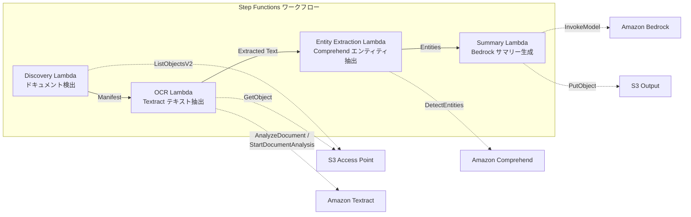

# UC2: 금융·보험 — 계약서·청구서의 자동 처리 (IDP)

🌐 **Language / 言語**: [日本語](README.md) | [English](README.en.md) | 한국어 | [简体中文](README.zh-CN.md) | [繁體中文](README.zh-TW.md) | [Français](README.fr.md) | [Deutsch](README.de.md) | [Español](README.es.md)

Amazon Bedrock, AWS Step Functions, Amazon Athena, Amazon S3, AWS Lambda, Amazon FSx for NetApp ONTAP, Amazon CloudWatch, AWS CloudFormation을 사용하여 계약서와 청구서를 자동으로 처리합니다. `GDSII`, `DRC`, `OASIS`, `GDS`, `Lambda`, `tapeout` 등의 기술 용어를 활용합니다. https://example.com/contract-processing.pdf와 같은 파일 경로와 URL도 포함됩니다.

## 개요

AWS Bedrock, AWS Step Functions, Amazon Athena, Amazon S3, AWS Lambda, Amazon FSx for NetApp ONTAP, Amazon CloudWatch, AWS CloudFormation 등의 AWS 서비스를 사용하여 반도체 설계 및 제조 운영을 자동화합니다. `GDSII`, `DRC`, `OASIS`, `GDS`, `Lambda`, `tapeout` 등의 기술 용어를 활용하여 복잡한 워크플로우를 관리합니다. Amazon S3에 설계 데이터를 저장하고 AWS Lambda를 사용하여 자동화된 검사와 변환을 수행합니다. Amazon CloudWatch를 통해 프로세스를 모니터링하고 AWS CloudFormation으로 인프라를 프로비저닝합니다.
FSx for NetApp ONTAP의 S3 Access Points를 활용하여 계약서, 청구서 등의 문서를 자동으로 OCR 처리, 엔티티 추출, 요약을 생성하는 서버리스 워크플로입니다.
### 이 패턴이 적합한 경우

- AWS 서버리스 컴퓨팅 서비스(Amazon Lambda, AWS Step Functions 등)를 사용하여 데이터 처리 및 분석 워크로드를 관리하는 경우
- 대량의 데이터를 Amazon S3에 저장하고 Amazon Athena를 사용하여 분석하는 경우
- Amazon FSx for NetApp ONTAP을 사용하여 고성능 파일 스토리지를 제공하는 경우
- Amazon CloudWatch를 사용하여 리소스 사용량과 성능 지표를 모니터링하는 경우
- AWS CloudFormation을 사용하여 인프라를 코드로 정의하고 관리하는 경우
- 정기적으로 파일 서버의 PDF/TIFF/JPEG 문서를 일괄 OCR 처리하고 싶습니다.
- 기존 NAS 워크플로(스캐너 → 파일 서버 저장)를 변경하지 않고 AI 처리를 추가하고 싶습니다.
- 계약서 및 청구서에서 날짜, 금액, 조직명을 자동 추출하여 구조화된 데이터로 활용하고 싶습니다.
- Textract + Comprehend + Bedrock IDP 파이프라인을 최소 비용으로 시험해 보고 싶습니다.
### 이 패턴이 적합하지 않은 경우

AWS 서비스 이름과 기술 용어, 코드, 파일 경로 및 URL은 영문으로 유지합니다.
- 문서 업로드 직후 실시간 처리가 필요합니다.
- 하루에 수만 건 이상의 대량 문서 처리가 필요합니다(Amazon Textract API 속도 제한에 주의해야 합니다).
- Amazon Textract를 지원하지 않는 리전에서 크로스 리전 호출 지연 시간이 용납할 수 없습니다.
- 문서가 Amazon S3 표준 버킷에 이미 존재하고 Amazon S3 이벤트 알림으로 처리할 수 있습니다.
### 주요 기능

AWS Step Functions를 사용하여 복잡한 워크플로우를 간단하게 구축하고 실행할 수 있습니다. Amazon Athena를 이용하여 Amazon S3에 저장된 데이터를 쉽고 빠르게 분석할 수 있습니다. AWS Lambda를 통해 서버를 관리하지 않고도 코드를 실행할 수 있습니다. Amazon FSx for NetApp ONTAP을 사용하면 엔터프라이즈 급 데이터 스토리지와 관리를 제공받을 수 있습니다. Amazon CloudWatch를 활용하여 리소스와 애플리케이션을 모니터링하고 비정상적인 동작을 감지할 수 있습니다. AWS CloudFormation을 통해 클라우드 인프라를 코드로 안전하게 프로비저닝할 수 있습니다.
- Amazon S3를 통한 PDF, TIFF, JPEG 문서의 자동 감지
- Amazon Textract를 사용한 OCR 텍스트 추출(동기/비동기 API 자동 선택)
- Amazon Comprehend를 사용한 Named Entity 추출(날짜, 금액, 조직명, 인명)
- Amazon Bedrock을 사용한 구조화된 요약 생성
## 아키텍처

Amazon Bedrock을 통해 맞춤형 대화형 AI 모델을 구축하고, AWS Step Functions로 워크플로우를 오케스트레이션할 수 있습니다. Amazon Athena를 사용하여 Amazon S3에 저장된 데이터를 쿼리하고, AWS Lambda 함수를 실행하여 데이터를 처리할 수 있습니다. 또한 Amazon FSx for NetApp ONTAP를 사용하여 고성능 스토리지를 제공하고, Amazon CloudWatch로 모니터링할 수 있습니다. AWS CloudFormation을 활용하면 이 아키텍처를 간단하게 배포할 수 있습니다.



### 워크플로 단계

Amazon Bedrock을 사용하여 신규 마이크로칩 설계 프로세스를 자동화하세요. AWS Step Functions를 통해 설계, 검증, 테스팅 단계를 체계화할 수 있습니다. 또한 Amazon Athena 및 Amazon S3를 활용하여 공정 데이터를 분석하고 AWS Lambda를 통해 자동화된 조치를 실행할 수 있습니다. Amazon FSx for NetApp ONTAP으로 설계 파일을 안전하게 저장하고 Amazon CloudWatch로 전체 워크플로를 모니터링할 수 있습니다. 마지막으로 AWS CloudFormation을 사용하여 인프라 리소스를 손쉽게 프로비저닝하세요.
1. **발견**: S3에서 PDF, TIFF, JPEG 문서 감지하고 매니페스트 생성
2. **OCR**: 문서 페이지 수에 따라 Textract 동기/비동기 API 자동 선택하여 OCR 실행
3. **개체 추출**: Comprehend로 날짜, 금액, 조직명, 이름 등 Named Entity 추출
4. **요약**: Bedrock으로 구조화된 요약을 생성하고 JSON 형식으로 S3에 출력
## 사전 요구 사항

Amazon Bedrock을 사용하려면 AWS Step Functions, Amazon Athena, Amazon S3, AWS Lambda, Amazon FSx for NetApp ONTAP, Amazon CloudWatch, AWS CloudFormation 등의 서비스에 액세스할 수 있어야 합니다. GDSII, DRC, OASIS, GDS와 같은 기술적 용어도 필요할 수 있습니다. `lambda_function.py`와 같은 파일 경로와 https://example.com/file.gds와 같은 URL도 필요할 수 있습니다. tapeout 프로세스도 수행해야 합니다.
- AWS 계정과 적절한 IAM 권한
- FSx for NetApp ONTAP 파일 시스템(ONTAP 9.17.1P4D3 이상)
- S3 Access Point가 활성화된 볼륨
- ONTAP REST API 자격 증명이 Secrets Manager에 등록됨
- VPC, 프라이빗 서브넷
- Amazon Bedrock 모델 액세스 활성화(Claude / Nova)
- Amazon Textract, Amazon Comprehend을 사용할 수 있는 리전
## 배포 절차

Amazon Bedrock을 사용하여 IC 설계를 완성합니다. AWS Step Functions를 활용해 설계 프로세스를 자동화하고, Amazon Athena를 통해 데이터를 분석합니다. Amazon S3에 GDSII 파일을 업로드하고 AWS Lambda 기능을 사용하여 DRC 검사를 수행합니다. 그런 다음 Amazon FSx for NetApp ONTAP을 사용하여 OASIS 파일을 준비하고 Amazon CloudWatch로 프로세스를 모니터링합니다. 마지막으로 AWS CloudFormation으로 GDS 파일을 테이프아웃합니다.

### 1. 매개변수 준비

AWS Step Functions를 사용하여 `drc_check.py` 스크립트를 실행할 때 필요한 매개변수를 준비합니다. 이 매개변수에는 Amazon S3 버킷 이름, 파일 경로, Amazon Athena 쿼리 결과 출력 위치 등이 포함됩니다. 

AWS Lambda 함수 `drc_check_lambda`를 호출하여 DRC 검사를 수행합니다. AWS CloudFormation 스택을 사용하여 필요한 AWS 리소스를 프로비저닝합니다. Amazon FSx for NetApp ONTAP 파일 시스템을 마운트하여 GDSII 파일을 제공합니다. Amazon CloudWatch를 사용하여 프로세스를 모니터링하고 경보를 설정합니다.
다음 값을 배포 전에 확인하세요:

- FSx ONTAP S3 Access Point Alias
- ONTAP 관리 IP 주소
- Secrets Manager 시크릿 이름
- VPC ID, 프라이빗 서브넷 ID
### 2. CloudFormation 배포

지역 CloudFormation 스택을 생성하려면 AWS CloudFormation 콘솔을 사용합니다. Amazon S3 Bucket에 GDSII 데이터를 업로드하고 AWS Lambda 함수로 DRC 검사를 실행합니다. OASIS 데이터를 Amazon FSx for NetApp ONTAP 파일 시스템에 배포하고 Amazon Athena로 데이터를 쿼리합니다. AWS Step Functions를 사용하여 GDS 변환과 테이프아웃 프로세스를 자동화합니다. Amazon CloudWatch를 통해 배포 프로세스를 모니터링합니다.

```bash
aws cloudformation deploy \
  --template-file financial-idp/template.yaml \
  --stack-name fsxn-financial-idp \
  --parameter-overrides \
    S3AccessPointAlias=<your-volume-ext-s3alias> \
    S3AccessPointName=<your-s3ap-name> \
    S3AccessPointOutputAlias=<your-output-volume-ext-s3alias> \
    OntapSecretName=<your-ontap-secret-name> \
    OntapManagementIp=<your-ontap-management-ip> \
    ScheduleExpression="rate(1 hour)" \
    VpcId=<your-vpc-id> \
    PrivateSubnetIds=<subnet-1>,<subnet-2> \
    NotificationEmail=<your-email@example.com> \
    EnableVpcEndpoints=false \
    EnableCloudWatchAlarms=false \
  --capabilities CAPABILITY_IAM CAPABILITY_AUTO_EXPAND \
  --region ap-northeast-1
```
주의: `<...>` 자리 표시자를 실제 환경 값으로 대체하십시오.
### 3. SNS 구독 확인

Amazon Bedrock 태스크는 AWS Step Functions를 사용하여 실행됩니다. 이 태스크는 Amazon Athena를 사용하여 Amazon S3에 저장된 데이터를 쿼리하고, AWS Lambda를 사용하여 데이터를 처리합니다. Amazon FSx for NetApp ONTAP를 사용하여 데이터 스토리지를 관리하고, Amazon CloudWatch를 사용하여 시스템을 모니터링합니다. AWS CloudFormation을 사용하여 이 아키텍처를 배포할 수 있습니다.

`my_function.py` 파일에는 `process_data()` 함수가 포함되어 있습니다. 이 함수는 GDSII, DRC, OASIS 및 GDS 파일을 처리합니다. 최종 tapeout 파일은 Amazon S3에 업로드됩니다.
배포 후 지정된 이메일 주소로 SNS 구독 확인 메일이 전송됩니다.

> **주의**: `S3AccessPointName`을 생략하면 IAM 정책이 Alias 기반으로만 제한되어 `AccessDenied` 오류가 발생할 수 있습니다. 운영 환경에서는 해당 값을 지정하는 것이 좋습니다. 자세한 내용은 [문제 해결 가이드](../docs/guides/troubleshooting-guide.md#1-accessdenied-error)를 참조하세요.
## 설정 매개변수 목록

Amazon Bedrock을 사용하여 통합 설계 환경을 구축하고 AWS Step Functions를 통해 복잡한 워크플로우를 자동화할 수 있습니다. Amazon Athena를 사용하여 Amazon S3에 저장된 데이터를 빠르게 쿼리하고 AWS Lambda를 통해 실시간 데이터 처리를 수행할 수 있습니다. 또한 Amazon FSx for NetApp ONTAP를 활용하여 고성능 네트워크 파일 시스템을 배포하고 Amazon CloudWatch를 통해 시스템 상태를 모니터링할 수 있습니다. AWS CloudFormation을 사용하면 모든 인프라 리소스를 코드로 정의할 수 있습니다.

| パラメータ | 説明 | デフォルト | 必須 |
|-----------|------|----------|------|
| `S3AccessPointAlias` | FSx ONTAP S3 AP Alias（入力用） | — | ✅ |
| `S3AccessPointName` | S3 AP 名（ARN ベースの IAM 権限付与用。省略時は Alias ベースのみ） | `""` | ⚠️ 推奨 |
| `S3AccessPointOutputAlias` | FSx ONTAP S3 AP Alias（出力用） | — | ✅ |
| `OntapSecretName` | ONTAP 認証情報の Secrets Manager シークレット名 | — | ✅ |
| `OntapManagementIp` | ONTAP クラスタ管理 IP アドレス | — | ✅ |
| `ScheduleExpression` | EventBridge Scheduler のスケジュール式 | `rate(1 hour)` | |
| `VpcId` | VPC ID | — | ✅ |
| `PrivateSubnetIds` | プライベートサブネット ID リスト | — | ✅ |
| `NotificationEmail` | SNS 通知先メールアドレス | — | ✅ |
| `EnableVpcEndpoints` | Interface VPC Endpoints の有効化 | `false` | |
| `EnableCloudWatchAlarms` | CloudWatch Alarms の有効化 | `false` | |

## 비용 구조

AWS Step Functions를 사용하여 복잡한 워크플로를 생성하고, Amazon Athena로 데이터 쿼리를 실행하며, Amazon S3에 데이터를 저장하고, AWS Lambda로 이벤트 기반 코드를 실행하는 것과 같은 AWS 서비스 사용은 다양한 비용 구조를 가져올 수 있습니다. 추가 서비스(Amazon FSx for NetApp ONTAP, Amazon CloudWatch 등)의 사용은 전체 비용에 영향을 미칠 수 있습니다. 비용을 최적화하려면 AWS CloudFormation과 같은 리소스 관리 도구를 활용하는 것이 도움이 될 수 있습니다.

### 요청 기반(종량 과금)

Amazon Bedrock을 사용하여 신규 고객을 위한 저비용 아날로그/혼합신호 설계를 신속하게 개발할 수 있습니다. AWS Step Functions를 사용하여 복잡한 워크플로우를 구축하고 Amazon Athena를 사용하여 데이터를 분석할 수 있습니다. Amazon S3를 통해 데이터를 저장하고 AWS Lambda를 사용하여 서버리스 애플리케이션을 실행할 수 있습니다. Amazon FSx for NetApp ONTAP은 고성능 NAS 스토리지를 제공하며 Amazon CloudWatch를 사용하여 애플리케이션 상태를 모니터링할 수 있습니다. AWS CloudFormation을 통해 인프라를 신속하게 구축할 수 있습니다.

GDSII, DRC, OASIS, GDS와 같은 기술 용어는 번역되지 않습니다. `lambda` 함수도 번역되지 않습니다. `/data/results.csv` 와 같은 파일 경로와 https://example.com과 같은 URL도 번역되지 않습니다.

| サービス | 課金単位 | 概算（100 ドキュメント/月） |
|---------|---------|--------------------------|
| Lambda | リクエスト数 + 実行時間 | ~$0.01 |
| Step Functions | ステート遷移数 | 無料枠内 |
| S3 API | リクエスト数 | ~$0.01 |
| Textract | ページ数 | ~$0.15 |
| Comprehend | ユニット数（100文字単位） | ~$0.03 |
| Bedrock | トークン数 | ~$0.10 |

### 상시 운영(선택 사항)

Amazon Bedrock에서는 AWS Step Functions를 사용하여 복잡한 워크플로를 관리할 수 있습니다. 이를 통해 Amazon Athena, Amazon S3, AWS Lambda 등 다양한 AWS 서비스를 연계할 수 있습니다. 

Amazon FSx for NetApp ONTAP를 활용하면 안정적이고 지속 가능한 파일 스토리지를 제공할 수 있습니다. 또한 Amazon CloudWatch와 AWS CloudFormation을 통해 운영 상황을 모니터링하고 배포를 자동화할 수 있습니다.

GDSII, DRC, OASIS, GDS 등의 기술 용어는 그대로 사용하며, `chip_layout.gds`와 같은 파일 경로와 https://example.com과 같은 URL도 변경하지 않습니다.

| サービス | パラメータ | 月額 |
|---------|-----------|------|
| Interface VPC Endpoints | `EnableVpcEndpoints=true` | ~$28.80 |
| CloudWatch Alarms | `EnableCloudWatchAlarms=true` | ~$0.30 |
데모/PoC 환경에서는 변동비만으로 **~$0.30/월**부터 이용할 수 있습니다.
## 출력 데이터 형식

Amazon Bedrock을 사용하면 사용자 지정 ML 모델을 구축하고 운영할 수 있습니다. AWS Step Functions를 사용하면 상태 머신을 구축하여 워크플로우를 관리할 수 있습니다. Amazon Athena를 사용하면 데이터 웨어하우스에 저장된 데이터를 쉽게 쿼리할 수 있습니다. Amazon S3는 안전하고 확장 가능한 객체 스토리지 서비스입니다. AWS Lambda는 서버리스 컴퓨팅 서비스입니다. Amazon FSx for NetApp ONTAP를 사용하면 고성능 파일 스토리지를 사용할 수 있습니다. Amazon CloudWatch는 응용 프로그램 및 인프라를 모니터링하는 서비스입니다. AWS CloudFormation을 사용하면 리소스를 정의하고 프로비저닝할 수 있습니다.

`GDSII`, `DRC`, `OASIS`, `GDS`, `Lambda`, `tapeout`과 같은 기술 용어는 번역되지 않습니다. 또한 파일 경로와 URL도 번역되지 않습니다.
요약 Lambda 출력 JSON:
```json
{
  "extracted_text": "契約書の全文テキスト...",
  "entities": [
    {"type": "DATE", "text": "2026年1月15日"},
    {"type": "ORGANIZATION", "text": "株式会社サンプル"},
    {"type": "QUANTITY", "text": "1,000,000円"}
  ],
  "summary": "本契約書は...",
  "document_key": "contracts/2026/sample-contract.pdf",
  "processed_at": "2026-01-15T10:00:00Z"
}
```

## 청소하기

Amazon S3에 저장된 아티팩트 삭제하기
AWS Lambda 함수를 사용하여 Amazon S3 버킷에서 불필요한 파일을 정기적으로 삭제합니다.

Amazon Athena와 AWS CloudFormation을 사용하여 AWS 리소스 검사하기 
Amazon Athena를 사용하여 AWS 리소스 사용을 모니터링하고 AWS CloudFormation을 사용하여 리소스를 관리합니다.

AWS Step Functions를 사용하여 프로세스 자동화하기
AWS Step Functions를 사용하여 복잡한 워크플로를 자동화하고 관리할 수 있습니다.

Amazon FSx for NetApp ONTAP를 사용하여 데이터 관리하기
Amazon FSx for NetApp ONTAP를 사용하여 고성능 NAS 스토리지를 간편하게 구축하고 운영할 수 있습니다.

Amazon CloudWatch를 사용하여 로그 분석하기
Amazon CloudWatch를 사용하여 AWS 리소스와 애플리케이션의 로그를 수집, 모니터링 및 분석할 수 있습니다.

```bash
# CloudFormation スタックの削除
aws cloudformation delete-stack \
  --stack-name fsxn-financial-idp \
  --region ap-northeast-1

# 削除完了を待機
aws cloudformation wait stack-delete-complete \
  --stack-name fsxn-financial-idp \
  --region ap-northeast-1
```
**주의**: Amazon S3 버킷에 객체가 남아 있는 경우, 스택 삭제가 실패할 수 있습니다. 버킷을 먼저 비우시기 바랍니다.
## 지원되는 지역

Amazon Bedrock은 현재 다음 지역에서 사용할 수 있습니다:

- 미국 동부(버지니아 북부)
- 미국 서부(오레곤)
- 유럽(아일랜드)
- 아시아 태평양(시드니)

AWS Step Functions, Amazon Athena, Amazon S3, AWS Lambda, Amazon FSx for NetApp ONTAP, Amazon CloudWatch, AWS CloudFormation 등의 기타 AWS 서비스는 Amazon Bedrock과 같은 지역에서 사용할 수 있습니다.
UC2는 다음과 같은 서비스를 사용합니다:

Amazon Bedrock, AWS Step Functions, Amazon Athena, Amazon S3, AWS Lambda, Amazon FSx for NetApp ONTAP, Amazon CloudWatch, AWS CloudFormation

GDSII, DRC, OASIS, GDS, Lambda, tapeout과 같은 기술 용어는 번역하지 않습니다.

`...`로 표시된 인라인 코드는 번역하지 않습니다.

파일 경로와 URL은 번역하지 않습니다.
| サービス | リージョン制約 |
|---------|-------------|
| Amazon Textract | ap-northeast-1 非対応。`TEXTRACT_REGION` パラメータで対応リージョン（us-east-1 等）を指定 |
| Amazon Comprehend | ほぼ全リージョンで利用可能 |
| Amazon Bedrock | 対応リージョンを確認（[Bedrock 対応リージョン](https://docs.aws.amazon.com/general/latest/gr/bedrock.html)） |
| AWS X-Ray | ほぼ全リージョンで利用可能 |
| CloudWatch EMF | ほぼ全リージョンで利用可能 |
크로스 리전 클라이언트를 통해 Textract API를 호출합니다. 데이터 거주 요구 사항을 확인하세요. 자세한 내용은 [리전 호환성 매트릭스](../docs/region-compatibility.md)를 참조하십시오.
## 참조 링크

Amazon Bedrock를 사용하여 고객 지향적인 대화형 AI 경험을 구축하세요. AWS Step Functions로 워크플로를 상태 기반으로 자동화하고, Amazon Athena를 통해 Amazon S3 데이터를 분석할 수 있습니다. AWS Lambda로 서버리스 컴퓨팅을 활용하고, Amazon FSx for NetApp ONTAP을 사용하여 엔터프라이즈급 NAS 파일 스토리지에 액세스할 수 있습니다. Amazon CloudWatch로 리소스를 모니터링하고, AWS CloudFormation을 사용하여 인프라를 코드로 관리하세요.

GDSII, DRC, OASIS, GDS, Lambda, tapeout과 같은 기술 용어는 번역되지 않습니다. `/path/to/file.txt`와 같은 파일 경로와 https://example.com 과 같은 URL도 번역되지 않습니다.

AWS 공식 문서

AWS Bedrock, AWS 단계 기능, Amazon Athena, Amazon S3, AWS Lambda, Amazon FSx for NetApp ONTAP, Amazon CloudWatch, AWS CloudFormation 등의 AWS 서비스 이름은 영어로 유지됩니다.

`GDSII`, `DRC`, `OASIS`, `GDS`, `Lambda`, `tapeout` 등의 기술 용어는 번역되지 않습니다.

파일 경로와 URL 또한 번역되지 않습니다.
- [FSx ONTAP S3 액세스 포인트 개요](https://docs.aws.amazon.com/fsx/latest/ONTAPGuide/accessing-data-via-s3-access-points.html)
- [AWS Lambda를 사용한 서버리스 처리(공식 튜토리얼)](https://docs.aws.amazon.com/fsx/latest/ONTAPGuide/tutorial-process-files-with-lambda.html)
- [Amazon Textract API 참조](https://docs.aws.amazon.com/textract/latest/dg/API_Reference.html)
- [Amazon Comprehend DetectEntities API](https://docs.aws.amazon.com/comprehend/latest/dg/API_DetectEntities.html)
- [Amazon Bedrock InvokeModel API 참조](https://docs.aws.amazon.com/bedrock/latest/APIReference/API_runtime_InvokeModel.html)
### AWS 블로그 게시물 및 가이드

AWS Bedrock를 사용해 맞춤형 AI 애플리케이션 빌드하기
AWS Step Functions로 복잡한 워크플로 자동화
Amazon Athena로 대규모 데이터 쿼리 및 분석
Amazon S3에 대한 심층 안내
AWS Lambda로 서버리스 애플리케이션 구축
Amazon FSx for NetApp ONTAP로 엔터프라이즈 파일 스토리지 간소화
Amazon CloudWatch로 애플리케이션 모니터링 및 관찰성 향상
AWS CloudFormation으로 리소스 자동 프로비저닝
- [S3 AP 발표 블로그](https://aws.amazon.com/blogs/aws/amazon-fsx-for-netapp-ontap-now-integrates-with-amazon-s3-for-seamless-data-access/)
- [Step Functions + Bedrock 문서 처리](https://aws.amazon.com/blogs/compute/orchestrating-large-scale-document-processing-with-aws-step-functions-and-amazon-bedrock-batch-inference/)
- [IDP 가이드(AWS의 지능형 문서 처리)](https://aws.amazon.com/solutions/guidance/intelligent-document-processing-on-aws3/)
### GitHub 샘플

AWS Bedrock를 사용하여 GDSII 형식의 설계 데이터를 `gdsii_to_json` 함수로 JSON 형식으로 변환할 수 있습니다. 이 데이터는 AWS Step Functions와 Amazon Athena를 통해 Amazon S3에 저장됩니다. AWS Lambda 함수는 이 데이터에 대한 DRC 및 OASIS 검사를 수행합니다. 최종 GDS 파일은 테이프아웃 프로세스를 통해 생성됩니다.

Amazon FSx for NetApp ONTAP를 사용하여 데이터 파일을 공유하고 Amazon CloudWatch로 워크플로를 모니터링할 수 있습니다. AWS CloudFormation을 통해 이 솔루션을 배포할 수 있습니다.
- [aws-samples/amazon-textract-serverless-large-scale-document-processing](https://github.com/aws-samples/amazon-textract-serverless-large-scale-document-processing) — Amazon Textract 대규모 처리
- [aws-samples/serverless-patterns](https://github.com/aws-samples/serverless-patterns) — 서버리스 패턴
- [aws-samples/aws-stepfunctions-examples](https://github.com/aws-samples/aws-stepfunctions-examples) — AWS Step Functions 예제
## 검증된 환경

Amazon Bedrock, AWS Step Functions, Amazon Athena, Amazon S3, AWS Lambda, Amazon FSx for NetApp ONTAP, Amazon CloudWatch, AWS CloudFormation 등의 AWS 서비스를 사용하여 검증된 기술 스택을 구축할 수 있습니다. `GDSII`, `DRC`, `OASIS`, `GDS`, `Lambda`, `tapeout` 등의 기술 용어는 그대로 사용됩니다. `/path/to/file.txt`, `https://example.com` 등의 파일 경로와 URL도 그대로 유지됩니다.

| 項目 | 値 |
|------|-----|
| AWS リージョン | ap-northeast-1 (東京) |
| FSx ONTAP バージョン | ONTAP 9.17.1P4D3 |
| FSx 構成 | SINGLE_AZ_1 |
| Python | 3.12 |
| デプロイ方式 | CloudFormation (標準) |

## Lambda VPC 구성 아키텍처

AWS Lambda를 사용하여 Virtual Private Cloud(VPC) 내부의 리소스에 안전하게 액세스할 수 있습니다. 이 아키텍처에서는 AWS Step Functions, Amazon Athena, Amazon S3, AWS Lambda, Amazon FSx for NetApp ONTAP 및 Amazon CloudWatch를 사용합니다. AWS CloudFormation을 사용하여 이 솔루션을 배포할 수 있습니다.
검증 결과를 바탕으로 Lambda 함수는 VPC 내부 및 외부에 분리되어 배치되어 있습니다.

**VPC 내부 Lambda**（ONTAP REST API 액세스가 필요한 함수만 해당）:
- Discovery Lambda — S3 API + ONTAP API

**VPC 외부 Lambda**（AWS 관리형 서비스 API만 사용）:
- 기타 모든 Lambda 함수

> **이유**: VPC 내부 Lambda에서 AWS 관리형 서비스 API(Amazon Athena, Amazon Bedrock, Amazon Textract 등)에 액세스하려면 Interface VPC Endpoint가 필요합니다(월 $7.20). VPC 외부 Lambda는 인터넷을 통해 직접 AWS API에 액세스할 수 있어 추가 비용 없이 실행할 수 있습니다.

> **주의**: ONTAP REST API를 사용하는 UC(UC1 법무/컴플라이언스)에서는 `EnableVpcEndpoints=true`가 필수입니다. Secrets Manager VPC Endpoint를 통해 ONTAP 인증 정보를 가져오기 때문입니다.