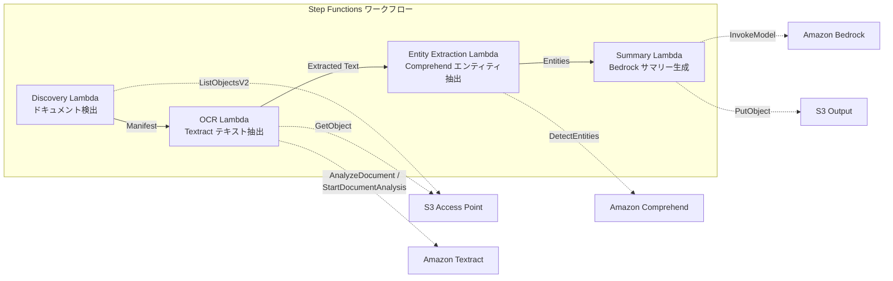

# UC2: 金融・保険 — 契約書・請求書の自動処理 (IDP)

🌐 **Language / 言語**: 日本語 | [English](README.en.md) | [한국어](README.ko.md) | [简体中文](README.zh-CN.md) | [繁體中文](README.zh-TW.md) | [Français](README.fr.md) | [Deutsch](README.de.md) | [Español](README.es.md)

📚 **ドキュメント**: [アーキテクチャ図](docs/architecture.md) | [デモガイド](docs/demo-guide.md)

## 概要

FSx for NetApp ONTAP の S3 Access Points を活用し、契約書・請求書などのドキュメントを自動で OCR 処理、エンティティ抽出、サマリー生成するサーバーレスワークフローです。

### このパターンが適しているケース

- ファイルサーバー上の PDF/TIFF/JPEG ドキュメントを定期的にバッチ OCR 処理したい
- 既存の NAS ワークフロー（スキャナー → ファイルサーバー保存）を変更せずに AI 処理を追加したい
- 契約書・請求書から日付、金額、組織名を自動抽出し、構造化データとして活用したい
- Textract + Comprehend + Bedrock の IDP パイプラインを最小コストで試したい

### このパターンが適さないケース

- ドキュメントアップロード直後のリアルタイム処理が必要
- 1 日数万件以上の大量ドキュメント処理（Textract の API レート制限に注意）
- Textract 非対応リージョンでクロスリージョン呼び出しのレイテンシーが許容できない
- ドキュメントが S3 標準バケットに既に存在し、S3 イベント通知で処理可能

### 主な機能

- S3 AP 経由で PDF、TIFF、JPEG ドキュメントを自動検出
- Amazon Textract による OCR テキスト抽出（同期/非同期 API 自動選択）
- Amazon Comprehend による Named Entity 抽出（日付、金額、組織名、人名）
- Amazon Bedrock による構造化サマリー生成

## アーキテクチャ



### ワークフローステップ

1. **Discovery**: S3 AP から PDF、TIFF、JPEG ドキュメントを検出し、Manifest を生成
2. **OCR**: ドキュメントのページ数に基づき Textract 同期/非同期 API を自動選択して OCR 実行
3. **Entity Extraction**: Comprehend で Named Entity（日付、金額、組織名、人名）を抽出
4. **Summary**: Bedrock で構造化サマリーを生成し、JSON 形式で S3 出力

## 前提条件

- AWS アカウントと適切な IAM 権限
- FSx for NetApp ONTAP ファイルシステム（ONTAP 9.17.1P4D3 以上）
- S3 Access Point が有効化されたボリューム
- ONTAP REST API 認証情報が Secrets Manager に登録済み
- VPC、プライベートサブネット
- Amazon Bedrock モデルアクセスが有効（Claude / Nova）
- Amazon Textract、Amazon Comprehend が利用可能なリージョン

## デプロイ手順

### 1. パラメータの準備

デプロイ前に以下の値を確認してください:

- FSx ONTAP S3 Access Point Alias
- ONTAP 管理 IP アドレス
- Secrets Manager シークレット名
- VPC ID、プライベートサブネット ID

### 2. CloudFormation デプロイ

```bash
aws cloudformation deploy \
  --template-file financial-idp/template.yaml \
  --stack-name fsxn-financial-idp \
  --parameter-overrides \
    S3AccessPointAlias=<your-volume-ext-s3alias> \
    S3AccessPointName=<your-s3ap-name> \
    S3AccessPointOutputAlias=<your-output-volume-ext-s3alias> \
    OntapSecretName=<your-ontap-secret-name> \
    OntapManagementIp=<your-ontap-management-ip> \
    ScheduleExpression="rate(1 hour)" \
    VpcId=<your-vpc-id> \
    PrivateSubnetIds=<subnet-1>,<subnet-2> \
    NotificationEmail=<your-email@example.com> \
    EnableVpcEndpoints=false \
    EnableCloudWatchAlarms=false \
  --capabilities CAPABILITY_IAM CAPABILITY_AUTO_EXPAND \
  --region ap-northeast-1
```

> **注意**: `<...>` のプレースホルダーを実際の環境値に置き換えてください。

### 3. SNS サブスクリプションの確認

デプロイ後、指定したメールアドレスに SNS サブスクリプション確認メールが届きます。

> **注意**: `S3AccessPointName` を省略すると、IAM ポリシーが Alias ベースのみとなり `AccessDenied` エラーが発生する場合があります。本番環境では指定を推奨します。詳細は [トラブルシューティングガイド](../docs/guides/troubleshooting-guide.md#1-accessdenied-エラー) を参照してください。


## 設定パラメータ一覧

| パラメータ | 説明 | デフォルト | 必須 |
|-----------|------|----------|------|
| `S3AccessPointAlias` | FSx ONTAP S3 AP Alias（入力用） | — | ✅ |
| `S3AccessPointName` | S3 AP 名（ARN ベースの IAM 権限付与用。省略時は Alias ベースのみ） | `""` | ⚠️ 推奨 |
| `S3AccessPointOutputAlias` | FSx ONTAP S3 AP Alias（出力用） | — | ✅ |
| `OntapSecretName` | ONTAP 認証情報の Secrets Manager シークレット名 | — | ✅ |
| `OntapManagementIp` | ONTAP クラスタ管理 IP アドレス | — | ✅ |
| `ScheduleExpression` | EventBridge Scheduler のスケジュール式 | `rate(1 hour)` | |
| `VpcId` | VPC ID | — | ✅ |
| `PrivateSubnetIds` | プライベートサブネット ID リスト | — | ✅ |
| `NotificationEmail` | SNS 通知先メールアドレス | — | ✅ |
| `EnableVpcEndpoints` | Interface VPC Endpoints の有効化 | `false` | |
| `EnableCloudWatchAlarms` | CloudWatch Alarms の有効化 | `false` | |

## コスト構造

### リクエストベース（従量課金）

| サービス | 課金単位 | 概算（100 ドキュメント/月） |
|---------|---------|--------------------------|
| Lambda | リクエスト数 + 実行時間 | ~$0.01 |
| Step Functions | ステート遷移数 | 無料枠内 |
| S3 API | リクエスト数 | ~$0.01 |
| Textract | ページ数 | ~$0.15 |
| Comprehend | ユニット数（100文字単位） | ~$0.03 |
| Bedrock | トークン数 | ~$0.10 |

### 常時稼働（オプショナル）

| サービス | パラメータ | 月額 |
|---------|-----------|------|
| Interface VPC Endpoints | `EnableVpcEndpoints=true` | ~$28.80 |
| CloudWatch Alarms | `EnableCloudWatchAlarms=true` | ~$0.30 |

> デモ/PoC 環境では変動費のみで **~$0.30/月** から利用可能です。

## 出力データ形式

Summary Lambda の出力 JSON:

```json
{
  "extracted_text": "契約書の全文テキスト...",
  "entities": [
    {"type": "DATE", "text": "2026年1月15日"},
    {"type": "ORGANIZATION", "text": "株式会社サンプル"},
    {"type": "QUANTITY", "text": "1,000,000円"}
  ],
  "summary": "本契約書は...",
  "document_key": "contracts/2026/sample-contract.pdf",
  "processed_at": "2026-01-15T10:00:00Z"
}
```

## クリーンアップ

```bash
# CloudFormation スタックの削除
aws cloudformation delete-stack \
  --stack-name fsxn-financial-idp \
  --region ap-northeast-1

# 削除完了を待機
aws cloudformation wait stack-delete-complete \
  --stack-name fsxn-financial-idp \
  --region ap-northeast-1
```

> **注意**: S3 バケットにオブジェクトが残っている場合、スタック削除が失敗することがあります。事前にバケットを空にしてください。

## Supported Regions

UC2 は以下のサービスを使用します:

| サービス | リージョン制約 |
|---------|-------------|
| Amazon Textract | ap-northeast-1 非対応。`TEXTRACT_REGION` パラメータで対応リージョン（us-east-1 等）を指定 |
| Amazon Comprehend | ほぼ全リージョンで利用可能 |
| Amazon Bedrock | 対応リージョンを確認（[Bedrock 対応リージョン](https://docs.aws.amazon.com/general/latest/gr/bedrock.html)） |
| AWS X-Ray | ほぼ全リージョンで利用可能 |
| CloudWatch EMF | ほぼ全リージョンで利用可能 |

> Cross-Region Client 経由で Textract API を呼び出します。データレジデンシー要件を確認してください。詳細は [リージョン互換性マトリックス](../docs/region-compatibility.md) を参照。

## 参考リンク

### AWS 公式ドキュメント

- [FSx ONTAP S3 Access Points 概要](https://docs.aws.amazon.com/fsx/latest/ONTAPGuide/accessing-data-via-s3-access-points.html)
- [Lambda でサーバーレス処理（公式チュートリアル）](https://docs.aws.amazon.com/fsx/latest/ONTAPGuide/tutorial-process-files-with-lambda.html)
- [Textract API リファレンス](https://docs.aws.amazon.com/textract/latest/dg/API_Reference.html)
- [Comprehend DetectEntities API](https://docs.aws.amazon.com/comprehend/latest/dg/API_DetectEntities.html)
- [Bedrock InvokeModel API リファレンス](https://docs.aws.amazon.com/bedrock/latest/APIReference/API_runtime_InvokeModel.html)

### AWS ブログ記事・ガイダンス

- [S3 AP 発表ブログ](https://aws.amazon.com/blogs/aws/amazon-fsx-for-netapp-ontap-now-integrates-with-amazon-s3-for-seamless-data-access/)
- [Step Functions + Bedrock ドキュメント処理](https://aws.amazon.com/blogs/compute/orchestrating-large-scale-document-processing-with-aws-step-functions-and-amazon-bedrock-batch-inference/)
- [IDP ガイダンス（Intelligent Document Processing on AWS）](https://aws.amazon.com/solutions/guidance/intelligent-document-processing-on-aws3/)

### GitHub サンプル

- [aws-samples/amazon-textract-serverless-large-scale-document-processing](https://github.com/aws-samples/amazon-textract-serverless-large-scale-document-processing) — Textract 大規模処理
- [aws-samples/serverless-patterns](https://github.com/aws-samples/serverless-patterns) — サーバーレスパターン集
- [aws-samples/aws-stepfunctions-examples](https://github.com/aws-samples/aws-stepfunctions-examples) — Step Functions サンプル


## 検証済み環境

| 項目 | 値 |
|------|-----|
| AWS リージョン | ap-northeast-1 (東京) |
| FSx ONTAP バージョン | ONTAP 9.17.1P4D3 |
| FSx 構成 | SINGLE_AZ_1 |
| Python | 3.12 |
| デプロイ方式 | CloudFormation (標準) |

## Lambda VPC 配置アーキテクチャ

検証で得た知見に基づき、Lambda 関数は VPC 内/外に分離配置されています。

**VPC 内 Lambda**（ONTAP REST API アクセスが必要な関数のみ）:
- Discovery Lambda — S3 AP + ONTAP API

**VPC 外 Lambda**（AWS マネージドサービス API のみ使用）:
- その他の全 Lambda 関数

> **理由**: VPC 内 Lambda から AWS マネージドサービス API（Athena, Bedrock, Textract 等）にアクセスするには Interface VPC Endpoint が必要（各 $7.20/月）。VPC 外 Lambda はインターネット経由で直接 AWS API にアクセスでき、追加コストなしで動作します。

> **注意**: ONTAP REST API を使用する UC（UC1 法務・コンプライアンス）では `EnableVpcEndpoints=true` が必須です。Secrets Manager VPC Endpoint 経由で ONTAP 認証情報を取得するためです。
