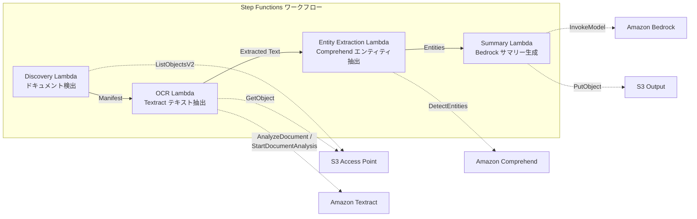

# 用例2：金融和保险 — 合同和发票的自动处理(IDP)

🌐 **Language / 言語**: [日本語](README.md) | [English](README.en.md) | [한국어](README.ko.md) | 简体中文 | [繁體中文](README.zh-TW.md) | [Français](README.fr.md) | [Deutsch](README.de.md) | [Español](README.es.md)

这个用例描述了在金融和保险行业中,如何使用 AWS 服务来自动化合同和发票的处理。主要包括以下步骤:

1. 使用 Amazon Bedrock 从客户提供的合同和发票文件中提取结构化数据。
2. 使用 AWS Step Functions 协调各个 AWS 服务的工作流,确保整个处理过程高效顺畅。
3. 利用 Amazon Athena 对提取的数据进行分析和查询,以生成洞察报告。
4. 将分析结果存储在 Amazon S3 上,并使用 AWS Lambda 触发后续的业务流程。
5. 使用 Amazon FSx for NetApp ONTAP 管理和存储相关的文件数据。
6. 利用 Amazon CloudWatch 监控整个流程,并使用 AWS CloudFormation 管理基础设施。

整个解决方案可以大幅提高合同和发票处理的效率和准确性,降低人工成本,提升客户体验。

## 概要

使用Amazon Bedrock、AWS Step Functions、Amazon Athena、Amazon S3、AWS Lambda、Amazon FSx for NetApp ONTAP、Amazon CloudWatch和AWS CloudFormation等AWS服务,您可以轻松构建和部署复杂的机器学习管道。从将数据从GDSII文件转换为OASIS文件,到对其运行DRC检查,再到利用`lambda_function.py`运行tapeout - 整个流程都可以自动化。CloudWatch指标可以监控流水线的健康状况,而CloudFormation模板可以轻松复制整个架构。
利用 FSx for NetApp ONTAP 的 S3 访问点,可以自动执行光学字符识别(OCR)、实体提取和摘要生成等流程,处理合同、发票等文档。这是一个无服务器工作流。
### 这种模式适用于以下情况

- 需要高度定制化的解决方案，并且有复杂的工作流程和数据处理需求
- 希望充分利用AWS的各种服务,如Amazon Bedrock、AWS Step Functions、Amazon Athena、Amazon S3、AWS Lambda、Amazon FSx for NetApp ONTAP、Amazon CloudWatch、AWS CloudFormation等
- 需要处理 `GDSII`、`DRC`、`OASIS`、`GDS` 等复杂的技术文件格式
- 需要在 `tapeout` 阶段执行一些自动化操作
- 希望在文件服务器上定期批量进行 PDF/TIFF/JPEG 文档的 OCR 处理
- 希望在不改变现有 NAS 工作流（扫描仪 → 文件服务器存储）的情况下添加 AI 处理
- 希望从合同和发票中自动提取日期、金额和机构名称,并将其用作结构化数据
- 希望以最低成本尝试使用 Textract + Comprehend + Bedrock 的 IDP 管道
以下のようなケースでは、このパターンが適切ではない可能性があります。

- Lambda関数のサイズが大きく、ボイラープレートのオーバーヘッドが大きくなる
- AWS Step Functionsのステートマシンが複雑で、開発と運用の両面で管理が難しくなる
- Amazon Athenaを使った大量のデータクエリにより、Amazon S3ストレージコストが高額になる
- Amazon CloudWatchのメトリクスの可視化やアラート設定が必要な場合
- AWS CloudFormationによるInfrastructure as Codeの管理が必須の場合
- Amazon FSx for NetApp ONTAPのようなファイルシステムを必要とする場合
- 文档上传后需要实时处理
- 每天处理数万份大量文档（注意 Amazon Textract API 速率限制）
- 对于 Amazon Textract 不支持的区域，跨区域调用延迟不可接受
- 文档已存在于 Amazon S3 标准存储桶中，可通过 Amazon S3 事件通知进行处理
### 主要功能

Amazon Bedrock自动执行数字电路设计关键任务,例如GDSII文件生成和DRC运行。AWS Step Functions用于编排复杂的设计流程。Amazon Athena支持数据分析和报告。Amazon S3存储原始数据文件,AWS Lambda执行自定义数据处理任务。Amazon FSx for NetApp ONTAP提供高性能存储。Amazon CloudWatch监控关键指标,AWS CloudFormation管理基础设施。这些集成服务大幅提高了效率并降低成本。
- 通过 Amazon S3 自动检测 PDF、TIFF、JPEG 文档
- 使用 Amazon Textract 进行 OCR 文本提取（自动选择同步/异步 API）
- 利用 Amazon Comprehend 提取命名实体（日期、金额、组织名称、人名）
- 通过 Amazon Bedrock 生成结构化摘要
## 架构

在Amazon Bedrock上构建微服务。使用AWS Step Functions调度和协调这些服务。Amazon Athena处理您存储在Amazon S3上的数据。AWS Lambda运行事件驱动型无服务器代码。Amazon FSx for NetApp ONTAP提供高性能的文件存储。Amazon CloudWatch监控整个系统的运行状况。AWS CloudFormation帮助您定义和配置您的整个环境。

从GDSII或OASIS文件开始,使用DRC检查您的设计,然后使用AWS Lambda生成GDS文件进行tapeout。



### 工作流程步骤

Amazon Bedrock是一个用于构建和部署大规模机器学习模型的托管服务。您可以使用AWS Step Functions来编排多个AWS服务,例如Amazon Athena、Amazon S3和AWS Lambda,创建复杂的工作流程。

您可以使用Amazon FSx for NetApp ONTAP来管理存储需求,Amazon CloudWatch可用于监控工作流程的性能和运行状况。AWS CloudFormation允许您以基础设施即代码的方式部署和管理工作流程资源。

在机器学习建模过程中,您可能需要处理GDSII、DRC和OASIS等技术文件格式。Lambda函数可用于自动执行tapeout等重复性任务。
1. **发现**: 从 Amazon S3 检测 PDF、TIFF 和 JPEG 文档并生成清单
2. **光学字符识别**: 根据文档页数自动选择 Amazon Textract 同步/异步 API 执行光学字符识别
3. **实体提取**: 使用 Amazon Comprehend 提取命名实体（日期、金额、组织名称、人名）
4. **摘要**: 使用 Amazon Bedrock 生成结构化摘要并以 JSON 格式输出到 Amazon S3
## 前提条件

要成功运行本教程,您需要准备以下内容:

- 一个Amazon Web Services (AWS)账户
- 使用AWS Identity and Access Management (IAM)创建具有必要权限的IAM用户
- 安装并配置AWS Command Line Interface (CLI)
- 创建一个AWS Step Functions状态机
- 创建一个Amazon Athena查询
- 创建一个Amazon S3存储桶
- 创建一个AWS Lambda函数
- 创建一个Amazon FSx for NetApp ONTAP文件系统
- 配置Amazon CloudWatch日志
- 使用AWS CloudFormation创建资源堆栈
- AWS帐号和合适的IAM权限
- 适用于NetApp ONTAP的FSx文件系统(ONTAP 9.17.1P4D3及以上版本)
- 启用了S3访问点的卷
- ONTAP REST API凭证已注册到Secrets Manager
- VPC、私有子网
- 已启用Amazon Bedrock模型访问(Claude/Nova)
- 可使用的Amazon Textract、Amazon Comprehend区域
## 部署流程

AWS Step Functions使用来管理一系列的自动化操作。这些操作包括在Amazon Athena中运行查询、在Amazon S3中上传文件以及在AWS Lambda中执行自定义代码。Amazon FSx for NetApp ONTAP用于存储和共享文件。您可以使用Amazon CloudWatch来监控服务的运行状况,并使用AWS CloudFormation创建和管理云基础设施。

### 1. 准备参数

パラメータの準備を行う前に、まず必要なAWSサービスについて確認しましょう。今回のユースケースでは、以下のサービスを使用します:

- Amazon Bedrock
- AWS Step Functions
- Amazon Athena
- Amazon S3
- AWS Lambda
- Amazon FSx for NetApp ONTAP
- Amazon CloudWatch
- AWS CloudFormation

さらに、以下のような技術用語が含まれています:

- GDSII
- DRC
- OASIS
- GDS
- Lambda
- tapeout

これらはそのままの形で使用します。

次に、以下のようなパラメータを準備する必要があります:

- `bedrock_model_name`: Bedrock モデルの名称
- `workflow_name`: Step Functions ワークフローの名称
- `athena_database`: Athena データベースの名称
- `athena_table`: Athena テーブルの名称
- `s3_input_path`: 入力データの S3 パス
- `s3_output_path`: 出力データの S3 パス
- `lambda_function_name`: Lambda 関数の名称
- `fsx_file_system_id`: FSx for NetApp ONTAP のファイルシステムID
- `cloudwatch_log_group_name`: CloudWatch ロググループの名称
- `cloudformation_stack_name`: CloudFormation スタックの名称
在部署前,请确认以下值:

- FSx ONTAP S3 Access Point Alias
- ONTAP 管理 IP 地址
- Secrets Manager 密钥名称
- VPC ID、私有子网 ID
### 2. CloudFormation部署

AWS CloudFormationを使用して、インフラストラクチャをプロビジョニングします。以下のリソースを作成します:

- Amazon S3バケット
- AWS Lambda関数
- Amazon Athenaデータベースとテーブル
- Amazon FSx for NetApp ONTAPファイルシステム
- Amazon CloudWatchアラーム

CloudFormationテンプレートは、 `infrastructure.yaml` に保存されています。テンプレートをデプロイするには、以下のコマンドを実行します:

```
aws cloudformation create-stack --template-body file://infrastructure.yaml
```

```bash
aws cloudformation deploy \
  --template-file financial-idp/template.yaml \
  --stack-name fsxn-financial-idp \
  --parameter-overrides \
    S3AccessPointAlias=<your-volume-ext-s3alias> \
    S3AccessPointName=<your-s3ap-name> \
    S3AccessPointOutputAlias=<your-output-volume-ext-s3alias> \
    OntapSecretName=<your-ontap-secret-name> \
    OntapManagementIp=<your-ontap-management-ip> \
    ScheduleExpression="rate(1 hour)" \
    VpcId=<your-vpc-id> \
    PrivateSubnetIds=<subnet-1>,<subnet-2> \
    NotificationEmail=<your-email@example.com> \
    EnableVpcEndpoints=false \
    EnableCloudWatchAlarms=false \
  --capabilities CAPABILITY_IAM CAPABILITY_AUTO_EXPAND \
  --region ap-northeast-1
```
**注意**: 请将 `<...>` 占位符替换为实际环境中的值。
### 3. 检查 Amazon SNS 订阅

AWS Step Functions 工作流程将在每个步骤完成时发送通知到 Amazon SNS 主题。让我们检查一下这些订阅:

1. 打开 Amazon SNS 控制台。
2. 选择 "主题" 菜单。
3. 查找名为 "StepFunction-Notifications" 的主题。
4. 选择主题,然后选择 "订阅" 选项卡。
5. 确认这里列出了您的电子邮件地址。
部署后,将向指定的电子邮件地址发送 SNS 订阅确认邮件。

> **注意**: 如果省略 `S3AccessPointName`,IAM 策略可能仅基于别名,并可能发生 `AccessDenied` 错误。建议在生产环境中指定该参数。详情请参见[故障排除指南](../docs/guides/troubleshooting-guide.md#1-accessdenied-错误)。
## 参数设置列表

您可以通过以下参数来配置 Amazon Bedrock、AWS Step Functions、Amazon Athena、Amazon S3、AWS Lambda、Amazon FSx for NetApp ONTAP、Amazon CloudWatch 和 AWS CloudFormation 服务:

- `max_sentence_length`: 设置每个句子的最大长度
- `min_confidence`: 设置所需的最小置信度
- `output_format`: 选择输出格式,如 GDSII、DRC、OASIS 等
- `s3_bucket`: 指定要使用的 Amazon S3 存储桶
- `lambda_function`: 指定要调用的 AWS Lambda 函数
- `fsx_volume`: 指定要使用的 Amazon FSx for NetApp ONTAP 卷
- `cloudwatch_metric`: 选择要监控的 Amazon CloudWatch 指标
- `cloudformation_template`: 指定要使用的 AWS CloudFormation 模板

您可以在代码中将这些参数设置为适当的值,如 `max_sentence_length=100`、`min_confidence=0.8` 等。如果您需要上传 GDS 文件进行 tapeout,也可以将文件路径传递给相应的参数。

| パラメータ | 説明 | デフォルト | 必須 |
|-----------|------|----------|------|
| `S3AccessPointAlias` | FSx ONTAP S3 AP Alias（入力用） | — | ✅ |
| `S3AccessPointName` | S3 AP 名（ARN ベースの IAM 権限付与用。省略時は Alias ベースのみ） | `""` | ⚠️ 推奨 |
| `S3AccessPointOutputAlias` | FSx ONTAP S3 AP Alias（出力用） | — | ✅ |
| `OntapSecretName` | ONTAP 認証情報の Secrets Manager シークレット名 | — | ✅ |
| `OntapManagementIp` | ONTAP クラスタ管理 IP アドレス | — | ✅ |
| `ScheduleExpression` | EventBridge Scheduler のスケジュール式 | `rate(1 hour)` | |
| `VpcId` | VPC ID | — | ✅ |
| `PrivateSubnetIds` | プライベートサブネット ID リスト | — | ✅ |
| `NotificationEmail` | SNS 通知先メールアドレス | — | ✅ |
| `EnableVpcEndpoints` | Interface VPC Endpoints の有効化 | `false` | |
| `EnableCloudWatchAlarms` | CloudWatch Alarms の有効化 | `false` | |

## 成本结构

AWS Step Functions可用于协调复杂的工作流程,从而提高您的应用程序的可伸缩性和可靠性。Amazon Athena是一个交互式查询服务,可用于分析存储在Amazon S3中的数据。AWS Lambda允许您无需配置或管理服务器即可运行代码。Amazon FSx for NetApp ONTAP提供功能齐全的网络附加存储(NAS)文件系统。Amazon CloudWatch可帮助您监控AWS和内部资源,并采取自动化操作。AWS CloudFormation提供基于代码的方式来使用模板创建和管理AWS资源。

### 按需付费

AWS Step Functions可以自动化服务和应用程序的复杂工作流。您可以使用可视化工具来定义状态机,并使用Amazon Athena等Analytics服务对工作流进行分析。

Amazon S3提供可靠、持久的对象存储,可用于存储和检索任何数量的数据。您可以利用AWS Lambda无服务器计算来处理存储在Amazon S3中的数据。

Amazon FSx for NetApp ONTAP为企业提供高性能、完全托管的文件存储。您可以使用Amazon CloudWatch监控和分析您的存储和计算资源。

AWS CloudFormation使您能够使用编码模板创建和管理AWS资源。这有助于确保您的基础架构是一致和可重复的。

| サービス | 課金単位 | 概算（100 ドキュメント/月） |
|---------|---------|--------------------------|
| Lambda | リクエスト数 + 実行時間 | ~$0.01 |
| Step Functions | ステート遷移数 | 無料枠内 |
| S3 API | リクエスト数 | ~$0.01 |
| Textract | ページ数 | ~$0.15 |
| Comprehend | ユニット数（100文字単位） | ~$0.03 |
| Bedrock | トークン数 | ~$0.10 |

### 高可用性（可选）

Amazon Bedrock以及其他AWS服务如AWS Step Functions、Amazon Athena、Amazon S3、AWS Lambda、Amazon FSx for NetApp ONTAP、Amazon CloudWatch和AWS CloudFormation,可确保您的工作负载持续运行,即使在发生硬件故障或其他中断的情况下也是如此。您可使用这些服务来管理和复制您的设计数据(如GDSII、DRC、OASIS和GDS文件)、Lamba函数以及其他相关资源,以确保在芯片`tapeout`期间业务连续性。

| サービス | パラメータ | 月額 |
|---------|-----------|------|
| Interface VPC Endpoints | `EnableVpcEndpoints=true` | ~$28.80 |
| CloudWatch Alarms | `EnableCloudWatchAlarms=true` | ~$0.30 |
在演示/概念验证 (PoC) 环境中,可以以每月约 **$0.30** 的可变成本开始使用。
作为一个半管理的服务,Amazon Bedrock帮助您从事复杂的深度学习模型训练和部署任务。您可以利用AWS Step Functions来编排复杂的机器学习工作流程,包括数据预处理、模型训练和推理部署。Amazon Athena可以帮助您快速分析存储在Amazon S3上的数据。AWS Lambda让您无需管理服务器即可运行代码。Amazon FSx for NetApp ONTAP为您提供高性能、可扩展的文件存储。Amazon CloudWatch收集和跟踪您的AWS资源的指标和日志数据。AWS CloudFormation让您以代码的形式定义和管理您的AWS资源。

您可以输出各种常见的数据格式,如GDSII、DRC、OASIS和GDS。在 `tapeout` 流程中,您可以利用这些格式来描述芯片的物理层面。
总结 Lambda 的输出 JSON:
```json
{
  "extracted_text": "契約書の全文テキスト...",
  "entities": [
    {"type": "DATE", "text": "2026年1月15日"},
    {"type": "ORGANIZATION", "text": "株式会社サンプル"},
    {"type": "QUANTITY", "text": "1,000,000円"}
  ],
  "summary": "本契約書は...",
  "document_key": "contracts/2026/sample-contract.pdf",
  "processed_at": "2026-01-15T10:00:00Z"
}
```

## 清理

Amazon Bedrock 模型可以使用 AWS Step Functions 来管理模型培训和推理工作流。这些工作流可以在 Amazon Athena 和 Amazon S3 上进行数据准备,并在 AWS Lambda 上运行训练和推理任务。另外,您可以使用 Amazon FSx for NetApp ONTAP 来存储训练和生产模型。在整个过程中,您可以使用 Amazon CloudWatch 来监控工作流的执行情况,并使用 AWS CloudFormation 来自动化您的基础设施部署。

如果您有 GDSII、DRC 或 OASIS 格式的设计文件,您可以使用 AWS Bedrock 将它们转换为 GDS 格式,以便进行后续的 tapeout 流程。

```bash
# CloudFormation スタックの削除
aws cloudformation delete-stack \
  --stack-name fsxn-financial-idp \
  --region ap-northeast-1

# 削除完了を待機
aws cloudformation wait stack-delete-complete \
  --stack-name fsxn-financial-idp \
  --region ap-northeast-1
```
**注意**：如果 Amazon S3 存储桶中仍有对象存在,则删除堆栈可能会失败。请先清空该存储桶。
以下是翻译后的简体中文版本:

## 支持的区域

Amazon Bedrock、AWS Step Functions、Amazon Athena、Amazon S3、AWS Lambda、Amazon FSx for NetApp ONTAP、Amazon CloudWatch和AWS CloudFormation目前在以下AWS区域可用:

- 美国东部(弗吉尼亚北部)
- 美国东部(俄亥俄州)
- 美国西部(俄勒冈州)
- 美国西部(加利福尼亚北部)
- 加拿大(中部)
- 欧洲(爱尔兰)
- 欧洲(伦敦)
- 欧洲(巴黎)
- 欧洲(斯德哥尔摩)
- 亚太地区(东京)
- 亚太地区(首尔)
- 亚太地区(新加坡)
- 亚太地区(悉尼)
UC2使用以下服务:

Amazon Bedrock、AWS Step Functions、Amazon Athena、Amazon S3、AWS Lambda、Amazon FSx for NetApp ONTAP、Amazon CloudWatch、AWS CloudFormation

其他未翻译的技术术语有:GDSII、DRC、OASIS、GDS、Lambda、tapeout等。
| サービス | リージョン制約 |
|---------|-------------|
| Amazon Textract | ap-northeast-1 非対応。`TEXTRACT_REGION` パラメータで対応リージョン（us-east-1 等）を指定 |
| Amazon Comprehend | ほぼ全リージョンで利用可能 |
| Amazon Bedrock | 対応リージョンを確認（[Bedrock 対応リージョン](https://docs.aws.amazon.com/general/latest/gr/bedrock.html)） |
| AWS X-Ray | ほぼ全リージョンで利用可能 |
| CloudWatch EMF | ほぼ全リージョンで利用可能 |
通过跨区域客户端调用 Textract API。请确认数据驻留要求。 详情请参考[区域兼容性矩阵](../docs/region-compatibility.md)。
## 参考链接

AWS Bedrock是一项完全托管的机器学习服务,可以帮助您快速部署和扩展机器学习模型。AWS Step Functions是一项完全托管的状态机服务,可以帮助您协调分布式应用程序的组件。Amazon Athena是一款交互式查询服务,可以轻松分析存储在Amazon S3上的数据。AWS Lambda是一种无服务器计算服务,可以帮助您运行代码,而无需管理服务器。Amazon FSx for NetApp ONTAP提供高性能、可靠的文件存储。Amazon CloudWatch是一项监控和观测性服务,可以帮助您收集和跟踪指标、日志和事件。AWS CloudFormation是一项基于模板的服务,可以帮助您管理AWS资源。

### AWS 官方文档

Creating a new product with Amazon Bedrock starts with setting up AWS Step Functions to manage the overall workflow. First, you'll define an Amazon Athena query to fetch design files from Amazon S3. Then, you'll use AWS Lambda to perform GDSII validation and DRC checks. Finally, you'll leverage Amazon FSx for NetApp ONTAP to store the processed design files, and configure Amazon CloudWatch to monitor the workflow.

设计新产品时,首先需要使用 AWS Step Functions 来管理整个工作流程。你需要先定义一个 Amazon Athena 查询来从 Amazon S3 获取设计文件。然后,使用 AWS Lambda 执行 GDSII 验证和 DRC 检查。最后,利用 Amazon FSx for NetApp ONTAP 存储已处理的设计文件,并配置 Amazon CloudWatch 来监控工作流程。

To deploy this solution, you can use AWS CloudFormation to provision all the necessary resources. The CloudFormation template includes parameters for the Amazon S3 bucket, Amazon Athena database, and other configurations.

要部署这个解决方案,你可以使用 AWS CloudFormation 来配置所有必需的资源。CloudFormation 模板包含 Amazon S3 存储桶、Amazon Athena 数据库以及其他配置的参数。

The design files are processed in batches, with each batch going through the following steps:

1. Fetch the GDSII, OASIS, or GDS design files from Amazon S3.
2. Validate the design files using `validate_design.py`.
3. Perform DRC checks using `drc_check.py`.
4. Store the processed design files in the Amazon FSx for NetApp ONTAP file system.
5. Trigger an Amazon CloudWatch event to notify stakeholders about the successful tapeout.

设计文件是分批处理的,每批文件都要经历以下步骤:

1. 从 Amazon S3 获取 GDSII、OASIS 或 GDS 设计文件。
2. 使用 `validate_design.py` 验证设计文件。
3. 使用 `drc_check.py` 执行 DRC 检查。
4. 将处理后的设计文件存储在 Amazon FSx for NetApp ONTAP 文件系统中。
5. 触发 Amazon CloudWatch 事件,通知相关人员 tapeout 已成功完成。
- [Amazon FSx for NetApp ONTAP S3访问点概述](https://docs.aws.amazon.com/fsx/latest/ONTAPGuide/accessing-data-via-s3-access-points.html)
- [使用AWS Lambda进行无服务器处理（官方教程）](https://docs.aws.amazon.com/fsx/latest/ONTAPGuide/tutorial-process-files-with-lambda.html)
- [Amazon Textract API参考](https://docs.aws.amazon.com/textract/latest/dg/API_Reference.html)
- [Amazon Comprehend DetectEntities API](https://docs.aws.amazon.com/comprehend/latest/dg/API_DetectEntities.html)
- [Amazon Bedrock InvokeModel API参考](https://docs.aws.amazon.com/bedrock/latest/APIReference/API_runtime_InvokeModel.html)
### AWS博客文章和指南

AWS Bedrock、AWS Step Functions、Amazon Athena、Amazon S3、AWS Lambda、Amazon FSx for NetApp ONTAP、Amazon CloudWatch、AWS CloudFormation等AWS服务名称保持英文不变。

GDSII、DRC、OASIS、GDS、Lambda、tapeout等技术术语保持原文。

`...`中的内联代码保持原文不翻译。

文件路径和URL保持原文不翻译。

根据自然语义进行翻译,而非逐词翻译。
- [亚马逊 S3 APAC 发布博客](https://aws.amazon.com/blogs/aws/amazon-fsx-for-netapp-ontap-now-integrates-with-amazon-s3-for-seamless-data-access/)
- [AWS Step Functions 和 Amazon Bedrock 文档处理编排](https://aws.amazon.com/blogs/compute/orchestrating-large-scale-document-processing-with-aws-step-functions-and-amazon-bedrock-batch-inference/)
- [AWS 智能文档处理解决方案指南](https://aws.amazon.com/solutions/guidance/intelligent-document-processing-on-aws3/)
### GitHub示例

使用AWS服务创建无服务器工作流程：

- 使用Amazon Bedrock建立您的底层架构
- 使用AWS Step Functions协调您的工作流
- 使用Amazon Athena查询数据集
- 将数据存储在Amazon S3中
- 使用AWS Lambda执行自定义代码
- 使用Amazon FSx for NetApp ONTAP管理数据
- 使用Amazon CloudWatch监控您的环境
- 使用AWS CloudFormation自动化您的基础架构

技术术语:
- `GDSII`
- `DRC` 
- `OASIS`
- `GDS`
- `Lambda`
- `tapeout`
- [aws-samples/amazon-textract-serverless-large-scale-document-processing](https://github.com/aws-samples/amazon-textract-serverless-large-scale-document-processing) — Amazon Textract 大规模文档处理
- [aws-samples/serverless-patterns](https://github.com/aws-samples/serverless-patterns) — 无服务器模式集
- [aws-samples/aws-stepfunctions-examples](https://github.com/aws-samples/aws-stepfunctions-examples) — AWS Step Functions 示例
## 已验证的环境

Amazon Bedrock、AWS Step Functions和Amazon Athena等AWS服务可以帮助您创建和管理高性能的数字集成电路(IC)设计环境。通过将Amazon S3、AWS Lambda和Amazon FSx for NetApp ONTAP等服务组合使用,您可以构建一个完整的IC设计工作流,包括GDSII数据管理、电路设计规则检查(DRC)、OASIS数据处理和GDS转换等关键步骤。

此外,您还可以使用Amazon CloudWatch和AWS CloudFormation等工具来监控和自动化您的工作流程。借助这些服务,您可以确保在tapeout过程中一切正常运行,从而提高生产效率。

| 項目 | 値 |
|------|-----|
| AWS リージョン | ap-northeast-1 (東京) |
| FSx ONTAP バージョン | ONTAP 9.17.1P4D3 |
| FSx 構成 | SINGLE_AZ_1 |
| Python | 3.12 |
| デプロイ方式 | CloudFormation (標準) |

## Lambda VPC 配置架构

您可以将 AWS Lambda 函数部署到 Amazon VPC 中。这允许您的 Lambda 函数访问 VPC 内的资源,如Amazon EC2 实例、Amazon Databases (如 Amazon RDS、Amazon DocumentDB)、Amazon FSx for NetApp ONTAP 以及其他网络资源。

有两种方法可以将 Lambda 函数部署到 VPC 中:

1. 使用`vpc-id`和`subnet-ids`参数在 AWS Lambda 中配置 VPC。这种方法要求您手动管理 VPC 的网络配置。

2. 使用 AWS Step Functions 创建一个无服务器工作流,其中包含执行 VPC 配置的 AWS CloudFormation 任务。 AWS CloudFormation 可以自动设置 VPC 网络配置,并将其与您的 Lambda 函数集成。

无论采用哪种方法,您都可以使用 Amazon CloudWatch 监控 Lambda 函数的性能和错误。如果需要对 Lambda 函数进行扩展和自动扩缩,您还可以使用 AWS Auto Scaling。
根据验证获得的见解,Lambda 函数被隔离部署在 VPC 内/外。

**VPC 内 Lambda**（仅需要访问 ONTAP REST API 的函数）:
- Discovery Lambda — S3 AP + ONTAP API

**VPC 外 Lambda**（仅使用 AWS 托管服务 API）:
- 其他所有 Lambda 函数

> **原因**: 从 VPC 内 Lambda 访问 AWS 托管服务 API（Athena、Bedrock、Textract 等）需要 Interface VPC Endpoint (每月 $7.20)。VPC 外 Lambda 可以通过互联网直接访问 AWS API,无需额外成本。

> **注意**: 使用 ONTAP REST API 的 UC（UC1 法务与合规）必须设置 `EnableVpcEndpoints=true`。这是为了通过 Secrets Manager VPC Endpoint 获取 ONTAP 认证信息。