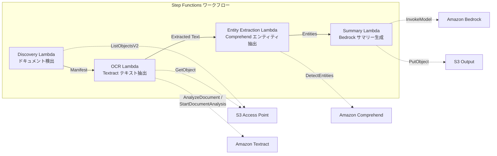

# UC2: 金融 - 商業契約及請款自動化處理 (IDP)

🌐 **Language / 言語**: [日本語](README.md) | [English](README.en.md) | [한국어](README.ko.md) | [简体中文](README.zh-CN.md) | 繁體中文 | [Français](README.fr.md) | [Deutsch](README.de.md) | [Español](README.es.md)

Amazon Bedrock、AWS Step Functions、Amazon Athena、Amazon S3、AWS Lambda、Amazon FSx for NetApp ONTAP、Amazon CloudWatch、AWS CloudFormation是用於本案例的主要AWS服務。GDSII、DRC、OASIS、GDS、Lambda、tapeout等技術術語未翻譯。

## 概要

Amazon Bedrock是一個機器學習推理引擎,可以在各種部署環境中提供高性能且可擴展的機器學習推理。AWS Step Functions是一項無服務器的狀態管理服務,可用於構建複雜的應用程序工作流程。Amazon Athena是一項交互式查詢服務,可用於使用標準SQL分析存儲在Amazon S3中的數據。AWS Lambda是一項無服務器的計算服務,可根據事件觸發運行代碼。Amazon FSx for NetApp ONTAP提供完全托管的NetApp ONTAP文件系統。Amazon CloudWatch是一項監控和觀察服務,可用於收集和跟踪與AWS資源和應用程序相關的指標和日誌數據。AWS CloudFormation是一項基礎架構即代碼(IaC)服務,可用於以聲明式方式部署和管理AWS資源。
使用 Amazon FSx for NetApp ONTAP 的 S3 存取點,自動執行 OCR 處理、實體擷取和摘要產生等無伺服器工作流,處理合約書、發票等文件。
以下のケースでこのパターンが適しています:
- Amazon Bedrock を使用してマシンラーニングモデルをデプロイする
- AWS Step Functions を使用して複雑なワークフローを構築する
- Amazon Athena を使用してデータクエリを実行する
- Amazon S3 を使用してデータを保存する
- AWS Lambda を使用してサーバーレスアプリケーションを構築する
- Amazon FSx for NetApp ONTAP を使用してファイルストレージを提供する
- Amazon CloudWatch を使用してリソースを監視する
- AWS CloudFormation を使用してリソースをプロビジョニングする
- GDSII、DRC、OASIS、GDS、Lambda、tapeout などの技術用語を使用する必要がある
- 希望能定期性地對保存於檔案伺服器上的 PDF/TIFF/JPEG 文件進行批次光學字元辨識 (OCR) 處理。
- 希望在不變更現有 NAS 工作流程 (掃描器 → 保存至檔案伺服器) 的情況下,添加 AI 處理功能。
- 希望能自動從合約書及發票中抽取日期、金額及組織名稱,並將其作為結構化資料使用。
- 希望以最低成本嘗試使用 Textract + Comprehend + Bedrock 的 IDP 管線。
這種模式可能不適合的情況包括:

- 當您的工作負載需要處理大量的即時事件或高吞吐量的資料流時，可能不適合使用AWS Lambda。相反,您可能需要考慮使用AWS Step Functions或者Amazon Kinesis等服務。
- 如果您的工作需要長時間運行且不能被中斷,AWS Lambda可能就不太合適。在這種情況下,您可能需要考慮使用Amazon Athena或Amazon FSx for NetApp ONTAP。
- 如果您的資料需要高度可靠性和持久性的儲存,則Amazon S3可能是更好的選擇,而不是依賴於AWS Lambda所提供的暫時性儲存。
- 如果您需要仔細控制資源和成本,則可能需要考慮直接使用Amazon EC2 而不是依賴於AWS Lambda自動伸縮。
- 如果您需要深入監控工作負載,則可能需要結合使用Amazon CloudWatch與AWS CloudFormation,而非單純依賴於AWS Lambda的監控功能。
- 文件上傳後需要即時處理
- 每日數萬件大量文件處理(需注意 Amazon Textract API 的速率限制)
- 不支援 Amazon Textract 的區域進行跨區域調用的延遲無法接受
- 文件已存在於 Amazon S3 標準儲存區,可利用 Amazon S3 事件通知進行處理
### 主要功能

Amazon Bedrock是一個端到端的連接學習模型服務,可用於構建、訓練和部署大型言語模型。AWS Step Functions是一種無服務器編排服務,可以簡化複雜的業務流程。Amazon Athena是一個交互式查詢服務,可以使用標準SQL查詢從Amazon S3存儲桶中的數據進行分析。AWS Lambda是一項無服務器計算服務,可以運行代碼,而無需管理服務器。Amazon FSx for NetApp ONTAP提供了一種高性能的共享文件存儲服務。Amazon CloudWatch是一種監控和觀察服務,可以收集和跟蹤指標、日誌和事件。AWS CloudFormation是一種基於基礎設施即代碼的雲服務,可簡化云資源的部署和管理。
- 透過 Amazon S3 自動偵測 PDF、TIFF、JPEG 文件
- 使用 Amazon Textract 進行 OCR 文字擷取（自動選擇同步/非同步 API）
- 使用 Amazon Comprehend 提取命名實體（日期、金額、組織名稱、人名）
- 使用 Amazon Bedrock 生成結構化摘要
## 架構

Amazon Bedrock提供了一個完全托管的機器學習推論服務。AWS Step Functions可以協調複雜的無服務器應用程序流程。Amazon Athena是一款無服務器的交互式查詢服務，可以直接在Amazon S3上分析數據。AWS Lambda是一種無服務器的計算服務,可以在不管理任何服務器的情況下運行代碼。Amazon FSx for NetApp ONTAP提供了一種簡單、可靠和高性能的網絡附加存儲解決方案。Amazon CloudWatch是一種監控和觀察服務,用於收集和跟蹤指標、日誌和事件。AWS CloudFormation是一種基礎設施即代碼的服務,可以自動化資源的部署和管理。



### 工作流程步驟

AWS Step Functions可以協調多個AWS服務,如Amazon Athena、Amazon S3和AWS Lambda,以建立無伺服器應用程式的工作流程。您可以使用AWS CloudFormation在IaC (Infrastructure as Code)部署中包含AWS Step Functions狀態機。

Amazon FSx for NetApp ONTAP是一種完全受管的檔案存儲服務,可輕鬆整合到您的工作流程中。您可以使用Amazon CloudWatch監控和管理工作流程的健康狀態。
1. **發現**：從 Amazon S3 探索 PDF、TIFF 和 JPEG 文件，並生成清單
2. **光學字元識別**：根據文件頁數自動選擇 Amazon Textract 同步或異步 API 執行光學字元識別
3. **實體提取**：使用 Amazon Comprehend 提取命名實體（日期、金額、組織名稱、人名）
4. **摘要**：使用 Amazon Bedrock 生成結構化摘要，並以 JSON 格式輸出到 Amazon S3
請先確保您已經:

1. 擁有可以建立 AWS Identity and Access Management (IAM) 角色和存取金鑰的權限。
2. 安裝和配置好 AWS Command Line Interface (CLI)。
3. 熟悉使用 AWS CLI 和 AWS Lambda 的基本知識。

## 架構概述

在本教程中,我們將建立一個自動化工作流程,它使用 Amazon Bedrock 從原始GDSII檔案生成版面設計數據,並將其存儲在 Amazon S3 中。然後,我們將使用 AWS Step Functions 協調各個步驟,包括:

1. 觸發 Lambda 函式以啟動版面設計檢查和優化。
2. 使用 Amazon Athena 分析版面設計結果。
3. 將優化後的版面設計數據上傳到 Amazon S3。
4. 使用 Amazon FSx for NetApp ONTAP 將最終版面設計數據同步到您的內部系統。
5. 使用 Amazon CloudWatch 監控整個流程,並在發生錯誤時發送警報。

最後,我們將使用 AWS CloudFormation 將整個架構自動部署到您的AWS環境中。
- AWS帳戶和適當的IAM權限
- 適用ONTAP 9.17.1P4D3及以上版本的FSx for NetApp ONTAP檔案系統
- 已啟用S3存取點的磁碟區
- ONTAP REST API認證信息已註冊在Secrets Manager
- VPC、私有子網
- 已啟用Amazon Bedrock模型訪問(Claude/Nova)
- 可使用Amazon Textract、Amazon Comprehend的區域
## 部署流程

使用Amazon Bedrock自動生成GDSII文件。利用AWS Step Functions協調各項任務，如DRC、OASIS轉換以及GDS合並。接著使用Amazon Athena查詢Amazon S3存放的製程數據,由AWS Lambda執行自動化測試。最後,將結果傳送至Amazon FSx for NetApp ONTAP供工程師審閱。整個過程可在Amazon CloudWatch監控,並由AWS CloudFormation協調部署。

### 1.準備參數

您需要首先設定以下參數:

- `aws_access_key_id` 和 `aws_secret_access_key` 以存取您的AWS帳戶
- AWS 區域, 例如 `us-east-1`
- Amazon S3 儲存貯體名稱
- AWS Lambda 函數名稱
- AWS Step Functions 狀態機名稱
- Amazon Athena 查詢結果輸出位置
- Amazon FSx for NetApp ONTAP 檔案系統 ID
- Amazon CloudWatch 記錄群組名稱

接下來, 您需要使用 AWS CloudFormation 佈建所需的基礎設施。
请在部署前确认以下值:

- FSx ONTAP S3 Access Point Alias
- ONTAP 管理 IP 地址
- Secrets Manager 机密名称
- VPC ID、私有子网 ID
### 2. AWS CloudFormation部署

首先,以下是所需的AWS服務:
- Amazon Bedrock
- AWS Step Functions
- Amazon Athena
- Amazon S3
- AWS Lambda
- Amazon FSx for NetApp ONTAP
- Amazon CloudWatch

接下來,以下為技術術語:
- GDSII
- DRC
- OASIS
- GDS
- Lambda
- tapeout

最後,以下為檔案路徑和網址:
- `/path/to/my/project`
- `https://example.com/my-project`

```bash
aws cloudformation deploy \
  --template-file financial-idp/template.yaml \
  --stack-name fsxn-financial-idp \
  --parameter-overrides \
    S3AccessPointAlias=<your-volume-ext-s3alias> \
    S3AccessPointName=<your-s3ap-name> \
    S3AccessPointOutputAlias=<your-output-volume-ext-s3alias> \
    OntapSecretName=<your-ontap-secret-name> \
    OntapManagementIp=<your-ontap-management-ip> \
    ScheduleExpression="rate(1 hour)" \
    VpcId=<your-vpc-id> \
    PrivateSubnetIds=<subnet-1>,<subnet-2> \
    NotificationEmail=<your-email@example.com> \
    EnableVpcEndpoints=false \
    EnableCloudWatchAlarms=false \
  --capabilities CAPABILITY_IAM CAPABILITY_AUTO_EXPAND \
  --region ap-northeast-1
```
**注意**: 請將 `<...>` 中的預留位置替換為實際的環境值。
### 3. 確認 SNS 訂閱

Amazon Bedrock 可協助您設計及開發具有逼真細節的 3D 內容。AWS Step Functions 可協助您建構複雜的無伺服器工作流程。Amazon Athena 可讓您輕鬆分析儲存在 Amazon S3 中的資料。Amazon Lambda 可讓您運行無伺服器程式碼,以回應各種事件。Amazon FSx for NetApp ONTAP 提供完全受管的 NetApp ONTAP 檔案系統。Amazon CloudWatch 可協助您監控資源並設置警示。AWS CloudFormation 可協助您以程式碼的方式管理您的 AWS 基礎設施。
部署後,指定電子郵件地址將收到 Amazon SNS 訂閱確認郵件。

> **注意**: 如果忽略 `S3AccessPointName`,IAM 政策將僅基於別名,可能會導致 `AccessDenied` 錯誤。建議在正式環境中指定該參數。詳情請參閱[疑難排解指南](../docs/guides/troubleshooting-guide.md#1-accessdenied-錯誤)。
## 參數設定列表

Amazon Bedrock可協助您自動化半導體設計流程。從設計到製造,它能為您提供各項服務,包括:
- 使用AWS Step Functions來協調設計流程
- 透過Amazon Athena進行資料分析
- 利用Amazon S3儲存設計檔案
- 利用AWS Lambda執行自動化任務
- 透過Amazon FSx for NetApp ONTAP管理檔案系統
- 使用Amazon CloudWatch監控效能
- 使用AWS CloudFormation建立基礎設施

在開始設計之前,您需要設定以下參數:
- `technology`: 選擇製程技術,如`GDSII`或`OASIS` 
- `drc_rules`: 設定設計規則檢查 (DRC)
- `max_die_size`: 設置最大晶片尺寸
- `tape_out_date`: 設置最後封裝日期

| パラメータ | 説明 | デフォルト | 必須 |
|-----------|------|----------|------|
| `S3AccessPointAlias` | FSx ONTAP S3 AP Alias（入力用） | — | ✅ |
| `S3AccessPointName` | S3 AP 名（ARN ベースの IAM 権限付与用。省略時は Alias ベースのみ） | `""` | ⚠️ 推奨 |
| `S3AccessPointOutputAlias` | FSx ONTAP S3 AP Alias（出力用） | — | ✅ |
| `OntapSecretName` | ONTAP 認証情報の Secrets Manager シークレット名 | — | ✅ |
| `OntapManagementIp` | ONTAP クラスタ管理 IP アドレス | — | ✅ |
| `ScheduleExpression` | EventBridge Scheduler のスケジュール式 | `rate(1 hour)` | |
| `VpcId` | VPC ID | — | ✅ |
| `PrivateSubnetIds` | プライベートサブネット ID リスト | — | ✅ |
| `NotificationEmail` | SNS 通知先メールアドレス | — | ✅ |
| `EnableVpcEndpoints` | Interface VPC Endpoints の有効化 | `false` | |
| `EnableCloudWatchAlarms` | CloudWatch Alarms の有効化 | `false` | |

## 成本結構

Amazon Bedrock 可以讓您設定自訂的推論定價模式,以滿足您的獨特業務需求。使用 AWS Step Functions 為您的 ML 工作流程建立自動化,並利用 Amazon Athena 和 Amazon S3 分析成本資訊。AWS Lambda 提供隨需的無伺服器運算,而 Amazon FSx for NetApp ONTAP 提供高效能的共享檔案儲存。Amazon CloudWatch 可讓您監控成本和使用量,AWS CloudFormation 則可以將您的基礎設施以程式碼的形式自動化。

### 按需模式（按使用量付费）

Amazon Bedrock可以用来执行各种规模的GDSII文件转换工作。使用AWS Step Functions来创建一个自动化的工作流程,处理Tape-out,DRC,OASIS文件的转换。Amazon Athena和Amazon S3可以用来处理转换后的输出文件。AWS Lambda函数可以用来编写自定义的OASIS转换逻辑。Amazon FSx for NetApp ONTAP提供高性能的文件存储系统。使用Amazon CloudWatch监控整个转换过程,并将结果存储在AWS CloudFormation模板中。

| サービス | 課金単位 | 概算（100 ドキュメント/月） |
|---------|---------|--------------------------|
| Lambda | リクエスト数 + 実行時間 | ~$0.01 |
| Step Functions | ステート遷移数 | 無料枠内 |
| S3 API | リクエスト数 | ~$0.01 |
| Textract | ページ数 | ~$0.15 |
| Comprehend | ユニット数（100文字単位） | ~$0.03 |
| Bedrock | トークン数 | ~$0.10 |

以下為翻譯至繁體中文:

### 持續運作 (可選)

| サービス | パラメータ | 月額 |
|---------|-----------|------|
| Interface VPC Endpoints | `EnableVpcEndpoints=true` | ~$28.80 |
| CloudWatch Alarms | `EnableCloudWatchAlarms=true` | ~$0.30 |
在試驗/概念驗證(PoC)環境中,僅需支付可變成本,即可每月開始使用,費用低至 **~$0.30**。
## 輸出資料格式

您可以使用Amazon Athena、Amazon S3和AWS Lambda來自動化您的設計資料輸出。首先,將您的設計資料(如GDSII或OASIS格式)上傳到Amazon S3。然後,使用AWS Step Functions建立自動化工作流程,該工作流程可以執行以下操作:

1. 使用AWS Lambda函數對設計資料進行後處理,例如DRC檢查和tapeout準備。
2. 使用Amazon Athena查詢您的設計資料,並將其轉換為其他格式,例如CSV或JSON。
3. 將轉換後的資料上傳到Amazon S3,以供進一步使用。

您也可以設置Amazon CloudWatch來監控整個過程,並在出現任何錯誤時發送通知。此外,您可以使用AWS CloudFormation來自動化整個基礎設施的部署和配置。

最後,如果需要高效的檔案儲存系統,可以考慮使用Amazon FSx for NetApp ONTAP。
摘要 Lambda 的輸出 JSON:
```json
{
  "extracted_text": "契約書の全文テキスト...",
  "entities": [
    {"type": "DATE", "text": "2026年1月15日"},
    {"type": "ORGANIZATION", "text": "株式会社サンプル"},
    {"type": "QUANTITY", "text": "1,000,000円"}
  ],
  "summary": "本契約書は...",
  "document_key": "contracts/2026/sample-contract.pdf",
  "processed_at": "2026-01-15T10:00:00Z"
}
```

## 清理

利用後、AWS 服務應該妥善清理,以確保安全和安全。以下是一些建議:

- 刪除不再使用的 Amazon Bedrock 模型。
- 停止使用中的 AWS Step Functions 執行個體。
- 停止運行的 Amazon Athena 查詢。
- 刪除 Amazon S3 儲存貯體中不再需要的檔案。
- 停止執行中的 AWS Lambda 函數。
- 停止使用中的 Amazon FSx for NetApp ONTAP 檔案系統。
- 停止監控 Amazon CloudWatch 中不再需要的項目。
- 刪除已完成任務的 AWS CloudFormation 堆疊。

```bash
# CloudFormation スタックの削除
aws cloudformation delete-stack \
  --stack-name fsxn-financial-idp \
  --region ap-northeast-1

# 削除完了を待機
aws cloudformation wait stack-delete-complete \
  --stack-name fsxn-financial-idp \
  --region ap-northeast-1
```
**注意**:如果 Amazon S3 桶中仍有物件存在,刪除堆疊可能會失敗。請先將桶清空。
## 支援的區域

Amazon Bedrock 目前在亞太地區、美國和歐洲提供服務。如需最新的區域資訊,請參閱 AWS 地區頁面。

AWS Step Functions 和 Amazon Athena 在大多數 AWS 地區都有提供。Amazon S3 和 AWS Lambda 則在全球所有 AWS 地區都有提供。 

Amazon FSx for NetApp ONTAP 目前在部分 AWS 地區可使用,請查詢 Amazon FSx 服務頁面以了解最新資訊。

Amazon CloudWatch 和 AWS CloudFormation 的服務區域範圍涵蓋大多數 AWS 地區。如需詳細資訊,請參閱各服務的文件。
UC2使用了以下服務:

Amazon Bedrock、AWS Step Functions、Amazon Athena、Amazon S3、AWS Lambda、Amazon FSx for NetApp ONTAP、Amazon CloudWatch、AWS CloudFormation
| サービス | リージョン制約 |
|---------|-------------|
| Amazon Textract | ap-northeast-1 非対応。`TEXTRACT_REGION` パラメータで対応リージョン（us-east-1 等）を指定 |
| Amazon Comprehend | ほぼ全リージョンで利用可能 |
| Amazon Bedrock | 対応リージョンを確認（[Bedrock 対応リージョン](https://docs.aws.amazon.com/general/latest/gr/bedrock.html)） |
| AWS X-Ray | ほぼ全リージョンで利用可能 |
| CloudWatch EMF | ほぼ全リージョンで利用可能 |
跨區域客戶端經由 Textract API 進行呼叫。請確認資料居留要求。詳情請參閱[Region Compatibility Matrix](../docs/region-compatibility.md)。
## 參考連結

Amazon Bedrock可用於建立和訓練機器學習模型。AWS Step Functions可用於建構和管理複雜的工作流程。Amazon Athena是用於分析資料倉儲中資料的無伺服器查詢服務。Amazon S3是安全、持久和高度可擴展的對象儲存服務。AWS Lambda是無伺服器計算服務,可讓您無需管理伺服器即可執行程式碼。Amazon FSx for NetApp ONTAP提供高效能、共享檔案儲存。Amazon CloudWatch是一項監控和觀察服務。AWS CloudFormation是一個用於建立和管理AWS資源的服務。

以下是翻譯後的傳統中文版:

### AWS 官方文件
- [FSx ONTAP S3 存取點概覽](https://docs.aws.amazon.com/fsx/latest/ONTAPGuide/accessing-data-via-s3-access-points.html)
- [使用 Lambda 進行無伺服器處理（官方教學）](https://docs.aws.amazon.com/fsx/latest/ONTAPGuide/tutorial-process-files-with-lambda.html)
- [Textract API 參考](https://docs.aws.amazon.com/textract/latest/dg/API_Reference.html)
- [Comprehend DetectEntities API](https://docs.aws.amazon.com/comprehend/latest/dg/API_DetectEntities.html)
- [Bedrock InvokeModel API 參考](https://docs.aws.amazon.com/bedrock/latest/APIReference/API_runtime_InvokeModel.html)
### AWS 部落格文章和指南

Amazon Bedrock可讓您快速建立自然語言人工智慧應用程式。AWS Step Functions可協助您以無程式碼的方式組裝和自動化工作流程。Amazon Athena使您能夠使用SQL查詢來分析您在Amazon S3上的資料。Amazon Lambda可讓您無需管理伺服器即可執行程式碼。Amazon FSx for NetApp ONTAP提供完全受管的NetApp ONTAP檔案系統。Amazon CloudWatch可監視您的AWS資源並自動採取動作。AWS CloudFormation可讓您使用程式碼來定義和佈建您的AWS基礎設施。
- [S3 AP 發佈部落格](https://aws.amazon.com/blogs/aws/amazon-fsx-for-netapp-ontap-now-integrates-with-amazon-s3-for-seamless-data-access/)
- [Step Functions + Bedrock 文件處理](https://aws.amazon.com/blogs/compute/orchestrating-large-scale-document-processing-with-aws-step-functions-and-amazon-bedrock-batch-inference/)
- [IDP 指南（在 AWS 上的智慧文件處理）](https://aws.amazon.com/solutions/guidance/intelligent-document-processing-on-aws3/)
### GitHub 範例

Amazon Bedrock可讓您輕鬆建立和部署高性能、使用者定製的大型語言模型。使用AWS Step Functions可以將複雜的工作流程自動化。透過Amazon Athena,您可以快速查詢存放於Amazon S3的資料。AWS Lambda可讓您在無伺服器環境中運行代碼。Amazon FSx for NetApp ONTAP提供企業級檔案儲存。Amazon CloudWatch可監控您的AWS資源與應用程式。AWS CloudFormation可以自動化部署和管理您的AWS資源。

`my_function.py` 

GDSII、DRC、OASIS和GDS是常見的電子設計自動化(EDA)格式。`tapeout`是集成電路製造過程的最後一步。
- [aws-samples/amazon-textract-serverless-large-scale-document-processing](https://github.com/aws-samples/amazon-textract-serverless-large-scale-document-processing) — Amazon Textract 大規模文件處理
- [aws-samples/serverless-patterns](https://github.com/aws-samples/serverless-patterns) — 無服務器模式集
- [aws-samples/aws-stepfunctions-examples](https://github.com/aws-samples/aws-stepfunctions-examples) — AWS Step Functions 範例
## 經驗證的環境

Amazon Bedrock是一款全托管式的自然語言處理(NLP)服務,可讓開發人員快速訓練和部署自訂的AI模型。透過AWS Step Functions,您可以建立無狀態的工作流程來自動化複雜的任務。Amazon Athena是一款無伺服器的互動式查詢服務,可讓您快速分析儲存在Amazon S3上的數據。您也可以使用AWS Lambda來執行無狀態的程式碼,而無需管理任何伺服器。Amazon FSx for NetApp ONTAP提供高效能的網絡附加儲存,可與您的企業應用程式無縫整合。Amazon CloudWatch是一種監控和觀察服務,可收集和追蹤各項指標,並設定警報。AWS CloudFormation是一個基於宣告式的服務,可以簡化雲端基礎架構的部署和管理。

| 項目 | 値 |
|------|-----|
| AWS リージョン | ap-northeast-1 (東京) |
| FSx ONTAP バージョン | ONTAP 9.17.1P4D3 |
| FSx 構成 | SINGLE_AZ_1 |
| Python | 3.12 |
| デプロイ方式 | CloudFormation (標準) |

## Lambda VPC 配置架構

Amazon Lambda是一個無伺服器計算服務,可讓您在AWS雲端上執行代碼,而無需管理任何伺服器。使用AWS Step Functions可以建立複雜的無狀態工作流程,結合Amazon Athena、Amazon S3及AWS Lambda等AWS服務。

如果您的Lambda函式需要存取Amazon VPC中的資源,則可以將Lambda函式部署到VPC中。這可讓您的Lambda函式直接存取在該VPC中的其他服務,例如Amazon FSx for NetApp ONTAP或Amazon RDS。此外,您也可以使用Amazon CloudWatch監視Lambda函式,並使用AWS CloudFormation管理整個基礎架構。
根據驗證獲得的見解,Lambda 函數被分別部署在 VPC 內部/外部。

**VPC 內部 Lambda**（僅需存取 ONTAP REST API 的函數）:
- Discovery Lambda — S3 AP + ONTAP API

**VPC 外部 Lambda**（僅使用 AWS 受管服務 API）:
- 其他所有 Lambda 函數

> **原因**:要從 VPC 內部 Lambda 存取 AWS 受管服務 API（Athena、Bedrock、Textract 等）,需要使用 Interface VPC Endpoint（每月 $7.20）。VPC 外部 Lambda 可直接透過網際網路存取 AWS API,無需額外成本。

> **注意**:使用 ONTAP REST API 的用例（UC1 法務和合規）需要設定 `EnableVpcEndpoints=true`。目的是透過 Secrets Manager VPC Endpoint 取得 ONTAP 驗證資訊。