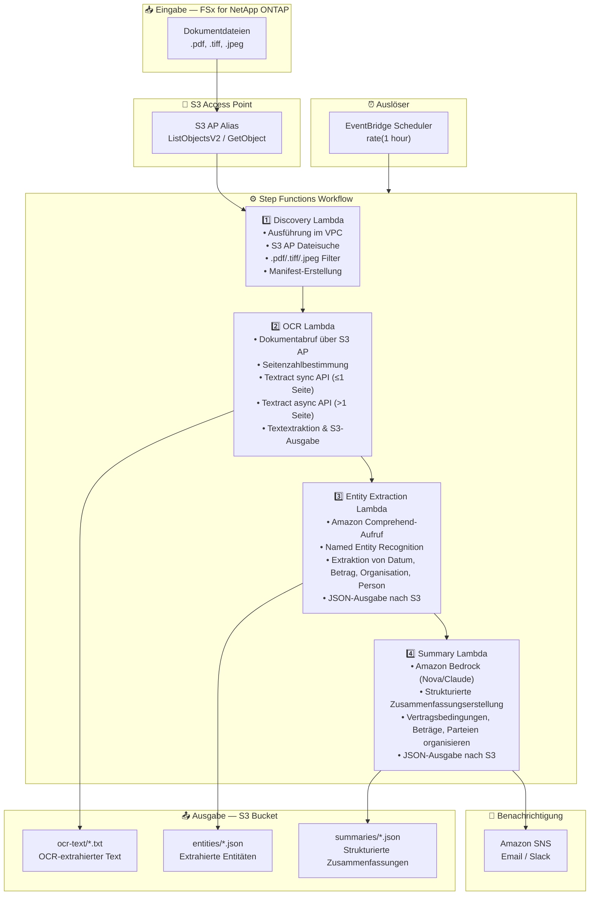

# UC2: Finanzen / Versicherung — Automatisierte Vertrags- und Rechnungsverarbeitung (IDP)

🌐 **Language / 言語**: [日本語](architecture.md) | [English](architecture.en.md) | [한국어](architecture.ko.md) | [简体中文](architecture.zh-CN.md) | [繁體中文](architecture.zh-TW.md) | [Français](architecture.fr.md) | Deutsch | [Español](architecture.es.md)

## End-to-End-Architektur (Eingabe → Ausgabe)

---

## Architekturdiagramm

---

## Datenfluss-Details

### Eingabe
| Element | Beschreibung |
|---------|--------------|
| **Quelle** | FSx for NetApp ONTAP Volume |
| **Dateitypen** | .pdf, .tiff, .tif, .jpeg, .jpg (gescannte und elektronische Dokumente) |
| **Zugriffsmethode** | S3 Access Point (ListObjectsV2 + GetObject) |
| **Lesestrategie** | Vollständiger Dateiabruf (für OCR-Verarbeitung erforderlich) |

### Verarbeitung
| Schritt | Service | Funktion |
|---------|---------|----------|
| Discovery | Lambda (VPC) | Dokumentdateien über S3 AP entdecken, Manifest erstellen |
| OCR | Lambda + Textract | Automatische Auswahl der sync/async API basierend auf Seitenzahl für Textextraktion |
| Entity Extraction | Lambda + Comprehend | Named Entity Recognition (Daten, Beträge, Organisationen, Personen) |
| Summary | Lambda + Bedrock | Strukturierte Zusammenfassungserstellung (Vertragsbedingungen, Beträge, Parteien) |

### Ausgabe
| Artefakt | Format | Beschreibung |
|----------|--------|--------------|
| OCR-Text | `ocr-text/YYYY/MM/DD/{stem}.txt` | Von Textract extrahierter Text |
| Entitäten | `entities/YYYY/MM/DD/{stem}.json` | Von Comprehend extrahierte Entitäten |
| Zusammenfassung | `summaries/YYYY/MM/DD/{stem}_summary.json` | Strukturierte Zusammenfassung von Bedrock |
| SNS-Benachrichtigung | Email | Verarbeitungsabschluss-Benachrichtigung (Verarbeitungsanzahl & Fehleranzahl) |

---

## Wichtige Designentscheidungen

1. **S3 AP statt NFS** — Kein NFS-Mount von Lambda erforderlich; Dokumente werden über S3 API abgerufen
2. **Textract sync/async Automatikauswahl** — Sync API für Einzelseiten (geringe Latenz), async API für mehrseitige Dokumente (hohe Kapazität)
3. **Comprehend + Bedrock Zwei-Stufen-Ansatz** — Comprehend für strukturierte Entitätsextraktion, Bedrock für natürlichsprachliche Zusammenfassungserstellung
4. **JSON-strukturierte Ausgabe** — Erleichtert die Integration mit nachgelagerten Systemen (RPA, Kernsysteme)
5. **Datumspartitionierung** — Verzeichnisaufteilung nach Verarbeitungsdatum für einfache Wiederverarbeitung und Historienverwaltung
6. **Polling (nicht ereignisgesteuert)** — S3 AP unterstützt keine Ereignisbenachrichtigungen, daher wird eine periodische geplante Ausführung verwendet

---

## Verwendete AWS-Services

| Service | Rolle |
|---------|-------|
| FSx for NetApp ONTAP | Enterprise-Dateispeicher (Verträge und Rechnungen) |
| S3 Access Points | Serverloser Zugriff auf ONTAP-Volumes |
| EventBridge Scheduler | Periodischer Auslöser |
| Step Functions | Workflow-Orchestrierung |
| Lambda | Compute (Discovery, OCR, Entity Extraction, Summary) |
| Amazon Textract | OCR-Textextraktion (sync/async API) |
| Amazon Comprehend | Named Entity Recognition (NER) |
| Amazon Bedrock | KI-Zusammenfassungserstellung (Nova / Claude) |
| SNS | Verarbeitungsabschluss-Benachrichtigung |
| Secrets Manager | ONTAP REST API-Anmeldeinformationsverwaltung |
| CloudWatch + X-Ray | Observability |
