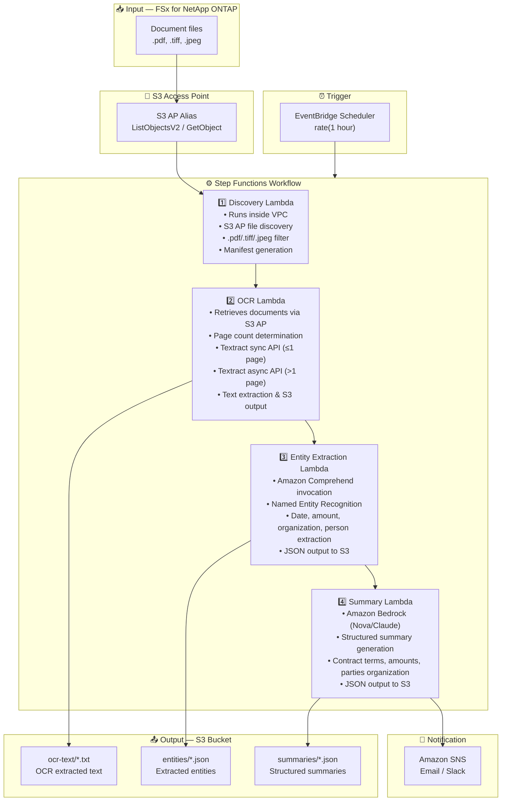

# UC2: Finance / Insurance — Automated Contract & Invoice Processing (IDP)

🌐 **Language / 言語**: [日本語](architecture.md) | English | [한국어](architecture.ko.md) | [简体中文](architecture.zh-CN.md) | [繁體中文](architecture.zh-TW.md) | [Français](architecture.fr.md) | [Deutsch](architecture.de.md) | [Español](architecture.es.md)

## End-to-End Architecture (Input → Output)

---

## Architecture Diagram

---

## Data Flow Detail

### Input
| Item | Description |
|------|-------------|
| **Source** | FSx for NetApp ONTAP volume |
| **File Types** | .pdf, .tiff, .tif, .jpeg, .jpg (scanned & electronic documents) |
| **Access Method** | S3 Access Point (ListObjectsV2 + GetObject) |
| **Read Strategy** | Full file retrieval (required for OCR processing) |

### Processing
| Step | Service | Function |
|------|---------|----------|
| Discovery | Lambda (VPC) | Discover document files via S3 AP, generate manifest |
| OCR | Lambda + Textract | Auto-select sync/async API based on page count for text extraction |
| Entity Extraction | Lambda + Comprehend | Named Entity Recognition (dates, amounts, organizations, persons) |
| Summary | Lambda + Bedrock | Structured summary generation (contract terms, amounts, parties) |

### Output
| Artifact | Format | Description |
|----------|--------|-------------|
| OCR Text | `ocr-text/YYYY/MM/DD/{stem}.txt` | Textract extracted text |
| Entities | `entities/YYYY/MM/DD/{stem}.json` | Comprehend extracted entities |
| Summary | `summaries/YYYY/MM/DD/{stem}_summary.json` | Bedrock structured summary |
| SNS Notification | Email | Processing completion notification (processed count & error count) |

---

## Key Design Decisions

1. **S3 AP over NFS** — No NFS mount needed from Lambda; documents retrieved via S3 API
2. **Textract sync/async auto-selection** — Sync API for single pages (low latency), async API for multi-page documents (high capacity)
3. **Comprehend + Bedrock two-stage approach** — Comprehend for structured entity extraction, Bedrock for natural language summary generation
4. **JSON structured output** — Facilitates integration with downstream systems (RPA, core business systems)
5. **Date partitioning** — Directory split by processing date for easy reprocessing and history management
6. **Polling (not event-driven)** — S3 AP does not support event notifications, so periodic scheduled execution is used

---

## AWS Services Used

| Service | Role |
|---------|------|
| FSx for NetApp ONTAP | Enterprise file storage (contracts & invoices) |
| S3 Access Points | Serverless access to ONTAP volumes |
| EventBridge Scheduler | Periodic trigger |
| Step Functions | Workflow orchestration |
| Lambda | Compute (Discovery, OCR, Entity Extraction, Summary) |
| Amazon Textract | OCR text extraction (sync/async API) |
| Amazon Comprehend | Named Entity Recognition (NER) |
| Amazon Bedrock | AI summary generation (Nova / Claude) |
| SNS | Processing completion notification |
| Secrets Manager | ONTAP REST API credential management |
| CloudWatch + X-Ray | Observability |
