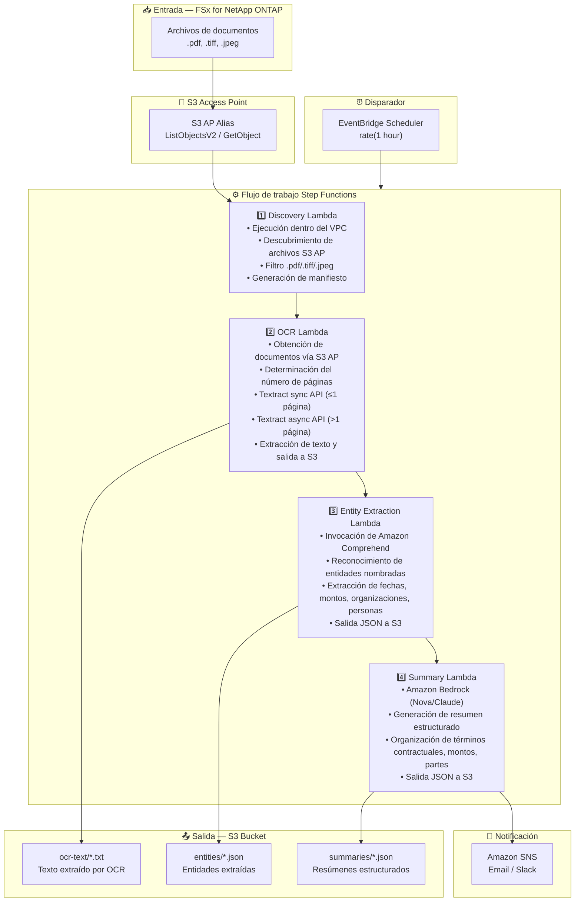

# UC2: Finanzas / Seguros — Procesamiento automatizado de contratos y facturas (IDP)

🌐 **Language / 言語**: [日本語](architecture.md) | [English](architecture.en.md) | [한국어](architecture.ko.md) | [简体中文](architecture.zh-CN.md) | [繁體中文](architecture.zh-TW.md) | [Français](architecture.fr.md) | [Deutsch](architecture.de.md) | Español

## Arquitectura de extremo a extremo (Entrada → Salida)

---

## Diagrama de arquitectura

---

## Detalle del flujo de datos

### Entrada
| Elemento | Descripción |
|----------|-------------|
| **Origen** | Volumen FSx for NetApp ONTAP |
| **Tipos de archivo** | .pdf, .tiff, .tif, .jpeg, .jpg (documentos escaneados y electrónicos) |
| **Método de acceso** | S3 Access Point (ListObjectsV2 + GetObject) |
| **Estrategia de lectura** | Obtención completa del archivo (necesaria para procesamiento OCR) |

### Procesamiento
| Paso | Servicio | Función |
|------|----------|---------|
| Discovery | Lambda (VPC) | Descubrir archivos de documentos vía S3 AP, generar manifiesto |
| OCR | Lambda + Textract | Selección automática de API sync/async según número de páginas para extracción de texto |
| Entity Extraction | Lambda + Comprehend | Reconocimiento de entidades nombradas (fechas, montos, organizaciones, personas) |
| Summary | Lambda + Bedrock | Generación de resumen estructurado (términos contractuales, montos, partes) |

### Salida
| Artefacto | Formato | Descripción |
|-----------|---------|-------------|
| Texto OCR | `ocr-text/YYYY/MM/DD/{stem}.txt` | Texto extraído por Textract |
| Entidades | `entities/YYYY/MM/DD/{stem}.json` | Entidades extraídas por Comprehend |
| Resumen | `summaries/YYYY/MM/DD/{stem}_summary.json` | Resumen estructurado de Bedrock |
| Notificación SNS | Email | Notificación de finalización de procesamiento (cantidad procesada y cantidad de errores) |

---

## Decisiones de diseño clave

1. **S3 AP en lugar de NFS** — No se necesita montaje NFS desde Lambda; documentos obtenidos vía API S3
2. **Selección automática Textract sync/async** — API sync para páginas individuales (baja latencia), API async para documentos multipágina (alta capacidad)
3. **Enfoque de dos etapas Comprehend + Bedrock** — Comprehend para extracción estructurada de entidades, Bedrock para generación de resúmenes en lenguaje natural
4. **Salida estructurada JSON** — Facilita la integración con sistemas posteriores (RPA, sistemas centrales de negocio)
5. **Particionamiento por fecha** — División de directorios por fecha de procesamiento para facilitar reprocesamiento y gestión de historial
6. **Sondeo periódico (no basado en eventos)** — S3 AP no admite notificaciones de eventos, por lo que se utiliza ejecución programada periódica

---

## Servicios AWS utilizados

| Servicio | Rol |
|----------|-----|
| FSx for NetApp ONTAP | Almacenamiento de archivos empresarial (contratos y facturas) |
| S3 Access Points | Acceso serverless a volúmenes ONTAP |
| EventBridge Scheduler | Disparador periódico |
| Step Functions | Orquestación de flujo de trabajo |
| Lambda | Cómputo (Discovery, OCR, Entity Extraction, Summary) |
| Amazon Textract | Extracción de texto OCR (API sync/async) |
| Amazon Comprehend | Reconocimiento de entidades nombradas (NER) |
| Amazon Bedrock | Generación de resumen IA (Nova / Claude) |
| SNS | Notificación de finalización de procesamiento |
| Secrets Manager | Gestión de credenciales ONTAP REST API |
| CloudWatch + X-Ray | Observabilidad |
