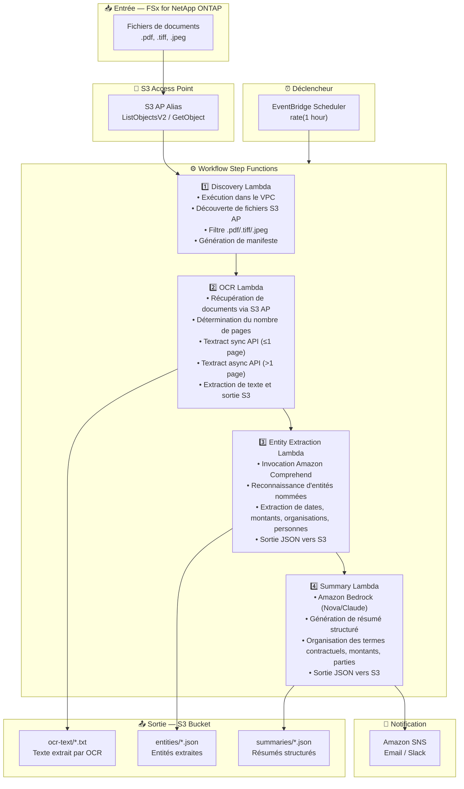

# UC2: Finance / Assurance — Traitement automatisé des contrats et factures (IDP)

🌐 **Language / 言語**: [日本語](architecture.md) | [English](architecture.en.md) | [한국어](architecture.ko.md) | [简体中文](architecture.zh-CN.md) | [繁體中文](architecture.zh-TW.md) | Français | [Deutsch](architecture.de.md) | [Español](architecture.es.md)

## Architecture de bout en bout (Entrée → Sortie)

---

## Flux de haut niveau

```
┌─────────────────────────────────────────────────────────────────────────────┐
│                         FSx for NetApp ONTAP                                 │
│                                                                              │
│  /vol/documents/                                                             │
│  ├── 契約書/保険契約_2024-001.pdf    (スキャン PDF)                          │
│  ├── 請求書/invoice_20240315.tiff    (複合機スキャン)                        │
│  ├── 申込書/application_form.jpeg    (手書き申込書)                          │
│  └── 見積書/quotation_v2.pdf         (電子 PDF)                             │
│                                                                              │
└──────────────────────────────────┬───────────────────────────────────────────┘
                                   │
                                   ▼
┌──────────────────────────────────────────────────────────────────────────────┐
│                      S3 Access Point (Data Path)                              │
│                                                                              │
│  Alias: fsxn-idp-vol-ext-s3alias                                             │
│  • ListObjectsV2 (document discovery)                                        │
│  • GetObject (PDF/TIFF/JPEG retrieval)                                       │
│  • No NFS/SMB mount required from Lambda                                     │
│                                                                              │
└──────────────────────────────────┬───────────────────────────────────────────┘
                                   │
                                   ▼
┌──────────────────────────────────────────────────────────────────────────────┐
│                    EventBridge Scheduler (Trigger)                            │
│                                                                              │
│  Schedule: rate(1 hour) — configurable                                       │
│  Target: Step Functions State Machine                                        │
│                                                                              │
└──────────────────────────────────┬───────────────────────────────────────────┘
                                   │
                                   ▼
┌──────────────────────────────────────────────────────────────────────────────┐
│                    AWS Step Functions (Orchestration)                         │
│                                                                              │
│  ┌─────────────┐    ┌──────────────────────┐    ┌────────────────┐          │
│  │  Discovery   │───▶│  OCR                 │───▶│Entity Extraction│         │
│  │  Lambda      │    │  Lambda              │    │ Lambda         │          │
│  │             │    │                      │    │               │          │
│  │  • VPC内     │    │  • Textract sync/    │    │  • Comprehend  │          │
│  │  • S3 AP List│    │    async API auto-   │    │  • Named Entity│          │
│  │  • PDF/TIFF  │    │    selection         │    │  • Date/Amount │          │
│  └─────────────┘    └──────────────────────┘    └───────┬────────┘          │
│                                                          │                   │
│                                                          ▼                   │
│                                                 ┌────────────────┐          │
│                                                 │    Summary      │          │
│                                                 │    Lambda       │          │
│                                                 │               │          │
│                                                 │ • Bedrock      │          │
│                                                 │ • JSON output  │          │
│                                                 └────────────────┘          │
│                                                                              │
└──────────────────────────────────────────────────────────────────────────────┘
                                   │
                                   ▼
┌──────────────────────────────────────────────────────────────────────────────┐
│                         Output (S3 Bucket)                                    │
│                                                                              │
│  s3://{stack}-output-{account}/                                              │
│  ├── ocr-text/YYYY/MM/DD/                                                    │
│  │   ├── 保険契約_2024-001.txt       ← OCR extracted text                   │
│  │   └── invoice_20240315.txt                                                │
│  ├── entities/YYYY/MM/DD/                                                    │
│  │   ├── 保険契約_2024-001.json      ← Extracted entities                   │
│  │   └── invoice_20240315.json                                               │
│  └── summaries/YYYY/MM/DD/                                                   │
│      ├── 保険契約_2024-001_summary.json  ← Structured summary               │
│      └── invoice_20240315_summary.json                                       │
│                                                                              │
└──────────────────────────────────────────────────────────────────────────────┘
```

---

## Diagramme Mermaid



---

## Détail du flux de données

### Entrée
| Élément | Description |
|---------|-------------|
| **Source** | Volume FSx for NetApp ONTAP |
| **Types de fichiers** | .pdf, .tiff, .tif, .jpeg, .jpg (documents numérisés et électroniques) |
| **Méthode d'accès** | S3 Access Point (ListObjectsV2 + GetObject) |
| **Stratégie de lecture** | Récupération complète du fichier (nécessaire pour le traitement OCR) |

### Traitement
| Étape | Service | Fonction |
|-------|---------|----------|
| Discovery | Lambda (VPC) | Découvrir les fichiers de documents via S3 AP, générer le manifeste |
| OCR | Lambda + Textract | Sélection automatique de l'API sync/async selon le nombre de pages pour l'extraction de texte |
| Entity Extraction | Lambda + Comprehend | Reconnaissance d'entités nommées (dates, montants, organisations, personnes) |
| Summary | Lambda + Bedrock | Génération de résumé structuré (termes contractuels, montants, parties) |

### Sortie
| Artefact | Format | Description |
|----------|--------|-------------|
| Texte OCR | `ocr-text/YYYY/MM/DD/{stem}.txt` | Texte extrait par Textract |
| Entités | `entities/YYYY/MM/DD/{stem}.json` | Entités extraites par Comprehend |
| Résumé | `summaries/YYYY/MM/DD/{stem}_summary.json` | Résumé structuré par Bedrock |
| Notification SNS | Email | Notification de fin de traitement (nombre traité et nombre d'erreurs) |

---

## Décisions de conception clés

1. **S3 AP plutôt que NFS** — Pas de montage NFS nécessaire depuis Lambda ; documents récupérés via l'API S3
2. **Sélection automatique Textract sync/async** — API sync pour les pages uniques (faible latence), API async pour les documents multi-pages (haute capacité)
3. **Approche en deux étapes Comprehend + Bedrock** — Comprehend pour l'extraction structurée d'entités, Bedrock pour la génération de résumés en langage naturel
4. **Sortie structurée JSON** — Facilite l'intégration avec les systèmes en aval (RPA, systèmes métier)
5. **Partitionnement par date** — Division par répertoire selon la date de traitement pour faciliter le retraitement et la gestion de l'historique
6. **Interrogation périodique (non événementielle)** — S3 AP ne prend pas en charge les notifications d'événements, donc une exécution planifiée périodique est utilisée

---

## Services AWS utilisés

| Service | Rôle |
|---------|------|
| FSx for NetApp ONTAP | Stockage de fichiers d'entreprise (contrats et factures) |
| S3 Access Points | Accès serverless aux volumes ONTAP |
| EventBridge Scheduler | Déclencheur périodique |
| Step Functions | Orchestration de workflow |
| Lambda | Calcul (Discovery, OCR, Entity Extraction, Summary) |
| Amazon Textract | Extraction de texte OCR (API sync/async) |
| Amazon Comprehend | Reconnaissance d'entités nommées (NER) |
| Amazon Bedrock | Génération de résumé IA (Nova / Claude) |
| SNS | Notification de fin de traitement |
| Secrets Manager | Gestion des identifiants ONTAP REST API |
| CloudWatch + X-Ray | Observabilité |
