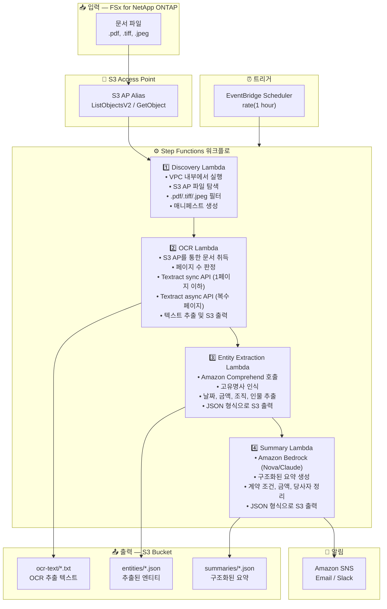

# UC2: 금융 / 보험 — 계약서 및 청구서 자동 처리 (IDP)

🌐 **Language / 言語**: [日本語](architecture.md) | [English](architecture.en.md) | 한국어 | [简体中文](architecture.zh-CN.md) | [繁體中文](architecture.zh-TW.md) | [Français](architecture.fr.md) | [Deutsch](architecture.de.md) | [Español](architecture.es.md)

## 엔드투엔드 아키텍처 (입력 → 출력)

---

## 상위 레벨 흐름

```
┌─────────────────────────────────────────────────────────────────────────────┐
│                         FSx for NetApp ONTAP                                 │
│                                                                              │
│  /vol/documents/                                                             │
│  ├── 契約書/保険契約_2024-001.pdf    (スキャン PDF)                          │
│  ├── 請求書/invoice_20240315.tiff    (複合機スキャン)                        │
│  ├── 申込書/application_form.jpeg    (手書き申込書)                          │
│  └── 見積書/quotation_v2.pdf         (電子 PDF)                             │
│                                                                              │
└──────────────────────────────────┬───────────────────────────────────────────┘
                                   │
                                   ▼
┌──────────────────────────────────────────────────────────────────────────────┐
│                      S3 Access Point (Data Path)                              │
│                                                                              │
│  Alias: fsxn-idp-vol-ext-s3alias                                             │
│  • ListObjectsV2 (document discovery)                                        │
│  • GetObject (PDF/TIFF/JPEG retrieval)                                       │
│  • No NFS/SMB mount required from Lambda                                     │
│                                                                              │
└──────────────────────────────────┬───────────────────────────────────────────┘
                                   │
                                   ▼
┌──────────────────────────────────────────────────────────────────────────────┐
│                    EventBridge Scheduler (Trigger)                            │
│                                                                              │
│  Schedule: rate(1 hour) — configurable                                       │
│  Target: Step Functions State Machine                                        │
│                                                                              │
└──────────────────────────────────┬───────────────────────────────────────────┘
                                   │
                                   ▼
┌──────────────────────────────────────────────────────────────────────────────┐
│                    AWS Step Functions (Orchestration)                         │
│                                                                              │
│  ┌─────────────┐    ┌──────────────────────┐    ┌────────────────┐          │
│  │  Discovery   │───▶│  OCR                 │───▶│Entity Extraction│         │
│  │  Lambda      │    │  Lambda              │    │ Lambda         │          │
│  │             │    │                      │    │               │          │
│  │  • VPC内     │    │  • Textract sync/    │    │  • Comprehend  │          │
│  │  • S3 AP List│    │    async API auto-   │    │  • Named Entity│          │
│  │  • PDF/TIFF  │    │    selection         │    │  • Date/Amount │          │
│  └─────────────┘    └──────────────────────┘    └───────┬────────┘          │
│                                                          │                   │
│                                                          ▼                   │
│                                                 ┌────────────────┐          │
│                                                 │    Summary      │          │
│                                                 │    Lambda       │          │
│                                                 │               │          │
│                                                 │ • Bedrock      │          │
│                                                 │ • JSON output  │          │
│                                                 └────────────────┘          │
│                                                                              │
└──────────────────────────────────────────────────────────────────────────────┘
                                   │
                                   ▼
┌──────────────────────────────────────────────────────────────────────────────┐
│                         Output (S3 Bucket)                                    │
│                                                                              │
│  s3://{stack}-output-{account}/                                              │
│  ├── ocr-text/YYYY/MM/DD/                                                    │
│  │   ├── 保険契約_2024-001.txt       ← OCR extracted text                   │
│  │   └── invoice_20240315.txt                                                │
│  ├── entities/YYYY/MM/DD/                                                    │
│  │   ├── 保険契約_2024-001.json      ← Extracted entities                   │
│  │   └── invoice_20240315.json                                               │
│  └── summaries/YYYY/MM/DD/                                                   │
│      ├── 保険契約_2024-001_summary.json  ← Structured summary               │
│      └── invoice_20240315_summary.json                                       │
│                                                                              │
└──────────────────────────────────────────────────────────────────────────────┘
```

---

## Mermaid 다이어그램



---

## 데이터 흐름 상세

### 입력
| 항목 | 설명 |
|------|------|
| **소스** | FSx for NetApp ONTAP 볼륨 |
| **파일 유형** | .pdf, .tiff, .tif, .jpeg, .jpg (스캔 및 전자 문서) |
| **접근 방식** | S3 Access Point (ListObjectsV2 + GetObject) |
| **읽기 전략** | 전체 파일 취득 (OCR 처리에 필요) |

### 처리
| 단계 | 서비스 | 기능 |
|------|--------|------|
| Discovery | Lambda (VPC) | S3 AP를 통한 문서 파일 탐색, 매니페스트 생성 |
| OCR | Lambda + Textract | 페이지 수에 따른 sync/async API 자동 선택으로 텍스트 추출 |
| Entity Extraction | Lambda + Comprehend | 고유명사 인식 (날짜, 금액, 조직, 인물) |
| Summary | Lambda + Bedrock | 구조화된 요약 생성 (계약 조건, 금액, 당사자) |

### 출력
| 산출물 | 형식 | 설명 |
|--------|------|------|
| OCR 텍스트 | `ocr-text/YYYY/MM/DD/{stem}.txt` | Textract 추출 텍스트 |
| 엔티티 | `entities/YYYY/MM/DD/{stem}.json` | Comprehend 추출 엔티티 |
| 요약 | `summaries/YYYY/MM/DD/{stem}_summary.json` | Bedrock 구조화 요약 |
| SNS 알림 | Email | 처리 완료 알림 (처리 건수 및 오류 건수) |

---

## 주요 설계 결정

1. **NFS 대신 S3 AP** — Lambda에서 NFS 마운트 불필요; S3 API를 통한 문서 취득
2. **Textract sync/async 자동 선택** — 단일 페이지는 sync API (저지연), 복수 페이지 문서는 async API (고용량)
3. **Comprehend + Bedrock 2단계 접근** — Comprehend로 구조화된 엔티티 추출, Bedrock으로 자연어 요약 생성
4. **JSON 구조화 출력** — 다운스트림 시스템 (RPA, 기간계 시스템) 연계 용이
5. **날짜 파티셔닝** — 처리 날짜별 디렉토리 분할로 재처리 및 이력 관리 용이
6. **폴링 (이벤트 드리븐 아님)** — S3 AP는 이벤트 알림을 지원하지 않으므로 정기 스케줄 실행 사용

---

## 사용 AWS 서비스

| 서비스 | 역할 |
|--------|------|
| FSx for NetApp ONTAP | 엔터프라이즈 파일 스토리지 (계약서 및 청구서) |
| S3 Access Points | ONTAP 볼륨에 대한 서버리스 접근 |
| EventBridge Scheduler | 정기 트리거 |
| Step Functions | 워크플로 오케스트레이션 |
| Lambda | 컴퓨팅 (Discovery, OCR, Entity Extraction, Summary) |
| Amazon Textract | OCR 텍스트 추출 (sync/async API) |
| Amazon Comprehend | 고유명사 인식 (NER) |
| Amazon Bedrock | AI 요약 생성 (Nova / Claude) |
| SNS | 처리 완료 알림 |
| Secrets Manager | ONTAP REST API 자격 증명 관리 |
| CloudWatch + X-Ray | 관측성 |
