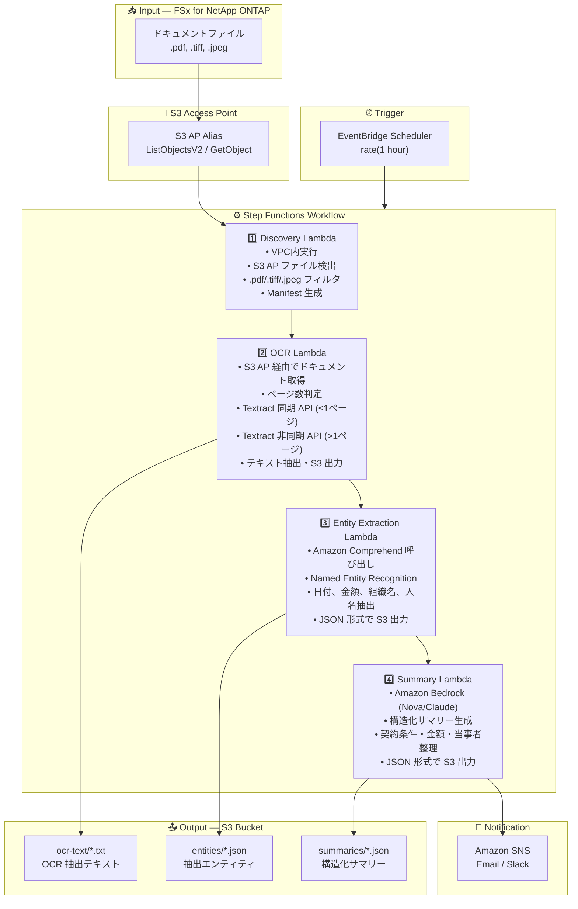

# UC2: 金融・保険 — 契約書・請求書の自動処理 (IDP)

🌐 **Language / 言語**: 日本語 | [English](architecture.en.md) | [한국어](architecture.ko.md) | [简体中文](architecture.zh-CN.md) | [繁體中文](architecture.zh-TW.md) | [Français](architecture.fr.md) | [Deutsch](architecture.de.md) | [Español](architecture.es.md)

## End-to-End Architecture (Input → Output)

---

## Architecture Diagram

---

## Data Flow Detail

### Input
| Item | Description |
|------|-------------|
| **Source** | FSx for NetApp ONTAP volume |
| **File Types** | .pdf, .tiff, .tif, .jpeg, .jpg (スキャン文書・電子文書) |
| **Access Method** | S3 Access Point (ListObjectsV2 + GetObject) |
| **Read Strategy** | ファイル全体を取得（OCR 処理に必要） |

### Processing
| Step | Service | Function |
|------|---------|----------|
| Discovery | Lambda (VPC) | S3 AP でドキュメントファイル検出、Manifest 生成 |
| OCR | Lambda + Textract | ページ数に応じた同期/非同期 API でテキスト抽出 |
| Entity Extraction | Lambda + Comprehend | Named Entity Recognition（日付、金額、組織名、人名） |
| Summary | Lambda + Bedrock | 構造化サマリー生成（契約条件、金額、当事者） |

### Output
| Artifact | Format | Description |
|----------|--------|-------------|
| OCR Text | `ocr-text/YYYY/MM/DD/{stem}.txt` | Textract 抽出テキスト |
| Entities | `entities/YYYY/MM/DD/{stem}.json` | Comprehend 抽出エンティティ |
| Summary | `summaries/YYYY/MM/DD/{stem}_summary.json` | Bedrock 構造化サマリー |
| SNS Notification | Email | 処理完了通知（処理件数・エラー件数） |

---

## Key Design Decisions

1. **S3 AP over NFS** — Lambda から NFS マウント不要、S3 API でドキュメント取得
2. **Textract 同期/非同期の自動選択** — 1ページ以下は同期 API（低レイテンシー）、複数ページは非同期 API（大容量対応）
3. **Comprehend + Bedrock の二段構成** — Comprehend で構造化エンティティ抽出、Bedrock で自然言語サマリー生成
4. **JSON 形式の構造化出力** — 下流システム（RPA、基幹システム）との連携を容易にする
5. **日付パーティション** — 処理日ごとにディレクトリ分割し、再処理・履歴管理を容易にする
6. **ポーリングベース** — S3 AP はイベント通知非対応のため、定期スケジュール実行

---

## AWS Services Used

| Service | Role |
|---------|------|
| FSx for NetApp ONTAP | エンタープライズファイルストレージ（契約書・請求書保管） |
| S3 Access Points | ONTAP ボリュームへのサーバーレスアクセス |
| EventBridge Scheduler | 定期トリガー |
| Step Functions | ワークフローオーケストレーション |
| Lambda | コンピュート（Discovery, OCR, Entity Extraction, Summary） |
| Amazon Textract | OCR テキスト抽出（同期/非同期 API） |
| Amazon Comprehend | Named Entity Recognition（NER） |
| Amazon Bedrock | AI サマリー生成 (Nova / Claude) |
| SNS | 処理完了通知 |
| Secrets Manager | ONTAP REST API 認証情報管理 |
| CloudWatch + X-Ray | オブザーバビリティ |
