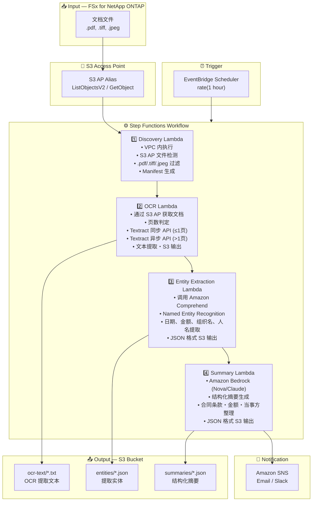

# UC2: 金融・保险 — 合同书・请求书的自动处理 (IDP)

🌐 **Language / 언어 / 语言 / 語言 / Langue / Sprache / Idioma**: [日本語](architecture.md) | [English](architecture.en.md) | [한국어](architecture.ko.md) | 简体中文 | [繁體中文](architecture.zh-TW.md) | [Français](architecture.fr.md) | [Deutsch](architecture.de.md) | [Español](architecture.es.md)

> 注意：此翻译由 Amazon Bedrock Claude 生成。欢迎对翻译质量提出改进建议。

## End-to-End Architecture (Input → Output)

---

## Architecture Diagram

---

## Data Flow Detail

### Input
| Item | Description |
|------|-------------|
| **Source** | FSx for NetApp ONTAP volume |
| **File Types** | .pdf, .tiff, .tif, .jpeg, .jpg（扫描文档・电子文档） |
| **Access Method** | S3 Access Point (ListObjectsV2 + GetObject) |
| **Read Strategy** | 获取完整文件（OCR 处理所需） |

### Processing
| Step | Service | Function |
|------|---------|----------|
| Discovery | Lambda (VPC) | 通过 S3 AP 检测文档文件，生成 Manifest |
| OCR | Lambda + Textract | 根据页数使用同步/异步 API 提取文本 |
| Entity Extraction | Lambda + Comprehend | Named Entity Recognition（日期、金额、组织名、人名） |
| Summary | Lambda + Bedrock | 结构化摘要生成（合同条款、金额、当事方） |

### Output
| Artifact | Format | Description |
|----------|--------|-------------|
| OCR Text | `ocr-text/YYYY/MM/DD/{stem}.txt` | Textract 提取文本 |
| Entities | `entities/YYYY/MM/DD/{stem}.json` | Comprehend 提取实体 |
| Summary | `summaries/YYYY/MM/DD/{stem}_summary.json` | Bedrock 结构化摘要 |
| SNS Notification | Email | 处理完成通知（处理件数・错误件数） |

---

## Key Design Decisions

1. **S3 AP over NFS** — Lambda 无需 NFS 挂载，通过 S3 API 获取文档
2. **Textract 同步/异步自动选择** — 1页以下使用同步 API（低延迟），多页使用异步 API（大容量支持）
3. **Comprehend + Bedrock 两阶段架构** — Comprehend 提取结构化实体，Bedrock 生成自然语言摘要
4. **JSON 格式结构化输出** — 便于与下游系统（RPA、核心系统）集成
5. **日期分区** — 按处理日期划分目录，便于重新处理・历史管理
6. **轮询模式** — S3 AP 不支持事件通知，因此采用定期调度执行

---

## AWS Services Used

| Service | Role |
|---------|------|
| FSx for NetApp ONTAP | 企业文件存储（合同・发票保管） |
| S3 Access Points | 对 ONTAP 卷的无服务器访问 |
| EventBridge Scheduler | 定期触发器 |
| Step Functions | 工作流编排 |
| Lambda | 计算（Discovery, OCR, Entity Extraction, Summary） |
| Amazon Textract | OCR 文本提取（同步/异步 API） |
| Amazon Comprehend | Named Entity Recognition（NER） |
| Amazon Bedrock | AI 摘要生成 (Nova / Claude) |
| SNS | 处理完成通知 |
| Secrets Manager | ONTAP REST API 凭证管理 |
| CloudWatch + X-Ray | 可观测性 |
